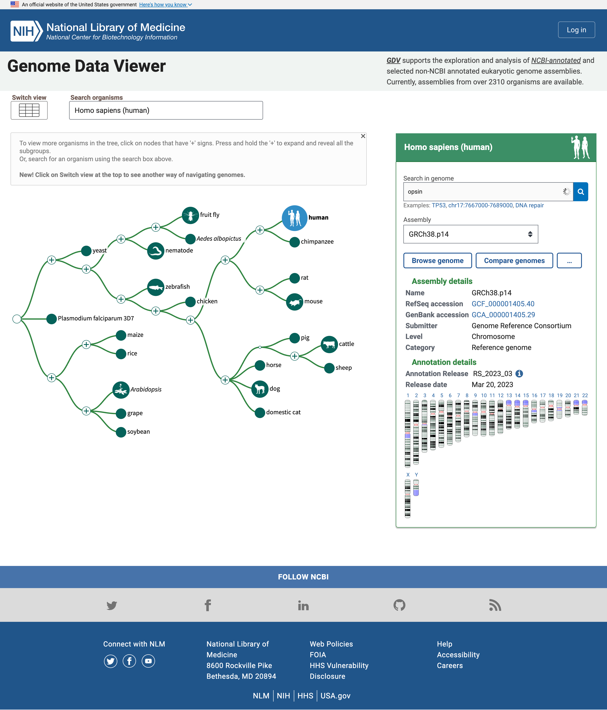
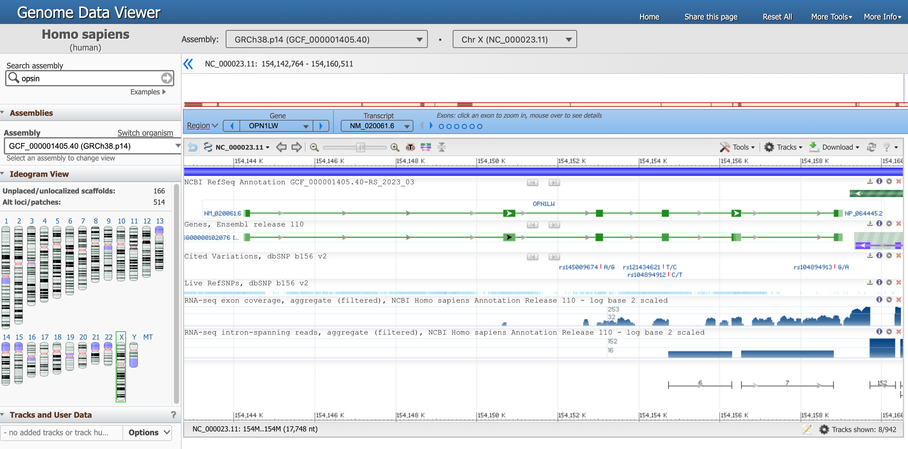
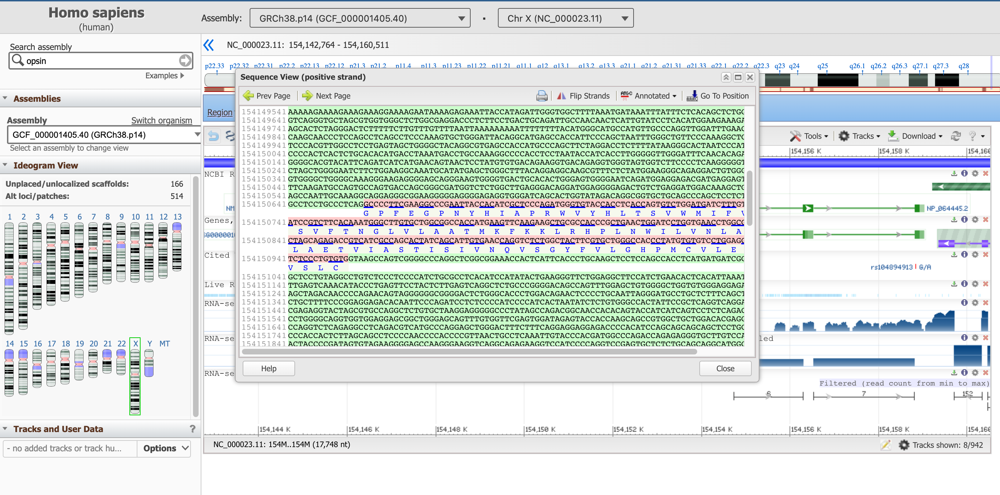
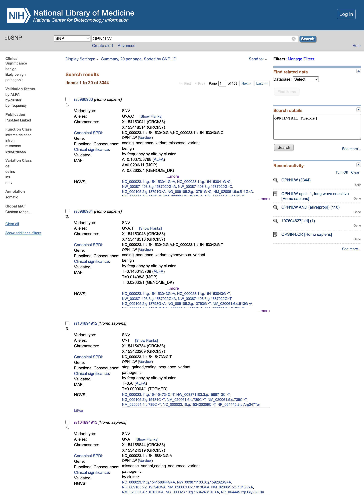
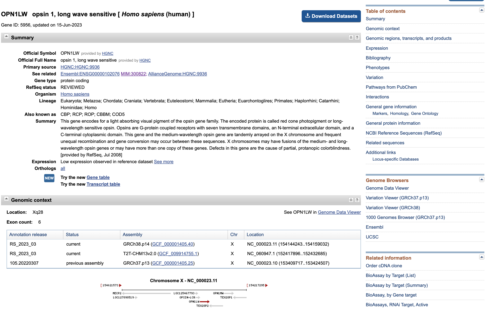
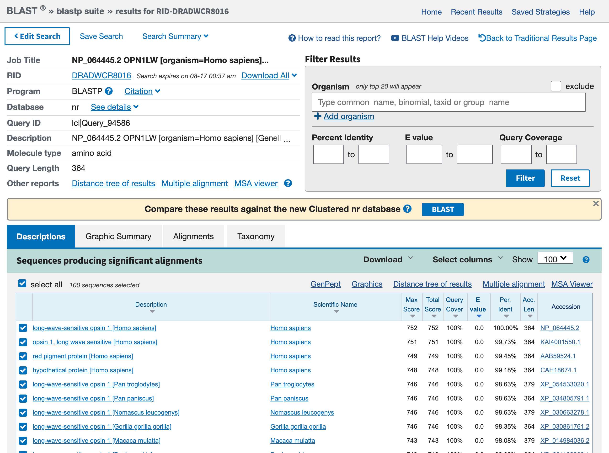
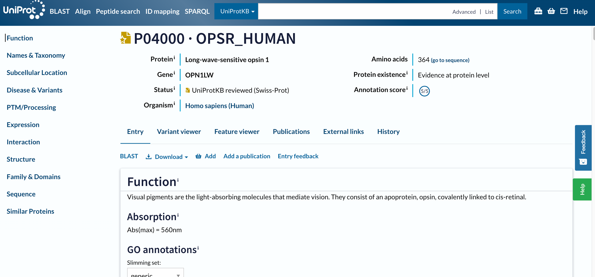

Quando facciamo un'analisi bioinformatica, per esempio RNA-seq, potremmo ritrovarci con un elenco di nomi di geni. Dobbiamo quindi esplorare questi geni. Ma come possiamo farlo? Quali sono le risorse disponibili per farlo? E come navigare al loro interno?

Lo scopo di questo tutorial è di familiarizzare con questi aspetti, utilizzando come esempio le opsine umane.

Le opsine umane si trovano nelle cellule della retina. Sono proteine che catturano la luce e iniziano la sequenza di segnali che porta alla visione. Procederemo ponendoci delle domande sulle opsine e sui geni delle opsine, utilizzando poi diversi database e risorse bioinformatiche per rispondere ad esse.

> <comment-title></comment-title> Questo tutorial è un po' atipico: non lavoreremo in Galaxy ma per lo più al di fuori di esso, navigando tra i database e gli strumenti attraverso le loro interfacce web. Lo scopo di questa esercitazione è quello di illustrare diverse fonti di dati biologici in diversi formati di file e che rappresentano diverse informazioni.
{: .comment}

> <agenda-title></agenda-title>
> 
> In questo tutorial ci occuperemo di:
> 
> 1. TOC
> {:toc}
{: .agenda}

# Ricerca di Opsine umane

Per cercare le Opsine umane, inizieremo controllando il [NCBI Genome Data Viewer] (https://www.ncbi.nlm.nih.gov/genome/gdv). L'NCBI Genome Data Viewer (GDV) () è un browser del genoma che supporta l'esplorazione e l'analisi degli assemblaggi di genomi eucariotici annotati. Il browser GDV visualizza le informazioni biologiche mappate su un genoma, tra cui l'annotazione dei geni, i dati sulle variazioni, gli allineamenti BLAST e i dati degli studi sperimentali dai database GEO e dbGaP dell'NCBI. Le note di rilascio di GDV descrivono le nuove funzionalità di questo browser.

> <hands-on-title>Aprire il visualizzatore di dati del genoma NCBI</hands-on-title>
> 
> 1. Aprire il visualizzatore di dati del genoma dell'NCBI all'indirizzo [www.ncbi.nlm.nih.gov/genome/gdv](https://www.ncbi.nlm.nih.gov/genome/gdv/)
{: .hands-on}

La homepage include un semplice "albero della vita" in cui il nodo umano è evidenziato perché è l'organismo predefinito per la ricerca. Possiamo cambiarlo nel riquadro *Ricerca organismi*, ma per ora lasciamo perdere perché siamo interessati alle Opsine umane.



Il pannello a destra riporta assemblaggi multipli del genoma di interesse e una mappa dei cromosomi in quel genoma. Possiamo cercare le Opsine.

> <hands-on-title>Ricerca di Opsine: Apri il visualizzatore di dati del genoma NCBI</hands-on-title>
> 
> 1. Digitare `opsin` nella casella *Ricerca nel genoma*
> 2. Fare clic sull'icona della lente di ingrandimento o premere <kbd>Invio<kbd>
{: .hands-on}

Sotto il riquadro viene ora visualizzata una tabella con i geni correlati all'opsina insieme ai loro nomi e alla loro posizione, cioè il numero del cromosoma, nonché la posizione iniziale e finale

Nell'elenco dei geni correlati al termine di ricerca opsina, ci sono il gene della rodopsina (RHO) e tre pigmenti del cono, le opsine sensibili a breve, media e lunga lunghezza d'onda (per il rilevamento della luce blu, verde e rossa). Esistono altre entità, ad esempio una -LCR (*Locus Control Region*), geni e recettori putativi.

Molti risultati si trovano sul cromosoma X, uno dei cromosomi che determinano il sesso.

> <question-title></question-title>
> 
> 1. Quanti geni sono stati trovati nel cromosoma X?
> 2. Quanti sono i geni codificanti per le proteine?
> 
> > <solution-title></solution-title>
> > 
> > 1. I risultati in ChrX sono:
> > - OPSINA-LCR
> > - OPN1LW
> > - OP1MW
> > - OPN1MW2
> > - OPN1MW3
> > 
> > 2. Passando il mouse su ogni gene, si apre un riquadro e possiamo cliccare su *Dettagli* per saperne di più su ogni gene. Si apprende così che il primo (OPSIN-LCR) non è un gene codificante ma una regione regolatoria e gli altri sono geni codificanti per le proteine. Quindi ci sono 4 geni codificanti per proteine legate alle opsine nel cromosoma X. In particolare, il cromosoma X include un gene per il pigmento rosso (OPN1LW) e tre geni per il pigmento verde (OPN1MW, OPN1MW2 e OPN1MW3 nell'assemblaggio del genoma di riferimento).
> {: .solution}
{: .question}

Concentriamoci ora su una specifica opsina, il gene OPN1LW.

> <hands-on-title>Aprire il browser del genoma per il gene OPN1LW</hands-on-title>
> 
> 1. Fare clic sulla freccia blu che appare nella tabella dei risultati quando si passa con il mouse sulla riga OPN1LW
{: .hands-on}

Dovreste essere arrivati a [questa pagina](https://www.ncbi.nlm.nih.gov/genome/gdv/browser/genome/?id=GCF_000001405.40), che è la vista del genoma del gene OPN1LW.



Ci sono molte informazioni in questa pagina, concentriamoci su una sezione alla volta.

1. Il visualizzatore di dati del genoma, in alto, ci dice che stiamo guardando i dati dell'organismo `Homo sapiens`, dell'assemblaggio `GRCh38.p14` e in particolare di `Chr X` (cromosoma X). Ciascuna di queste informazioni ha un ID univoco.
2. L'intero cromosoma è rappresentato direttamente qui sotto, e le posizioni lungo i bracci corti (`p`) e lunghi (`q`) sono evidenziate.
3. Di seguito, un riquadro blu evidenzia che ora ci stiamo concentrando sulla regione corrispondente al gene `OPN1LW`.

   Ci sono diversi modi per interagire con il visualizzatore sottostante. Provate ad esempio a passare il mouse sui punti che rappresentano gli esoni nel riquadro blu.

4. Nel grafico sottostante, la sequenza genica è una linea verde con gli esoni (frammenti di codifica delle proteine) rappresentati da rettangoli verdi.

   Passare il mouse sulla linea verde corrispondente a `NM_020061.6` (il nostro gene di interesse) per ottenere informazioni più dettagliate.

   > <question-title></question-title>
   > 
   > 1. Qual è la posizione del segmento OPN1LW?
   > 2. Qual è la lunghezza del segmento OPN1LW?
   > 3. Cosa sono gli introni e gli esoni?
   > 4. Quanti esoni e introni ci sono nel gene OPN1LW?
   > 5. Qual è la lunghezza totale della regione codificante?
   > 6. Qual è la distribuzione tra regioni codificanti e non codificanti? Che cosa significa in termini di biologia?
   > 7. Qual è la lunghezza della proteina in numero di aminoacidi?
   > 
   > > <solution-title></solution-title>
   > > 
   > > 1. Da 154.144.243 a 154.159.032
   > > 2. 1.4790 nucleotidi, trovato a *Span su 14790 nt, nucleotidi)*
   > > 3. I geni eucariotici sono spesso interrotti da regioni non codificanti chiamate sequenze intercalari o introni. Le regioni codificanti sono chiamate esoni.
   > > 4. Da questo diagramma si può vedere che il gene OPN1LW è composto da 6 esoni e 5 introni e che gli introni sono molto più grandi degli esoni.
   > > 5. La lunghezza della CDS è di 1.095 nucleotidi.
   > > 6. Dei 14790 nt del gene, solo 1095 nt codificano per le proteine, il che significa che meno dell'8% delle coppie di basi contiene il codice. Quando questo gene viene espresso nelle cellule della retina umana, viene sintetizzata una copia di RNA dell'intero gene. Poi le regioni introniche vengono tagliate e le regioni esoniche unite per produrre l'mRNA maturo (un processo chiamato splicing), che verrà tradotto dai ribosomi per produrre la proteina opsina rossa. In questo caso, il 92% della trascrizione iniziale dell'RNA viene eliminato, lasciando il codice proteico puro.
   > > 7. La lunghezza della proteina risultante è di 364 aa, aminoacidi.
   > {: .solution}
   {: .question}

Ma qual è la sequenza di questo gene? Esistono diversi modi per recuperare questa informazione, noi ci occuperemo di quello che riteniamo essere uno dei più intuitivi.

> <hands-on-title>Aprire il browser del genoma per il gene OPN1LW</hands-on-title>
> 
> 1. fate clic sulla sezione  *Strumenti* in alto a destra del riquadro che mostra il gene
> 2. Fare clic su *Visualizzazione del testo della sequenza*
{: .hands-on}

Questo pannello riporta la sequenza del DNA degli introni (in verde) e quella degli esoni (in rosa, compresa la sequenza della proteina tradotta in basso).



Questo riquadro di sequenza non mostra al momento l'intero gene, ma una sua sottosequenza. È possibile spostarsi a monte e a valle del codice genetico con le frecce *Prev Page* e *Next Page*, oppure partire da una posizione specifica con il pulsante *Go To Position*. Suggeriamo di partire dall'inizio della parte codificante del gene, che, come abbiamo appreso in precedenza, si trova alla posizione 154.144.243.

> <hands-on-title>Vai a una posizione specifica nella vista Sequenza</hands-on-title>
> 
> 1. Fare clic su *Vai alla posizione*
> 2. Digitare su `154144243`
> 
>    Dobbiamo rimuovere le virgole per convalidare il valore
{: .hands-on}

La sequenza evidenziata in viola segnala una regione regolatoria.

> <question-title></question-title>
> 
> 1. Qual è il primo amminoacido del prodotto proteico risultante?
> 2. Qual è l'ultimo?
> 3. Puoi annotare i primi tre e gli ultimi tre AA di questa proteina?
> 
> > <solution-title></solution-title>
> > 
> > 1. La proteina corrispondente inizia con la metionina, M (lo fanno tutte).
> > 2. L'ultimo AA dell'ultimo esone (trovato nella seconda pagina) è l'alanina (A). Dopo di esso si trova il codone di stop TGA, che non viene tradotto in AA.
> > 3. I primi tre AA sono: M,A,Q; gli ultimi tre: S,P,A.
> {: .solution}
{: .question}

Possiamo ora chiudere la *visualizzazione della sequenza*.

Da questa risorsa si possono ottenere anche file, in formato diverso, che descrivono il gene. Sono disponibili nella sezione *Download*.

1. *Scaricare FASTA* ci permetterà di scaricare il formato di file più semplice per rappresentare la sequenza nucleotidica di tutto l'intervallo visibile del genoma (più lungo del solo gene).
2. *Download GenBank flat file* ci permetterà di accedere alle annotazioni disponibili su questa pagina (e oltre) in un formato di testo semplice.
3. *Scarica i dati delle tracce* ci permette di ispezionare due dei formati di file presentati nelle diapositive: i formati GFF (GFF3) e BED. Se si cambiano le tracce, ognuna di esse può essere disponibile o meno.

# Trovare ulteriori informazioni sul nostro gene

Facciamo ora una panoramica delle informazioni che abbiamo (in letteratura) sul nostro gene, utilizzando le risorse NCBI

> <hands-on-title>Vai a una posizione specifica nella vista Sequenza</hands-on-title>
> 
> 1. Aprire la ricerca NCBI su [www.ncbi.nlm.nih.gov/search](https://www.ncbi.nlm.nih.gov/search/)
> 2. Digitare `OPN1LW` nella casella di ricerca *Cerca NCBI*
{: .hands-on}

.

## Letteratura

Cominciamo con la letteratura e in particolare con i risultati di *PubMed* o *PubMed Central*

> <details-title>Qual è la differenza tra PubMed e PubMed Central? </details-title>
> 
> PubMed è un database di letteratura biomedica che contiene gli abstract delle pubblicazioni presenti nel database.
> 
> PubMed Central è un archivio di testo completo, che contiene il testo completo delle pubblicazioni presenti nel database.
> 
> Anche se il numero esatto di risultati può variare nel tempo rispetto alla schermata precedente, qualsiasi nome di gene dovrebbe avere più risultati in PubMed Central (ricerca nei testi completi delle pubblicazioni) che in PubMed (ricerca solo negli abstract).
{: .details}

> <hands-on-title>Aprire PubMed</hands-on-title>
> 
> 1. Fare clic su *PubMed* nel riquadro *Letteratura*
{: .hands-on}

Avete inserito in PubMed, un database gratuito di letteratura scientifica, i risultati di una ricerca completa di articoli direttamente associati a questo locus genico.

Facendo clic sul titolo di ogni articolo, si possono vedere gli abstract dell'articolo. Se vi trovate in un campus universitario dove è disponibile l'accesso online a riviste specifiche, potreste anche vedere i link agli articoli completi. PubMed è il punto di accesso a un'ampia gamma di letteratura scientifica nel campo delle scienze della vita. Sul lato sinistro di ogni pagina di PubMed si trovano i collegamenti a una descrizione del database, alla guida e alle esercitazioni sulla ricerca.

> <question-title></question-title>
> 
> 1. Riesci a indovinare quali tipi di condizioni sono associate a questo gene?
> 
> > <solution-title></solution-title>
> > 
> > 1. Risponderemo a questa domanda più tardi
> {: .solution}
{: .question}

> <hands-on-title>Torna alla pagina di ricerca NCBI</hands-on-title>
> 
> 1. Torna alla [pagina di ricerca NCBI](https://www.ncbi.nlm.nih.gov/search/all/?term=OPN1LW)
{: .hands-on}

## Clinica

Concentriamoci ora sul riquadro *Clinica* e in particolare su *OMIM*. L'OMIM, l'Online Mendeliam Inheritance in Man (and woman!), è un catalogo di geni umani e disturbi genetici.

> <hands-on-title>Aprire OMIM</hands-on-title>
> 
> 1. Fare clic su *OMIM* nel riquadro *Clinica*
{: .hands-on}

Ogni voce OMIM è un disturbo genetico (qui soprattutto tipi di daltonismo) associato a mutazioni in questo gene.

> <hands-on-title>Leggi tutto quello che il tuo interesse ti impone</hands-on-title>
> 
> 1. Seguire i link per ottenere maggiori informazioni su ogni voce
{: .hands-on}

> <comment-title>Leggi tutto ciò che ti interessa</comment-title>
> 
> Per ulteriori informazioni su OMIM, fare clic sul logo OMIM in cima alla pagina. Attraverso OMIM, sono disponibili numerose informazioni su innumerevoli geni del genoma umano e tutte le informazioni sono supportate da riferimenti agli articoli di ricerca più recenti.
{: .comment}

Come le variazioni nel gene influenzano il prodotto proteico e le sue funzioni? Torniamo alla pagina del NIH e cerchiamo di accedere all'elenco dei polimorfismi a singolo nucleotide (SNP) individuati dagli studi di genetica nel gene.

> <hands-on-title>Aprire dbSNP</hands-on-title>
> 
> 1. Torna alla [pagina di ricerca NCBI](https://www.ncbi.nlm.nih.gov/search/all/?term=OPN1LW)
> 2. Fare clic su *dbSNP* nel riquadro *Clinica*
{: .hands-on}



> <question-title></question-title>
> 
> 1. Qual è il significato clinico delle varianti rs5986963 e rs5986964 (le prime due varianti elencate al momento della creazione di questo tutorial)?
> 2. Qual è la conseguenza funzionale di rs104894912?
> 3. Qual è la conseguenza funzionale di rs104894913?
> 
> > <solution-title></solution-title>
> > 
> > 1. Il significato clinico è `benign`, quindi sembra che non abbiano alcun effetto sul prodotto proteico finale
> > 2. la mutazione rs104894912 porta a una variante `stop_gained`, che tronca la proteina risultante troppo presto ed è quindi `pathogenic`
> > 3. la mutazione rs104894913 porta a un `missense_variant`, anche `pathogenic`.
> {: .solution}
{: .question}

Indaghiamo ancora sulla variante rs104894913

> <hands-on-title>Per saperne di più su una variante dbSNP</hands-on-title>
> 
> 1. Clicca su `rs104894913` per aprire la sua [pagina dedicata](https://www.ncbi.nlm.nih.gov/snp/rs104894913)
> 2. Clicca su *Significato clinico*
> 
>    > <question-title></question-title>
>    > 
>    > Quale tipo di condizione è associata alla variante rs104894913?
>    > 
>    > > <solution-title></solution-title>
>    > > 
>    > > Il nome della malattia associata è "difetto di Protan". Una rapida ricerca su Internet con il vostro motore di ricerca chiarirà che si tratta di un tipo di daltonismo.
> > {: .solution}
> {: .question}
> 
> 3. Fare clic su *Dettagli della variante*
> 
>    > <question-title></question-title>
>    > 
>    > 1. Quale sostituzione è associata a questa variante?
>    > 2. Qual è l'impatto di questa sottotitolazione in termini di codoni e amminoacidi?
>    > 3. In quale posizione della proteina si trova questa sostituzione?
>    > 
>    > > <solution-title></solution-title>
>    > > 
>    > > 1. La sostituzione `NC_000023.10:g.153424319G>A` corrisponde al passaggio da una guanina (G) a un'adenina (A)
>    > > 2. Questa sostituzione cambia il codone `GGG`, una glicina, in `GAG`, un glutatione
>    > > 3. `p.Gly338Glu` significa che la sostituzione avviene nella posizione 338 della proteina.
> > {: .solution}
> {: .question}
{: .hands-on}

Cosa significa questa sostituzione della proteina? Diamo un'occhiata più approfondita a questa proteina.

## Proteine

> <hands-on-title>Aprire la proteina</hands-on-title>
> 
> 1. Torna alla [pagina di ricerca NCBI](https://www.ncbi.nlm.nih.gov/search/all/?term=OPN1LW)
> 2. Fare clic su *Proteina* nel riquadro *Proteine*
> 3. Fare clic su `OPN1LW – opsin 1, long wave sensitive` nella casella in alto
{: .hands-on}



Questa pagina presenta ancora una volta alcuni dati che ci sono familiari (ad esempio la distribuzione degli esoni lungo la sequenza genica).

> <hands-on-title>Scaricare le sequenze di proteine</hands-on-title>
> 
> 1. Cliccare su *Scaricare i dataset*
> 2. Seleziona
>    - `Gene Sequences (FASTA)`
>    - `Transcript sequences (FASTA)`
>    - `Protein sequences (FASTA)`
> 3. Fare clic sul pulsante *Scarica*
> 4. Aprire il file ZIP scaricato
{: .hands-on}

> <question-title></question-title>
> 
> 1. Cosa contiene la cartella?
> 2. Pensi che abbiano implementato buone pratiche per i dati?
> 
> > <solution-title></solution-title>
> > 
> > 1. La cartella comprende
> >    - una cartella `ncbi_datasets` con diverse sottocartelle al suo interno che contengono alcuni file di dati (formati multipli),
> >    - un `README.md` (un file Markdown), progettato per "viaggiare" insieme ai dati e spiegare come sono stati recuperati i dati, qual è la struttura della sottocartella contenente i dati e dove trovare la documentazione completa.
> > 2. È sicuramente una buona pratica di gestione dei dati quella di guidare gli utenti (non solo i vostri collaboratori, ma anche voi stessi in un futuro non troppo lontano, quando dimenticherete da dove proviene quel file nella vostra cartella Download) alla fonte e alla struttura dei dati.
> {: .solution}
{: .question}

# Ricerca per sequenza

Cosa potremmo fare con queste sequenze appena scaricate? Supponiamo di aver appena sequenziato i trascritti che abbiamo isolato attraverso un esperimento - quindi conosciamo la sequenza della nostra entità di interesse, ma non sappiamo cosa sia. In questo caso, dobbiamo cercare nell'intero database delle sequenze conosciute dalla scienza e abbinare la nostra entità sconosciuta a una voce che abbia qualche annotazione. Procediamo in questo modo.

> <hands-on-title>Ricerca la sequenza proteica rispetto a tutte le sequenze proteiche</hands-on-title>
> 
> 1. Aprite (con il più semplice editor di testo che avete installato) il file `protein.faa` che avete appena scaricato.
> 2. Copia il suo contenuto
> 3. Open BLAST [blast.ncbi.nlm.nih.gov](https://blast.ncbi.nlm.nih.gov/Blast.cgi)
> 4. Fare clic sul pulsante `Protein BLAST, protein > protein`
> 
>    Utilizzeremo una sequenza proteica per effettuare una ricerca in un database di proteine
> 
> 5. Incollare la sequenza della proteina nella casella di testo grande
> 6. Controllare il resto dei parametri
> 7. Fare clic sul pulsante blu `BLAST`
{: .hands-on}

Questa fase richiederà un po' di tempo, dopotutto c'è un server da qualche parte che sta confrontando l'insieme delle sequenze note con il vostro obiettivo. Una volta completata la ricerca, il risultato dovrebbe essere simile a quello riportato di seguito:



> <hands-on-title>Riepilogo grafico delle sequenze proteiche</hands-on-title>
> 
> 1. Fare clic sulla scheda *Riassunto grafico*
{: .hands-on}

Accediamo a un riquadro contenente molte linee colorate. Ogni linea rappresenta un risultato della ricerca blast. Se si fa clic su una linea rossa, il riquadro stretto appena sopra il riquadro fornisce una breve descrizione dell'hit.

> <hands-on-title>Descrizioni delle sequenze proteiche</hands-on-title>
> 
> 1. Fare clic sulla scheda *Descrizioni*
{: .hands-on}

> <question-title></question-title>
> 
> 1. Qual è il primo risultato? È previsto?
> 2. Quali sono gli altri risultati? Per quali organismi?
> 
> > <solution-title></solution-title>
> > 
> > 1. Il primo risultato è la nostra opsina rossa. Questo è incoraggiante, perché la migliore corrispondenza dovrebbe essere con la sequenza di query stessa, e si è ottenuta questa sequenza dalla voce del gene.
> > 2. Altri risultati sono altre opsine. Comprendono voci di altri primati (ad esempio `Pan troglogytes`).
> {: .solution}
> 
{: .question}

I risultati riguardano la nostra opsina rossa nell'uomo, ma anche altre opsine in altri primati. Potremmo volerlo, per esempio se volessimo usare questi dati per costruire un albero filogenetico. Se invece siamo abbastanza sicuri che la nostra sequenza di interesse sia umana, potremmo anche filtrare la ricerca solo nelle sequenze umane.

> <hands-on-title>Filtrare una ricerca BLAST</hands-on-title>
> 
> 1. Cliccare su *Modifica ricerca*
> 2. Digitare `Homo sapiens` nel campo *Organismo
> 3. Fare clic sul pulsante blu `BLAST`
{: .hands-on}

Con questa nuova ricerca, troviamo le altre opsine (verde, blu, pigmento della cellula roditrice) nell'elenco. Gli altri risultati hanno un numero inferiore di residui corrispondenti. Se si fa clic su una delle linee colorate nel *Riepilogo grafico*, si apriranno ulteriori informazioni su quel risultato e si potrà vedere quanta somiglianza c'è tra ciascuno di essi e l'opsina rossa, la nostra sequenza di query originale. Scorrendo l'elenco, ogni sequenza successiva ha meno punti in comune con l'opsina rossa. Ogni sequenza è mostrata a confronto con l'opsina rossa in quello che viene chiamato allineamento di sequenza a coppie. In seguito, si realizzeranno allineamenti di sequenze multiple da cui si potranno discernere le relazioni tra i geni.

> <details-title>Maggiori dettagli sui punteggi BLAST</details-title>
> 
> Le visualizzazioni contengono due misure importanti della significatività dell'hit:
> 
> 1. il punteggio di BLAST - Punteggio lableled (bit)
> 
>    Il punteggio BLAST indica la qualità del miglior allineamento tra la sequenza richiesta e la sequenza trovata (hit). Più alto è il punteggio, migliore è l'allineamento. I punteggi vengono ridotti dai mismatch e dalle lacune nell'allineamento migliore. Il calcolo del punteggio è complesso e coinvolge una matrice di sostituzione, ovvero una tabella che assegna un punteggio a ogni coppia di residui allineati. La matrice più utilizzata per l'allineamento delle proteine è nota come BLOSUM62.
> 
> 2. il valore di aspettativa (etichettato Expect o E)
> 
>     Il "valore di aspettativa" E di un hit indica se l'hit è probabilmente il risultato di una somiglianza casuale tra hit e query o di un'ascendenza comune tra hit e query. ()
> 
>     > <comment-title>Filtrare una ricerca BLAST</comment-title>
>     > 
>     > Se E è più piccolo di $$10\mathrm{e}{-100}$, a volte viene dato come 0,0.
>     {: .comment}
> 
>     Il valore di aspettativa è il numero di risultati che ci si aspetterebbe di ottenere per puro caso se si cercasse la propria sequenza in un genoma casuale delle dimensioni del genoma umano.
>
>      $$E = 25$$ significa che ci si potrebbe aspettare di trovare 25 riscontri in un genoma di queste dimensioni, per puro caso. Quindi un riscontro con $$E = 25$$ è probabilmente un riscontro casuale e non implica che la sequenza riscontrata abbia un'ascendenza comune con la sequenza ricercata.
>
>      Valori di aspettativa di circa 0,1 possono essere biologicamente significativi o meno (per decidere occorrono altri test).
>
>      Ma valori molto piccoli di E significano che l'hit è biologicamente significativo. La corrispondenza tra la vostra sequenza di ricerca e questo hit deve derivare da un'ascendenza comune tra le sequenze, perché le probabilità che la corrispondenza possa derivare dal caso sono semplicemente troppo basse. Ad esempio, $$E = 10\mathrm{e}{-18}$$ per un riscontro nel genoma umano significa che ci si aspetterebbe una sola corrispondenza casuale in un miliardo di miliardi di genomi diversi della stessa dimensione del genoma umano.
>
>      La ragione per cui crediamo di provenire tutti da antenati comuni è che una massiccia somiglianza di sequenze in tutti gli organismi è semplicemente troppo improbabile per essere un evento casuale. Qualsiasi famiglia di sequenze simili in molti organismi deve essersi evoluta da una sequenza comune in un antenato remoto.
>
{: .details}

> <hands-on-title>Download </hands-on-title>
> 
> 1. Fare clic sulla scheda *Descrizioni*
> 2. Fare clic su una qualsiasi sequenza hit
> 3. Cliccare su *Download*
> 4. Selezionare `FASTA (aligned sequences)`
{: .hands-on}

scaricherà un nuovo tipo di file, leggermente diverso: un FASTA allineato. Se volete, esploratelo prima della prossima sezione.

Mentre nelle sezioni precedenti di questo tutorial abbiamo usato ampiamente le interfacce web degli strumenti (visualizzatori genomici, scansione rapida della letteratura, lettura delle annotazioni, ecc.), questa ricerca BLAST è un esempio di una fase che si potrebbe automatizzare completamente con Galaxy.

> <hands-on-title>Ricerca di somiglianza con BLAST in Galaxy </hands-on-title>
> 
> 1. Creare una nuova cronologia per questa analisi
> 
>    
> 
> 2. Rinominare la storia
> 
>    
> 
> 3. Importare la sequenza proteica tramite link da [Zenodo]({{ page.zenodo_link }}) o dalle librerie di dati condivisi Galaxy:
> 
>    ```text
>    {{ page.zenodo_link }}/files/protein.faa
>    ```
> 
>    
> 
>    
> 
> 1.  con i seguenti parametri:
>    - *"Sequenza/e di query proteica/e "*: `protein.faa`
>    - *"Database soggetti/sequenze "*: `Locally installed BLAST database`
>    - *"Database BLAST delle proteine "*: `SwissProt`
> 
>      Per cercare solo sequenze annotate in UniProt, dobbiamo selezionare l'ultima versione di `SwissProt`
> 
>    - *"Impostare il cutoff del valore di aspettativa "*: `0.001`
>    - *"Formato di output "*: `Tabular (extended 25 columns)`
{: .hands_on}

> <question-title></question-title>
> 
> Pensate che i risultati siano esattamente gli stessi della nostra ricerca originale di `opsin` in [www.ncbi.nlm.nih.gov/genome/gdv](https://www.ncbi.nlm.nih.gov/genome/gdv/)? Perché?
> 
> > <solution-title></solution-title>
> > 
> > I risultati possono essere simili, ma ci sono sicuramente delle differenze. Infatti, non solo una ricerca testuale è diversa da una ricerca di sequenze in termini di metodo, ma anche in questa seconda tornata siamo partiti dalla sequenza di una specifica opsina, quindi da un ramo dell'intero albero genealogico delle proteine. Alcuni membri della famiglia sono più simili tra loro, quindi questo tipo di ricerca guarda all'intera famiglia da una prospettiva piuttosto parziale.
> {: .solution}
{: .question}

# Maggiori informazioni sulla nostra proteina

Finora abbiamo esplorato queste informazioni sulle opsine:
- come sapere quali proteine di un certo tipo esistono in un genoma,
- come sapere dove si trovano lungo il genoma,
- come ottenere maggiori informazioni su un gene di interesse,
- come scaricare le loro sequenze in diversi formati,
- come utilizzare questi file per eseguire una ricerca di similarità.

Potreste essere curiosi di sapere come saperne di più sulle proteine che codificano. Abbiamo già raccolto alcune informazioni (ad esempio le malattie associate), ma nei prossimi passi le incroceremo con dati sulla struttura della proteina, sulla localizzazione, sugli interattori, sulle funzioni, ecc.

Il portale da visitare per ottenere tutte le informazioni su una proteina è [UniProt](https://www.uniprot.org/). Possiamo effettuare la ricerca utilizzando una ricerca testuale, oppure il nome del gene o della proteina. Utilizziamo la nostra solita parola chiave `OPN1LW`.

> <hands-on-title>Ricerca su UniProt</hands-on-title>
> 
> 1. Apri [UniProt](https://www.uniprot.org/)
> 2. digitare `OPN1LW` nella barra di ricerca
> 3. Selezionare la visualizzazione della scheda
{: .hands-on}

Il primo risultato dovrebbe essere `P04000 · OPSR_HUMAN`. Prima di aprire la pagina, due cose da notare:

1. Il nome della proteina `OPSR_HUMAN` è diverso dal nome del gene, così come i loro ID sono.
2. Questa voce ha una stella dorata, il che significa che è stata annotata e curata manualmente.

> <hands-on-title>Aprire un risultato su UniProt</hands-on-title>
> 
> 1. Fare clic su `P04000 · OPSR_HUMAN`
{: .hands-on}



Questa è una pagina lunga con molte informazioni, per cui abbiamo progettato un [intero tutorial] () per esaminarla.

