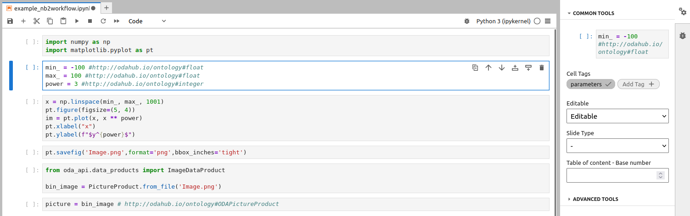
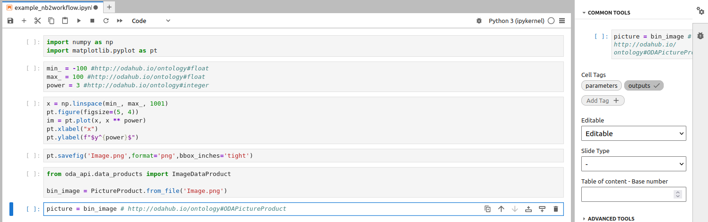

---

layout: tutorial_hands_on
title: "nb2workflow: Generating Galaxy Tools From Jupyter notebooks"
key_points:
  - The nb2galaxy module of the nb2workflow library is an automated Galaxy tool generator for scientists and developers who routinely write Jupyter notebooks.

objectives:
 - Learn why you might want to use the nb2galaxy.
 - Install and explore the simple examples provided.
 - Modify and re-generate them to see how changes affect the tool.
 - Generate new simple Galaxy tools using your own scripts.

questions:
 - What options exist for new-to-Galaxy developers to convert functioning Jupyter notebooks into Galaxy tools?

time_estimation: 1H
subtopic: tooldev

requirements:
    topic_name: introduction
    tutorials:
      - galaxy-intro-short
      - galaxy-intro-101-everyone
    topic_name: dev
    tutorials:
      - tool-integration


contributors:
  - Andrei-EPFL
  - dsavchenko

---

This tutorial is for developers and researchers interested in Galaxy, who routinely develop their own analysis in Jupyter notebooks.


> <agenda-title></agenda-title>
>
> 1. TOC
> {:toc}
>
{: .agenda}

# Generating Galaxy Tools From Jupyter notebooks

You will learn how to use the `nb2galaxy` module of the `nb2workflow` library to convert the jupyter notebook into the Galaxy tool.

## Preparing environment

Throughout this tutorial, the jupyter-lab interface is used to edit notebooks. The example notebook is simple, only using basic numeric libraries, like `numpy` and `matplotlib`. The `nb2galaxy` is a part of the `nb2workflow` library, maintaned by the astronomy-oriented team, but isn't limited to astronomy use-case. To test a Galaxy tool or to preview it locally, `planemo` library is used. To create a virtual environment with the needed tools installed:

```bash
mkdir nb2galaxy-example
cd nb2galaxy-example
python -m venv .venv
source .venv/bin/activate
pip install jupyterlab numpy matplotlib nb2workflow[galaxy] planemo
```

The example notebook plots a function $y=x^p$ in a given range. It can be downloaded from

```bash
wget https://raw.githubusercontent.com/esg-epfl-apc/nb2galaxy-example-repo/refs/tags/step-0/example_nb2workflow.ipynb
```

Open Jupyter lab to preview the notebook

```bash
jupyter lab
```

## Tagging Jupyter notebook

The prepared notebook has "inputs" defined in the cell 2 and produces a plot as an "output". `nb2galaxy` recognizes papermill-like cell tags. In particular, you need to tag a "parameters" cell



and return an output product by saving a plot first and creating a tagged output cell



We need to declare dependencies of the notebook (hence Galaxy tool). As long as Galaxy uses `conda` for tool dependencies, the preferred way is to create an `environment.yml` file in the repo:

```yaml
name: nb2galaxy-example
channels:
  - conda-forge
dependencies:
  - numpy
  - matplotlib
```

`nb2galaxy` supports both `environment.yml` and `requirements.txt`. The conversion module attempts to reconcile the dependencies listed in both `requirements.txt` and `environment.yml` using Conda. First, each package from `requirements.txt` is searched by Conda. If the package with the same name exists in the configured conda channels (only `conda-forge` by default), it is included in the final list of packages for reconciliation. Otherwise, the package is ignored, and a comment is added to the generated tool represented as an XML file.

In the end, all dependencies are resolved together to obtain fixed versions of the required packages that are written in the tool's XML file.

## Converting notebook to Galaxy tool

We are ready to create a very simple Galaxy tool now, using `nb2galaxy` CLI:

```bash
nb2galaxy --environment_yml environment.yml example_nb2workflow.ipynb ./tooldir
```

Which produces tool description xml file and a python script file in the `./tooldir`

```
tooldir/
├── example_nb2workflow.py
└── example.xml

1 directory, 2 files
```

The minimal tool created from the notebook is ready. We can preview it locally

```bash
planemo serve ./tooldir
```

## Improving the tool

Currently, the tool doesn't pass planemo linting

```bash
$ planemo lint ./tooldir/
Linting tool /home/dsavchenko/Projects/ESG/nb2galaxy-example-repo/tooldir/example.xml
.. CHECK (TestsNoValid): 1 test(s) found.
.. INFO (OutputsNumber): 1 outputs found.
.. INFO (InputsNum): Found 3 input parameters.
.. WARNING (HelpMissing): No help section found, consider adding a help section to your tool.
.. CHECK (ToolIDValid): Tool defines an id [example].
.. CHECK (ToolNameValid): Tool defines a name [example].
.. CHECK (ToolProfileValid): Tool specifies profile version [24.0].
.. CHECK (ToolVersionValid): Tool defines a version [0.1.0+galaxy0].
.. INFO (CommandInfo): Tool contains a command.
.. WARNING (CitationsMissing): No citations found, consider adding citations to your tool.
Failed linting
```

So we need to add help text and citations. `nb2galaxy` accepts help in `.rst` or `.md` format and citations as a bibfile.

We create markdown file `galaxy_help.md` with a help text:

```markdown
This tool is a simple example, automatically created from a Jupyter notebook using `nb2galaxy`.
```

and a `CITATION.bib` file:

```bibtex
@software{nb2galaxy-example,
  author = {Variu, Andrei and Savchenko, Denys},
  title = {{Example of nb2galaxy}},
  url = {https://github.com/esg-epfl-apc/nb2galaxy-example-repo},
  year = {2025}
}
```

Regenerate the tool

```bash
nb2galaxy --environment_yml environment.yml --citations_bibfile CITATION.bib --help_file galaxy_help.md example_nb2workflow.ipynb tooldir
```

and now `planemo lint` passes.

## Annotating input parameters

The script automatically recognized types of the parameters to be all integers, based on the default values provided. One can change defaults, but we will use semantic annotations to explicitly provide types (other option is to use python type annotations, but we will see that semantic annotations allow for additional options).

Annotations should be placed in the comment following the parameter. The syntax is truncated turtle with subject ommited, the subject is input parameter, implicitly. Also, the `a` predicate may be ommited. By default, the astronomy-specific ontology, located at <https://odahub.io/ontology/>, but this may be configured using cli option. The `oda:` prefix is defined to abbreviate <http://odahub.io/ontology#> as well as `rdfs:` prefix.

Therefore, the annotated parameters will look like

```python
min_ = -10 # http://odahub.io/ontology#Float
max_ = 10 # http://odahub.io/ontology#Float
power = 3 # http://odahub.io/ontology#Integer
```

or

```python
min_ = -10 # oda:Float
max_ = 10 # oda:Float
power = 3 # oda:Integer
```

which are equivalent.

We can also add labels that will be shown in the tool interface

```python
min_ = -10 # oda:Float; oda:label "Left bound of x-axis"
max_ = 10 # oda:Float; oda:label "Right bound of x-axis"
power = 3 # oda:Integer
```

Let's add optional y-axis bounds:


The notebook to verify is available at <https://github.com/esg-epfl-apc/nb2galaxy-example-repo/blob/step-2/example_nb2workflow.ipynb>

Now we can recreate a tool 

```bash
nb2galaxy --environment_yml environment.yml --citations_bibfile CITATION.bib --help_file galaxy_help.md example_nb2workflow.ipynb tooldir
```

and `planemo lint` will pass. We can play around with the tool locally by using `planemo serve` as before.