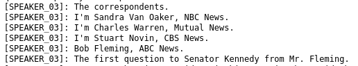

Audio and media files are a rich source in the social sciences and the Humanities. 
One example is oral history, in which historians interview contemporary witnesses to access information beyond written sources. 
 gives an introduction to the topic and lays out potential challenges. But once you have your audio(visual) material. 
How can you make it accessible for structured analysis? This is a task Galaxy can help with.
The platform contains several tools for automatic speech recognition (ASR). 
From uploading and converting to suitable file types to transcriptions and post-processing, Galaxy has you covered.

This tutorial aims to make the audio track of a video machine-readable for further processing. 
It is the pre-processing step to get you started. 
Once you have covered this, you can further analyse your material more thoroughly. This step will not be covered in this tutorial.

We use a video of the 1960 United States presidential debate between John F. Kennedy and Richard Nixon.
It was broadcast on television, and the recording is now in the public domain. We will use [WhisperX](https://usegalaxy.eu/root?tool_id=%2Fwhisperx) to transcribe the material. 
The advantage of WhisperX over [Whisper](https://usegalaxy.eu/root?tool_id=whisper), another tool available on Galaxy, is its speaker diarization. 
This means the tool recognises different speakers and (tries to) allocate the text passages accordingly. 
To make it easier to distinguish "who said what", we later replace the tool's naming convention of, for example, "SPEAKER_00," with the name of the person speaking. 
Then we extract passages from Kennedy's and Nixon's speeches for further analysis. 


> <agenda-title></agenda-title>
>
> In this tutorial, we will cover:
>
> 1. TOC
> {:toc}
>
{: .agenda}

# Upload your Files

You can upload data in various ways. Here are some examples:

> <hands-on-title> Data Upload </hands-on-title>
>
> 1. Create a new history for this tutorial
>
>    
>
> 2. Import the files from the shared data library (`GTN - Material` -> `{{ page.topic_name }}`
>     -> `{{ page.title }}`) or from [Zenodo](https://zenodo.org/records/17949386):
>
>    ```
>    https://zenodo.org/records/17949386/files/1960_kennedy-nixon_1.mp4
>    ```
>
>    
>    
>    
>
> 4. Check the Datatype
>
>    
>
{: .hands_on}

We upload one file: the video of the presidential debate we want to transcribe. 

Once you click start, your upload should begin. It will turn green once it is done.
If you follow this workflow with one of your own files, make sure to check your file's datatype. 
If your file's datatype is not supported as an input for Whisper or WhisperX, you can use [FFMPEG](https://usegalaxy.eu/root?tool_id=ffmpeg_converter) to convert your input file into a format WhisperX supports. 
You can check which file types a tool supports by clicking on the tool of your choice, for example, [WhisperX](https://usegalaxy.eu/root?tool_id=%2Fwhisperx), and clicking on "accepted formats" below the upload section, where you choose the tool input.


## Get to know your Input

You should now have one item in your history.
But how can you watch the video? If you try to access it via the view option, a download button pops up. 
But you do not need to download the file.
Instead, browse to the activity bar on the left side of your screen and click on ["Vizualisation"](https://usegalaxy.eu/visualizations). 
There, search for ["Media Player"](https://usegalaxy.eu/visualizations/create/plyr). 
Select the video in the dropdown menu and click on play to watch the video or audio.

> <question-title></question-title>
>
> 1. How long is the video?
> 2. What is the colour of the video?
>
> > <solution-title></solution-title>
> >
> > 1. 16:11
> > 2. The video is in black and white.
> >
> {: .solution}
>
{: .question}

This video shows the first televised presidential debate held between Richard Nixon and John F. Kennedy in 1960.  
You can use Galaxy for automated speech recognition.


# Sub-step with **Speech to Text with Diarization**
Galaxy has different tools to transcribe your media files: [Whisper](https://usegalaxy.eu/root?tool_id=whisper)
and WhisperX [WhisperX](https://usegalaxy.eu/root?tool_id=%2Fwhisperx). 
If you want to transcribe a monologue or do not care about who said what, you can choose Whisper. 
If you want to differentiate between various speakers, use WhisperX instead. This is what we will do here to create our video transcript. 

Please make sure to comply with your local copyright and privacy laws regarding recordings and sensitive data, if applicable. 
You might also need to get informed consent first to use this tool on some files. 
Read more, for example, on the regulations in Germany [here](https://forschungsdaten.info/themen/rechte-und-pflichten/datenschutzrecht/).

> <hands-on-title> Create the Video Transcription </hands-on-title>
>
> 1.  with the following parameters:
>    -  *"Select audio or video file"*: `output` (Input dataset)
>    - *"Speech to Text Model"*: `Medium (~2x faster than the large model)`
>    - *"Language"*: `English`
>    - *"Output Format"*: `Text`
>
>    > <comment-title> Choose a suitable model </comment-title>
>    >
>    > There are several models to choose from. This [overview](https://whisper-api.com/blog/models/) can help you decide. The bigger the model, the higher the accuracy, but also the greater the computational time for transcription and its carbon footprint.
>    > Despite the tool's option to auto-detect the language, we suggest selecting a language if you can. This saves computing resources.
>    > The `Medium` model selected here showed the best results for this recording. The large model was too sensitive and returned many errors, while the smaller ones were not accurate enough. Files with different qualities and in other languages may differ.
>    > For those, you can check Eamonn Bell's [workflow on comparing Whisper Models](https://usegalaxy.eu/u/eamonnbell/w/compare-two-whisper-models-on-a-set-of-audio-files) or build your own for WhisperX based on this.
>    {: .comment}
>
{: .hands_on}


Now, take a look at the finished transcript as soon as the job turns green.

> <question-title></question-title>
>
> 1. How many different speakers does your transcript show?
>
> > <solution-title></solution-title>
> >
> > 1. There are 4 different speakers, named `SPEAKER_00` through `SPEAKER_03`.
> >
> {: .solution}
>
{: .question}

Your transcript differs slightly because Whisper is not deterministic, meaning its outputs are not standardised. 
You can run it several times and will get a slightly different output each time.
Another thing to be aware of is small errors that can occur in speaker diarization.
The longer a person speaks on the recording, the easier it is for Whisper to allocate a speaker. 
If someone speaks only a single sentence in the whole recording, it might mean it is not recognised as a different speaker. 
As a result, some passages can be wrongly allocated as happened in the last bit of the recording:



The above screenshot shows an extract at the end of the transcript. 
You can also watch that part of the recording in the media player starting at 14:35. 
It is the moment when correspondents and reporters introduce themselves in one line each.
The video clearly shows four different journalists speaking. WhisperX, however, names them all SPEAKER_03 and fails to distinguish between them at this point. 
As we are more interested in the presidential candidates than the journalists, this poses no issue to us. But keep this in mind for your own transcripts.

It is cumbersome to keep track of who is who in this version of the transcript. 
We will make it a bit more obvious by renaming the speakers with their given names with the help of Regular Expressions (RegEx).

# Allocate the Speakers by using Regular Expressions

We will start by allocating the moderator. 
In this example transcript, the moderator was recorded as `SPEAKER_03`. 
This might differ slightly from your text. 
If you want to make sure, you can either listen to the video and check the transcript, or you can search for who speaks the first line in the transcript and use this alias if it differs from `SPEAKER_03`, and replace it with `Moderator`.

## Allocating the Moderator

> <hands-on-title> Allocating the Moderator </hands-on-title>
>
> 1.  with the following parameters:
>    -  *"File to process"*: `output_txt` (output of **Speech to Text with Diarization** )
>    - In *"Find and Replace"*:
>        -  *"Insert Find and Replace"*
>            - *"Find pattern"*: `SPEAKER_03`
>            - *"Replace with"*: `Moderator`
>            - *"Find and Replace text in"*: `entire line`
>
>
>    
>
> 2. Rename your output file (once it is green) to `Transcribed_Mod` to signal that this text was transcribed and includes the allocated moderator.
>
>    
>
{: .hands_on}

The tool goes through the text line by line, finds passages that match `SPEAKER_03`, and replaces them with `Moderator`. 
When the dataset turns green, we can check whether our renaming worked. This step makes it easier to point out when the moderator spoke.

We will repeat this step three more times to allocate all the speakers mentioned in the transcript. 
Make sure to always use the latest text file to ensure we end up with a single text file where all speakers are clearly distinguished.

## Allocating Kennedy

We are continuing in chronological order, so the next speaker after the moderator is Kennedy.
In the example, his lines are tagged with `SPEAKER_00`. 
We use this (or the name used in your text) and replace it with `Kennedy` by redoing this step.

> <hands-on-title> Allocating Kennedy </hands-on-title>
>
> 1.  with the following parameters:
>    -  *"File to process"*: `Transcribed_Mod` (output of **Replace** )
>    - In *"Find and Replace"*:
>        -  *"Insert Find and Replace"*
>            - *"Find pattern"*: `SPEAKER_00`
>            - *"Replace with"*: `Kennedy`
>            - *"Find and Replace text in"*: `entire line`
>
> 2. Rename your output file to `Transcribed_Mod_Ken`.
{: .hands_on}

The text should now also clearly indicate which lines Kennedy spoke. We will continue to allocate Nixon's passages as well.

## Allocating Nixon

Nixon's first line is: `Senator Kennedy.` You can search for it to see if it was also attributed to `SPEAKER_01`, as in this example. 
If not, use the respective name as the `Find pattern` in the tool instead.

> <hands-on-title> Allocating Nixon </hands-on-title>
>
> 1.  with the following parameters:
>    -  *"File to process"*: `Transcribed_Mod_Ken` (output of **Replace** )
>    - In *"Find and Replace"*:
>        -  *"Insert Find and Replace"*
>            - *"Find pattern"*: `SPEAKER_01`
>            - *"Replace with"*: `Nixon`
>            - *"Find and Replace text in"*: `entire line`
>
> 2. Rename your output file to `Transcribed_Mod_Ken_Nix`.
{: .hands_on}

## Allocating Fleming

The only journalist clearly named in this example was Bob Fleming. 
He probably spoke a longer passage that clearly distinguished him from the others.
We also allocate his passage, as before. 
His first line is: `Senator, the Vice President in his campaign has said that you are naive and at times immature.`

> <hands-on-title> Allocating Fleming </hands-on-title>
>
> 1.  with the following parameters:
>    -  *"File to process"*: `Transcribed_Mod_Ken_Nix` (output of **Replace** )
>    - In *"Find and Replace"*:
>        -  *"Insert Find and Replace"*
>            - *"Find pattern"*: `SPEAKER_02`
>            - *"Replace with"*: `Fleming`
>            - *"Find and Replace text in"*: `entire line`
>
> 2. Rename your output file to `Transcribed_all`.
{: .hands_on}

Congratulations, now all speakers are allocated.
When we compare this file with the initial transcript, all speakers are now allocated, making it easier to see who spoke what. 
There should be no more passages saying `SPEAKER_xx` in your text. 
This may be all you need, but you may want to go further and work only with selected text. 
In this example, we want to get a sense of the topics Nixon and Kennedy addressed during their time on screen. 
Therefore, we will first select all passages allocated to them and then clean them.

# Select  and clean the presidential candidate's passages

In this step, we will use the `Transcribed_all` file to select only the lines from Nixon and Kennedy, that are most relevant to this example.

## Select Nixon's passages

First, we search the document for mentions of Richard Nixon, which are now marked as `[Nixon]`. 
Despite the tool's name, `search`, it actually selects the lines that fit a certain expression, in our case, the speaker allocation for Nixon. 

> <hands-on-title> Search Nixon's passages </hands-on-title>
>
> 1.  with the following parameters:
>    -  *"Select lines from"*: `Transcribed_all` (output of **Replace** )
>    - *"Regular Expression"*: `\[Nixon\]`
>
> 2. Rename your output file to `Nixon_raw`.
>
>    > <comment-title> Using RegEx here </comment-title>
>    >
>    > As the input is set as another Regular Expression, we need to "escape" the brackets by putting `\` in front of them in order to make the selection work.
>    {: .comment}
>
{: .hands_on}


> <question-title></question-title>
>
> 1. How many lines were selected for Nixon?
>
> > <solution-title></solution-title>
> >
> > 1. 83
> >
> {: .solution}
>
{: .question}


## Select Kennedy's passages

We will redo this step to extract the parts of John F. Kennedy's speech accordingly.

> <hands-on-title> Search Kennedy's passages </hands-on-title>
>
> 1.  with the following parameters:
>    -  *"Select lines from"*: `Transcribed_all` (output of **Replace** )
>    - *"Regular Expression"*: `\[Kennedy\]`
>
> 2. Rename your output file to `Kennedy_raw`.
>
>    > <comment-title> Troubleshooting </comment-title>
>    >
>    > Make sure to select `Transcribed_all` as your input. If you select `Nixon_raw` instead, your output will be empty as that file no longer contains any passages spoken by Kennedy.
>    {: .comment}
>
{: .hands_on}


This output might already suffice, depending on what you want to do with the texts. 
If you want to use it further, some text cleaning might be in order.


## Clean Nixon's passages

Since all of the passages in this file are now from Nixon, the allocation saying `[Nixon]: ` at the beginning of each line is redundant.
We remove it in the next step.

> <hands-on-title> Clean Nixon's passages </hands-on-title>
>
> 1.  with the following parameters:
>    -  *"File to process"*: `Nixon_raw` (output of **Search in textfiles** )
>    - In *"Find and Replace"*:
>        -  *"Insert Find and Replace"*
>            - *"Find pattern"*: `[Nixon]: `
>            - *"Find and Replace text in"*: `entire line`
>
> 2. Rename your output file to `Nixon_cleaned`.
>
>    > <comment-title>Troubleshooting</comment-title>
>    >
>    > Make sure to add the space after the colon to clean the text properly. If you forget, each line will start with a space! 
>    {: .comment}
>

{: .hands_on}

The result is the transcript of the text Nixon spoke during the debate. You can use it for further in-depth analysis or visualise it.
To get the same for Kennedy, we have to redo the same step on Kennedy's text.


## Clean Kennedy's passages

> <hands-on-title> Clean Kennedy's passages </hands-on-title>
>
> 1.  with the following parameters:
>    -  *"File to process"*: `Kennedy_raw` (output of **Search in textfiles** )
>    - In *"Find and Replace"*:
>        -  *"Insert Find and Replace"*
>            - *"Find pattern"*: `[Kennedy]: `
>            - *"Find and Replace text in"*: `entire line`
>
> 2. Rename your output file to `Kennedy_cleaned`.
>
>    > <comment-title>Troubleshooting</comment-title>
>    >
>    > Also here, remember to add the space after the colon. It is easy to forget.
>    {: .comment}
>
{: .hands_on}

Congratulation! You should now have two cleaned texts. One with Kennedy's text and one with Nixon's text.

# Conclusion

With the example of the first televised presidential debate of Richard Nixon and John F. Kennedy in 1960, this tutorial introduced you to automated speech recognition using Galaxy.
We introduced several tools to transcribe your audio and video files into machine-readable text.
Building on this, we explored how using Regular Expressions can help us clean the automated text and extract specific passages, in our case, the lines from Nixon and Kennedy respectively. 
Which audio and video files do you want to test this on?
