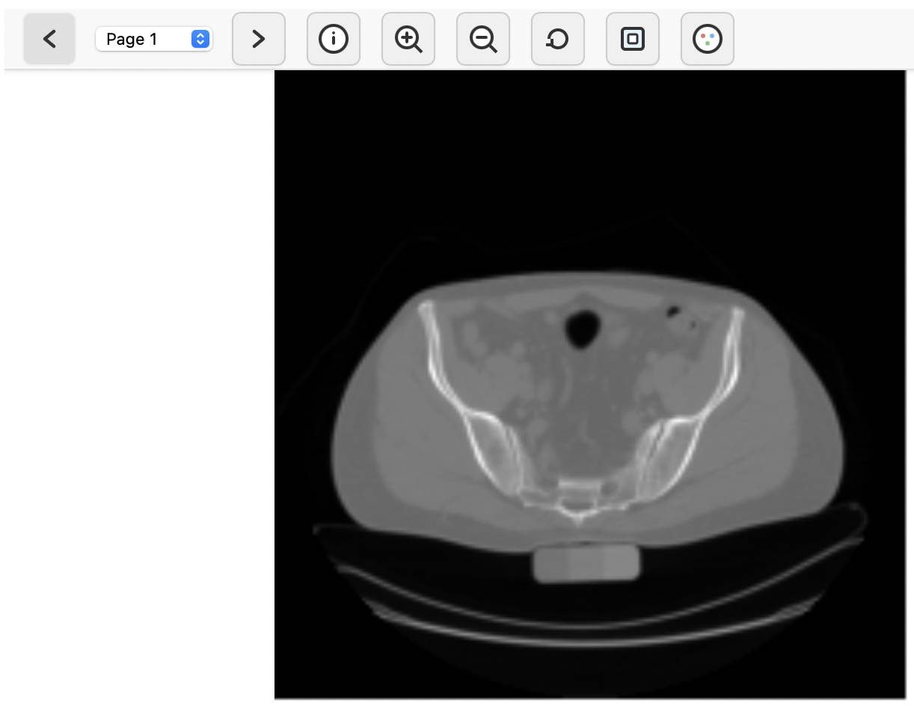
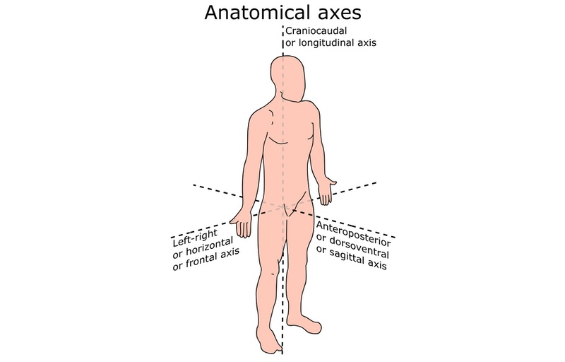

Image data in medical imaging is often stored and exchanged in the DICOM file format. A DICOM dataset is a file that contains rich metadata (patient, study info) and the actual medical image data stored as pixels (for 2-D images) or voxel (for 3-D images). The image data can be single-channel or multi-channel, and it can also be organized in multiple frames (e.g., spatial tiles of a mosaic, z-slices of a 3-D image, or time steps).

Even though, technically, DICOM datasets can contain heterogeneous frames for different axes (e.g., z-slices and temporal frames), in practice, the frames of a DICOM dataset are usually designated for only one specific purpose and axis (e.g., z-slices or temporal frames). For such cases, DICOM series are more widely adopted: A list of DICOM datasets can form a DICOM series to store multi-dimensional data (e.g., a list of 3-D images for consecutive time steps, or just the z-slices of a 3-D image, where each slice is a single DICOM dataset).

In this tutorial, we will show how DICOM series and DICOM datasets can be converted to TIFF, which is a general-purpose image file format that is well-supported by a majority of tools in Galaxy. We will use that to showcase segmentation and visualization of anatomical structures in 3-D image data from computed tomography (CT). The Galaxy Image Analysis tools and techniques utilized in this tutorial are domain-agnostic and can also be adapted to other imaging modalities (e.g., 3-D cell imaging).

> <agenda-title></agenda-title>
>
> In this tutorial, we will deal with:
>
> 1. TOC
> {:toc}
>
{: .agenda}

# Getting the Image Data

In this tutorial, we will be using a publicly available CT dataset of a human torso, scanned between the thorax and the pelvis.

> <hands-on-title>Data upload</hands-on-title>
>
> 1. If you are logged in, create a new history for this tutorial
>
>    
>
> 2. Import the following dataset from [Zenodo]({{ page.zenodo_link }}) or from the data library (ask your instructor).
>
>    ```
>    {{ page.zenodo_link }}/files/PCIR_98890234_20010101_7.zip
>    ```
>
>    
>
>    
>
> 3.  with the following parameters:
>    -  *"Input file"*: `PCIR_98890234_20010101_7.zip`
>    - *"What to extract"*: `All files`
>
> 4. Rename  the dataset collection to `DICOM series`
>
>    
>
> 4. Change the datatype of  `DICOM series` to `Auto-detect`
>    
>    <!-- For some reason, there is no "Auto-detect" option when using the non-bulk version of the "Change data type" function of the collection -->
>    
{: .hands_on}

# Pre-processing

In this DICOM series, each DICOM dataset contains the z-slice of the 3-D image. The metadata of each DICOM dataset in the series contains the z-position of the slice, so the order of the individual DICOM datasets in the collection does not matter (note that for other images, in general, this information might be missing in the metadata, in which case the order of the datasets might be crucial).

Our first step will be to convert the DICOM series into a single TIFF image, that represents the whole 3-D dataset.

> <hands-on-title>Convert DICOM series to TIFF image</hands-on-title>
>
> 1.  with the following parameters to convert the DICOM series (list of DICOM datasets) into a list of TIFF images:
>    -  *"DICOM dataset"*: `DICOM series` collection
> 2.  with the following parameters to concatenate the stack of TIFF images along the z-axis into a single 3-D image:
>    -  *"Images to concatenate"*: Output of 
>    - *"Concatenation axis"*: `Z-axis (concatenate images as slices of a 3-D image or image sequence)`
>    - *"Scaling of values"*: `Preserve range of values`
>    - *"Sort images before concatenating"*: `Sort images by their position along the Z-axis`
>
>    > <comment-title>Why do we convert DICOM to TIFF?</comment-title>
>    >
>    > Although DICOM is *the* standard file format in medical imaging, in research, it is convenient to use to TIFF for image analysis for several reasons:
>    > 
>    > **Advantages of TIFF for image analysis:**
>    > - **Tool compatibility:** Most image analysis and visualization tools in Galaxy and other scientific computing platforms are optimized for standard, general-purpose image formats like TIFF. In addition, TIFF is also well-supported by programming languages (e.g., Python, MATLAB), which can be handy for advanced analyses.
>    > - **Simpler structure:** TIFF has more straightforward data organization for computational processing. A single multi-dimensional TIFF file is easier to handle than hundreds or thousands of seperate DICOM datasets.
>    > - **Metadata handling:** The extensive clinical metadata of DICOM (e.g., patient info, acquisition protocols) can be challenging to parse and process for general-purpose image analysis tools.
>    > 
>    > **Important considerations:**
>    > - **Metadata preservation is critical:** During conversion, spatial calibration data (voxel spacing, slice positions, orientation) must be preserved. Without these informations, it is not possible to translate spatial image analysis readouts (e.g., object sizes) into physical units (e.g., mm, cm), rendering quantitative analysis meaningless.
>    > - **DICOM advantages:** DICOM remains essential for clinical workflows, PACS integration, and regulatory compliance. For pure clinical use, stay in DICOM format.
>    {: .comment}
{: .hands_on}

Some of the tools that we will be using in our analysis require that the voxel size of the image is isotropic. To ensure that this is the case, we will re-sample the image data to an isotropic voxel size:

> <hands-on-title>Re-sample image data for isotropic pixel/voxel sizes</hands-on-title>
>
> 1.  with the following parameters to re-sample the image data to an isotropic voxel size:
>    -  *"Input image"*: Output of 
>    - *"How to scale?"*: `Scale to spatially isotropic pixels/voxels`
>    - *"Method"*: `Down-sample (might lose information)`
{: .hands_on}

If the image data already would have been isotropic, this tool would yield the original data.

CT image data, such as the dataset that we are using in this tutorial, typically have intensity values that correspond to the Hounsfield scale. Using Hounsfield Units (HU) is advantageous, because it allows to directly identify specific materials or tissues solely based on the image intensities. Typical HU values are –1000 HU for air, –700 to –200 HU for skin tissue, –200 to –50 HU for fat tissue, 0 HU for water, –20 to 140 HU for muscle tissue, and 200 to 3071 HU for bone tissue (e.g., ).

However, the image data may also contain values outside of the range of –1000 to 3071 HU that correspond to, for example, parts of the CT imaging setup, or imaging artifacts. To effectively “erase” those parts from the image data, we will clip the image intensities to the meaningful range of –1000 to 3071 HU as a final step of pre-processing:

> <hands-on-title>Clipping the image intensities</hands-on-title>
>
> 1.  with the following parameters:
>    -  *"Input image"*: Output of 
>    - *"Lower bound"*: `-1000`
>    - *"Upper bound"*: `3071`
{: .hands_on}

# Exploring the Image Data

Galaxy's built-in TIFF viewer can be used to roughly explore the image data. To do so, click on the  (eye) icon next to the output of the  tool. This will bring up a basic user interface that shows a z-slice of the 3-D image, along with the option to navigate to a different slice along the *z-axis* (slices are presented as "pages"). The viewer shows the *x-axis* as *left-to-right* and the *y-axis* as *top-to-bottom*.



The buttons in the toolbar can be used to zoom and pan the view, or this can be accomplished by using the scroll wheel or dragging the image with a pressed mouse button. Even though this viewer is very simple, we can make two important observations that provide some rough orientation within the image data that we are dealing with:

1. The *y-axis* is the **anteroposterior axis** (or *anterior-posterior*, from the front to the back of the torso).
2. The *z-axis* is the **craniocaudal axis** (or *cranial-caudal*, from the bottom to the top of the torso).



We will now use this information to get a visually more informative representation of the image data by creating a 3-D volume rendering (geometrical projection of the 3-D image data onto the 2-D screen plane).

Inspecting 3-D data as a 2-D projection is intrinsically challenging because it requires transformations of the data that inherently reduce the information along the way—but we as humans, who are also subject to this limitation due to our two-dimensional vision, we have learned to deal with it naturally *by taking looks from different angles*. The tool that we are going to use for visualization mimics this intuition by generating *videos* instead of plain images, that use different angles for the projection:

> <hands-on-title>Visual inspection via pre-rendered video</hands-on-title>
>
> 1.  with the following parameters:
>    -  *"Input image (3-D)"*: Output of 
>    - *"Unit of the intensity values"*: `Hounsfield`
>    - *"Rendering mode"*: `Maximum Intensity Projection (MIP)`
>    - *"Color map"*: `rainbow`
>    - *"Camera parameters"*:
>      - *"Distance"*: `350`
>    - *"Video parameters"*:
>      - *"Frames"*: `400`
>
>    > <comment-title>How do we establish proper orientation of the image data in 3-D?</comment-title>
>    >
>    > The parameter for the *"Coordinate system"* is set to `Point Z to the top` by default. This is the setting that we must use here, since we have identified the z-axis as the *craniocaudal* axis. For other image data it might be necessary to instead `Point Y to the top`.
>    {: .comment}
{: .hands_on}

Click on the  (eye) icon next to the output of the  tool to inspect the obtained visualization:

<!--
    Command to compress screen recordings to reasonable file size:
    ffmpeg -ss 0.5 -t 16 -i input.mov -vf "fps=15,scale=-1:512:flags=lanczos" -c:v libx264 -preset slow -crf 26 -movflags +faststart -pix_fmt yuv420p -an output.mp4

    An alternative is to use webp, but this yields larger files with worse quality:
    ffmpeg -ss 0.5 -t 16 -i input.mov -vf "fps=12,scale=-1:400:flags=lanczos" -loop 0 -c:v libwebp_anim -quality 40 -compression_level 5 -speed 2 -an output.webp
-->
<video loop="true" autoplay="autoplay" muted width="100%">
    <source src="../../images/dicom-anatomical-3d/mip_rainbow.mp4" type="video/mp4"/>
</video>

The *Maximum Intensity Projection (MIP)* is useful to get an idea of the spatial distribution of the image intensities within the image. At each time step of the video, the MIP is computed by casting a ray from each image pixel through the 3-D volume of image intensities, and taking the maximum intensity value along the line by sampling the image intensities at fixed steps (the rendering technique is thus called *ray marching*).

# Skeletal Segmentation

The imaged section of the torso in our dataset contains parts of prominent skeletal structures such as the pelvis, the spine, and the thorax. Segmentation of these structures is easy due to the distinct ranges of the Hounsfield scale:

> <hands-on-title>Skeletal segmentation in a CT image</hands-on-title>
>
> 1.  with the following parameters:
>    -  *"Input image"*: Output of 
>    - *"Thresholding method"*: `Manual`
>    - *"Threshold value"*: `120`
>
>    > <question-title></question-title>
>    >
>    > Why do we use a threshold value of just 120, if the typical range of HU values for bone tissue starts at about 200 HU?
>    >
>    > > <solution-title></solution-title>
>    > > Some bones in the imaged data are quite thin (e.g., the ends of the ribs). This leads to *partial volume effects*: voxels at the edges of thin structures contain a mixture of bone and surrounding soft tissue (e.g., cartilage), resulting in intermediate intensity values lower than pure bone. When we re-sampled the image data to an isotropic voxel size, we chose to *down-sample* the image data. A consequence of this is that voxel intensity values are locally averaged, which can lead to reduced intensity values of thin structures.
>    > {: .solution }
>    {: .question}
{: .hands_on}

Lets inspect the segmentation result using a 3-D overlay of the input image and the segmentation mask:

> <hands-on-title>Visualization of 3-D segmentation results</hands-on-title>
>
> 1.  with the following parameters:
>    -  *"Input image (3-D)"*: Output of 
>    - *"Unit of the intensity values"*: `Hounsfield`
>    - *"Rendering mode"*: `Direct Volume Rendering (DVR)`
>    - *"Color map"*: `BrBG`
>      - *"Ramp function"*: `Enabled`
>        - *"Ramp start"*:
>          - *"Type of the intensity value"*: `Absolute intensity value`
>          - *"Intensity value"*: `100`
>        - *"Ramp end"*:
>          - *"Type of the intensity value"*: `Absolute intensity value`
>          - *"Intensity value"*: `150`
>    - *"Camera parameters"*:
>      - *"Distance"*: `350`
>    - *"Render mask overlay"*: `Render mask overlay`
>      - *"Mask overlay (3-D)"*: Output of 
>    - *"Video parameters"*:
>      - *"Frames"*: `400`
{: .hands_on}

The *Direct Volume Rendering (DVR)* is rendering technique similar to MIP, but instead of taking the maximum intensity for each image pixel it simulates the absorption of light and thus produces realistically looking surface renderings. Click on the  (eye) icon next to the output of the  tool to inspect the obtained visualization:

<video loop="true" autoplay="autoplay" muted width="100%">
    <source src="../../images/dicom-anatomical-3d/segm_skeletal1.mp4" type="video/mp4"/>
</video>

It can be seen from the visualization that objects corresponding to parts of the imaging setup (behind the spine) also fall into the selected HU range, and is thus falsely included in the segmentation skeletal segmentation result (leakage). To improve the segmentation result, we will thus remove all objects from the segmentation that are behind the spine and pelvis. To identify the spine and pelvis in the segmentation result, we exploit that they correspond to the largest connected component in our segmentation.

The first step is to determine the sizes of the connected components:

> <hands-on-title>Feature extraction for the connected components of the segmentation result</hands-on-title>
>
> 1.  with the following parameters to assign a unique label to each connected component of the segmentation result:
>    - *"Mode"*: `Connected component analysis`
>    -  *"Binary image"*: Output of 
>
> 2.  with the following parameters to measure the size and location of each connected component:
>    -  *"Label map"*: Output of 
>    - *"Available features"*:
>      - `Label from the label map`
>      - `Area`
>      - `Centroid`
{: .hands_on}

Next, we inspect the tabular output yielded by the  tool:

> |label|area   |centroid_x       |centroid_y        |centroid_z       |
> |:----|:------|:----------------|:-----------------|:----------------|
> |1    |61710.0|88.83420839410144|103.37395883973424|36.61537838275806|
> |2    |10465.0|97.36292403248925|139.6089823220258 |52.41691352126135|
> |3    |1.0    |87.0             |137.0             |0.0              |
> |4    |2.0    |44.0             |159.0             |0.5              |
> |5    |7.0    |132.0            |159.0             |3.0              |
> |6    |6.0    |48.5             |160.0             |1.0              |
> |…    |…      |…                |…                 |…                |
{: .matrix}

In this table, each row corresponds to a connected component in the segmentation result (identified by its unique label). The centroid of the connected components tells us where the components are located (the y-axis is the *anteroposterior axis* and points from the front to the back of the torso). By inspecting this table, we can easily conclude that the centroid of the largest connected component is located at a y-coordinate of 103.37 (in voxels).

Since this coordinate corresponds to the centroid of the spine and pelvis, removing all objects with a y-coordinate of more than 103.37 voxels is likely to also remove some ribs—which we do not want to happen. Hence, we will add a tolerance margin for objects: Instead of strictly removing all objects that are behind the centroid of the spine and pelvis, we will only remove those that are 1,5cm or further behind.

The size of the margin needs to be given in voxels. To determine that, we inspect the standard output of the  tool, that contains many details:

> <hands-on-title>Inspect the standard output of the "Scale image" tool</hands-on-title>
>
> 1. Expand the history item for the output of the  tool.
>
> 2. Click on the  icon.
>
> 3. Scroll down to the **Job Information** section to view the "Tool Standard Output" log:
>
>  > <code-out-title>Standard output of the "Scale image" tool</code-out-title>
>  > ```
>  > Input axes: ZYX
>  > Input resolution: (1.137778101526753, 1.137778101526753), unit: mm, z_position: -248.60999337383177, z_spacing: 2.4999998490566036
>  > scale: (1, 1, 1.0, 0.35156242119108805, 0.35156242119108805)
>  > order: 1
>  > preserve_range: True
>  > channel_axis: 5
>  > anti_aliasing: True
>  > anti_aliasing_sigma: (0, 0, 0, 0.9222225410383957, 0.9222225410383957, 0)
>  > Output shape: (107, 180, 180)
>  > Output axes: ZYX
>  > Output resolution: (0.4000000241509449, 0.4000000241509449), unit: mm, z_position: -248.60999337383177, z_spacing: 2.4999998490566036
>  > ```
>  {: .code-out}
{: .hands_on}

What we are interested in here is the line for the `Output resolution`. The first tuple `(0.4000000241509449, 0.4000000241509449)` corresponds to the number of voxels per millimeter along the x- and y-axes. From this we can deduce with basic algebra, that one voxel corresponds to 2,5mm along the y-axis (in fact, we can also read off the value for the `z_spacing`, which is identical due to the isotropic re-sampling). Thus, a margin of 1,5cm corresponds to 6 voxels.

With this information, we can now write a *rules* file for removing the leakage from the segmentation result:

> <hands-on-title>Write a rules file to remove spurious objects from the segmentation</hands-on-title>
>
> 1. Create a new file via the  **Upload Data** tool in Galaxy, use the name `rules_skeletal`, paste the following content, and set the format to tabular:
>    ```
>    feature   	min	max
>    centroid_y	0	109.37
>    ```
>
>    
{: .hands_on}

The upper bound of 109.37 for the y-coordinate of the centroids of the objects that we will retain in the segmentation is obtained by adding the margin of 6 voxels to the previously determined y-coordinate of the centroid of the spine and pelvis.

Now we are all set to remove the leakage from the segmentation result:

> <hands-on-title>Remove spurious objects from the segmentation</hands-on-title>
>
> 1.  with the following parameters:
>    -  *"Label map"*: Output of 
>    -  *"Features"*: Output of 
>    -  *"Rules"*: `rules_skeletal`
>
> 2.  with the following parameters:
>    -  *"Input image (3-D)"*: Output of 
>    - *"Unit of the intensity values"*: `Hounsfield`
>    - *"Rendering mode"*: `Direct Volume Rendering (DVR)`
>    - *"Color map"*: `BrBG`
>      - *"Ramp function"*: `Enabled`
>        - *"Ramp start"*:
>          - *"Type of the intensity value"*: `Absolute intensity value`
>          - *"Intensity value"*: `100`
>        - *"Ramp end"*:
>          - *"Type of the intensity value"*: `Absolute intensity value`
>          - *"Intensity value"*: `150`
>    - *"Camera parameters"*:
>      - *"Distance"*: `350`
>    - *"Render mask overlay"*: `Render mask overlay`
>      - *"Mask overlay (3-D)"*: Output of 
>    - *"Video parameters"*:
>      - *"Frames"*: `400`
{: .hands_on}

Click on the  (eye) icon next to the output of the  tool to visually inspect the improved segmentation result:

<video loop="true" autoplay="autoplay" muted width="100%">
    <source src="../../images/dicom-anatomical-3d/segm_skeletal2.mp4" type="video/mp4"/>
</video>

> <question-title>Further improvements of the segmentation result</question-title>
>
> The visualization above shows that there are still small, spurious objects included in the segmentation. How to remove these?
>
> > <solution-title></solution-title>
> > Add another rule to the `rules_skeletal` file that you have created, then re-run the  tool. That rule should be for the `area` feature and impose a reasonable `min` value for the minimum size of retained connected components. The value for `max` could be `100000`, for example.
> {: .solution }
{: .question}

# Vessel Segmentation

As another example of the segmentation of anatomical structures, we will now perform a segmentation of the aortic bifurcation, a key vascular landmark where the abdominal aorta divides into the left and right common iliac arteries. Vessel segmentation is very different from skeletal segmentation, because vessels do not exhibit a specific HU intensity value and generally have a very low contrast compared to the surrounding tissue. Moreover, they often are very thin, elongated structures, with and without branches, which poses additional challenges compared to segmentation of large connected image regions.

In CT imaging, vessels usually appear as thin lines of subtly higher intensity than the surrounding tissue (just like the ridges of mountains on a relief map). Image filters that enhance such structures are thus called *ridge filters*. The most prominent ridge filter for vessel enhancement in 3-D images is the Frangi filter ().
> <comment-title>Contrast-enhanced vs. non-contrast vessel imaging</comment-title>
>
> Vessel segmentation feasibility is highly dependent on the imaging protocol:
>
> **Non-contrast CT:**
> - Blood vessels: ~30–50 HU (similar to muscle: 40–60 HU)
> - Can also be much less due to *partial volume effects*
> - Minimal contrast with surrounding tissue
> - Less suited for detailed vascular examination (e.g., segmentation of whole vessel trees)
> - Frangi filter unreliable for very thin vessels (e.g., coronary vessels)
>
> **Contrast-enhanced CT (CTA):**
> - Contrast-filled vessels: 250–400 HU (with iodinated contrast agent)
> - Excellent contrast against surrounding tissue (40–60 HU)
> - Frangi filter performs reliably for vessel detection
> - Clinical standard for vascular imaging and segmentation
>
> The image data used in this tutorial is *non-contrast* CT.
{: .comment}
Our workflow for the segmentation of the aortic bifurcation is as follows:

- First, we will apply a *Frangi filter* to perform image enhancement for vessels and other vessel-like structures. The responses of Frangi filters range between 0 and 1, which directly indicates the "vesselness" of an image point.
- Second, we will perform *hysteresis thresholding* to segment connected parts of the vascular tree with a particularly high filter response (i.e. a particularly high vesselness).
- Third, we will apply *feature extraction* and *label map filtering* to select the largest connected component of the segmented vascular tree (like we did for skeletal segmentation).

The individual workflow steps are as follows:

> <hands-on-title>Vessel segmentation and feature extraction</hands-on-title>
>
> 1.  with the following parameters:
>    -  *"Input image"*: Output of 
>    - *"Filter"*: `Frangi vesselness filter`
>    - *"Mode of operation"*: `Enhance bright ridges (high image intensities)`
>    - *"Minimum sigma"*: `0.5`
>    - *"Maximum sigma"*: `1.5`
>    - *"Number of sigma steps for multi-scale analysis"*: `3`
>    - *"Alpha"*: `0.5`
>    - *"Beta"*: `0.5`
>    - *"Gamma"*: `5.0`
>
> 2.  with the following parameters:
>    -  *"Input image"*: Output of 
>    - *"Thresholding method"*: `Manual`
>    - *"Threshold value"*: `0.25`
>    - *"Second threshold value for hysteresis thresholding"*: `0.3`
>
> 3.  with the following parameters:
>    - *"Mode"*: `Connected component analysis`
>    -  *"Binary image"*: Output of 
>
> 4.  with the following parameters:
>    -  *"Label map"*: Output of 
>    - *"Available features"*:
>      - `Label from the label map`
>      - `Area`
>
> 5.  with the following parameters:
>    -  *"Sort Query"*: Output of 
>    - *"Number of header lines"*: `1`
>    - *"Column selections"*: `1: Column selections`
>      - *"on column"*: `Column 2`
>      - *"in"*: `Descending order`
>      - *"Flavor"*: `Fast numeric sort (-n)`
{: .hands_on}

We inspect the tabular output yielded by the  tool:

> |label|area   |
> |:----|:------|
> |26   |11167.0|
> |132  |8739.0 |
> |176  |2910.0 |
> |175  |2821.0 |
> |42   |2157.0 |
> |…    |…      |
{: .matrix}

From this table, we can deduce that the largest connected component is the one with label 26. We now create the corresponding *rules* file for removing all other components from the segmentation:

> <hands-on-title>Segmentation and visualization of the aortic bifurcation</hands-on-title>
>
> 1. Create a new file via the  **Upload Data** tool in Galaxy, use the name `rules_aorticbif`, paste the following content, and set the format to tabular:
>    ```
>    feature	min	max
>    label  	26	26
>    ```
>
>    
>
> 2.  with the following parameters:
>    -  *"Label map"*: Output of 
>    -  *"Features"*: Output of 
>    -  *"Rules"*: `rules_aorticbif`
>
> 3. Create a new file via the  **Upload Data** tool in Galaxy, use the name `colormap_white`, paste the following content, and set the format to tabular:
>    ```
>    color	intensity	type
>    #ffffff00	0	relative
>    #ffffffff	1 	relative
>    ```
>
>    
>
> 4.  with the following parameters:
>    -  *"Input image (3-D)"*: Output of 
>    - *"Unit of the intensity values"*: `No unit`
>    - *"Rendering mode"*: `Direct Volume Rendering (DVR)`
>    - *"Color map"*: `Custom`
>    -  *"Custom color map"*: `colormap_white`
>    - *"Add a color bar"*: `No`
>    - *"Camera parameters"*:
>      - *"Distance"*: `250`
>    - *"Render mask overlay"*: `No overlay`
>    - *"Video parameters"*:
>      - *"Frames"*: `400`
{: .hands_on}

The obtained visualization shows the segmentation of the aortic bifurcation:

<video loop="true" autoplay="autoplay" muted width="100%">
    <source src="../../images/dicom-anatomical-3d/segm_aorticbif.mp4" type="video/mp4"/>
</video>

Vessel segmentation is generally challenging and still an active field of research. Segmentation of whole vascular trees may require more sophisticated methods (e.g., , ).

# Fully automated workflow

This tutorial contained several interactive steps that required inspection of data from previous steps. Note that this steps can also be automated, as we show in the supplemental workflow:


