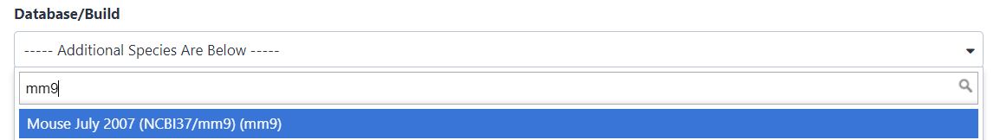

Wir sind auf eine Arbeit () mit dem Titel *"The histone
acetyltransferase MOF is a key regulator of the embryonic stem cell core transcriptional
network "* gestoßen. Die Arbeit enthält die Analyse möglicher Zielgene eines
interessanten Proteins namens Mof. Die Zielgene wurden durch ChIP-seq in Mäusen
gewonnen, und die Rohdaten sind über [GEO](https://www.ncbi.nlm.nih.gov/geo/query/acc.cgi?acc=GSE37268) verfügbar. Die Liste der
Gene ist jedoch weder in der Beilage der Arbeit noch in der GEO-Einreichung enthalten.
Das Naheliegendste, was wir finden konnten, ist eine Datei in GEO, die eine Liste der
Regionen enthält, in denen das Signal signifikant angereichert ist (so genannte
*Peaks*):

1 | 3660676 | 3661050 | 375 | 210 | 62.0876250438913 | -2.00329386666667
1 | 3661326 | 3661500 | 175 | 102 | 28.2950833625942 | -0.695557142857143
1 | 3661976 | 3662325 | 350 | 275 | 48.3062708406486 | -1.29391285714286
1 | 3984926 | 3985075 | 150 | 93 | 34.1879823073944 | -0.816992
1 | 4424801 | 4424900 | 100 | 70 | 26.8023246007435 | -0.66282

**Tabelle 1** Teilprobe der verfügbaren Datei

Das Ziel dieser Übung ist es, **die Liste der genomischen Regionen in eine Liste
möglicher Zielgene** umzuwandeln.



> <agenda-title></agenda-title>
> 
> In diesem Tutorium werden wir uns mit folgenden Themen beschäftigen:
> 
> 1. TOC
> {:toc}
>
{: .agenda}

# Vorbehandlungen

> <hands-on-title>Open Galaxy</hands-on-title>
> 
> 1. Navigieren Sie zu einer Galaxy-Instanz: die von Ihrem Ausbilder empfohlene oder
>    eine aus der Liste **Galaxy-Instanz** im Kopf dieser Seite
> 2. Anmelden oder registrieren (oberes Feld)
> 
>    
> 
{: .hands_on}

Die Galaxy-Schnittstelle besteht aus drei Hauptteilen. Auf der linken Seite sind die
verfügbaren Werkzeuge aufgelistet, auf der rechten Seite wird Ihr Analyseverlauf
aufgezeichnet, und im mittleren Bereich werden die Werkzeuge und Datensätze angezeigt.


Beginnen wir mit einer neuen Geschichte.


> <hands-on-title>Historie erstellen</hands-on-title>
> 
> 1. Stellen Sie sicher, dass Sie einen leeren Analyseverlauf haben.
> 
>    
> 
> 2. **Benennen Sie Ihren Verlauf**, damit Sie ihn leicht erkennen können
> 
>    > <tip-title>Einen Verlauf umbenennen</tip-title>
>    > 
>    > * Klicken Sie auf den Titel des Verlaufs (standardmäßig ist der Titel `Unnamed
>    >   history`)
>    > 
>    >   
>    > 
>    > * Geben Sie als Namen `Galaxy Introduction` ein
>    > * Drücken Sie <kbd>Eingabe</kbd>
>    {: .tip}
>
{: .hands_on}

## Daten-Upload

> <hands-on-title>Daten-Upload</hands-on-title>
> 
> 1. Laden Sie die Liste der Peak-Regionen (die Datei
>    [`GSE37268_mof3.out.hpeak.txt.gz`](https://www.ncbi.nlm.nih.gov/geo/download/?acc=GSE37268&format=file&file=GSE37268%5Fmof3%2Eout%2Ehpeak%2Etxt%2Egz))
>    von [GEO](https://www.ncbi.nlm.nih.gov/geo/query/acc.cgi?acc=GSE37268) auf Ihren
>    Computer herunter
> 2. Klicken Sie auf die Schaltfläche "Hochladen" in der oberen linken Ecke der
>    Benutzeroberfläche
> 
>    
> 
> 3. Drücken Sie **Lokale Dateien auswählen** und suchen Sie die Datei auf Ihrem Computer
> 4. Select `interval` as **Type**
> 5. Drücken Sie **Start**
> 6. Drücken Sie **Schließen**
> 7. Warten Sie, bis der Upload abgeschlossen ist. Galaxy wird die Datei automatisch
>    entpacken.
> 
> 8. Danach sehen Sie Ihren ersten Eintrag in der Historie im rechten Fensterbereich von
>    Galaxy. Es durchläuft den grauen (Vorbereitung/Warteschlange) und gelben (läuft)
>    Status und wird schließlich grün (Erfolg):
> 
>    
> 
>    Das direkte Hochladen von Dateien ist nicht die einzige Möglichkeit, Daten in
>    Galaxy zu bekommen
> 
>    
> 
>    > <tip-title>Daten in Galaxy importieren</tip-title>
>    > Es gibt [weitere Optionen]() für fortgeschrittene Benutzer.
>    {: .tip}
>
{: .hands_on}


> <comment-title>Intervall-Dateiformat</comment-title>
> Das **Intervall**-Format ist ein Galaxy-Format zur Darstellung genomischer Intervalle. Es ist tabulatorgetrennt, hat aber die zusätzliche Anforderung, dass drei der Spalten sein müssen:
> - Chromosomen-ID
> - Startposition (0-basiert)
> - Endposition (end-exclusive)
> 
> Eine optionale Strangspalte kann ebenfalls angegeben werden, und eine anfängliche
> Kopfzeile kann verwendet werden, um die Spalten zu beschriften, die nicht in einer
> bestimmten Reihenfolge angeordnet sein müssen. Im Gegensatz zum BED-Format (siehe
> unten) können auch beliebige zusätzliche Spalten vorhanden sein.
> 
> Weitere Informationen über Formate, die in Galaxy verwendet werden können, finden Sie
> auf der [Galaxy Data Formats page](https://usegalaxy.org/static/formatHelp.html).
> 
{: .comment}


> <hands-on-title>Attribute einer Datei untersuchen und bearbeiten</hands-on-title>
> 
> 1. Klicken Sie auf die Datei im Verlaufsfenster
> 
>    Einige Metainformationen (z.B. Format, Referenzdatenbank) über die Datei und die
>    Kopfzeile der Datei werden dann zusammen mit der Anzahl der Zeilen in der Datei
>    (48.647) angezeigt:
> 
>    
> 
> 2. Klicken Sie auf das  (Auge) Symbol (**Daten ansehen**) in
>    Ihrem Datensatz in der Historie
> 
>    Der Inhalt der Datei wird im zentralen Feld angezeigt
> 
> 3. Klicken Sie auf das  (Bleistift)-Symbol (**Attribute
>    bearbeiten**) in Ihrem Datensatz in der Historie
> 
>    Ein Formular zur Bearbeitung von Datensatzattributen wird im zentralen Bereich
>    angezeigt
> 
> 4. Suche nach `mm9` im **Datenbank/Build**-Attribut und Auswahl von `Mouse July 2007
>    (NCBI37/mm9)` (das Papier sagt uns, dass die Peaks von `mm9` stammen)
> 
>    
> 
> 5. Klicken Sie auf **Speichern** am oberen Rand
> 6. Hinzufügen eines Tags namens `#peaks` zum Datensatz, um ihn in der Historie besser
>    verfolgen zu können
> 
>    
> 
>    Der Datensatz sollte nun in der Historie wie folgt aussehen
> 
>    {: width="250px" height="300px"}
> 
{: .hands_on}

Um die mit diesen Peak-Regionen verwandten Gene zu finden, benötigen wir auch eine Liste
von Genen in Mäusen, die wir von UCSC erhalten können.

> <hands-on-title>Daten-Upload von UCSC</hands-on-title>
> 
> 1. Suche nach `UCSC Main` in der Werkzeug-Suchleiste (oben links)
> 
>    
> 
> 2. Klicken Sie auf `UCSC Main` 
> 
>    Sie werden zum **UCSC-Tabellenbrowser** weitergeleitet, der in etwa wie folgt
>    aussieht:
> 
>    
> 
> 3. Setzen Sie die folgenden Optionen:
>     - *"Klade "*: `Mammal`
>     - *"Genom "*: `Mouse`
>     - *"Baugruppe "*: `July 2007 (NCBI37/mm9)`
>     - *"Gruppe "*: `Genes and Gene Predictions`
>     - *"Spur "*: `RefSeq Genes`
>     - *"Tabelle "*: `refGene`
>     - *"Region "*: `genome`
>     - *"Ausgabeformat "*: `BED - browser extensible data`
>     - *"Ausgabe senden an "*: `Galaxy` (nur)
> 
> 4. Klicken Sie auf die Schaltfläche **Ausgabe erhalten**
> 
>    Sie sehen den nächsten Bildschirm:
> 
>    
> 
> 5. Stellen Sie sicher, dass *"Create one BED record per "* auf `Whole Gene` gesetzt
>    ist
> 6. Klicken Sie auf die Schaltfläche **Abfrage an Galaxy senden**
> 7. Warten, bis der Upload beendet ist
> 8. Benennen Sie unseren Datensatz in etwas Erkennbareres wie `Genes` um
> 
>    
> 
> 9. Hinzufügen eines Tags namens `#genes` zum Datensatz, um ihn in der Historie besser
>    verfolgen zu können
> 
{: .hands_on}

> <comment-title>BED-Dateiformat</comment-title> Das **BED - Browser Extensible
> Data**-Format bietet eine flexible Möglichkeit zur Kodierung von Genregionen.
> BED-Zeilen haben drei Pflichtfelder:
> - Chromosomen-ID
> - Startposition (0-basiert)
> - Endposition (end-exclusive)
> 
> Es kann bis zu neun zusätzliche optionale Felder geben, aber die Anzahl der Felder pro
> Zeile muss in jedem einzelnen Datensatz konsistent sein.
> 
> Weitere Informationen dazu finden Sie unter
> [UCSC](https://genome.ucsc.edu/FAQ/FAQformat#format1), einschließlich einer
> Beschreibung der optionalen Felder.
> 
{: .comment}

Jetzt haben wir alle Daten gesammelt, die wir für unsere Analyse benötigen.

# Teil 1: Naiver Ansatz

Zunächst wird mit einem "naiven" Ansatz versucht, die Gene zu identifizieren, mit denen
die Peak-Regionen verbunden sind. Wir werden Gene identifizieren, die sich mindestens
1bp mit den Peakregionen überschneiden.

## Dateivorbereitung

Werfen wir einen Blick auf unsere Dateien, um zu sehen, was wir hier haben.

> <hands-on-title>Dateiinhalt anzeigen</hands-on-title>
> 
> 1. Klicken Sie auf das  (Auge)-Symbol (**Daten anzeigen**) der
>    Peak-Datei, um den Inhalt der Datei anzuzeigen
> 
>    Es sollte wie folgt aussehen:
> 
>    
> 
> 2. Ansicht des Inhalts der Regionen der Gene von UCSC
> 
>    
> 
{: .hands_on}

> <question-title></question-title>
> 
> Während die Datei von UCSC Bezeichnungen für die Spalten hat, hat die Peak-Datei
> keine. Können Sie erraten, wofür die Spalten stehen?
> 
> 
> > <solution-title></solution-title>
> > 
> > Diese Peak-Datei hat kein Standardformat, und allein durch ihre Betrachtung können
> > wir nicht herausfinden, was die Zahlen in den verschiedenen Spalten bedeuten. In der
> > Veröffentlichung erwähnen die Autoren, dass sie den Peak Caller
> > [HPeak](https://www.ncbi.nlm.nih.gov/pubmed/20598134) verwendet haben.
> > 
> > Aus dem HPeak-Handbuch geht hervor, dass die Spalten die folgenden Informationen
> > enthalten:
> > 
> >  - Chromosomenname nach Nummer
> >  - Startkoordinate
> >  - Endkoordinate
> >  - Länge
> >  - Stelle innerhalb des Peaks, die die höchste hypothetische DNA-Fragmentabdeckung aufweist (Gipfel)
> >  - nicht relevant
> >  - nicht relevant
> {: .solution}
{: .question}

Um die beiden Dateien zu vergleichen, müssen wir sicherstellen, dass die
Chromosomennamen das gleiche Format haben. Wie wir sehen können, fehlt in der Peak-Datei
das `chr` vor jeder Chromosomennummer. Aber was passiert mit Chromosom 20 und 21? Werden
sie stattdessen X und Y heißen? Schauen wir nach:

> <hands-on-title>Ende der Datei anzeigen</hands-on-title>
> 
> 1. Suche nach  tool und führe es mit den folgenden Einstellungen aus:
>     - *"Textdatei "*: unsere Spitzendatei `GSE37268_mof3.out.hpeak.txt.gz`
>     - *"Operation "*: `Keep last lines`
>     - *"Anzahl der Zeilen "*: Wählen Sie einen Wert, z.B. `100`
> 2. Klick auf **Werkzeug starten**
> 3. Warten, bis der Auftrag beendet ist
> 4. Untersuchen Sie die Datei über das  (Auge) Symbol (**Daten ansehen**)
> 
>    > <question-title></question-title>
>    > 
>    > 1. Wie sind die Chromosomen benannt?
>    > 2. Wie sind die Chromosomen X und Y benannt?
>    > 
>    > > <solution-title></solution-title>
>    > > 1. Die Chromosomen werden einfach durch ihre Nummer angegeben. In der Gendatei
>    > >    von UCSC beginnen sie mit `chr`
>    > > 2. Die Chromosomen X und Y werden 20 und 21 genannt
>    > {: .solution }
>    {: .question}
{: .hands_on}

Um die Chromosomennamen zu konvertieren, müssen wir also zwei Dinge tun:

1. `chr` hinzufügen
2. 20 und 21 in X und Y ändern

> <hands-on-title>Anpassen der Chromosomennamen</hands-on-title>
> 
> 1.  in einer bestimmten Spalte mit den folgenden Einstellungen:
>     - *"Zu verarbeitende Datei "*: unsere Peak-Datei `GSE37268_mof3.out.hpeak.txt.gz`
>     - *"in Spalte "*: `1`
>     - *"Muster suchen "*: `[0-9]+`
> 
>       Es wird nach numerischen Ziffern gesucht
> 
>     - *"Ersetzen durch "*: `chr&`
> 
>       `&` ist ein Platzhalter für das Suchergebnis der Mustersuche
> 
> 2. Benennen Sie Ihre Ausgabedatei in `chr prefix added` um.
> 
> 3.  : Führen wir das Tool mit zwei weiteren Ersetzungen erneut aus
>    - *"Zu verarbeitende Datei "*: die Ausgabe des letzten Laufs, `chr prefix added`
>    - *"in Spalte "*: `1`
>    -  Ersetzen
>      - *"Muster suchen "*: `chr20`
>      - *"Ersetzen durch "*: `chrX`
>    -  Ersetzen einfügen
>      - *"Muster suchen "*: `chr21`
>      - *"Ersetzen durch "*: `chrY`
> 
>    > <tip-title>Wiederholung eines Werkzeugs</tip-title>
>    > 
>    > * Erweitern Sie die Datensatzinformationen
>    > * Drücken Sie das Symbol  (**Diesen Job erneut ausführen**)
>    {: .tip}
> 
> 4. Prüfen Sie die letzte Datei über das  (Auge) Symbol. Waren wir
>    erfolgreich?
> 
>    Wir haben jetzt eine ganze Reihe von Dateien und müssen bei jedem Schritt darauf
>    achten, die richtigen auszuwählen.
> 
>    > <question-title></question-title>
>    > 
>    > Wie viele Regionen befinden sich in unserer Ausgabedatei? Sie können auf den
>    > Namen der Ausgabedatei klicken, um sie zu erweitern und die Anzahl zu sehen.
>    > 
>    > > <solution-title></solution-title> Sie sollte der Anzahl der Regionen in Ihrer
>    > > ersten Datei, `GSE37268_mof3.out.hpeak.txt.gz`, entsprechen: 48.647 Wenn in
>    > > Ihrer Datei 100 Regionen angezeigt werden, haben Sie das Programm mit der Datei
>    > > `Tail` ausgeführt und müssen die Schritte erneut ausführen.
>    > {: .solution }
>    {: .question}
> 
> 5. Umbenennen der Datei in etwas besser Erkennbares, z.B. `Peak regions`
{: .hands_on}

## Analyse

Unser Ziel ist es, die beiden Regionsdateien (die Gendatei und die Peakdatei aus der
Veröffentlichung) zu vergleichen, um herauszufinden, welche Peaks mit welchen Genen
verbunden sind. Wenn Sie nur wissen wollen, welche Peaks sich **innerhalb** von Genen
(innerhalb des Genkörpers) befinden, können Sie den nächsten Schritt überspringen.
Andernfalls könnte es sinnvoll sein, die **Promoter**-Region der Gene in den Vergleich
einzubeziehen, z. B. weil Sie Transkriptionsfaktoren in ChIP-seq-Experimente einbeziehen
wollen. Es gibt keine strenge Definition für die Promotorregion, aber 2kb stromaufwärts
vom TSS (Beginn der Region) wird üblicherweise verwendet. Wir verwenden das Tool **Get
Flanks**, um Regionen zu erhalten, die 2kb Basen stromaufwärts vom Start des Gens bis
10kb Basen stromabwärts vom Start liegen (12kb Länge). Dazu teilen wir dem Tool Get
Flanks mit, dass wir Regionen vor dem Start mit einem Offset von 10kb suchen, die 12kb
lang sind, wie im folgenden Diagramm dargestellt.


> <hands-on-title>Promoterregion zu Gendatensätzen hinzufügen</hands-on-title>
> 
> 1.  gibt flankierende Region/en für jedes Gen zurück, mit den folgenden Einstellungen:
>     - *"Daten auswählen "*: `Genes` Datei von UCSC
>     - *"Region "*: `Around Start`
>     - *"Lage der flankierenden Region/en "*: `Upstream`
>     - *"Versatz "*: `10000`
>     - *"Länge der flankierenden Region(en) "*: `12000`
> 
>    Dieses Tool liefert flankierende Regionen für jedes Gen
> 
> 2. Vergleichen Sie die Zeilen der resultierenden BED-Datei mit der Eingabe, um
>    herauszufinden, wie sich die Start- und Endpositionen geändert haben
> 
>    > <tip-title>Untersuchung mehrerer Dateien mit dem Scratchbook</tip-title>
>    > 
>    > * Klicken Sie auf **Scratchbook aktivieren/deaktivieren** in der oberen Leiste
>    > 
>    >   
>    > 
>    > * Klicken Sie auf das  (Auge)-Symbol der zu prüfenden
>    >   Dateien
>    > * Klicken Sie auf **Scratchbook anzeigen/ausblenden**
>    > 
>    >   
>    {: .tip}
> 
> 3. Benennen Sie Ihren Datensatz so um, dass er Ihre Ergebnisse widerspiegelt (`Promoter regions`)
{: .hands_on}

Die Ausgabe besteht aus Regionen, die 2kb stromaufwärts vom TSS beginnen und 10kb
stromabwärts umfassen. Für Eingaberegionen auf dem positiven Strang, z. B. `chr1
134212701 134230065`, ergibt dies `chr1 134210701 134222701`. Für Regionen auf dem
negativen Strang, z. B. `chr1 8349819 9289958`, ergibt dies `chr1 9279958 9291958`.

Sie haben vielleicht bemerkt, dass die UCSC-Datei im Format `BED` vorliegt und mit einer
Datenbank verknüpft ist. Genau das wollen wir auch für unsere Peak-Datei. Das Tool
**Intersect**, das wir verwenden werden, kann Intervalldateien automatisch in das
BED-Format konvertieren, aber wir werden unsere Intervalldatei hier explizit
konvertieren, um zu zeigen, wie dies mit Galaxy erreicht werden kann.

> <hands-on-title>Format und Datenbank ändern</hands-on-title>
> 
> 1. Klicken Sie auf das  (Bleistift)-Symbol im History-Eintrag
>    unserer Peak-Region-Datei
> 2. Wechsel zur Registerkarte **Datentypen**
> 3. Im Abschnitt **In Datentyp konvertieren** unter *"Zieldatentyp "* wählen: `bed
>    (using 'Convert Genomic Interval To Bed')`
> 4. Drücken Sie **Datensatz erstellen**
> 5. Prüfen Sie, ob die "Datenbank/Build" `mm9` ist (die in der Arbeit verwendete
>    Datenbank-Build für Mäuse)
> 6. Benennen Sie die Datei erneut in etwas Erkennbares um, z.B. `Peak regions BED`
{: .hands_on}

Es ist an der Zeit, die überlappenden Intervalle zu finden (endlich!). Dazu wollen wir
die Gene extrahieren, die sich mit unseren Peaks überlappen/überschneiden.

> <hands-on-title>Überschneidungen finden</hands-on-title>
> 
> 1.  die Intervalle zweier Datensätze, mit den folgenden Einstellungen:
>     - *"Rückgabe "*: `Overlapping Intervals`
>     - *"von "*: die UCSC-Datei mit Promotorregionen (`Promoter regions`)
>     - *"die sich schneiden "*: unsere Peak-Region-Datei von **Ersetzen** (`Peak
>       regions BED`)
>     - *"für mindestens "*: `1`
> 
>    > <comment-title></comment-title> Die Reihenfolge der Eingaben ist wichtig! Wir
>    > wollen am Ende eine Liste von **Genen** erhalten, also muss der entsprechende
>    > Datensatz mit den Geninformationen die erste Eingabe sein (`Promoter regions`).
>    {: .comment}
>    
{: .hands_on}

Wir haben jetzt die Liste der Gene (Spalte 4), die sich mit den Peak-Regionen
überschneiden, ähnlich wie oben gezeigt.

Um einen besseren Überblick über die erhaltenen Gene zu bekommen, wollen wir uns ihre
Verteilung auf die verschiedenen Chromosomen ansehen. Wir gruppieren die Tabelle nach
Chromosomen und zählen die Anzahl der Gene mit Peaks auf jedem Chromosom

> <hands-on-title>Gene auf verschiedenen Chromosomen zählen</hands-on-title>
> 
> 1.  data by a column and perform aggregate operation on other columns, with the following settings:
>     - *"Daten auswählen "* zum Ergebnis der Schnittmenge
>     - *"Gruppieren nach Spalte "*:`Column 1`
>     - Drücken Sie **Einfügen Operation** und wählen Sie:
>         - *"Typ "*: `Count`
>         - *"In der Spalte "*: `Column 1`
>         - *"Ergebnis auf die nächste ganze Zahl runden "*: `No`
> 
>    > <question-title></question-title>
>    > 
>    > Welches Chromosom enthielt die höchste Anzahl von Zielgenen?
>    > 
>    > > <solution-title></solution-title>
>    > > 
>    > > Das Ergebnis variiert bei verschiedenen Einstellungen, z. B. kann sich die
>    > > Annotation aufgrund von Aktualisierungen bei UCSC ändern. Wenn Sie Schritt für
>    > > Schritt mit der gleichen Annotation vorgehen, sollte das Ergebnis Chromosom 11
>    > > mit 2164 Genen sein. Beachten Sie, dass Sie aus Gründen der Reproduzierbarkeit
>    > > alle in der Analyse verwendeten Eingabedaten aufbewahren sollten. Ein erneuter
>    > > Durchlauf der Analyse mit demselben Satz von Parametern, die in Galaxy
>    > > gespeichert sind, kann zu einem anderen Ergebnis führen, wenn sich die Eingaben
>    > > geändert haben, z. B. die Annotation von UCSC.
>    > {: .solution }
>    {: .question}
>
{: .hands_on}

## Visualisierung

Wir haben einige schöne aggregierte Daten, warum also nicht einen Barchart davon
zeichnen?

Bevor wir das tun, sollten wir unsere gruppierten Daten noch ein wenig aufpolieren.

Sie haben vielleicht bemerkt, dass die Mäusechromosomen in diesem Datensatz nicht in der
richtigen Reihenfolge aufgelistet sind (das Tool **Group** versuchte, sie zu sortieren,
tat dies aber in alphabetischer Reihenfolge).

Wir können dies beheben, indem wir ein spezielles Tool zum Sortieren unserer Daten
verwenden.

> <hands-on-title>Sortierreihenfolge der Genanzahltabelle korrigieren</hands-on-title>
> 
> 1.  Daten in aufsteigender oder absteigender Reihenfolge, mit den folgenden Einstellungen:
>     - *"Sortierabfrage "*: Ergebnis der Ausführung des Gruppentools
>     - in  *"Spaltenselektionen "*
>       - *"in Spalte "*: `Column 1`
>       - *"in "*: `Ascending order`
>       - *"Flavor "*: `Natural/Version sort (-V)`
> 
>    
> 
{: .hands_on}

Großartig, wir sind bereit, Dinge zu zeichnen!

> <hands-on-title>Balkendiagramm zeichnen</hands-on-title>
> 
> 1. Klicken Sie auf  (visualisieren) auf die Ausgabe des
>    Werkzeugs **Sortieren**
> 2. Wähle `Bar diagram (NVD3)`
> 3. Klicken Sie auf das Symbol **<<** in der oberen rechten Ecke
> 4. Wählen Sie einen Titel bei **Angeben eines Titels**, z.B. `Gene counts per
>    chromosome`
> 5. Wechseln Sie zum  **Daten auswählen** und
>    spielen Sie mit den Einstellungen herum
> 6. Wenn Sie zufrieden sind, klicken Sie auf das  **Speichern**
>    Visualisierung oben rechts im *Hauptfenster*
> 
>    Damit wird die Datei in Ihren gespeicherten Visualisierungen gespeichert. Später
>    können Sie sie unter **Daten -> Visualisierungen** im oberen Menü von Galaxy
>    ansehen, herunterladen oder mit anderen teilen.
{: .hands_on}

## Arbeitsablauf extrahieren

Wenn Sie sich Ihren Verlauf genau ansehen, können Sie feststellen, dass er alle Schritte
unserer Analyse enthält, vom Anfang bis zum Ende. Durch die Erstellung dieses Verlaufs
haben wir tatsächlich eine vollständige Aufzeichnung unserer Analyse mit Galaxy
erstellt, in der alle Parametereinstellungen, die bei jedem Schritt angewendet wurden,
erhalten bleiben. Wäre es nicht schön, diesen Verlauf einfach in einen Workflow
umzuwandeln, den wir immer wieder ausführen können?

Galaxy macht dies mit der Option `Extract workflow` sehr einfach. Das bedeutet, dass Sie
jedes Mal, wenn Sie einen Arbeitsablauf erstellen wollen, diesen einmal manuell
durchführen und dann in einen Arbeitsablauf umwandeln können, so dass es beim nächsten
Mal viel weniger Arbeit ist, die gleiche Analyse durchzuführen. Außerdem können Sie Ihre
Analyse problemlos weitergeben oder veröffentlichen.

> <hands-on-title>Workflow extrahieren</hands-on-title>
> 
> 1. **Aufräumen**: Entfernen Sie alle fehlgeschlagenen (roten) Aufträge aus Ihrer
>    Historie, indem Sie auf die Schaltfläche  klicken.
> 
>    Dies wird die Erstellung des Arbeitsablaufs erleichtern.
> 
> 2. Klicken Sie auf  (**Verlaufsoptionen**) am oberen Rand des
>    Verlaufsfensters und wählen Sie **Workflow extrahieren**.
> 
>    
> 
>    Das zentrale Bedienfeld zeigt den Inhalt der Historie in umgekehrter Reihenfolge an
>    (die älteste Datei steht oben), und Sie können auswählen, welche Schritte in den
>    Arbeitsablauf aufgenommen werden sollen.
> 
> 3. Ersetzen Sie den **Arbeitsablaufnamen** durch etwas Beschreibenderes, zum Beispiel:
>    `From peaks to genes`
> 
> 4. Wenn es Schritte gibt, die nicht in den Arbeitsablauf einbezogen werden sollen,
>    können Sie sie in der ersten Spalte der Kästchen **entmarkieren**.
> 
>    Da wir einige Schritte durchgeführt haben, die spezifisch für unsere
>    benutzerdefinierte Peak-Datei waren, möchten wir sie vielleicht ausschließen:
>    - **Letztes auswählen** 
>    - alle **Ersetzen von Text**  steps
>    - **Genomische Intervalle in BED umwandeln**
>    - **Flanken holen** 
> 
> 5. Klicken Sie auf die Schaltfläche **Workflow erstellen** am oberen Rand.
> 
>    Sie erhalten eine Meldung, dass der Workflow erstellt wurde. Aber wo ist er
>    geblieben?
> 
> 6. Klicken Sie auf **Workflow** im linken Menü von Galaxy
> 
>    Hier haben Sie eine Liste aller Ihrer Arbeitsabläufe
> 
> 7. Wählen Sie den neu erstellten Workflow aus und klicken Sie auf **Bearbeiten**
> 
>    Sie sollten etwas ähnliches wie das hier sehen:
> 
>    
> 
>    > <comment-title>Der Workflow-Editor</comment-title> Wir können den Workflow im
>    > Workflow-Editor von Galaxy untersuchen. Hier können Sie die
>    > Parametereinstellungen der einzelnen Schritte anzeigen/ändern, Werkzeuge
>    > hinzufügen und entfernen und die Ausgabe eines Werkzeugs mit der Eingabe eines
>    > anderen verbinden - alles auf einfache und grafische Weise. Sie können diesen
>    > Editor auch verwenden, um Workflows von Grund auf neu zu erstellen.
>    {: .comment}
> 
>     Although we have our two inputs in the workflow they are missing their connection to the first tool (**Intersect** ), because we didn't carry over some of the intermediate steps.
> 
> 8. Verbinden Sie jeden Eingabedatensatz mit dem Tool **Intersect** ,
>    indem Sie den nach außen zeigenden Pfeil auf der rechten Seite des Kästchens (das
>    eine Ausgabe bezeichnet) auf einen nach innen zeigenden Pfeil auf der linken Seite
>    des **Intersect**-Kästchens (das eine Eingabe bezeichnet) ziehen
> 9. Umbenennung der Eingabedatensätze in `Reference regions` und `Peak regions`
> 10. Drücken Sie **Auto Re-layout**, um unsere Ansicht aufzuräumen 
> 11. Klicken Sie auf das  **Speichern** (oben), um Ihre
>     Änderungen zu speichern {: width="50%"}
> 
> > <tip-title>Zwischenschritte ausblenden</tip-title>
> > Bei der Ausführung eines Workflows ist der Benutzer in der Regel in erster Linie an dem Endprodukt und nicht
> > an allen Zwischenschritten interessiert. Standardmäßig werden alle Ausgaben eines
> > Workflows angezeigt, aber wir können Galaxy explizit mitteilen, welche Ausgaben für
> > einen bestimmten Workflow angezeigt und welche ausgeblendet werden sollen. Dieses
> > Verhalten wird durch das kleine Sternchen neben jedem Ausgabedatensatz gesteuert:
> > 
> > 
> > 
> > Wenn Sie auf dieses Sternchen für einen der Ausgabedatensätze klicken, werden *nur*
> > die Dateien mit einem Sternchen angezeigt, und alle Ausgaben ohne Sternchen werden
> > ausgeblendet (Beachten Sie, dass das Anklicken von *allen* Ausgaben denselben Effekt
> > hat wie das Anklicken von *keiner* der Ausgaben, in beiden Fällen werden alle
> > Datensätze angezeigt).
> {: .tip}
{: .hands_on}

Nun ist es an der Zeit, unseren Arbeitsablauf für einen anspruchsvolleren Ansatz
wiederzuverwenden.

# Teil 2: Anspruchsvollerer Ansatz

In Teil 1 haben wir eine Überlappungsdefinition von 1 bp (Standardeinstellung)
verwendet, um Gene zu identifizieren, die mit den Peakregionen verbunden sind. Um eine
aussagekräftigere Definition zu erhalten, könnten wir stattdessen die Gene
identifizieren, die sich dort überlappen, wo die meisten Reads konzentriert sind, den
**Peak-Gipfel**. Wir verwenden die Informationen über die Position des Peak-Gipfels, die
in der ursprünglichen Peak-Datei enthalten sind, und prüfen, ob sich die Gipfel mit
Genen überschneiden.

## Vorbereitung

Wir brauchen wieder unsere Peak-Datei, aber wir möchten in einem sauberen Verlauf
arbeiten. Anstatt sie zweimal hochzuladen, können wir sie in einen neuen Verlauf
kopieren.

> <hands-on-title>Historische Elemente kopieren</hands-on-title>
> 
> 1. Erstellen Sie einen neuen Verlauf und geben Sie ihm einen neuen Namen wie `Galaxy
>    Introduction Part 2`
> 
>    
> 
> 2. Klicken Sie auf die **Historienoptionen** oben rechts in Ihrer Historie. Klicken
>    Sie auf die Option **Verläufe nebeneinander anzeigen**
> 
>    Sie sollten nun beide Historien nebeneinander sehen
> 
> 3. Ziehen Sie die bearbeitete Peak-Datei (`Peak regions`, nach den
>    Ersetzungsschritten), die die Gipfelinformationen enthält, in Ihren neuen Verlauf.
> 4. Klicken Sie auf den Namen der Galaxie in der oberen Menüleiste (oben links), um zu
>    Ihrem Analysefenster zurückzukehren
> 
{: .hands_on}

## Peak-Gipfel-Datei erstellen

Wir müssen eine neue BED-Datei aus der ursprünglichen Peak-Datei erzeugen, die die
Positionen der Peak-Gipfel enthält. Der Beginn des Gipfels ist der Beginn des Peaks
(Spalte 2) plus die Stelle innerhalb des Peaks, die die höchste hypothetische
DNA-Fragmentabdeckung aufweist (Spalte 5, abgerundet auf die nächstkleinere ganze Zahl,
da einige Peakgipfel zwischen zwei Basen liegen). Als Ende der Peakregion definieren wir
einfach `start + 1`.

> <hands-on-title>Gipfeldatei erstellen</hands-on-title>
> 
> 1.  mit den folgenden Parametern:
>   - *"Eingabedatei "*: unsere Peakdatei `Peak regions` (die Intervallformatdatei)
>   - *"Eingabe hat eine Kopfzeile mit Spaltennamen?": `No`
>   - In *"Ausdrücke "*:
>       -  *"Ausdrücke "*
>           - *"Ausdruck hinzufügen "*: `c2 + int(c5)`
>           - *"Art der Operation "*: Anhängen
>       -  *"Ausdrücke "*
>           - *"Ausdruck hinzufügen "*: `c8 + 1`
>           - *"Art der Operation "*: Anhängen
> 
> Dies wird eine 8. und eine 9. Spalte in unserer Tabelle erzeugen, die wir im nächsten
> Schritt verwenden werden:
> 
> 2. Umbenennen der Ausgabe `Peak summit regions`
> 
{: .hands_on}

Jetzt schneiden wir nur das Chromosom sowie den Anfang und das Ende des Gipfels aus:

> <hands-on-title>Spalten ausschneiden</hands-on-title>
> 1.  Spalten aus einer Tabelle mit den folgenden Einstellungen:
>   - *"Spalten ausschneiden "*: `c1,c8,c9`
>   - *"Getrennt durch Tabulator "*: `Tab`
>   - *"Von "*: `Peak summit regions`
> 
> Die Ausgabe von **Cut** wird im Format `tabular` erfolgen.
> 
> 2. Ändern Sie das Format in `interval` (verwenden Sie das ), da dies das ist, was das Tool **Intersect** erwartet.
> 
>    
> 
>    Die Ausgabe sollte wie folgt aussehen:
> 
>    {: width="200px"}
> 
{: .hands_on}

## Gennamen holen

Die RefSeq-Gene, die wir von der UCSC heruntergeladen haben, enthielten nur die
RefSeq-Kennungen, aber nicht die Gennamen. Um am Ende eine Liste der Gennamen zu
erhalten, verwenden wir eine andere BED-Datei aus den Datenbibliotheken.

> <comment-title></comment-title> Es gibt mehrere Möglichkeiten, die Gennamen
> einzugeben, wenn Sie dies selbst tun müssen. Eine Möglichkeit besteht darin, ein
> Mapping über Biomart abzurufen und dann die beiden Dateien zu verbinden (**Zwei
> Datensätze nebeneinander auf einem bestimmten Feld verbinden** ). Eine
> andere Möglichkeit ist, die vollständige RefSeq-Tabelle von UCSC zu erhalten und sie
> manuell in das BED-Format zu konvertieren.
> 
{: .comment}

> <hands-on-title>Daten-Upload</hands-on-title>
> 
> 1.  `mm9.RefSeq_genes_from_UCSC.bed` von [Zenodo](https://zenodo.org/record/1025586) oder aus der Datenbibliothek:
> 
>    ```
>    https://zenodo.org/record/1025586/files/mm9.RefSeq_genes_from_UCSC.bed
>    ```
> 
>    
> 
>    
> 
>    Standardmäßig nimmt Galaxy den Link als Namen, also benennen Sie sie um.
> 
> 2. Überprüfen Sie den Inhalt der Datei, um zu sehen, ob sie Gennamen enthält. Er
>    sollte ähnlich wie unten aussehen: 
> 
> 3. Umbenennen in `mm9.RefSeq_genes`
> 4. Anwenden des Tags `#genes`
> 
{: .hands_on}

## Arbeitsablauf wiederholen

Es ist an der Zeit, den zuvor erstellten Arbeitsablauf wiederzuverwenden.

> <hands-on-title>Ausführen eines Arbeitsablaufs</hands-on-title>
> 1. Öffnet das Workflow-Menü (linke Menüleiste)
> 2. Suchen Sie den Workflow, den Sie im vorherigen Abschnitt erstellt haben, und wählen
>    Sie die Option **Ausführen**
> 3. Wählen Sie als Eingaben unsere `mm9.RefSeq_genes` (`#genes`) BED-Datei und das
>    Ergebnis des **Cut**-Tools (`#peaks`)
> 4. Klick **Workflow starten**
> 
>    Die Ausgaben sollten in der Historie erscheinen, aber es kann einige Zeit dauern,
>    bis sie fertig sind.
> 
{: .hands_on}

Wir haben unseren Workflow verwendet, um unsere Analyse mit den Spitzenwerten zu
wiederholen. Das Tool **Group** lieferte wieder eine Liste mit der Anzahl der in jedem
Chromosom gefundenen Gene. Aber wäre es nicht interessanter, die Anzahl der Peaks in
jedem einzelnen Gen zu kennen? Lassen Sie uns den Arbeitsablauf mit anderen
Einstellungen wiederholen!

> <hands-on-title>Ausführen eines Arbeitsablaufs mit geänderten
> Einstellungen</hands-on-title>
> 1. Öffnet das Workflow-Menü (linke Menüleiste)
> 2. Suchen Sie den Workflow, den Sie im vorherigen Abschnitt erstellt haben, und wählen
>    Sie die Option **Ausführen**
> 3. Wählen Sie als Eingaben unsere `mm9.RefSeq_genes` (`#genes`) BED-Datei und das
>    Ergebnis des **Cut**-Tools (`#peaks`)
> 4. Klicken Sie auf den Titel des Werkzeugs  **Gruppenwerkzeugs**, um
>    die Optionen zu erweitern.
> 5. Ändern Sie die folgenden Einstellungen durch Klicken auf das  (Bleistift)-Symbol auf der linken Seite:
>     - *"Gruppieren nach Spalte "*: `7`
>     - In *"Operation "*:
>       - *"In der Spalte "*: `7`
> 6. Klick **Workflow starten**
> 
{: .hands_on}

Herzlichen Glückwunsch! Sie sollten nun eine Datei mit allen eindeutigen Gennamen und
der Anzahl der darin enthaltenen Peaks haben.

> <question-title></question-title>
> 
> Die Liste der eindeutigen Gene ist nicht sortiert. Versuchen Sie, sie selbst zu
> sortieren!
> 
> > <solution-title></solution-title>
> > Sie können das Werkzeug "Daten in aufsteigender oder absteigender Reihenfolge sortieren" auf Spalte 2 und "schnelle numerische Sortierung" verwenden.
> {: .solution }
{: .question}


# Teilen Sie Ihre Arbeit

Eine der wichtigsten Funktionen von Galaxy kommt am Ende einer Analyse. Wenn Sie
beeindruckende Ergebnisse veröffentlicht haben, ist es wichtig, dass andere Forscher in
der Lage sind, Ihr In-Silico-Experiment zu reproduzieren. Galaxy ermöglicht es den
Nutzern, ihre Arbeitsabläufe und Historien mit anderen zu teilen.

Um einen Verlauf zu teilen, klicken Sie auf die 
Verlaufsoptionen und wählen Sie `Share or Publish`. Auf dieser Seite können Sie 3 Dinge
tun:


1. **Zugänglich machen über Link**

   Dies erzeugt einen Link, den Sie an andere weitergeben können. Jeder, der diesen Link
   hat, kann Ihren Verlauf sehen.

2. **Historie öffentlich zugänglich machen in Published Histories**

   Damit wird nicht nur ein Link erstellt, sondern auch Ihr Verlauf veröffentlicht. Das
   bedeutet, dass Ihr Verlauf unter `Data → Histories → Published Histories` im oberen
   Menü aufgeführt wird.

3. **Mit einzelnen Benutzern teilen**

   Dadurch wird der Verlauf nur für bestimmte Benutzer der Galaxy-Instanz freigegeben.


> <hands-on-title>Geschichte und Arbeitsablauf teilen</hands-on-title>
> 
> 1. Teilen Sie eine Ihrer Historien mit Ihrem Nachbarn
> 2. Schau mal, ob du das auch mit deinem Arbeitsablauf machen kannst!
> 3. Finde die Geschichte und/oder den Arbeitsablauf, den dein Nachbar teilt
> 
>    Historien, die für bestimmte Benutzer freigegeben sind, können von diesen Benutzern
>    unter `Data → Histories → Histories shared with me` eingesehen werden.
> 
{: .hands_on}

# Schlussfolgerung


 Sie haben gerade Ihre erste Analyse in Galaxy durchgeführt. Sie haben
auch einen Arbeitsablauf für Ihre Analyse erstellt, so dass Sie dieselbe Analyse leicht
mit anderen Datensätzen wiederholen können. Außerdem haben Sie Ihre Ergebnisse und
Methoden mit anderen geteilt.

