Nos hemos topado con un artículo () llamado *"La histona
acetiltransferasa MOF es un regulador clave de la red transcripcional del núcleo de las
células madre embrionarias "*. El artículo contiene el análisis de posibles genes diana
de una interesante proteína llamada Mof. Las dianas se obtuvieron mediante ChIP-seq en
ratones y los datos en bruto están disponibles a través de
[GEO](https://www.ncbi.nlm.nih.gov/geo/query/acc.cgi?acc=GSE37268). Sin embargo, la
lista de genes no está ni en el suplemento del artículo, ni forma parte de la
presentación GEO. Lo más parecido que hemos podido encontrar es un archivo en GEO que
contiene una lista de las regiones en las que la señal está significativamente
enriquecida (los llamados *picos*):

1 | 3660676 | 3661050 | 375 | 210 | 62.0876250438913 | -2.00329386666667
1 | 3661326 | 3661500 | 175 | 102 | 28.2950833625942 | -0.695557142857143
1 | 3661976 | 3662325 | 350 | 275 | 48.3062708406486 | -1.29391285714286
1 | 3984926 | 3985075 | 150 | 93 | 34.1879823073944 | -0.816992
1 | 4424801 | 4424900 | 100 | 70 | 26.8023246007435 | -0.66282

**Tabla 1** Submuestra del archivo disponible

El objetivo de este ejercicio es **convertir esta lista de regiones genómicas en una
lista de posibles genes diana**.



> <agenda-title></agenda-title>
> 
> En este tutorial, nos ocuparemos de:
> 
> 1. TOC
> {:toc}
>
{: .agenda}

# Pretratamientos

> <hands-on-title>Abre Galaxia</hands-on-title>
> 
> 1. Navega a una instancia de Galaxy: la recomendada por tu instructor o una de la
>    lista **Instancia de Galaxy** en la cabecera de esta página
> 2. Iniciar sesión o registrarse (panel superior)
> 
>    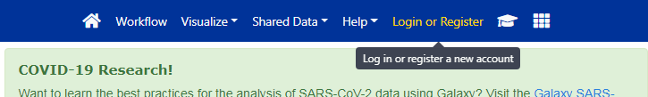
> 
{: .hands_on}

La interfaz de Galaxy consta de tres partes principales. Las herramientas disponibles se
enumeran a la izquierda, su historial de análisis se registra a la derecha, y el panel
central mostrará las herramientas y conjuntos de datos.


Empecemos con una historia fresca.


> <hands-on-title>Crear historial</hands-on-title>
> 
> 1. Asegúrate de tener un historial de análisis vacío.
> 
>    
> 
> 2. **Renombra tu historial** para que sea fácil de reconocer
> 
>    > <tip-title>Renombrar un historial</tip-title>
>    > 
>    > * Haga clic en el título del historial (por defecto el título es `Unnamed history`)
>    > 
>    >   
>    > 
>    > * Escriba `Galaxy Introduction` como nombre
>    > * Pulse <kbd>Intro</kbd>
>    > 
>    {: .tip}
> 
{: .hands_on}

## Carga de datos

> <hands-on-title>Carga de datos</hands-on-title>
> 
> 1. Descargue la lista de regiones de picos (el archivo [`GSE37268_mof3.out.hpeak.txt.gz`](https://www.ncbi.nlm.nih.gov/geo/download/?acc=GSE37268&format=file&file=GSE37268%5Fmof3%2Eout%2Ehpeak%2Etxt%2Egz)) de [GEO](https://www.ncbi.nlm.nih.gov/geo/query/acc.cgi?acc=GSE37268) a su ordenador
> 2. Haga clic en el botón de carga en la parte superior izquierda de la interfaz
> 
>    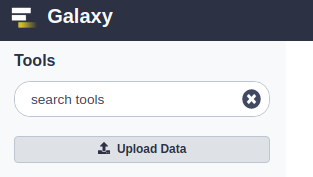
> 
> 3. Pulse **Seleccionar archivos locales** y busque el archivo en su ordenador
> 4. Select `interval` as **Tipo**
> 5. Pulse **Iniciar**
> 6. Pulse **Cerrar**
> 7. Espera a que termine la carga. Galaxy descomprimirá el archivo automáticamente.
> 
> 8. Después de esto verá su primer elemento del historial en el panel derecho de Galaxy. Pasará por los estados gris (preparando/en cola) y amarillo (ejecutando) para convertirse en verde (éxito):
> 
>    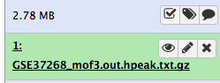
> 
>    La carga directa de archivos no es la única forma de introducir datos en Galaxy
> 
>    
> 
>    > <tip-title>Importación de datos a Galaxy</tip-title> Hay [más opciones]() para usuarios avanzados.
>    {: .tip}
> 
{: .hands_on}


> <comment-title>Formato de archivo de intervalo</comment-title> **El formato de
> intervalo** es un formato Galaxy para representar intervalos genómicos. Está separado
> por tabuladores, pero tiene el requisito añadido de que tres de las columnas deben
> ser:
> - ID del cromosoma
> - posición inicial (en base 0)
> - posición final (extremo-exclusivo)
> 
> También se puede especificar una columna de cadena opcional, y se puede utilizar una
> fila de encabezado inicial para etiquetar las columnas, que no tienen que estar en
> ningún orden especial. A diferencia del formato BED (véase más adelante), también
> pueden aparecer columnas adicionales arbitrarias.
> 
> Puede encontrar más información sobre los formatos que se pueden utilizar en Galaxy en
> la [página de formatos de datos de Galaxy](https://usegalaxy.org/static/formatHelp.html).
{: .comment}


> <hands-on-title>Inspeccionar y editar atributos de un fichero</hands-on-title>
> 
> 1. Haga clic en el archivo en el panel de la historia
> 
>    A continuación se muestra alguna metainformación (por ejemplo, formato, base de
>    datos de referencia) sobre el archivo y la cabecera del mismo, junto con el número
>    de líneas del archivo (48.647):
> 
>    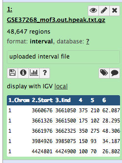
> 
> 2. Haga clic en el icono  (ojo) (**Ver datos**) en su conjunto de
>    datos en el historial
> 
>    El contenido del archivo se muestra en el panel central
> 
> 3. Haga clic en el icono  (lápiz) (**Editar atributos**) en su
>    conjunto de datos en el historial
> 
>    En el panel central aparece un formulario para editar los atributos del conjunto de
>    datos
> 
> 4. Busca `mm9` en el atributo **Database/Build** y selecciona `Mouse July 2007 (NCBI37/mm9)` (el papel nos dice que los picos son de `mm9`)
> 
>    
> 
> 5. Haga clic en **Guardar** en la parte superior
> 6. Añade una etiqueta llamada `#peaks` al conjunto de datos para facilitar su seguimiento en el historial
> 
>    
> 
>    El conjunto de datos debería tener ahora el siguiente aspecto en el historial
> 
>    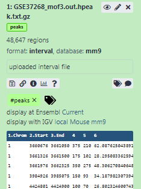{: width="250px" height="300px"}
> 
{: .hands_on}

Para encontrar los genes relacionados con estas regiones pico, también necesitamos una
lista de genes en ratones, que podemos obtener de UCSC.

> <hands-on-title>Carga de datos de UCSC</hands-on-title>
> 
> 1. Busque `UCSC Main` en la barra de búsqueda de herramientas (arriba a la izquierda)
> 
>    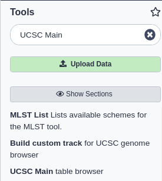
> 
> 2. Haga clic en `UCSC Main` 
> 
>    Accederás al **buscador de tablas de la UCSC**, que tiene un aspecto parecido a
>    este:
> 
>    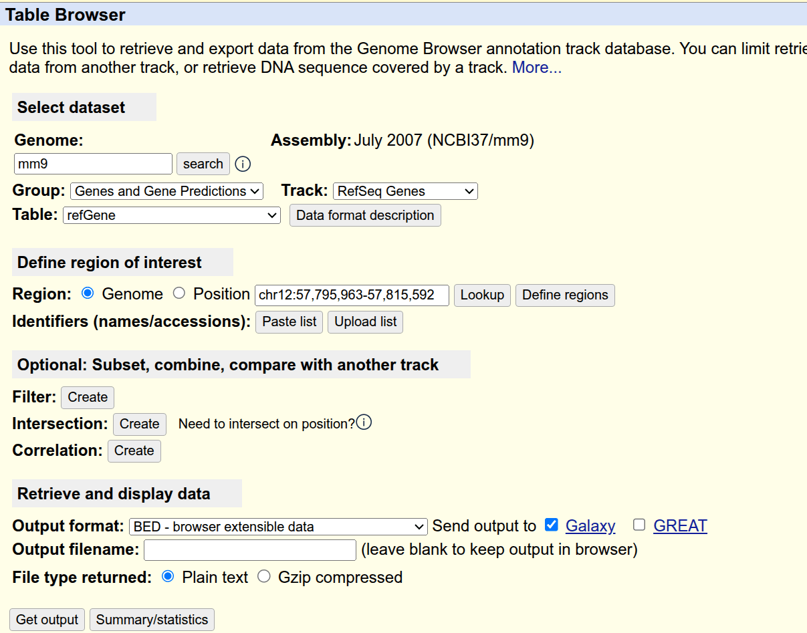
> 
> 3. Establezca las siguientes opciones:
>     - *"clade "*: `Mammal`
>     - *"genoma "*: `Mouse`
>     - *"conjunto "*: `July 2007 (NCBI37/mm9)`
>     - *"grupo "*: `Genes and Gene Predictions`
>     - *"pista "*: `RefSeq Genes`
>     - *"tabla "*: `refGene`
>     - *"región "*: `genome`
>     - *"formato de salida "*: `BED - browser extensible data`
>     - *"Enviar salida a "*: `Galaxy` (sólo)
> 
> 4. Haga clic en el botón **obtener salida**
> 
>    Verá la siguiente pantalla:
> 
>    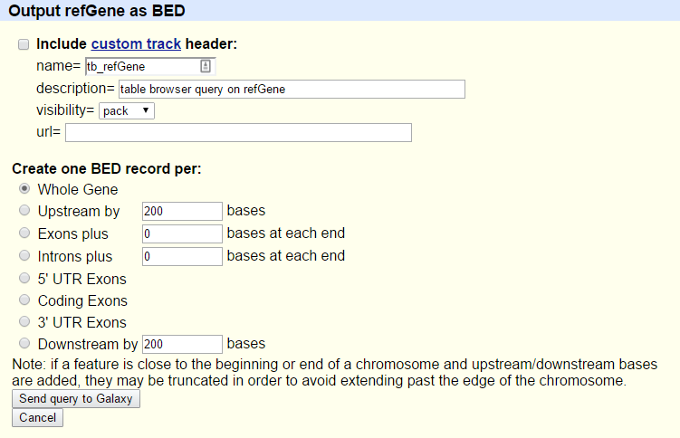
> 
> 5. Asegúrate de que *"Crear un registro BED por "* está en `Whole Gene`
> 6. Haga clic en el botón **Enviar consulta a Galaxia**
> 7. Espera a que termine la carga
> 8. Cambiar el nombre de nuestro conjunto de datos a algo más reconocible como `Genes`
> 
>    
> 
> 9. Añade una etiqueta llamada `#genes` al conjunto de datos para facilitar su seguimiento en el historial
> 
{: .hands_on}

> <comment-title>Formato de archivo BED</comment-title> El formato **BED - Browser
> Extensible Data** proporciona una forma flexible de codificar regiones de genes. Las
> líneas BED tienen tres campos obligatorios:
> - ID del cromosoma
> - posición inicial (en base 0)
> - posición final (extremo-exclusivo)
> 
> Puede haber hasta nueve campos opcionales adicionales, pero el número de campos por
> línea debe ser coherente en cualquier conjunto de datos.
> 
> Puede encontrar más información al respecto en
> [UCSC](https://genome.ucsc.edu/FAQ/FAQformat#format1), incluida una descripción de los
> campos opcionales.
{: .comment}

Ahora hemos recopilado todos los datos que necesitamos para empezar nuestro análisis.

# Parte 1: Enfoque ingenuo

Primero utilizaremos un enfoque "ingenuo" para intentar identificar los genes con los
que están asociadas las regiones de pico. Identificaremos los genes que se solapen al
menos 1 pb con las regiones de pico.

## Preparación del archivo

Echemos un vistazo a nuestros archivos para ver lo que realmente tenemos aquí.

> <hands-on-title>Ver contenido de archivo</hands-on-title>
> 
> 1. Haga clic en el  (ojo) (**Ver datos**) del archivo pico para
>    ver su contenido
> 
>    Debería verse así:
> 
>    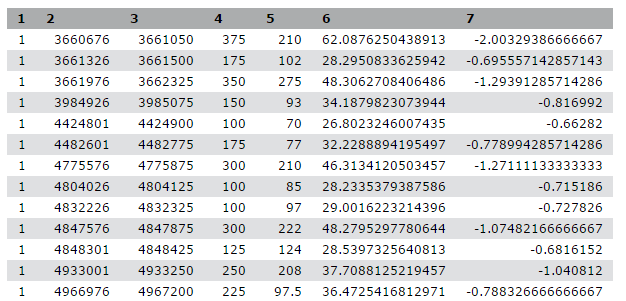
> 
> 2. Ver el contenido de las regiones de los genes de UCSC
> 
>    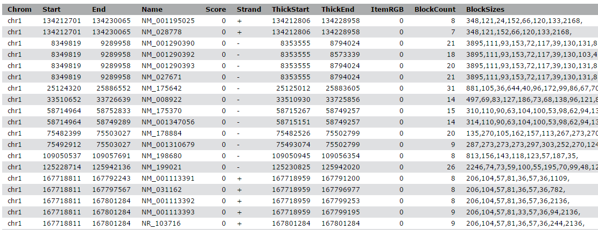
> 
{: .hands_on}

> <question-title></question-title>
> 
> Mientras que el archivo de UCSC tiene etiquetas para las columnas, el archivo de pico
> no. ¿Puede adivinar qué significan las columnas?
> 
> 
> > <solution-title></solution-title>
> > 
> > Este archivo de picos no tiene ningún formato estándar y, con sólo mirarlo, no
> > podemos averiguar qué significan los números de las distintas columnas. En el
> > artículo, los autores mencionan que utilizaron el llamador de picos
> > [HPeak](https://www.ncbi.nlm.nih.gov/pubmed/20598134).
> > 
> > Consultando el manual de HPeak podemos averiguar que las columnas contienen la
> > siguiente información:
> > 
> >  - nombre del cromosoma por número
> >  - coordenada inicial
> >  - coordenada final
> >  - longitud
> >  - ubicación dentro del pico que tiene la mayor cobertura hipotética de fragmentos
> >    de ADN (cumbre)
> >  - no relevante
> >  - no relevante
> > 
> {: .solution}
> 
{: .question}

Para poder comparar los dos ficheros, tenemos que asegurarnos de que los nombres de los
cromosomas siguen el mismo formato. Como podemos ver, el fichero pico carece de `chr`
antes de cualquier número de cromosoma. Pero, ¿qué ocurre con los cromosomas 20 y 21?
¿Serán X e Y en su lugar? Comprobémoslo:

> <hands-on-title>Ver fin de archivo</hands-on-title>
> 
> 1. Busque  herramienta y ejecútela con la siguiente configuración:
>     - *"Archivo de texto "*: nuestro archivo pico `GSE37268_mof3.out.hpeak.txt.gz`
>     - *"Operación "*: `Keep last lines`
>     - *"Número de líneas "*: Elija un valor, por ejemplo `100`
> 2. Haga clic en **Ejecutar herramienta**
> 3. Espera a que termine el trabajo
> 4. Inspecciona el archivo a través del  (ojo) icono (**Ver datos**)
> 
>    > <question-title></question-title>
>    > 
>    > 1. ¿Cómo se nombran los cromosomas?
>    > 2. ¿Cómo se llaman los cromosomas X e Y?
>    > 
>    > > <solution-title></solution-title>
>    > > 1. Los cromosomas se dan sólo por su número. En el archivo genético de UCSC, empezaban por `chr`
>    > > 2. Los cromosomas X e Y se llaman 20 y 21
>    > {: .solution }
>    {: .question}
{: .hands_on}

Para convertir los nombres de los cromosomas tenemos por tanto que hacer dos cosas:

1. añade `chr`
2. cambiar 20 y 21 por X e Y

> <hands-on-title>Ajustar nombres de cromosomas</hands-on-title>
> 
> 1.  en una columna específica con la siguiente configuración:
>     - *"Fichero a procesar "*: nuestro fichero pico `GSE37268_mof3.out.hpeak.txt.gz`
>     - *"en columna "*: `1`
>     - *"Buscar patrón "*: `[0-9]+`
> 
>       Esto buscará dígitos numéricos
> 
>     - *"Reemplazar por "*: `chr&`
> 
>       `&` es un marcador de posición para el resultado de la búsqueda de patrón
> 
> 2. Cambie el nombre de su archivo de salida `chr prefix added`.
> 
> 3.  : Volvamos a ejecutar la herramienta con dos reemplazos más
>    - *"Fichero a procesar "*: la salida de la última ejecución, `chr prefix added`
>    - *"en columna "*: `1`
>    -  Reemplazar
>      - *"Buscar patrón "*: `chr20`
>      - *"Reemplazar por "*: `chrX`
>    -  Insertar Reemplazo
>      - *"Buscar patrón "*: `chr21`
>      - *"Reemplazar por "*: `chrY`
> 
>    > <tip-title>Reejecutar una herramienta</tip-title>
>    > 
>    > * Ampliar la información del conjunto de datos
>    > * Pulse el icono  (**Ejecute este trabajo de nuevo**)
>    {: .tip}
> 
> 4. Inspeccione el último archivo a través del  (ojo) icono. ¿Hemos tenido éxito?
> 
>    Ahora tenemos bastantes ficheros y tenemos que tener cuidado de seleccionar los correctos en cada paso.
> 
>    > <question-title></question-title>
>    > 
>    > ¿Cuántas regiones hay en nuestro archivo de salida? Puede hacer clic en el nombre
>    > del archivo de salida para expandirlo y ver el número.
>    > 
>    > > <solution-title></solution-title> Debe ser igual al número de regiones de su
>    > > primer fichero, `GSE37268_mof3.out.hpeak.txt.gz`: 48,647 Si el suyo dice 100
>    > > regiones, entonces lo ha ejecutado en el archivo `Tail` y necesita volver a
>    > > ejecutar los pasos.
>    > {: .solution }
>    {: .question}
> 
> 5. Cambia el nombre del archivo a algo más reconocible, por ejemplo `Peak regions`
{: .hands_on}

## Análisis

Nuestro objetivo es comparar los 2 archivos de región (el archivo de genes y el archivo
de picos de la publicación) para saber qué picos están relacionados con qué genes. Si
sólo desea saber qué picos se encuentran **dentro** de los genes (dentro del cuerpo del
gen) puede omitir el siguiente paso. De lo contrario, podría ser razonable incluir la
región **promotora** de los genes en la comparación, por ejemplo, porque desea incluir
factores de transcripción en experimentos ChIP-seq. No existe una definición estricta de
región promotora, pero se suele utilizar 2kb aguas arriba del TSS (inicio de la región).
Usaremos la herramienta **Get Flanks** para obtener regiones de 2kb bases aguas arriba
del inicio del gen hasta 10kb bases aguas abajo del inicio (12kb de longitud). Para
ello, le diremos a la herramienta Get Flanks que queremos regiones aguas arriba del
inicio, con un desplazamiento de 10kb, que tengan 12kb de longitud, como se muestra en
el diagrama siguiente.

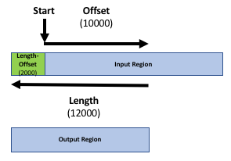

> <hands-on-title>Añadir región promotora a registros de genes</hands-on-title>
> 
> 1.  devuelve región/es de flanqueo para cada gen, con la siguiente configuración:
>     - *"Seleccionar datos "*: archivo `Genes` de UCSC
>     - *"Región "*: `Around Start`
>     - *"Localización de la/s región/es flanqueante/s "*:`Upstream`
>     - *"Desplazamiento "*: `10000`
>     - *"Longitud de la(s) región(es) flanqueante(s)*: `12000`
> 
>    Esta herramienta devuelve regiones flanqueantes para cada gen
> 
> 2. Compara las filas del fichero BED resultante con la entrada para averiguar cómo han
>    cambiado las posiciones de inicio y fin
> 
>    > <tip-title>Inspeccionando varios archivos usando el libro de trucos</tip-title>
>    > 
>    > * Haga clic en **Habilitar/Deshabilitar Scratchbook** en el panel superior
>    > 
>    >   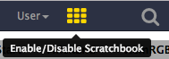
>    > 
>    > * Haga clic en el  (ojo) de los archivos a inspeccionar
>    > * Haga clic en **Mostrar/Ocultar Libro de Fichas**
>    > 
>    >   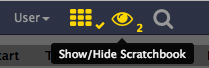
>    {: .tip}
> 
> 3. Cambie el nombre de su conjunto de datos para reflejar sus hallazgos (`Promoter regions`)
{: .hands_on}

La salida son regiones que empiezan a 2kb aguas arriba del TSS e incluyen 10kb aguas
abajo. Para regiones de entrada en la cadena positiva, por ejemplo `chr1 134212701
134230065`, se obtiene `chr1 134210701 134222701`. Para regiones de la cadena negativa,
por ejemplo `chr1 8349819 9289958`, se obtiene `chr1 9279958 9291958`.

Te habrás dado cuenta de que el archivo UCSC está en formato `BED` y tiene asociada una
base de datos. Eso es lo que queremos también para nuestro fichero de picos. La
herramienta **Intersect** que utilizaremos puede convertir automáticamente los ficheros
de intervalos al formato BED, pero aquí convertiremos nuestro fichero de intervalos
explícitamente para mostrar cómo se puede conseguir esto con Galaxy.

> <hands-on-title>Cambiar formato y base de datos</hands-on-title>
> 
> 1. Haga clic en el icono  (lápiz) en la entrada del historial de nuestro archivo de región pico
> 2. Cambia a la pestaña **Tipos de datos**
> 3. En la sección **Convertir a tipo de datos** en *"Tipo de datos de destino "* seleccione: `bed (using 'Convert Genomic Interval To Bed')`
> 4. Pulse **Crear conjunto de datos**
> 5. Comprueba que "Database/Build" es `mm9` (la base de datos para ratones utilizada en el artículo)
> 6. De nuevo renombra el archivo a algo más reconocible, por ejemplo `Peak regions BED`
{: .hands_on}

Es hora de encontrar los intervalos solapados (¡por fin!). Para ello, queremos extraer
los genes que se solapan/intersecan con nuestros picos.

> <hands-on-title>Encontrar solapamientos</hands-on-title>
> 
> 1.  los intervalos de dos conjuntos de datos, con la siguiente configuración:
>     - *"Devolver "*: `Overlapping Intervals`
>     - *"de "*: el archivo UCSC con regiones promotoras (`Promoter regions`)
>     - *"que intersecan "*: nuestro archivo de región de pico de **Replace** (`Peak regions BED`)
>     - *"por lo menos "*: `1`
> 
>    > <comment-title></comment-title> ¡El orden de las entradas es importante! Queremos
>    > obtener una lista de **genes**, por lo que el conjunto de datos correspondiente
>    > con la información del gen debe ser la primera entrada (`Promoter regions`).
>    {: .comment}
>    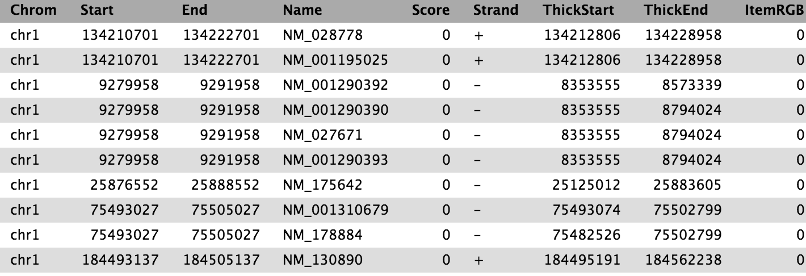
{: .hands_on}

Ahora tenemos la lista de genes (columna 4) que se solapan con las regiones de pico,
similar a la mostrada anteriormente.

Para tener una mejor visión de los genes que hemos obtenido, queremos ver su
distribución en los diferentes cromosomas. Agruparemos la tabla por cromosomas y
contaremos el número de genes con picos en cada cromosoma

> <hands-on-title>Cuenta genes en diferentes cromosomas</hands-on-title>
> 
> 1.  datos por una columna y realizar la operación de agregado en otras columnas, con la siguiente configuración:
>     - *"Seleccionar datos "* al resultado de la intersección
>     - *"Agrupar por columna "*:`Column 1`
>     - Pulse **Insertar operación** y elija:
>         - *"Tipo "*: `Count`
>         - *"En columna "*: `Column 1`
>         - *"¿Redondear el resultado al entero más cercano?*: `No`
> 
>    > <question-title></question-title>
>    > 
>    > ¿Qué cromosoma contiene el mayor número de genes objetivo?
>    > 
>    > > <solution-title></solution-title>
>    > > 
>    > > El resultado varía con diferentes configuraciones, por ejemplo, la anotación
>    > > puede cambiar debido a actualizaciones en UCSC. Si siguió paso a paso, con la
>    > > misma anotación, debería ser el cromosoma 11 con 2164 genes. Tenga en cuenta
>    > > que para la reproducibilidad, debe mantener todos los datos de entrada
>    > > utilizados en el análisis. Volver a ejecutar el análisis con el mismo conjunto
>    > > de parámetros, almacenados Galaxy, puede conducir a un resultado diferente si
>    > > las entradas cambiaron, por ejemplo, la anotación de UCSC.
>    > {: .solution }
>    {: .question}
>
{: .hands_on}

## Visualización

Tenemos algunos datos agregados, ¿por qué no dibujar un gráfico de barras?

Pero antes deberíamos pulir un poco más nuestros datos agrupados.

Se habrá dado cuenta de que los cromosomas del ratón no aparecen en su orden correcto en
ese conjunto de datos (la herramienta **Group** intentó ordenarlos, pero lo hizo
alfabéticamente).

Podemos arreglar esto ejecutando una herramienta dedicada para ordenar nuestros datos.

> <hands-on-title>Arreglar el orden de la tabla de recuento de genes</hands-on-title>
> 
> 1.  datos en orden ascendente o descendente, con la siguiente configuración:
>     - *"Ordenar consulta "*: resultado de ejecutar la herramienta Grupo
>     - en  *"Column selections "*
>       - *"en columna "*: `Column 1`
>       - *"en "*: `Ascending order`
>       - *"Sabor "*: `Natural/Version sort (-V)`
> 
>    
> 
{: .hands_on}

¡Genial, estamos listos para trazar cosas!

> <hands-on-title>Dibujar gráfico de barras</hands-on-title>
> 
> 1. Haga clic en  (visualizar) en la salida de la herramienta **Sort**
> 2. Select `Bar diagram (NVD3)`
> 3. Haga clic en el **<<** en la esquina superior derecha
> 4. Elija un título en **Provea un título**, por ejemplo `Gene counts per chromosome`
> 5. Cambia a la pestaña  **Seleccione los datos** y juegue con la configuración
> 6. Cuando esté satisfecho, haga clic en el  **Guardar** en la parte superior derecha del *panel principal*
> 
>    Esto lo almacenará en sus visualizaciones guardadas. Más tarde podrás verla,
>    descargarla o compartirla con otros desde **Datos -> Visualizaciones** en el menú
>    superior de Galaxy.
> 
{: .hands_on}

## Extrayendo flujo de trabajo

Si observamos detenidamente nuestro historial, veremos que contiene todos los pasos de
nuestro análisis, desde el principio hasta el final. Al construir este historial, en
realidad hemos construido un registro completo de nuestro análisis con Galaxy
preservando todos los ajustes de parámetros aplicados en cada paso. ¿No sería agradable
convertir este historial en un flujo de trabajo que podamos ejecutar una y otra vez?

Galaxy hace esto muy simple con la opción `Extract workflow`. Esto significa que cada
vez que desee construir un flujo de trabajo, puede realizarlo manualmente una vez, y
luego convertirlo en un flujo de trabajo, de modo que la próxima vez será mucho menos
trabajo hacer el mismo análisis. También te permite compartir o publicar fácilmente tus
análisis.

> <hands-on-title>Extraer flujo de trabajo</hands-on-title>
> 
> 1. **Limpie** su historial: elimine los trabajos fallidos (en rojo) de su historial
>    haciendo clic en el botón .
> 
>    Esto facilitará la creación del flujo de trabajo.
> 
> 2. Haz clic en  (**Opciones de historial**) en la parte superior
>    de tu panel de historial y selecciona **Extraer flujo de trabajo**.
> 
>    
> 
>    El panel central mostrará el contenido del historial en orden inverso (el más
>    antiguo arriba), y podrá elegir qué pasos incluir en el flujo de trabajo.
> 
> 3. Reemplace el **nombre del flujo de trabajo** por algo más descriptivo, por ejemplo:
>    `From peaks to genes`
> 
> 4. Si hay pasos que no deberían incluirse en el flujo de trabajo, puede
>    **desmarcarlos** en la primera columna de casillas.
> 
>    Dado que hemos realizado algunos pasos específicos para nuestro archivo de picos
>    personalizado, es posible que queramos excluir:
>    - **Seleccionar último** 
>    - all **Replace Text**  steps
>    - **Convertir intervalos genómicos a BED**
>    - **Obtener flancos** 
> 
> 5. Haga clic en el botón **Crear flujo de trabajo** situado en la parte superior.
> 
>    Recibirá un mensaje indicando que se ha creado el flujo de trabajo. Pero, ¿adónde ha ido?
> 
> 6. Haga clic en **Flujo de trabajo** en el menú de la izquierda de Galaxy
> 
>    Aquí tiene una lista de todos sus flujos de trabajo
> 
> 7. Seleccione el flujo de trabajo recién generado y haga clic en **Editar**
> 
>    Deberías ver algo similar a esto:
> 
>    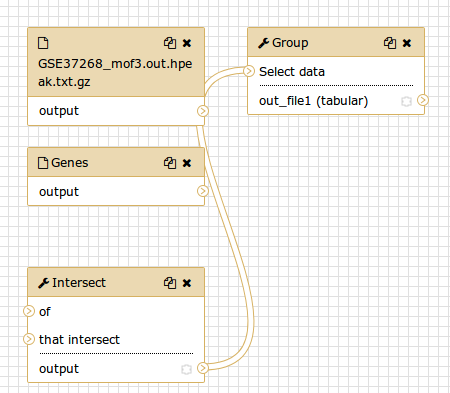
> 
>    > <comment-title>El editor de flujo de trabajo</comment-title> Podemos examinar el
>    > flujo de trabajo en el editor de flujo de trabajo de Galaxy. Aquí puede
>    > ver/cambiar la configuración de los parámetros de cada paso, añadir y eliminar
>    > herramientas, y conectar una salida de una herramienta a la entrada de otra, todo
>    > de una manera fácil y gráfica. También puedes utilizar este editor para crear
>    > flujos de trabajo desde cero.
>    {: .comment}
> 
>     Although we have our two inputs in the workflow they are missing their connection to the first tool (**Intersect** ), because we didn't carry over some of the intermediate steps.
> 
> 8. Conecte cada conjunto de datos de entrada a la herramienta **Intersect**  arrastrando la flecha que apunta hacia fuera a la derecha de su
>    casilla (que denota una salida) a una flecha a la izquierda de la casilla **Intersect** que apunta hacia dentro (que denota una entrada)
> 9. Cambia el nombre de los conjuntos de datos de entrada a `Reference regions` y `Peak regions`
> 10. ¡Pulsa **Auto Re-layout** para limpiar nuestra vista 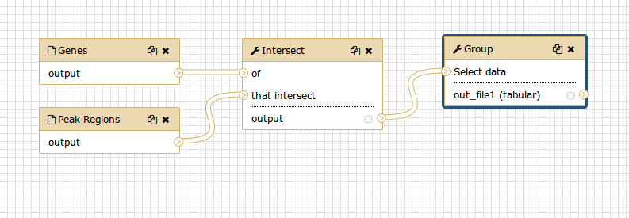
> 11. Haga clic en el icono  **(){: width="50%"}
> 
> > <tip-title>Ocultar pasos intermedios</tip-title> Cuando se ejecuta un flujo de
> > trabajo, el usuario suele estar interesado principalmente en el producto final y no
> > en todos los pasos intermedios. Por defecto se mostrarán todas las salidas de un
> > flujo de trabajo, pero podemos decirle explícitamente a Galaxy qué salida mostrar y
> > cuál ocultar para un flujo de trabajo determinado. Este comportamiento se controla
> > mediante el pequeño asterisco que aparece junto a cada conjunto de datos de salida:
> > 
> > 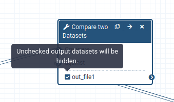
> > 
> > Si hace clic en este asterisco para cualquiera de los conjuntos de datos de salida,
> > se mostrarán *sólo* los archivos con asterisco, y se ocultarán todas las salidas sin
> > asterisco (Tenga en cuenta que hacer clic en *todas* las salidas tiene el mismo
> > efecto que hacer clic en *ninguna* de las salidas, en ambos casos se mostrarán todos
> > los conjuntos de datos).
> {: .tip}
> 
{: .hands_on}

Ahora es el momento de reutilizar nuestro flujo de trabajo para un enfoque más sofisticado.

# Parte 2: Enfoque más sofisticado

En la parte 1 utilizamos una definición de solapamiento de 1 pb (ajuste por defecto)
para identificar los genes asociados a las regiones de pico. Sin embargo, los picos
podrían ser amplios, por lo que, para obtener una definición más significativa,
podríamos identificar los genes que se solapan donde se concentra la mayoría de las
lecturas, la **cima del pico**. Utilizaremos la información sobre la posición de la
cumbre del pico contenida en el archivo de picos original y comprobaremos si las cumbres
se solapan con los genes.

## Preparación

De nuevo necesitamos nuestro archivo pico, pero nos gustaría trabajar en un historial
limpio. En lugar de cargarlo dos veces, podemos copiarlo en un nuevo historial.

> <hands-on-title>Copiar elementos del historial</hands-on-title>
> 
> 1. Crea un nuevo historial y dale un nuevo nombre como `Galaxy Introduction Part 2`
> 
>    
> 
> 2. Haz clic en **Opciones de historial** en la parte superior derecha de tu historial.
>    Haga clic en **Mostrar historiales lado a lado**
> 
>    Deberías ver ahora tus dos historiales uno al lado del otro
> 
> 3. Arrastre y suelte el archivo de pico editado (`Peak regions`, después de los pasos
>    de reemplazo), que contiene la información de la cumbre, a su nuevo historial.
> 4. Haga clic en el nombre de la Galaxia en la barra de menú superior (arriba a la izquierda) para volver a su ventana de análisis
> 
{: .hands_on}

## Crear archivo cumbre pico

Necesitamos generar un nuevo archivo BED a partir del archivo de picos original que
contenga las posiciones de las cumbres de los picos. El inicio de la cima es el inicio
del pico (columna 2) más la ubicación dentro del pico que tiene la mayor cobertura
hipotética de fragmentos de ADN (columna 5, redondeada al siguiente entero más pequeño
porque algunas cimas de picos caen entre a bases). Como final de la región del pico,
definiremos simplemente `start + 1`.

> <hands-on-title>Crear archivo cumbre</hands-on-title>
> 
> 1.  con los siguientes parámetros:
>   - *"Archivo de entrada "*: nuestro archivo de pico `Peak regions` (el archivo de formato de intervalo)
>   - *"¿La entrada tiene una línea de encabezado con nombres de columnas?": `No`
>   - En *"Expresiones "*:
>       -  *"Expresiones "*
>           - *"Añadir expresión "*: `c2 + int(c5)`
>           - *"Modo de la operación "*: Append
>       -  *"Expresiones "*
>           - *"Añadir expresión "*: `c8 + 1`
>           - *"Modo de la operación "*: Append
> 
> Esto creará una 8ª y una 9ª columna en nuestra tabla, que utilizaremos en el siguiente paso:
> 
> 2. Renombra la salida `Peak summit regions`
> 
{: .hands_on}

Ahora recortamos sólo el cromosoma más el inicio y el final de la cima:

> <hands-on-title>Cortar columnas</hands-on-title>
> 1.  columnas de una tabla con la siguiente configuración:
>   - *"Cortar columnas "*: `c1,c8,c9`
>   - *"Delimitado por tabulador "*: `Tab`
>   - *"De "*: `Peak summit regions`
> 
> La salida de **Cut** estará en formato `tabular`.
> 
> 2. Cambia el formato a `interval` (usa el ) ya que es lo que
>    espera la herramienta **Intersect**.
> 
>    
> 
>    El resultado debería ser como el siguiente:
> 
>    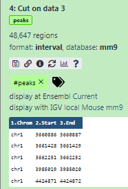{: width="200px"}
> 
{: .hands_on}

## Obtener nombres de genes

Los genes RefSeq que descargamos de UCSC sólo contenían los identificadores RefSeq, pero
no los nombres de los genes. Para obtener al final una lista de nombres de genes,
utilizamos otro archivo BED de las Bibliotecas de Datos.

> <comment-title></comment-title> Hay varias formas de obtener los nombres de los genes,
> si necesita hacerlo usted mismo. Una forma es recuperar un mapeo a través de Biomart y
> luego unir los dos archivos (**Join two Datasets side by side on a specified field**
> ). Otra forma es obtener la tabla RefSeq completa de UCSC y
> convertirla manualmente al formato BED.
> 
{: .comment}

> <hands-on-title>Carga de datos</hands-on-title>
> 
> 1.  `mm9.RefSeq_genes_from_UCSC.bed` de
>    [Zenodo](https://zenodo.org/record/1025586) o de la biblioteca de datos:
> 
>    ```
>    https://zenodo.org/record/1025586/files/mm9.RefSeq_genes_from_UCSC.bed
>    ```
> 
>    
> 
>    
> 
>    Por defecto, Galaxy toma el enlace como nombre, así que renómbralos.
> 
> 2. Inspeccione el contenido del archivo para comprobar si contiene nombres de genes.
>    Debe ser similar al siguiente: 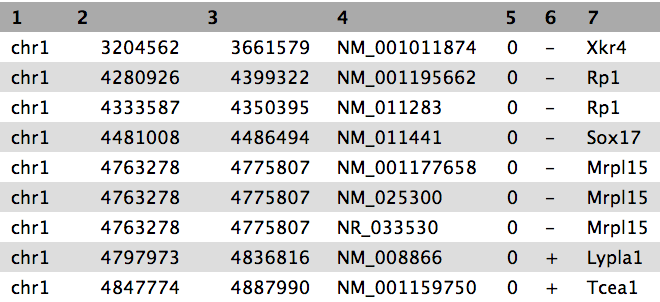
> 
> 3. Renómbralo `mm9.RefSeq_genes`
> 4. Aplica la etiqueta `#genes`
> 
{: .hands_on}

## Repetir flujo de trabajo

Es hora de reutilizar el flujo de trabajo que creamos antes.

> <hands-on-title>Ejecutar un flujo de trabajo</hands-on-title>
> 1. Abre el menú de flujo de trabajo (barra de menú izquierda)
> 2. Busque el flujo de trabajo que realizó en la sección anterior y seleccione la
>    opción **Ejecutar**
> 3. Elige como entradas nuestro fichero BED `mm9.RefSeq_genes` (`#genes`) y el
>    resultado de la herramienta **Cut** (`#peaks`)
> 4. Haga clic en **Ejecutar flujo de trabajo**
> 
>    Las salidas deberían aparecer en el historial, pero puede que tarden un poco en
>    terminar.
> 
{: .hands_on}

Usamos nuestro flujo de trabajo para volver a ejecutar nuestro análisis con las cimas de
los picos. La herramienta **Group** volvió a producir una lista con el número de genes
encontrados en cada cromosoma. ¿Pero no sería más interesante conocer el número de picos
en cada gen único? Volvamos a ejecutar el flujo de trabajo con una configuración
diferente

> <hands-on-title>Ejecutar un flujo de trabajo con la configuración
> cambiada</hands-on-title>
> 1. Abre el menú de flujo de trabajo (barra de menú izquierda)
> 2. Busque el flujo de trabajo que realizó en la sección anterior y seleccione la opción **Ejecutar**
> 3. Elige como entradas nuestro fichero BED `mm9.RefSeq_genes` (`#genes`) y el resultado de la herramienta **Cut** (`#peaks`)
> 4. Haga clic en el título de la herramienta  **Group** para ampliar las opciones.
> 5. Cambie los siguientes ajustes haciendo clic en el  (lápiz) de la izquierda:
>     - *"Agrupar por columna "*: `7`
>     - En *"Operación "*:
>       - *"En columna "*: `7`
> 6. Haga clic en **Ejecutar flujo de trabajo**
> 
{: .hands_on}

¡Enhorabuena! Debería tener un archivo con todos los nombres de genes únicos y un recuento de cuántos picos contenían.

> <question-title></question-title>
> 
> La lista de genes únicos no está ordenada. Intente ordenarla usted mismo
> 
> > <solution-title></solution-title> Puede utilizar la herramienta "Ordenar datos en
> > orden ascendente o descendente" en la columna 2 y "ordenación numérica rápida".
> {: .solution }
{: .question}


# Comparte tu trabajo

Una de las características más importantes de Galaxy llega al final de un análisis.
Cuando haya publicado resultados sorprendentes, es importante que otros investigadores
puedan reproducir su experimento in-silico. Galaxy permite a los usuarios compartir
fácilmente sus flujos de trabajo e historiales con otros.

Para compartir un historial, haz clic en las  opciones
de historial y selecciona `Share or Publish`. En esta página puedes hacer 3 cosas:


1. **Hacer accesible vía Enlace**

   Esto genera un enlace que puedes dar a otros. Cualquiera que tenga este enlace podrá
   ver tu historial.

2. **Hacer pública la Historia en Historias Publicadas**

   Esto no sólo creará un enlace, sino que también publicará tu historial. Esto
   significa que su historial aparecerá bajo `Data → Histories → Published Histories` en
   el menú superior.

3. **Compartir con usuarios individuales**

   Esto compartirá el historial sólo con usuarios específicos en la instancia Galaxy.


> <hands-on-title>Compartir historia y flujo de trabajo</hands-on-title>
> 
> 1. Comparte una de tus historias con tu vecino
> 2. ¡A ver si puedes hacer lo mismo con tu flujo de trabajo!
> 3. Encuentra el historial y/o flujo de trabajo compartido por tu vecino
> 
>    Los historiales compartidos con usuarios específicos pueden ser accedidos por esos
>    usuarios bajo `Data → Histories → Histories shared with me`.
> 
{: .hands_on}

# Conclusión


 Acaba de realizar su primer análisis en Galaxy. También ha creado un
flujo de trabajo a partir de su análisis para poder repetir fácilmente el mismo análisis
en otros conjuntos de datos. Además, ha compartido sus resultados y métodos con otras
personas.

