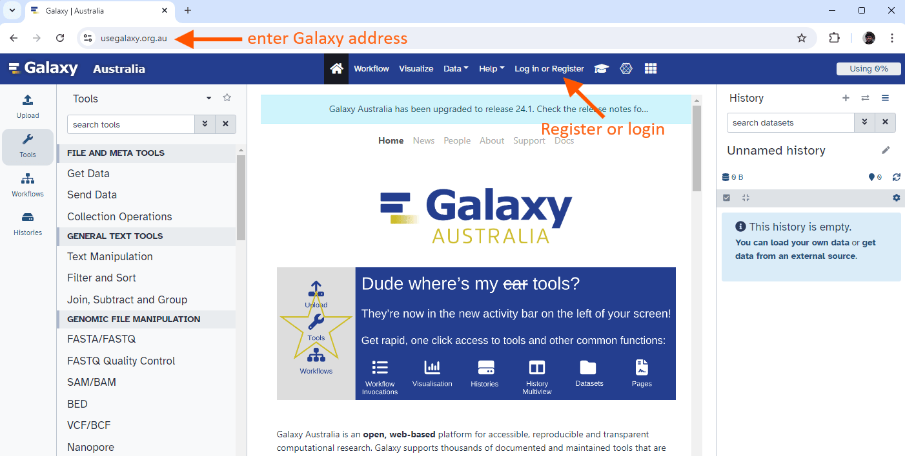
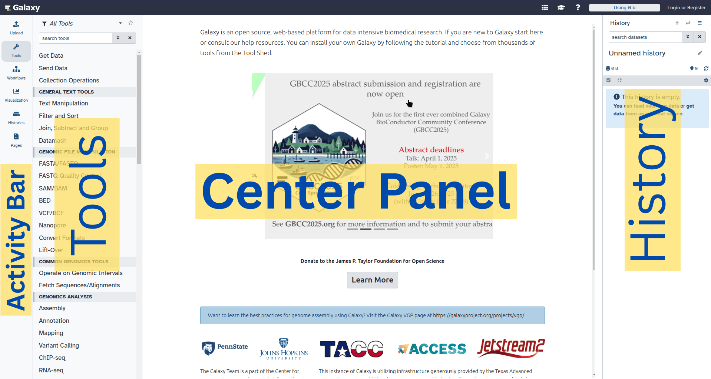
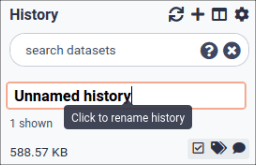
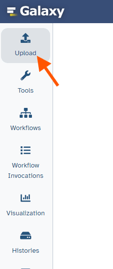
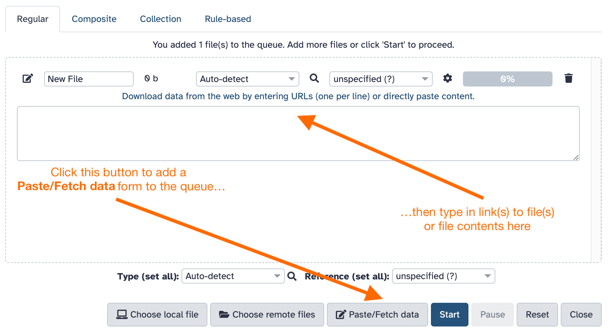

This tutorial aims to familiarize you with the Galaxy user interface, with a special focus on highlighting Galaxy's many RDM (Research Data Management) features.

Galaxy has over 10,000 available tools in it's [Tool Shed](https://toolshed.g2.bx.psu.edu/), covering a wide variety of scientific domains, ranging from life sciences, to astronomy, and digital humanities, and covering techniques from simple text manipulation to advanced machine learning and other complex algorithms.

To keep this tutorial accessible for people with different backgrounds, we perform a toy analysis on a tabular dataset, namely a table of all athletes competing in the Olympics. The question we ask ourselves is ***"What is the age distribution of Olympic athletes?"***. In addition, we want to make sure our analysis is reproducible, so that it can be easily be repeated on different datasets, and shared with others.


> <agenda-title></agenda-title>
>
> In this tutorial, we will cover:
>
> 1. TOC
> {:toc}
>
{: .agenda}


# Overview

## The Research Data Life Cycle

The research life cycle refers to the series of stages through which a research project or study progresses from inception to completion. Although the specifics of the research process vary across disciplines, they share several key phases that help ensure that the research is systematic, rigorous, and produces reliable results. From **planning** and designing your study, to **collecting**, **processing**, and **analysing** your data, evaluating results, and finally **preserving** and **sharing** your data and findings for **reuse** by others.

{: style="width:40%"}

## Galaxy as part of the RDM Life Cycle

Galaxy supports you in your research throughout the different stages of the life cycle, covering the steps from data collection to data reuse.


For  more information, see also the [RDMKit Galaxy page](https://rdmkit.elixir-europe.org/galaxy_assembly)


## Watch

Below is a 5-minute video introducing Galaxy as a cross-domain RDM platform.




## Scope
In this tutorial, we will take you through all the stages of the Research data life cycle, and provide a hands-on introduction to the Galaxy platform at each stage.


# The Galaxy Web Interface

Before we go into the stages of the RDM life cycle, let's start with the basics and log into Galaxy and explore the graphical user interface.

## Create an account on a Galaxy instance/server
If you already have an account, skip to the next section!

In Galaxy, *server* and *instance* are often used interchangeably. These terms basically mean that different regions have different Galaxy servers/instances, with slightly different tool installations and appearances. If you don't have a specific server/instance in mind, we recommend registering at one of the main public servers/instances, detailed below.



Depending on your Galaxy server, you may also be able to log in with your institutional or social account.




## What does Galaxy look like?

> <hands-on-title>Log in to Galaxy</hands-on-title>
> 1. Open your favorite browser (Chrome, Safari, Edge or Firefox as your browser, not Internet Explorer!)
> 2. Browse to your Galaxy instance
> 3. Log in or register
>
>    
>
> 
>
>   > <comment-title>Different Galaxy servers</comment-title>
>   >  This is an image of Galaxy Australia, located at [usegalaxy.org.au](https://usegalaxy.org.au/)
>   >
>   > The particular Galaxy server that you are using may look slightly different and have a different web address.
>   >
>   > You can also find more possible Galaxy servers at the top of this tutorial in **Available on these Galaxies**
>   {: .comment}
{: .hands_on}

The Galaxy homepage is divided into four sections (panels):
- The **Activity Bar** on the left: _This is where you will navigate to the resources in Galaxy (Tools, Workflows, Histories etc.)_
- Currently active **"Activity Panel"** on the left: _By default, the  **Tools** activity will be active and its panel will be expanded_
- **Viewing panel** in the middle: _The main area for context for your analysis_
- **History** of analysis and files on the right: _Shows your "current" history; i.e.: Where any new files for your analysis will be stored_



Now that you are logged in to Galaxy, let's start!


# Collect: Data import

{: style="width:75%"}


## The Galaxy History

Your "History" is in the panel at the right. This is where all the files you import or create will be shown. It is also a record of the actions you have taken. Galaxy tracks the provenance of all datasets; which tools were used to create them, which version, and which parameter settings. Everything you need to write the methods section of your journal publication.
Before we begin, let's name our history. It is recommended to create a new history for each analysis that you perform, and giving your histories good names will help keep your analyses organized.


### Name your current history

> <hands-on-title>Name history</hands-on-title>
> 1. Go to the **History** panel (on the right)
> 2. Click  (**Edit**) next to the history name (which by default is "Unnamed history")
>
>    {:width="250px"}
>
>    > <comment-title></comment-title>
>    >
>    > In some previous versions of Galaxy, you will need to click the history name to rename it as shown here:
>    > {:width="320px"}
>    {: .comment}
>
> 3. Type in a new name, for example, "Olympics Data Analysis"
> 4. Click **Save**
>
> > <comment-title>Renaming not an option?</comment-title>
> > If renaming does not work, it is possible you aren't logged in, so try logging in to Galaxy first. Anonymous users are only permitted to have one history, and they cannot rename it.
> {: .comment}
>
{: .hands_on}


## Upload a dataset


> <comment-title> Galaxy Data Import Options </comment-title>
>
> There are various ways to get data into Galaxy
> - Uploading from **your computer**
> - Import from **URL**
> - Import directly from **data repositories**, e.g.
>   - SRA/NCBI/EBI/Uniprot (Biological Sequence Data)
>   - OMERO (Image database)
>   - Copernicus (Climate Data)
>    - CERN Open Data (Particle Physics)
>   - many more (See "Get Data" section of the Tool panel in Galaxy)
> - **Bring-your-own-data** (e.g. Dropbox, Gdrive, OneData, eLabFTW)
>
>   
>
> - Connections to your **LIMS** system
>
>   
>
{: .comment}

For this tutorial, we will import datasets from the general-purpose FAIR data repository [Zenodo](https://zenodo.org).


> <hands-on-title>Upload a file from URL</hands-on-title>
>
> 1. At the top of the **Activity Bar**, click the  **Upload** activity
>
>    
>
>    This brings up a box:
>
>    
>
> 3. Click **Paste/Fetch data**
> 4. Paste in the address of a file:
>
>    ```
>    https://zenodo.org/records/18803585/files/olympics-2010-winter.tsv
>    ```
>
> 5. Click **Start**
> 6. Click **Close**
>
{: .hands_on}

Your uploaded file is now in your current history.
When the file has uploaded to Galaxy, it will turn green.

> <comment-title></comment-title>
> After this you will see your first history item (called a "dataset") in Galaxy's right panel. It will go through
> the gray (preparing/queued) and yellow (running) states to become green (success).
>
{: .comment}

What is this file?

> <hands-on-title>View the dataset content</hands-on-title>
> 1. Click the  (eye) icon next to the dataset name, to look at the file content
>
>    {:width="25%"}
{: .hands_on}

The contents of the file will be displayed in the central Galaxy panel. If the dataset is large, you will see a warning message which explains that only the first megabyte is shown.


This file contains a table listing all athletes who competed in the 2010 Winter Olympics in Oslo.


> <question-title> Explore the dataset </question-title>
>
> 1. How many athletes participated in this Olympics?
> 2. What was the location of this Olympic games?
>
> > <solution-title></solution-title>
> > 1. 4402 athletes. Each row signifies an athlete, there are 4403 rows, one of which is the header row.
> > 2. Vancouver. This information is given in column 13.
> {: .solution}
{: .question}


## Dataset attributes (metadata)

Let's have a look at the metadata that Galaxy tracks for your datasets.

> <hands-on-title> Explore metadata </hands-on-title>
>
> 1. **Expand** the item in your history by clicking on its name
>    - Here you will see a peek of the contents, some basic file attributes such as the format, number of lines, and number of columns
>
>    
>
> 2. **Click** on the **"Dataset Details"**  button
>    - Here you can see further metadata such as file size, creation date, hash, format, original URL, and more
>    - Scrolling down you will also see details of the upload job that performed the import. We will look more closely at this later.
>
>    
>
> 3. **Rename** the file to include the city of the Olympic. You can do this by **editing the dataset attributes**
>    - This can be done by clicking on the **Edit** tab at the top of your screen, or the pencil icon  on the expanded dataset.
>    - For example, rename it to `2010 Winter Olympics Vancouver`
>
>    
>
>    
>
{: .hands_on}


# Process: Data preparation and QC

{: style="width:75%"}


The first steps of an analysis are often data cleaning and quality control steps.
Galaxy offers many tools that can help prepare your data for analysis, such as format conversions and data manipulation tools.

## Use a tool

Recall that our research question in this tutorial is **"What is the age distribution of Olympic athletes?"**
Looking at the dataset, you will see that we do not have an "age" column in our table. We do however, have a column with the birth year
of each athlete, and a column containing the year of the olympics. Let's prepare our data for analysis by calculating a new age column
based on these two existing columns.


> <hands-on-title>Find a tool</hands-on-title>
>
> 1. **Search** for the tool 
>    - Click on **Tools**  in the **Activity bar** on the left
>    - Enter "Compute" in the search bar
>
> 2. **Open** the tool by clicking on it
>    - You will see the tool form in the center panel of Galaxy
>
> 3. **Scroll** down to the **Help** section and read about the tool
>    - Here you will always find **usage information** about the tool, including **citations** and links to **tutorials** describing the tool.
>    - How could we use this tool to add an age column to our dataset?
>
>    
>
{: .hands_on}

We can use this tool to compute an age column for our dataset, but first we must ask ourselves some questions:

> <question-title> Explore the dataset </question-title>
>
> 1. Which column contains the birth year information
> 2. Which column contains the year of the Olympics?
> 3. How can we compute the age of the athlete from these columns?
>
> > <solution-title></solution-title>
> > 1. column 4 (c4)
> > 2. column 10 (c10)
> > 3. we subtract the columns, `c10-c4`
> {: .solution}
{: .question}


We now have what we need to add an age column to our dataset, let's do it:

> <hands-on-title>Use a tool</hands-on-title>
>
> 1.  with the following parameters
>    -  *"Input file"*: `2010 Winter Olympics Vancouver`
>    - *"Input has a header line with column names?"*: `Yes`
>    - *"Expressions"*
>      -  Insert Expressions
>        - *"Add expression"*: `c10-c4`
>        - *"Mode of the operation"*: `Append`
>        - *"The new column name"*: `age`
> 2. **Run**  the tool
>
{: .hands_on}

This tool will run and a new output dataset will appear at the top of your history panel.

> <hands-on-title> Check the results </hands-on-title>
>
> 1. **View**  the resulting file
>    - make sure the new column was successfully added, and the column header is "age"
>
> > <question-title> </question-title>
> >
> > 1. What column number is our new "age" column?
> > 2. What age is the first Olympian in our file, *Muhammad Abbas*?
> >
> > > <solution-title></solution-title>
> > > 1. The column was added at the end, column 16.
> > > 2. Age 23.
> > {: .solution}
> {: .question}
>
>
{: .hands_on}





## Tool provenance

We already examined the attributes for the file we uploaded. For datasets that result from running tools, Galaxy tracks even more provenance.
Let's look at this now

> <hands-on-title> Explore metadata </hands-on-title>
>
> 1. **Expand** the item in your history by clicking on its name
> 2. **Click** on the **"Dataset Details"**  button
>
{: .hands_on}

Here you will see all the metadata that Galaxy keeps track of. It has all the same basic information as we saw with the uploaded file.
In addition, it shows which tool produced this output, complete with exact parameter settings and tool version.

 that produced this dataset")


> <question-title> Examine the Job metadata </question-title>
>
> 1. What was the version of the tool that produced your dataset?
> 2. What was the command that was run behind the scenes?
>
> > <solution-title></solution-title>
> > 1. Version 2.1. This can be found under *"Job Information -> Galaxy Tool ID"*, where the last part is the version. E.g. `toolshed.g2.bx.psu.edu/repos/devteam/column_maker/Add_a_column1/2.1`. Note that this may be different for you if a newer version has been released since writing this tutorial.
> > 2. The command that is run can be found under *"Job Information -> Command Line"*. It will be something like:
> >    ```
> >    python '/opt/galaxy/shed_tools/toolshed.g2.bx.psu.edu/repos/devteam/column_maker/aff5135563c6/column_maker/column_maker.py' --column-types int,str,str,int,float,float,str,str,str,int,str,str,str,str,str  --header --file '/data/jwd07/main/097/599/97599988/configs/tmp1vp1f4gh' --fail-on-non-existent-columns --fail-on-non-computable '/data/dnb12/galaxy_db/files/7/a/6/dataset_7a6bad76-3181-45e2-a460-31cbe2a6e4a3.dat' '/data/jwd07/main/097/599/97599988/outputs/dataset_5ce07003-fe0c-4836-8f16-b64f25dc9219.dat'
> >    ```
> {: .solution}
{: .question}


## Visualise a dataset


> <hands-on-title> Visualise a dataset </hands-on-title>
>
> 1. Expand the output from **Compute** 
> 2. Click on the **visualise**  icon
>
>    
>
> 3. Select the **Boxplot** option
>
>    
>
> 4. Change **Column of y-axis values** to `Column: 16` (our new age column)
>
{: .hands_on}

This is a quick way to get a feeling for our data.


> <question-title></question-title>
>
> 1. What age range were our athletes?
>
> > <solution-title></solution-title>
> > 1. Based on the box plot, it looks like our youngest athelete was 15, and our oldest 51. The mean age was 25.
> {: .solution}
{: .question}


> <tip-title> Save your visualisation </tip-title>
>
> 1. Click on the **Save**  icon at the top-right
>
>    
>
> 2. In the Activity bar, click on **Visualization**
> 3. Click on **Saved Visualizations** at the top of the panel
>
>    
>
> 4. Here you will find your saved visualisations
>    - Here you can view, adjust, rename your previously saved visualisaions
>
>    
>
{: .tip}


## Re-run a tool

Our file only contained information for a single Olympics, let's have a look at a second Olympics as well.

We will import another file from Zenodo, but in a slightly different way. Instead of providing the download URL for the dataset, we can also browse Zenodo repositories (and many other data repositories) directly from the Galaxy upload menu.

> <hands-on-title> Upload a second dataset </hands-on-title>
>
> 1. **Option 1:** Choose from Repository
>    - Open the **Upload** window
>    - At the bottom, click on  "Choose from Repository"
>
>      
>
>    - Search for *"Zenodo"* at the top
>      - If you do not find anything, this is not supported on your Galaxy yet, please skip to option 2 below
>    - Search for the repository with the same name as this tutorial *"Introduction to Galaxy as an RDM platform"*
>
>      
>
>    - Select the file `olympics-2008-summer.tsv`
>
>      
>
>    - Click **Start**
>
> 2. **Option 2:** From URL (same method as before)
>
>    ```
>    https://zenodo.org/records/18803585/files/olympics-2008-summer.tsv
>    ```
>
>    
>
> > <question-title> Examine the file </question-title>
> >
> > 1. Which Olympics is this file for? Which city was it held in?
> >
> > > <solution-title></solution-title>
> > > 1. This file is from the 2008 summer Olympics in Beijing
> > >
> > {: .solution}
> {: .question}
{: .hands_on}


Now that we have a second dataset, we want to run the same **Compute**  tool on this data so that we get an age column.
We could open the tool again, and re-configure all the settings, but there is an easier way to repeat what we did before.

> <hands-on-title> Re-run a tool </hands-on-title>
>
> 1. Click the **Re-run**  button on the output from the **Compute tool**
>    - You will see the tool form with the exact same settings we used before
>    - Because Galaxy tracks all the parameter settings, it is easy to repeat a tool on new data, without having to choose all the parameters again.
>
>    
>
> 2. **Change the input dataset**  to the summer olympics file we just uploaded
>    - **Run**  the tool
>
> > <question-title> How did it go? </question-title>
> >
> > 1. What do you see?
> >
> > > <solution-title></solution-title>
> > > 1. If all went well, something went wrong in this step. That is, your dataset turned red instead of green. Not to worry, we will show you how to troubleshoot errors next.
> > >
> > >    
> > >
> > {: .solution}
> {: .question}
>
>
{: .hands_on}

Oh no! The dataset turned red! This means something went wrong. In the next section we will show you how you can troubleshoot errors in Galaxy.


## Troubleshooting errors

So something went wrong with one of your tools. This will happen now and then, and can have different causes. It might be something you can fix yourself (e.g. a problem with the input dataset), or it might be something that needs to be fixed in Galaxy (e.g. a bug in the tool). Next we will see how you can find more information about the error, and submit a bug report if you think it might be a problem with the tool.


> <hands-on-title> Troubleshoot a failed tool </hands-on-title>
>
> 1. Click on the **bug icon**  on the failed (red) dataset
>
>    
>
{: .hands_on}

You will now see details about the error in the center panel:

 and other tool logs (stdout). It also has a form to submit a bug report at the bottom.")

The error messages can sometimes be a bit cryptic, but the more you use the tools the easier it will get. If you do not know how to fix the error yourself, you can submit a bug report at the bottom of this page. This will be sent to the administrators of the Galaxy you are using.


> <question-title> Examine the Error message </question-title>
>
> 1. Can you guess what went wrong based on the error message?
> 2. Is this something we can fix? how?
>
> > <solution-title></solution-title>
> > 1. The error message says `could not convert string to float: 'NA'`. This suggests there is a line in the input file that contains unexpected value (`NA`). This is a common way to denote a missing value, but if we assume this column to be a number and use it in our calculation
> >    things can go wrong.
> >
> >    ```
> >    Failed to convert some of the columns in line #1859 to their expected types.
> >    The error was: "could not convert string to float: 'NA'" for the line:
> >    "19504	Cha Yong-Hwa	F	NA	145	39	North Korea	PRK	2008 Summer	2008
> >     Summer	Beijing	Gymnastics	Gymnastics Women's Individual All-Around	NA"
> >    ```
> >
> >    Apparently, no birth year was known for this athlete from North Korea
> >
> > 2. Yes, since the problem is with our input file, this is something we can fix ourself.
> >    - One solution could be to remove all lines that contain `NA` in the birth year column.
> >    - Another would be to replace all `NA` values with `nan` (not a number), which is the appropriate way to indicate missing values in numeric columns
> >    - In our case, there is an easier option: we can tell the **Compute**  tool how to deal with such cases.
> >
> {: .solution}
{: .question}

The error is caused because Galaxy is trying to interpret the birthyear column as a number, but cannot do this for columns
containing an "NA" (Not Available) value.

So now that we know what caused the error, let's fix it by re-running our tool once more, with different error-handling settings.
We can tell the **Compute**  tool stop autodetecting the column type, and instruct it what
to do with "NA" values.

> <hands-on-title> Re-run the tool with error handling parameters </hands-on-title>
>
> 1. **Re-run**  the failed (red) dataset
>    - Expand the **Error Handling** section at the bottom of the tool form
>      -  *"Autodetect column types"*: `No`
>      - *"If an expression cannot be computed for a row"*: `Skip the row`
>    - Change the *"Expression"* parameter to: `int(c10)-int(c4)`
>      - the `int()` part tells the tool to turn the value into an integer (whole number). Since we told the tool to not autodetect anymore, we need to tell it how to interpret the values in the column.
>
>    
>
>    
>
>
> > <question-title> </question-title>
> >
> > 1. What age is the first Olympian in this file, *Ragnhild Margrethe Aamodt*?
> >
> > > <solution-title></solution-title>
> > > 1. Age 27. The age column is the last one.
> > {: .solution}
> {: .question}
{: .hands_on}

If this solution seemed a bit cryptic, don't worry too much, there are always multiple ways to solve the problem. The important thing is that you ran into a problem, looked at the error, and then solved it.

If you get an error message that you don't understand, or don't know how to solve, you can always ask for help in one of our **support channels**.




### Starring your favourite tools

Since Galaxy has so many tools to choose from, once you find one that is useful for you, you will likely want to use it more often.
To make it easier to find your favorite tools, you can star them.

> <hands-on-title> Star/Favourite a tool </hands-on-title>
>
> 1. **Star**  the **Compute**  tool
>
>    
>
> 2. You can access your favorite tools by clicking on the  icon at the top of the **Tool Panel**
>    - this will filter the tool panel for the tools you have starred and your most-used tools
>
{: .hands_on}


## Keeping your history clean

If you have failed items in your history, you might want to delete them. This helps keep your history organized.


> <hands-on-title> Delete failed dataset </hands-on-title>
>
> 1. Click on the **trashcan icon**  on the failed (red) dataset
>
> > <tip-title> Deleted by accident? </tip-title>
> >
> > Did you accidentally delete a dataset you didn't mean to delete? Not to worry, your data is not gone yet.
> > You can show these deleted datasets in your history, and **undelete** them.
> >
> > 1. Click on  **include deleted**  at the top of your history
> >    - so not on the dataset, but at the top of the history panel
> >    - you will see the deleted dataset appear in your history again
> >   - if you expand the deleted dataset, the delete icon has turned into an undelete icon
> >
> >    
> >
> {: .tip}
{: .hands_on}

Your dataset is now gone from your history. But deleting it does not remove it completely yet. So if you delete something by accident, you can still view it and undelete it.

You can also delete datasets in bulk



### Storage Quota

Sometimes you really want to permanently delete a dataset, for example to free up your storage quota. By default you get **250 GB storage** (exact number may depend on your Galaxy), and more can usually be requested on a temporary basis. If you are running out of storage space, you can *purge* (permanently delete) datasets as well. This cannot be undone.





We recommend always keeping your history clean, and deleting any failed steps.

### Further learning about data preprocessing in Galaxy

Galaxy offers a wide range of basic file manipulation tools that are very helpful for data cleaning.
Operations such as file transformations, filtering, sorting, grouping, joining, splitting, etc are all possible inside Galaxy

For more practice with such tools, please see our [Data Manipulation Olympics tutorial]()


## Optional: Use an Interactive Tool

Galaxy also offers various *Interactive Tools*. For example, we could have performed this preprocessing with [OpenRefine](https://openrefine.org/) as well.
Or if we know a bit of programming in R or Python, we could have done these steps using [Rstudio](https://posit.co/download/rstudio-desktop/) or [Jupyter Notebooks](https://jupyter.org/).
All of these have been integrated into Galaxy as *Interactive Tools*.

Using these interactive tools is not quite as reproducible as using standard Galaxy tools, but it is great for the exploratory analysis phase of research, especially if you are already familiar with these tools.

In this **optional section** we will show you how to use such an interactive tool. Here we will use [OpenRefine](https://openrefine.org/), a powerful free, open source tool for working with messy data: cleaning it, transforming it from one format into another. We will use OpenRefine to perform the same task of adding an age column to our dataset.


> <hands-on-title> Launch OpenRefine </hands-on-title>
>
> 1. Click on **Interactive Tools** in the **Activity Bar**
> 2. Search for OpenRefine
>
>    
>
> 3. You will see a tool form where you can select files to open
>    - *"Input file in tabular format"*: `2010 Winter Olympics Vancouver`
>    - **Run**  the tool
>
> 4. Click on **Interactive Tools** in the **Activity Bar** again
>    - It may take a little time to start
>
> 5. Once it has started, click on the name to open it
>    - Clicking on the  icon will open it in a new tab
>
>    
>
> 6. Click on **Open Project** on the left panel of OpenRefine
>    - Click on **Galaxy File**
>
>    
>
> 5. You will see our Olympics dataset loaded in OpenRefine:
>
>    
>
{: .hands_on}

Next, let's create the same age column we did using regular tools

> <hands-on-title> Edit dataset in OpenRefine </hands-on-title>
>
> 1. First we tell OpenRefine to interpret the birthyear column as a number
>    - Click on the dropdown  icon next to the birthyear column name
>    - **birthyear  --> Edit Cells --> Common Transforms --> To number**
>
>    
>
> 2. The values in the column turned green
>
> 3. Click on column **birthyear  --> Edit Column --> Add column based on this column**
>
> 4. Fill in the form
>    - *"New column name"*: `age`
>    - *"Expression"*: `2010-value
>
>    
>
> 3. You should now see a new column named "age"
>
>    
>
>
{: .hands_on}

Now that we have transformed our dataset as needed, we want to export this table back to our Galaxy history so that we can continue working on it.

> <hands-on-title> Save OpenRefine dataset to Galaxy History </hands-on-title>
>
> 1. Click on the **Export** button in the top-right corner of OpenRefine
> 2. Select **Galaxy Exporter** from the dropdown
>
>    
>
> 3. You will get a message that your dataset has been exported to Galaxy
>    - Check your history and view the exported file
>
> 4. You can now **stop**  your Interactive tool again
>
>    
>
{: .hands_on}


Interactive tools can be a powerful addition to your Galaxy analysis.

> <tip-title>Tutorials about Rstudio and Jupyter notebooks in Galaxy</tip-title>
>
> If you are interested in using R or python programming in Galaxy, we recommend
> you have a look at the [Foundations of Data Science]() topic in
> GTN for comprehensive tutorials.
>
{: .tip}


## Scaling up

Now that we have preprocessed our data, we can continue our analysis, but before we do that, let's explore some more
Galaxy RDM features that can help you manage your research data and analyses.


### Multiple histories

You can have multiple histories in Galaxy, to organize your different analyses. We will now start a second history,
and show you how you can switch between histories and move data from one history to another.


> <hands-on-title> Create a second History </hands-on-title>
>
> 1. Create a new History
>
>    
>
> 2. **Name**  your history
>    - call it "Multi-Olympics Analysis"
>
{: .hands_on}

You have now created a new, empty history. You can easily switch back and forth between histories as needed



We will continue our analysis in this new history, and use collections and dataset tags to analyze multiple datasets simultaneously,
and keeping our data organized.

To avoid re-uploading our Olympics dataset and duplicating that data, we can simply copy the files from our previous history

> <hands-on-title> Copy datasets from another history  </hands-on-title>
>
> 1. **View** your histories **side by side**. Instructions are in the tip box below:
>
>    
>
>    
>
> 2. **Drag-and-drop** datasets between histories
>    - drag the Winter Olympics file to the new history
>    - do the same for the Summer Olympics file
>
>    
>
{: .hands_on}

We now have both our datasets in our new history. By doing it this way, rather than re-uploading the files, we do not increase our storage usage.

### Dataset tags

You may have noticed in our first history that the results from the **Compute**  tool were named *Compute on dataset 1* and *Compute on dataset 3*. To make it a bit more clear for ourselves which dataset was generated from which input file, we can add **dataset tags** 

> <hands-on-title> Add dataset tags </hands-on-title>
>
> 1. Add two dataset tags to the Winter Olympics file
>    - Make sure all tags start with a hashtag (`#`), then they will also be added to any datasets derived from it during analysis.
>    - tag 1: `#winter`
>    - tag 2: `#Vancouver`
>    - tag 3: `#2010`
>
>    
>
> 2. Do the same for the Summer Olympics file:
>    - tag 1: `#summer`
>    - tag 2: `#Beijing`
>    - tag 3: `#2008`
>
>    
>
{: .hands_on}


### Dataset collections

In order to easily run analysis on multiple datasets at once, we can create *dataset collections* in Galaxy:

> <hands-on-title> Create a collection </hands-on-title>
>
> 1. Create a collection out of our two Olympic datasets
>
>    
>
>    
>
> 2. Your history now has a single item in it
>    - it tells you what is inside *"a list with 2 tabular datasets"*
>
>    
>
> 3. **Click on the collection** to see the files inside it
>
>    
>
> 4. **Return to the regular history view** by clicking the link at the top of the history panel
>    - The link will be called something like *<< History: Multi-Olympics Data Analysis*
>
{: .hands_on}


We can now treat this collection the same way as a single dataset. If we use a collection as input to a tool, that tool will be run on each of
the datasets inside the collection. The result will again be a collection, this time with all the result files.


### Run a tool on a collection

Now that we have set up our inputs as a collection with tags, lets see how to run the **Compute**  tool on both datasets in the collection at once.

Remember that you starred  the compute tool, so you can use that to easily find it again now!

> <hands-on-title> Run a tool on a collection </hands-on-title>
>
> 1.  with the following parameters
>    -  *"Input file"*: `Olympics Dataset` (collection)
>      - In front of this parameter, click on the  icon to switch to collection input
>    - *"Input has a header line with column names?"*: `Yes`
>    - *"Expressions"*
>      -  Insert Expressions
>        - *"Add expression"*: `int(c10)-int(c4)`
>        - *"Mode of the operation"*: `Append`
>        - *"The new column name"*: `age`
>    - Expand the **Error Handling** section at the bottom of the tool form
>      -  *"Autodetect column types"*: `No`
>      - *"If an expression cannot be computed for a row"*: `Skip the row`
>
>    
>
> 2. **View**  the results
>
> > <question-title> What is our output? </question-title>
> >
> > 1. How many outputs were created? Are the files the same as before?
> > 2. What happened with the tags?
> >
> > > <solution-title></solution-title>
> > > 1. One output collection was created, with two files inside. The files themselves are the same as before.
> > > 2. The tags from our input datasets were also added to the results
> > >
> > {: .solution}
> {: .question}
>
{: .hands_on}

Collections allow you to easily run tools on multiple datasets at once. We have 2 datasets in our collection, but you can have as many as
you like, even hundreds or thousands.

Now that we have everything in Galaxy set up for analysis, and our data pre-processed to the right format, we can start to
answer our research question, ***"What is the age distribution of Olympic athletes?"***.


# Analyse: Calculate results


{: style="width:75%"}


> <comment-title> Domain-specific analysis tools </comment-title>
>
> Because this is an intro tutorial, our "analysis" will be quite basic. But Galaxy offers thousand of tools covering
> a wide range of scientific domains. From life sciences, to ecology, climate, astronomy, digital humanities, and many more.
>
> Galaxy has a lot of computational power behind it, so whether you need a simple calculation or a complex algorithm requiring a supercomputer,
> Galaxy can handle it.
>
> If you are interested in a specific domain, have a look at the following resources:
> - [Galaxy Special Interest Groups (SIGs)](https://galaxyproject.org/community/sig/)
> - Galaxy Labs (aka subsites or subdomains)
>
>   
>
> And the following GTN resources:
> - [GTN Tutorials by Topic](https://training.galaxyproject.org)
> - [GTN Learning Pathways](https://training.galaxyproject.org/learning-pathways)
>
{: .comment}


## Plan our approach

Recall that our research question in this tutorial is ***"What is the age distribution of Olympic athletes?"***

> <question-title> What to do? </question-title>
>
> 1. How would you approach answering our research question?
> 2. Can you find tools in Galaxy that might help you do this?
>
> > <solution-title></solution-title>
> > 1. There are several things we might like to compute in order to answer our question, perhaps
> >    - What is the average age of our Olympians?
> >    - What is the standard deviation?
> >    - What ages are the oldest and youngest Olympians?
> >    - What does the histogram look like for the age distribution?
> >    - Create a boxplot for the age distribution
> >
> > 2. If you already know the name of the tool you want to use, you can simply enter this in the search bar. But often you might not know the name of the tool, then just search for some related keywords
> >
> >    Try searching for terms like:
> >    - statistics, mean, average, minimum, maximum, standard deviation, summary, column, histogram, boxplot
> >
> >    The tool **Summary Statistics - for any numerical column**  looks interesting!
> >
> >    As does the **Histogram** 
> >
> {: .solution}
{: .question}

Let's do some analysis based on our plan.

## Get summary statistics for our age column

> <hands-on-title> Summary Statistics </hands-on-title>
>
> 1.  with the following parameters:
>    -  *"Summary statistics on"*: output from **Compute** 
>      - remember to switch to collection input 
>    - *"Column or expression"*: `c16`
>
> 2. **View**  the results
>    - it should look something like this:
>
>      ```
>      #sum 	mean 	stdev 	0% 	25% 50% 75% 100%
>      114999 	26.1243 5.01207 15 	23 	25 	29 	51
>      ```
>
> > <question-title> </question-title>
> >
> > 1. Which of these two Olympics game had the youngest contestants on average?
> > 2. What was the age of the oldest contestant in each Olympics?
> >
> > > <solution-title></solution-title>
> > > 1. The 2008 Summer Olympics. Compare the *mean* of each output. For the 2010 Winter games this was 26.1243, and for the 2008 Summer games it was 25.7341
> > > 2. The value of the 100th percentile indicates the highest value encountered. For 2008 this was 67 year, for 2010 it was 51.
> > >
> > {: .solution}
> {: .question}
>
{: .hands_on}

This is great, we know know some summary statistics for the age distribution of the Olympics. Let's see if we can also create a visual representation.


## Create a histogram

A picture is worth a 1000 words, so let's see if we can plot the age distribution as well.
We already created a boxplot before, let's try a histogram this time. We will also use a tool rather than a Galaxy visualisation,
so that we get an output file with the plot in our history.

The tool we are going to use for this is **Histogram with ggplot2** . This tool will plot every compatible column in the
input dataset. Since we are only interested in the age column, we will extract this column first, and then plot it.

> <hands-on-title> Create a Histogram Plot </hands-on-title>
>
> 1.  with the following parameters:
>    -  *"Tabular file"*: output from **Compute**  (collection)
>    - *"Header name"*: `age`
>    -  *"Keep named columns"*: `Yes`
>
> 2. **View**  the outputs
>    - make sure the output is as expected (a file containing only the age column)
>
> 3.  with the following parameters:
>    - *"Plot title"*: enter a good title, e.g. `Age distribution of athletes`
>    - *"Label for x axis"*: `Age`
>    - *"Label for y axis"*: `Count`
>    - *"Bin width for plotting"*: `1`
>
> 4. **View**  the resulting plots side by side using the **Window Manager** 
>
>    
>
{: .hands_on}


The Window Manager is an easy way to quickly compare two datasets.


But this doesn't scale to a large number of datasets. So as the final step of our analysis, let's create a montage of our histograms.


> <hands-on-title> Create a montage of plots </hands-on-title>
>
> 1.  with the following parameters
>    -  *"Image"*: Output from **Histogram** 
>    - *"# of images wide"*: `2`
>    - *"Add a Title to the image"*: `Age distribution of athletes in Olympic Games`
>    - *"Add the name of the files as image labels."*: `Yes`
>    - *"Point size of the labels and/or title"*: `60`
>
{: .hands_on}


Awesome, we now have a pretty good answer to our question. We have some basic summary statistics for each Olympics, and a montage of histogram plots.

Next, we would like to repeat all this for **all** Olympic games.

Note that we chose our montage to be 2 images wide because we only had 2, but when we run it on more datasets at once we might want to change this. We will do this later.


## Extract workflow from our history

To make it easy to repeat this entire analysis without a lot of clicking, we will create a **workflow** based on our analysis history.

> <hands-on-title>Extract workflow from history </hands-on-title>
>
> 1. **Clean up** your history
>    - Remove any failed (red) jobs from your history by clicking the  button.
>    - This will make the creation of the workflow easier.
>
> 2. Click  (**History options**) at the top of your history panel and select **Extract workflow**.
>
>    
>
>    The central panel will show the content of the history in reverse order (oldest on top), and you will be able to choose which steps to include in the workflow.
>
>    
>
> 3. Replace the **Workflow name** to something more descriptive, for example: `Olympic Age distribution`.
>    - Here you can also uncheck any steps you forgot to delete when you cleaned up your history
>
> 4. Click the **Create Workflow** button near the top.
>
>    You will get a message that the workflow was created.
>
{: .hands_on}


Next, let's view our workflow in the workflow editor


> <hands-on-title>View the workflow in the editor</hands-on-title>
>
> 1. Click  **Workflows** in the **Activity bar**.
>
>    Here you have a list of all your workflows _(the **My Workflows** tab is active by default)_.
>
>    
>
>    You can see all available actions for the workflow on the workflow card, e.g. copy, download, share, edit and run
>
> 2. Click the  (*Edit*) button on the bottom right of the workflow card.
>
> 3. Play around with the editor
>    - You can move boxes around
>    - You can add tools and make connections between tools
>    - You can click on a tool and change parameters
>
>    
>
>    **We will only make 1 change:** since we will have many more histograms, lets make the montage image 4 plots wide
>
> 4. Click on the Montage tool
>    - A panel with the tool's configuration will open on the right.
>    - Change the value for **# of images wide** to 4.
>
>     
>
> 5. **Save**  the workflow via the  icon at the top right.
>
> 6. **Exit** the editor by clicking on the **Home button** (Galaxy logo) at the left of the top menu bar.
>
{: .hands_on}


Next, we will run this workflow on *all* Olympic games.


## Run workflow on all Olympics

First we will create a new history, and upload our data.

> <hands-on-title>New history</hands-on-title>
>
> 1. **Create** a new history
>
>    
>
> 2. **Rename**  your history, *e.g.* "All Olympics"
>
>    
>
> 3. **Upload** the zip file with all olympic datasets from Zenodo
>
>    ```
>    https://zenodo.org/records/18803585/files/olympics-all.zip
>    ```
>
>    
>
> 4.  with the following parameters:
>    -  *"Input file"*: `olympics-all.zip`
>
> > <question-title> </question-title>
> >
> > 1. How many Olympic games do we have data for?
> >
> > > <solution-title></solution-title>
> > > 1. Our collection contains 51 datasets, one per Olympics
> > {: .solution}
> {: .question}
>
{: .hands_on}

Now it's time to run our workflow

> <hands-on-title>Run the workflow</hands-on-title>
>
> 1.  Click  **Workflows** in the **Activity bar**.
>
> 2. Click the  (*Run workflow*) button on the bottom right of the workflow card.
>
>    The central panel will change to allow you to configure and launch the workflow.
>
>    
>
> 3. Make sure the input of the workflow is our collection with 51 datasets.
>
> 4. Click **Run Workflow**  at top right.
>    - You will now see the *workflow invocation* screen
>    - Here you can see the progress of the workflow
>    - You can find all your previous workflow runs (invocations) in the Activity bar under **Workflow Invocations** 
>
>    
>
{: .hands_on}

Our analysis will now be run on all 51 olympics files. This may take a bit of time (~5-10 minutes or more depending on how busy Galaxy is at the moment), so now is a good time to **grab a coffee**. You can also already proceed to the next section while you wait.

Once your workflow is finished, you should get a final montage image with 51 histograms


> <question-title></question-title>
>
> 1. What was the youngest athelete in 1896 Olympics?
>
> > <solution-title></solution-title>
> >
> > 1. Look in the Summary statistics output, the 0th percentile is **10 years old**
> {: .solution}
{: .question}

Well done! You have created your first Galaxy workflow, and rerun it on a collection of datasets.

The next step is often preserving your work. Whether you want to publish your findings and methods in a journal article, or share it with colleagues, or simply have a detailed record for yourself. The next sections deal with exporting and sharing everything you created in Galaxy for your research.

# Preserve: Export data, history, and workflow

{: style="width:75%"}


## Downloading your history

**Individual** datasets can be downloaded via the **save**  icon on the expanded dataset in history, or via the command line.





But we can also download our entire history at once, including all metadata. You can download your history in two formats
- Compressed folder
- [RO-crate](https://www.researchobject.org/ro-crate/) (Research Object crates), a community standard for bundling research (meta)data and analysis.

> <details-title> About RO-crates </details-title>
>
> An RO-Crate is an integrated view through which you can see an entire Research Object; the methods, the data, the output and the outcomes of a project or a piece of work. Linking all this together enables the sharing of research outputs with their context, as a coherent whole.
>
> RO-Crates link data and metadata no matter where they are stored – so that from a paper, you can find the data, and from the data, you can find its authors, and so on.
>
> For example, an RO Crate won’t just contain an author’s name. It would also contain their ORCID, which in turn is connected to their affiliations, their funding, and their other publications.
>
> 
>
> For more information, see the [ROcrates website](https://www.researchobject.org/ro-crate/)
>
{: .details}


> <hands-on-title>Export your history</hands-on-title>
>
> 1. Click on **History options** 
> 2. Select **Export history to file**
> 3. Select the format *compressed TGZ*
>
>    
>
> 4. Select as destination: **Temporary Direct Download**
>
>    
>
> 5. Click **Generate Download Link**
>
>    
>
> 6. You will get a Download button and a Download link
>
>    
>
{: .hands_on}

You now have your full history available outside of Galaxy. This is useful if you want to continue your analysis on your local machine,
or simply want a backup of your work.

This exported history can also be imported into a different Galaxy.



If you want to share your history with another Galaxy user, there are more direct ways to do that, which we will cover in the *share* section next.


## Exporting your history to a repository

You can also directly export Galaxy datasets to external repositories such as Zenodo, Google Drive, OneData, and many more.

In order to do this, you will first need to configure one of these repositories in your Galaxy account settings.

> <hands-on-title> Manage your repositories </hands-on-title>
>
> 1. **Configure a repository** in your Galaxy account by following the instructions in the box below
>    - Pick a repository you already have an account for. E.g. Google drive may be a good option.
>    - If you do not have accounts on any of these systems, you can skip this and watch the video below this hands-on box.
>
>    
>
> 2.  with the following parameters
>    - *"Choose your dataset"*: the montage output from Galaxy
>    - *"Directory URI"*: the repository you configured in the previous step
>
> 3. Go to your repository and view the file there.
>
{: .hands_on}

Below is a video showing this feature in action:



Now that you have configured a data repository in your Galaxy account, you can also use it to **import data from repositories** into Galaxy for analysis



## Exporting tool citations

When you publish your analysis, you will have to cite the tools you used. Galaxy makes this easy for you:

> <hands-on-title> Export Tool Citations </hands-on-title>
>
> 1. Click on **History options** 
> 2. Select **Export Tool References**
> 3. Here you will find all known citations for the tools used in your current history
>    - They are provided in 2 formats, **References (APA)** and **Bibtex**
>
>    
>
{: .hands_on}

## Exporting your workflows

Any workflows you have created can also be exported. For example to share them when you publish your analysis.



Your exported Galaxy workflow will be a file with a `.ga` extension. This file can be imported into Galaxy by others easily.




# Share: Share or publish data and workflow

{: style="width:75%"}


To share your Galaxy work, you can of course send the exported files from the previous section to others. But you can also share your work without exporting it, by providing others access to your Galaxy datasets, histories, workflows, visualisations, and more.

Galaxy objects can be shared in different ways:
1. With **specific users** on the same Galaxy
2. With Galaxy users via a **share link** (anybody with the link can access)
3. **Publicly visible** to everybody (published on Galaxy)


Let's see how we can share our work in Galaxy

> <hands-on-title> Share your work </hands-on-title>
>
> 1. Share your history with another Galaxy user.
>    - If you do not know other Galaxy users, publish it for everybody to see.
>
>    
>
> 2. [If possible] Have somebody else share a history with you.
>
> 3. Find histories shared with you
>    - If nobody shared a history with you, choose a **public history**
>
>    
>
> 4. **Import** this history into your own account to start working with it.
>
{: .hands_on}

You now have your own copy of this history in your account. Any changes you make will not affect the original history.
This is a quick and easy way to collaborate with your colleagues on Galaxy.

Workflows can be shared or published in a similar way.






When you publish a paper about your research we recommend always publishing your workflow and history (e.g. as an RO-crate) with your journal article for optimal FAIRness.

Workflows can be shared in dedicated workflow repositories such as [WorkflowHub](https://workflowhub.eu) for increased visibility.
Similarly, you can publish your exported history to repositories such as [Zenodo](https://zenodo.org) or other data repositories.

Sharing every aspect of your research, from data, to metadata and workflows, enables other researchers to **reuse your work (and cite you!)** and build on top of it. Team work makes the (science) dream work!

# Reuse: Find and run workflows shared by others

{: style="width:75%"}

The ultimate goal of preserving and sharing your research data and analyses, is to enable others to repeat your analysis and reuse your work.
To illustrate this, we will now show you how you can find and reuse shared Galaxy workflows.

## Where to find Galaxy Workflows

There are various places where you can find Galaxy workflows to reuse:

1. [IWC (Intergalactic Workflows commission)](https://iwc.galaxyproject.org). High-quality workflows curated by Galaxy community experts.
2. [WorkflowHub](https://workflowhub.eu/). A registry for describing, sharing and publishing scientific computational workflows. Not limited to Galaxy workflows.
3. [Dockstore](https://dockstore.org/search?entryType=workflows&searchMode=files). A free and open source platform for sharing reusable and scalable analytical tools and workflows.
4. The "Published Workflows" section in Galaxy. All the workflows published by others on your Galaxy.
5. Workflow definition files (ending in `.ga`) shared with you by others, e.g. in a publication.

In the following sections we will showcase some of these workflow repositories.

## Showcase 1: WorkflowHub

### About the workflow

We will now walk you through reusing the *Voronoi segmentation* workflow
you may recognize from the [video at the start of this tutorial](#watch)

This [workflow has been made available via WorkflowHub](https://workflowhub.eu/workflows/1522). We will import this workflow into Galaxy, upload a dataset, and run the workflow in Galaxy.

> <details-title> Voronoi Segmentation </details-title>
>
> **From Wikipedia:** In mathematics, a Voronoi diagram is a partition of a plane into regions close to each of a given set of objects. It can be classified also as a tessellation. In the simplest case, these objects are just finitely many points in the plane (called seeds, sites, or generators). For each seed there is a corresponding region, called a Voronoi cell, consisting of all points of the plane closer to that seed than to any other.
>
> 
{: .details}


For more information about this workflow and a full walkthrough of all its steps, see also the [full GTN tutorial]()


### Import the Workflow

We start by importing this workflow into Galaxy.




<div class="GalaxyEU" markdown="1">

> <hands-on-title> Obtain workflow from WorkflowHub </hands-on-title>
>
> 1. Open [WorkflowHub](https://workflowhub.eu/workflows)
>    - Here you can browse for workflows
>    - On the left panel you can filter workflows by type (Galaxy, Nextflow, CWL etc)
>    - **Search** for **"Voronoi Segmentation"**
>
> 2. Click on the "Run on Galaxy" button in the top-right instead!
>
>    
>
> 3. This will automatically import the workflow to Galaxy EU, and display the workflow run window
>
>    
>
> 4. In the **Activity Bar**, click on **Workflows**
>    - you will see the workflow listed under **My Workflows**
>
>     
>
{: .hands_on}

</div>

<div class="Other" markdown="1">

> <hands-on-title> Obtain workflow from WorkflowHub </hands-on-title>
>
> 1. Open [WorkflowHub](https://workflowhub.eu/workflows)
>    - Here you can browse for workflows
>    - On the left panel you can filter workflows by type (Galaxy, Nextflow, CWL etc)
>    - **Search** for **"Voronoi Segmentation"**
>
> 2. Open the [WorkflowHub page for the Voronoi workflow](https://workflowhub.eu/workflows/1522)
>
>    
>
> 3. Click on the **Files** tab
>
>    
>
> 4. Click on `voronoi-segmentation.ga` in the file list
>
> 5. **Download** the .ga file OR **copy the URL** to it (via the "Raw" button)
>
> 6. In Galaxy, click on **Workflows** in the **Activity Bar**
>
> 7. Import the voronoi workflow to Galaxy via URL or file upload
>
>    
>
{: .hands_on}
</div>

### Run the workflow

> <hands-on-title></hands-on-title>
>
> 1. Create a **new history**, and give it a good name
>
>    
>
> 2. Upload the two input images by URL
>
>    ```
>    https://zenodo.org/records/18803585/files/tree-image.tiff
>    https://zenodo.org/records/18803585/files/tree-seeds.tiff
>    ```
>
>    
>
> 3. Run the voronoi workflow with the following inputs
>    - **Image**: `tree-image.tiff`
>    - **Seeds**: `tree-seeds.tiff`
>
>    
>
> 4. After the workflows is completed (~5-10 minutes), you can explore the outputs
>
>   
>
{: .hands_on}

The details of this workflow are out of scope for this tutorial, the important thing is that you have seen how to find and import workflows shared by others.


## Showcase 2: IWC

All the workflows from IWC are reviewed and maintained by a group of Galaxy experts.

All IWC workflows are available from the [IWC Workflow Library]((https://iwc.galaxyproject.org/). The IWC workflow library makes it even easier to try out workflows, by providing example data preconfigured with the workflow.


> <hands-on-title> Try an IWC workflow with example data </hands-on-title>
>
> 1. Open the [IWC Workflow Library](https://iwc.galaxyproject.org/)
>
>    
>
> 2. Browse for a workflow that interests you.
>    - If nothing jumps out at you, try ["Segmentation and counting of cell nuclei in fluorescence microscopy images"](https://iwc.galaxyproject.org/workflow/fluorescence-nuclei-segmentation-and-counting-main/) from the Imaging section.
>
> 3. On the workflow page, look at the options at the bottom right
>    - **Select your Galaxy** from the dropdown
>    - Click **Try with Example Data**
>
>    
>
> 4. Your workflow will now be imported to your account, and the workflow run menu will be opened, preconfigured with example inputs
>    - Simply click **Run Workflow** to start it (top-right)
>
>    
>
> 5. Once the workflow is completed, you can explore the outputs
>    - If you picked the Segmentation workflow, one of the outputs is this image, a microscope image analysed to detect objects (cells in this case), count them and label them:
>
>      
>
{: .hands_on}

This is a great way to evaluate a workflow without requiring the effort of finding good example datasets.


# Conclusion

Congratulations! You have now completed this introduction to Galaxy and seen how Galaxy can support you in every phase of the research data life cycle.


