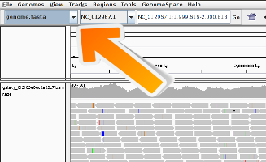

> <hands-on-title>Visualización de lecturas en IGV</hands-on-title>
>
> Hay dos maneras de correrlo:
>
> 1. Si tienes IGV instalado (o quieres instalarlo):
>     1. Instala [IGV](https://software.broadinstitute.org/software/igv/download)
>     2. Inicia IGV en tu ordenador 
>     3. Expande el  output de **{{ include.tool }}** 
>     4. Haz click en `local` en `display with IGV` para cargar tus lecturas en el navegador de IGV
> 2. Si no tienes IGV
>     1. Click en el `Mouse mm10` (o en el organismo correcto) en `display with IGV` para cargar tus lecturas en el navegador de IGV
> 4. Zoom en `{{ include.region_to_zoom }}`
{: .hands_on}

Las lecturas tienen una dirección: se mapean a la hebra directa o a la hebra inversa, respectivamente. Al pasar el cursor sobre una lectura, se muestra información adicional.

> <question-title></question-title>
>
> 1. ¿Qué podría significar si una barra en la vista de cobertura está colorada? 
> 2. ¿Cuál podría ser la razón para que una lectura sea blanca en vez de gris?
>
> > <solution-title></solution-title>
> > 1. Si un nucleótido difiere de la secuencia de referencia en más del 20 % de las lecturas ponderadas por calidad, IGV colorea la barra en proporción al número de lecturas de cada base. 
> > 2. Tienen una calidad de mapeo igual a cero. La interpretación de esta calidad de mapeo depende del alineador utilizado, ya que algunos alineadores comunes usan esta convención para marcar lecturas con alineamientos múltiples. En ese caso, la lectura también se alinea en otra ubicación con una calidad de alineamiento igualmente buena. También es posible que la lectura no pueda ubicarse de forma única, aunque las otras ubicaciones alternativas no necesariamente tengan una calidad de alineamiento igual de buena.
> {: .solution }
{: .question}

> <comment-title>Trucos para IGV</comment-title>
> 1. Debido a que el número de lecturas en una región puede ser muy elevado, el visor IGV muestra por defecto solo las lecturas que caen dentro de una pequeña ventana. Este comportamiento puede modificarse en IGV desde `view > Preferences > Alignments`.
> 2. Si el genoma de interés no está ahí comprueba si está disponible en **More...**. Si este no es el caso, puedes añadirlo manualmente a través del menú **Genomes** -> **Load Genome from...**
>
>    
>
> Una descripción general de la interfaz de IGV está disponible aquí: [IGV Browser description]()
{: .comment}
