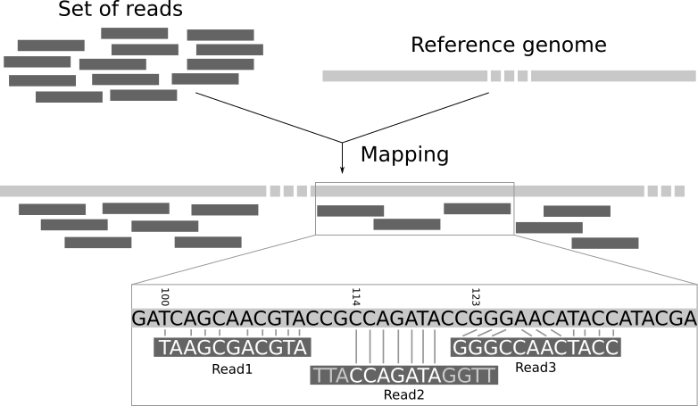

La secuenciación produce una colección de secuencias sin contexto genómico. No sabemos a
qué parte del genoma corresponden las secuencias. El mapeo de las lecturas de un
experimento con un genoma de referencia es un paso clave en el análisis moderno de datos
genómicos. Con el mapeo, las lecturas se asignan a una ubicación específica en el genoma
y se puede obtener información como el nivel de expresión de los genes.

Las lecturas no vienen con información de posición, por lo que no sabemos de qué parte
del genoma provienen. Tenemos que utilizar la secuencia de la propia lectura para
encontrar la región correspondiente en la secuencia de referencia. Pero la secuencia de
referencia puede ser bastante larga (unos 3.000 millones de bases en el caso del ser
humano), por lo que encontrar una región que coincida es una tarea de enormes
proporciones. Como nuestras lecturas son cortas, puede haber varios lugares igualmente
probables en la secuencia de referencia desde los que podrían haberse leído. Esto es
especialmente cierto en el caso de las regiones repetitivas.

En principio, podríamos hacer un análisis BLAST para averiguar dónde encajan mejor las
piezas secuenciadas en el genoma conocido. Tendríamos que hacerlo para cada uno de los
millones de lecturas de nuestros datos de secuenciación. Sin embargo, alinear millones
de secuencias cortas de este modo puede llevar un par de semanas. Y no nos importa la
correspondencia exacta entre bases (alineación). Lo que nos interesa es "de dónde
proceden estas lecturas". Este enfoque se denomina **mapeo**.

A continuación, procesaremos un conjunto de datos con el mapeador **Bowtie2** y
visualizaremos los datos con el programa **IGV**.

> <agenda-title></agenda-title>
> 
> En este tutorial, nos ocuparemos de:
> 
> 1. TOC
> {:toc}
> 
{: .agenda}

# Preparar los datos

> <hands-on-title>Carga de datos</hands-on-title>
> 
> 1. Crea un nuevo historial para este tutorial y dale un nombre apropiado
> 
>    
> 
>    
> 
> 2. Importe `wt_H3K4me3_read1.fastq.gz` y `wt_H3K4me3_read2.fastq.gz` de
>    [Zenodo](https://zenodo.org/record/1324070) o de la biblioteca de datos (pregunte a
>    su instructor)
> 
>    ```
>    https://zenodo.org/record/1324070/files/wt_H3K4me3_read1.fastq.gz
>    https://zenodo.org/record/1324070/files/wt_H3K4me3_read2.fastq.gz
>    ```
> 
>    
> 
>    
> 
>    Por defecto, Galaxy toma el enlace como nombre, así que renómbralos.
> 
> 3. Cambie el nombre de los archivos a `reads_1` y `reads_2`
> 
>    
> 
{: .hands_on}

Acabamos de importar en Galaxy los archivos FASTQ correspondientes a los datos de fin de
pares que pudimos obtener directamente de una instalación de secuenciación.

Durante la secuenciación se introducen errores, como la llamada de nucleótidos
incorrectos. Los errores de secuenciación pueden sesgar el análisis y dar lugar a una
interpretación errónea de los datos. El primer paso para cualquier tipo de datos de
secuenciación es siempre comprobar su calidad.

Hay un tutorial dedicado al [control de calidad]() de los datos de
secuenciación. No vamos a repetir los pasos allí. Debería seguir el [tutorial]() y aplicarlo a sus
datos antes de continuar.

# Mapear lecturas en un genoma de referencia

El mapeo de lecturas es el proceso para alinear las lecturas en un genoma de referencia.
Un mapeador toma como entrada un genoma de referencia y un conjunto de lecturas. Su
objetivo es alinear cada lectura en el conjunto de lecturas en el genoma de referencia,
permitiendo desajustes, indels y el recorte de algunos fragmentos cortos en los dos
extremos de las lecturas:



Necesitamos un genoma de referencia para mapear las lecturas.



Actualmente, existen más de 60 mapeadores diferentes, y su número sigue creciendo. En
este tutorial, utilizaremos [Bowtie2](http://bowtie-bio.sourceforge.net/bowtie2/), una
herramienta de código abierto rápida y eficiente en memoria, particularmente buena para
alinear lecturas de secuenciación de entre 50 y 1.000 bases con genomas relativamente
largos.

> <hands-on-title>Mapeo con Bowtie2</hands-on-title>
> 1.  con los siguientes parámetros
>    - *"Is this single or paired library "*: `Paired-end`
>       -  *"FASTA/Q file #1"*: `reads_1`
>       -  *"FASTA/Q file #2"*: `reads_2`
>       - *"Do you want to set paired-end options?"*: `No`
> 
>         Debería echar un vistazo a los parámetros, especialmente la orientación de la
>         pareja si la conoce. Pueden mejorar la calidad del mapeo de extremos pareados.
> 
>     - *"¿Will you select a reference genome from your history or use a built-in index?"*: `Use a built-in genome index`
>       - *"Select reference genome "*: `Mouse (Mus musculus): mm10`

>     - *"Select analysis mode "*: `Default setting only`
> 
>       Debería echar un vistazo a los parámetros no predeterminados e intentar
>       comprenderlos. Pueden tener un impacto en el mapeo y mejorarlo.
> 
>     - *"Save the bowtie2 mapping statistics to the history "*: `Yes`
> 
> 2. Inspeccione el archivo `mapping stats` haciendo clic en el  (ojo)
> 
{: .hands_on}

> <question-title></question-title> (título de la pregunta)
> 
> 1. ¿Qué información se proporciona aquí?
> 2. ¿Cuántas lecturas se han mapeado exactamente 1 vez?
> 3. ¿Cuántas lecturas se han mapeado más de 1 vez? ¿Cómo es posible? ¿Qué debemos hacer
>    con ellas?
> 4. ¿Cuántos pares de lecturas no se han mapeado? ¿Cuáles son las causas?
> 
> > <solution-title></solution-title>
> > 1. La información dada aquí es cuantitativa. Podemos ver cuántas secuencias están
> >    alineadas. No nos dice nada sobre la calidad.
> > 2. ~90% de las lecturas se han alineado exactamente 1 vez
> > 3. ~7% de las lecturas se han alineado concordantemente >1 veces. Estas se denominan
> >    lecturas multimapeadas. Puede ocurrir debido a repeticiones en el genoma de
> >    referencia (múltiples copias de un gen, por ejemplo), especialmente cuando las
> >    lecturas son pequeñas. Es difícil decidir de dónde proceden estas secuencias, por
> >    lo que la mayoría de los pipelines las ignoran. Compruebe siempre las
> >    estadísticas para asegurarse de no descartar demasiada información en los
> >    análisis posteriores.
> > 4. ~3% de pares de lecturas no se han mapeado porque
> >     - ambas lecturas del par alineadas pero sus posiciones no concuerdan con el par
> >       de lecturas (`aligned discordantly 1 time`)
> >     - las lecturas de estos pares están mapeadas (`aligned >1 times` en `pairs
> >       aligned 0 times concordantly or discordantly`)
> >     - se mapea una lectura de estos pares pero no la lectura emparejada (`aligned
> >       exactly 1 time` en `pairs aligned 0 times concordantly or discordantly`)
> >     - el resto no está mapeado en absoluto
> > 
> {: .solution }
> 
{: .question}

La comprobación de las estadísticas de mapeo es un paso importante antes de continuar
con cualquier análisis. Hay varias fuentes potenciales de errores en el mapeo,
incluyendo (pero no limitado a):

- **Artefactos de la reacción en cadena de la polimerasa (PCR)**: Muchos métodos de
  secuenciación de alto rendimiento (HTS) implican uno o varios pasos de PCR. Los
  errores de PCR se mostrarán como desajustes en la alineación, y especialmente los
  errores en las primeras rondas de PCR aparecerán en múltiples lecturas, sugiriendo
  falsamente una variación genética en la muestra. Un error relacionado son los
  duplicados de PCR, en los que el mismo par de lecturas aparece varias veces, lo que
  distorsiona los cálculos de cobertura en el alineamiento.
- **Errores de secuenciación**: La máquina de secuenciación puede hacer una llamada
  errónea, ya sea por razones físicas (por ejemplo, aceite en un portaobjetos Illumina)
  o debido a las propiedades del ADN secuenciado (por ejemplo, homopolímeros). Como los
  errores de secuenciación suelen ser aleatorios, pueden filtrarse como lecturas únicas
  durante la llamada de variantes.
- **Errores de mapeo**: El algoritmo de mapeo puede mapear una lectura a una
  localización incorrecta en la referencia. Esto ocurre a menudo alrededor de
  repeticiones u otras regiones de baja complejidad.

Por lo tanto, si las estadísticas de mapeo no son buenas, debe investigar la causa de
estos errores antes de continuar con sus análisis.

Después de esto, debería echar un vistazo a las lecturas e inspeccionar el archivo BAM
donde se almacenan los mapeos de lecturas.

# Inspección de un archivo BAM



El archivo BAM incluye mucha información sobre cada lectura, en particular sobre la
calidad del mapeo.

> <hands-on-title>Resumen de la calidad del mapeo</hands-on-title>
> 1.  con los siguientes parámetros
>    -  *"BAM file "*: `aligned reads` (salida de **Bowtie2** )
>    - *"Use reference sequence "*: `Locally cached/Use a built-in genome`
>      - *"Use genome"*: `Mouse (Mus musculus): mm10 Full`
> 
> 2. Inspeccionar el archivo  archivo `Stats`
> 
{: .hands_on}

> <question-title></question-title> (título de la pregunta)
> 
> 1. ¿Cuál es la proporción de desajustes en las lecturas mapeadas cuando se alinean con
>    el genoma de referencia?
> 2. ¿Qué representa la tasa de error?
> 3. ¿Cuál es la calidad media? ¿Cómo se representa?
> 4. ¿Cuál es el tamaño medio de las inserciones?
> 5. ¿Cuántas lecturas tienen una puntuación de calidad de mapeo inferior a 20?
> 
> > <solution-title></solution-title>
> > 1. Hay ~21.900 discordancias para ~4.753.900 bases mapeadas, lo que en promedio
> >    produce ~0,005 discordancias por bases mapeadas.
> > 2. La tasa de error es la proporción de emparejamientos erróneos por bases mapeadas,
> >    por lo que la proporción calculada justo antes.
> > 3. La calidad media es la puntuación de calidad media del mapeo. Es una puntuación
> >    Phred como la utilizada en el archivo FASTQ para cada nucleótido. Pero aquí la
> >    puntuación no es por nucleótido, sino por lectura y representa la probabilidad de
> >    la calidad del mapeo.
> > 4. El tamaño de la inserción es la distancia entre las dos lecturas de los pares.
> > 5. Para obtener la información:
> >      1.  con un filtro para mantener sólo las lecturas con una calidad de mapeo >= 20
> >      2.  en la salida de **Filter**
> > 
> >    Antes del filtrado: 95.412 lecturas y después del filtrado: 89.664 lecturas.
> > 
> {: .solution }
> 
{: .question}

# Visualización mediante un navegador del genoma

## IGV

El Visor de Genómica Integrativa (IGV) es una herramienta de visualización de alto
rendimiento para la exploración interactiva de grandes conjuntos de datos genómicos
integrados. Es compatible con una amplia variedad de tipos de datos, incluidos los datos
de secuencias basadas en arrays y de próxima generación, y las anotaciones genómicas. A
continuación, la utilizaremos para visualizar las lecturas mapeadas.



## JBrowse


es un navegador del genoma alternativo, basado en la web. Mientras que IGV es un
software que debe descargarse y ejecutarse, las instancias de JBrowse son sitios web
alojados en línea que proporcionan una interfaz para navegar por los datos genómicos. Lo
utilizaremos para visualizar las lecturas mapeadas.



# Conclusión

Tras el control de calidad, el mapeo es un paso importante en la mayoría de los análisis
de datos de secuenciación (RNA-Seq, ChIP-Seq, etc.) para determinar en qué parte del
genoma se originaron nuestras lecturas y utilizar esta información para los análisis
posteriores.

