Bei der Sequenzierung werden die Nukleotidbasen in einer DNA- oder RNA-Probe (Bibliothek) durch den Sequenzierer bestimmt. Für jedes Fragment in der Bibliothek wird eine Sequenz erzeugt, auch **Leseprobe** genannt, die einfach eine Folge von Nukleotiden ist.

Moderne Sequenzierungstechnologien können in einem einzigen Experiment eine riesige Anzahl von Sequenz-Reads erzeugen. Allerdings ist keine Sequenzierungstechnologie perfekt, und jedes Gerät erzeugt unterschiedliche Arten und Mengen von Fehlern, wie z. B. falsch bezeichnete Nukleotide. Diese falsch benannten Basen sind auf die technischen Beschränkungen der einzelnen Sequenzierplattformen zurückzuführen.

Daher ist es notwendig, Fehlertypen zu verstehen, zu identifizieren und auszuschließen, die die Interpretation der nachgeschalteten Analyse beeinträchtigen können. Die Qualitätskontrolle der Sequenzen ist daher ein wesentlicher erster Schritt in Ihrer Analyse. Frühzeitiges Erkennen von Fehlern spart später Zeit.

> <agenda-title></agenda-title>
> 
> In diesem Tutorium werden wir uns mit folgenden Themen beschäftigen:
> 
> 1. TOC
> {:toc}
{: .agenda}

# Untersuchen Sie eine Rohsequenzdatei

> <hands-on-title>Daten-Upload</hands-on-title>
> 
> 1. Erstellen Sie einen neuen Verlauf für dieses Tutorial und geben Sie ihm einen passenden Namen
> 
>    
> 
>    
> 
> 2. Importieren Sie die Datei `female_oral2.fastq-4143.gz` von [Zenodo] (https://zenodo.org/record/3977236) oder aus der Datenbibliothek (fragen Sie Ihren Dozenten) Dies ist eine Mikrobiomprobe von einer Schlange .
> 
>    ```
>    https://zenodo.org/record/3977236/files/female_oral2.fastq-4143.gz
>    ```
> 
>    
> 
>    
> 
> 3. Benennen Sie den importierten Datensatz in `Reads` um.
{: .hands_on}

Wir haben gerade eine Datei in Galaxy importiert. Diese Datei ähnelt den Daten, die wir direkt von einer Sequenziereinrichtung erhalten könnten: eine [FASTQ-Datei](https://en.wikipedia.org/wiki/FASTQ_format).

> <hands-on-title>Inspect the FASTQ file</hands-on-title>
> 
> 1. Überprüfen Sie die Datei, indem Sie auf das  (Auge) Symbol
{: .hands_on}

Obwohl es kompliziert aussieht (und es vielleicht auch ist), ist das FASTQ-Format mit ein wenig Dekodierung leicht zu verstehen.

Jeder Read, der ein Fragment der Bibliothek darstellt, wird durch 4 Zeilen kodiert:

| Line | Description                                                                                                                                                        |
| ---- | ------------------------------------------------------------------------------------------------------------------------------------------------------------------ |
| 1    | Always begins with `@` followed by the information about the read                                                                                                  |
| 2    | The actual nucleic sequence                                                                                                                                        |
| 3    | Always begins with a `+` and contains sometimes the same info in line 1                                                                                            |
| 4    | Has a string of characters which represent the quality scores associated with each base of the nucleic sequence; must have the same number of characters as line 2 |

Die erste Sequenz in unserer Datei ist also zum Beispiel:

```
@M00970:337:000000000-BR5KF:1:1102:17745:1557 1:N:0:CGCAGAAC+ACAGAGTT
GTGCCAGCCGCCGCGGTAGTCCGACGTGGCTGTCTCTTATACACATCTCCGAGCCCACGAGACCGAAGAACATCTCGTATGCCGTCTTCTGCTTGAAAAAAAAAAAAAAAAAAAACAAAAAAAAAAAAAGAAGCAAATGACGATTCAAGAAAGAAAAAAACACAGAATACTAACAATAAGTCATAAACATCATCAACATAAAAAAGGAAATACACTTACAACACATATCAATATCTAAAATAAATGATCAGCACACAACATGACGATTACCACACATGTGTACTACAAGTCAACTA
+
GGGGGGGGGGGGGGGGGGGGGGGGGGGGGGGGGGGGGGGGGGGGGGGGGGGGGGGGGGGGGFGGGFGGGGGGAFFGGFGGGGGGGGFGGGGGGGGGGGGGGFGGG+38+35*311*6,,31=******441+++0+0++0+*1*2++2++0*+*2*02*/***1*+++0+0++38++00++++++++++0+0+2++*+*+*+*+*****+0**+0**+***+)*.***1**//*)***)/)*)))*)))*),)0(((-((((-.(4(,,))).,(())))))).)))))))-))-(
```

Das bedeutet, dass das Fragment mit der Bezeichnung `@M00970` der DNA-Sequenz `GTGCCAGCCGCCGCGGTAGTCCGACGTGGCTGTCTCTTATACACATCTCCGAGCCCACGAGACCGAAGAACATCTCGTATGCCGTCTTCTGCTTGAAAAAAAAAAAAAAAAAAAACAAAAAAAAAAAAAGAAGCAAATGACGATTCAAGAAAGAAAAAAACACAGAATACTAACAATAAGTCATAAACATCATCAACATAAAAAAGGAAATACACTTACAACACATATCAATATCTAAAATAAATGATCAGCACACAACATGACGATTACCACACATGTGTACTACAAGTCAACTA` entspricht und diese Sequenz mit einer Qualität von `GGGGGGGGGGGGGGGGGGGGGGGGGGGGGGGGGGGGGGGGGGGGGGGGGGGGGGGGGGGGGFGGGFGGGGGGAFFGGFGGGGGGGGFGGGGGGGGGGGGGGFGGG+38+35*311*6,,31=******441+++0+0++0+*1*2++2++0*+*2*02*/***1*+++0+0++38++00++++++++++0+0+2++*+*+*+*+*****+0**+0**+***+)*.***1**//*)***)/)*)))*)))*),)0(((-((((-.(4(,,))).,(())))))).)))))))-))-(` sequenziert wurde.



> <question-title></question-title>
> 
> 1. Welches ASCII-Zeichen entspricht dem schlechtesten Phred-Score für Illumina 1.8+?
> 2. Wie hoch ist der Phred-Qualitätsscore des 3. Nukleotids der ersten Sequenz?
> 3. Wie berechnet man die Genauigkeit der Nukleotidbase mit dem ASCII-Code `/`?
> 4. Wie hoch ist die Genauigkeit dieses 3. Nukleotids?
> 
> > <solution-title></solution-title>
> > 1. Der schlechteste Phred-Score ist der kleinste, also 0. Bei Illumina 1.8+ entspricht er dem Zeichen `!`.
> > 2. Das 3. Nukleotid der 1. Sequenz hat ein ASCII-Zeichen `G`, was einem Score von 38 entspricht.
> > 3. Dies kann wie folgt berechnet werden:
> >    - ASCII-Code für `/` ist 47
> >    - Qualitätsbewertung = 47-33=14
> >    - Formel zur Ermittlung der Fehlerwahrscheinlichkeit: \\(P = 10^{-Q/10}\)
> >    - Fehlerwahrscheinlichkeit = (10^{-14/10}\) = 0,03981
> >    - Daher Genauigkeit = 100 - 0.03981 = 99.96%
> > 4. Das entsprechende Nukleotid `G` hat eine Genauigkeit von fast 99,96 %
> {: .solution }
{: .question}

> <comment-title></comment-title> Das aktuelle lllumina (1.8+) verwendet das Sanger-Format (Phred+33). Wenn Sie mit älteren Datensätzen arbeiten, können Sie auf die älteren Scoring-Schemata stoßen. *mit *FastQC** , einem Tool, das wir später in diesem Tutorial verwenden werden, kann versucht werden, die Art der verwendeten Qualitätskodierung zu bestimmen (durch Bewertung des Bereichs der Phred-Werte in der FASTQ).
> 
{: .comment}

Wenn man sich die Datei in Galaxy ansieht, sieht es so aus, als ob die meisten Nukleotide einen hohen Score haben (`G` entspricht einem Score von 38). Gilt das für alle Sequenzen? Und entlang der gesamten Sequenzlänge?


# Bewertung der Qualität mit FASTQE 🧬😎 - nur kurze Reads

Um einen Blick auf die Sequenzqualität entlang aller Sequenzen zu werfen, können wir [FASTQE](https://fastqe.com/) verwenden. Es ist ein Open-Source-Tool, das eine einfache und unterhaltsame Möglichkeit zur Qualitätskontrolle von Rohsequenzdaten bietet und diese als Emoji ausgibt. Sie können es verwenden, um einen schnellen Eindruck davon zu bekommen, ob Ihre Daten irgendwelche Probleme aufweisen, auf die Sie achten sollten, bevor Sie eine weitere Analyse durchführen.

> <hands-on-title>Qualitätsprüfung</hands-on-title>
> 
> 1.  mit den folgenden Parametern
>    -  *"FastQ-Daten "*: `Reads`
>    -  *"Anzuzeigende Score-Typen "*: `Mean`
> 
> 2. Prüfen Sie die generierte HTML-Datei
{: .hands_on}

Anstatt die Qualitätswerte für jeden einzelnen Read zu betrachten, betrachtet FASTQE die Qualität kollektiv für alle Reads innerhalb einer Probe und kann den Mittelwert für jede Nukleotidposition entlang der Länge der Reads berechnen. Nachfolgend sind die Mittelwerte für diesen Datensatz aufgeführt.

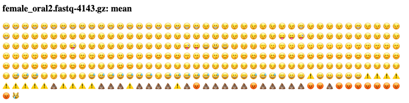

Sie können den Score für jedes [Emoji in der fastqe-Dokumentation] sehen (https://github.com/fastqe/fastqe#scale). Die folgenden Emojis mit Phred-Scores unter 20 sind diejenigen, von denen wir hoffen, dass wir sie nicht oft sehen werden.

| Phred Quality Score | ASCII code | Emoji |
| ------------------- | ---------- | ----- |
| 0                   | !          | 🚫     |
| 1                   | "          | ❌     |
| 2                   | #          | 👺     |
| 3                   | $          | 💔     |
| 4                   | %          | 🙅     |
| 5                   | &          | 👾     |
| 6                   | '          | 👿     |
| 7                   | (          | 💀     |
| 8                   | )          | 👻     |
| 9                   | *          | 🙈     |
| 10                  | +          | 🙉     |
| 11                  | ,          | 🙊     |
| 12                  | -          | 🐵     |
| 13                  | .          | 😿     |
| 14                  | /          | 😾     |
| 15                  | 0          | 🙀     |
| 16                  | 1          | 💣     |
| 17                  | 2          | 🔥     |
| 18                  | 3          | 😡     |
| 19                  | 4          | 💩     |


> <question-title></question-title>
> 
> Was ist der niedrigste Durchschnittswert in diesem Datensatz?
> 
> > <solution-title></solution-title> Der niedrigste Wert in diesem Datensatz ist 😿 13.
> {: .solution }
{: .question}


# Bewertung der Qualität mit FastQC - kurze und lange Reads

Eine zusätzliche oder alternative Möglichkeit zur Überprüfung der Sequenzqualität ist [FastQC] (https://www.bioinformatics.babraham.ac.uk/projects/fastqc/). Es bietet eine modulare Reihe von Analysen, die Sie verwenden können, um zu prüfen, ob Ihre Daten Probleme aufweisen, auf die Sie achten sollten, bevor Sie eine weitere Analyse durchführen. Wir können damit zum Beispiel prüfen, ob bekannte Adapter in den Daten vorhanden sind. Wir führen es mit der FASTQ-Datei aus.

> <hands-on-title>Qualitätsprüfung</hands-on-title>
> 
> 1.  mit den folgenden Parametern
>    -  *"Rohe Lesedaten aus Ihrer aktuellen Historie "*: `Reads`
> 
> 2. Prüfen Sie die generierte HTML-Datei
{: .hands_on}

> <question-title></question-title>
> 
> Welche Phred-Kodierung wird in der FASTQ-Datei für diese Sequenzen verwendet?
> 
> > <solution-title></solution-title> Die Phred-Scores werden mit `Sanger / Illumina 1.9` (`Encoding` in der oberen Tabelle) kodiert.
> {: .solution }
{: .question}

## Qualität der Sequenz pro Base

Mit FastQC können wir die Basenqualität der Reads anhand des Plots für die Sequenzqualität pro Base überprüfen, ähnlich wie wir es mit FASTQE gemacht haben.

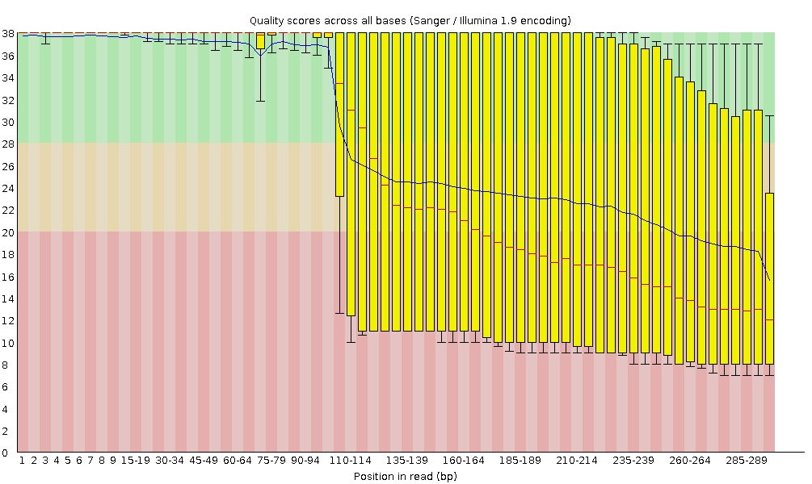

Auf der x-Achse ist die Basenposition im Read angegeben. In diesem Beispiel enthält die Probe Reads, die bis zu 296 bp lang sind.

> <details-title>Nicht einheitliche x-Achse</details-title>
> 
> Die x-Achse ist nicht immer gleichmäßig. Bei langen Leseabschnitten wird ein gewisses Binning angewendet, um die Dinge kompakt zu halten. Wir können das in unserer Probe sehen. Sie beginnt mit einzelnen 1-10 Basen. Danach werden die Basen über ein Fenster mit einer bestimmten Anzahl von Basen gebinnt. Datenbinning bedeutet Gruppierung und ist eine Technik der Datenvorverarbeitung, um die Auswirkungen kleinerer Beobachtungsfehler zu verringern. Die Anzahl der zusammengebinnten Basenpositionen hängt von der Länge des Reads ab. Bei Reads mit einer Länge von mehr als 50bp werden im letzten Teil des Diagramms aggregierte Statistiken für 5bp-Fenster angezeigt. Kürzere Reads haben kleinere Fenster und längere Reads größere Fenster. Das Binning kann bei der Ausführung von FastQC entfernt werden, indem der Parameter "Disable grouping of bases for reads &gt;50bp" auf Yes gesetzt wird.
{: .details}

Für jede Position wird ein Boxplot mit gezeichnet:

- der Medianwert, dargestellt durch die zentrale rote Linie
- der Interquartilsbereich (25-75%), dargestellt durch den gelben Kasten
- die 10%- und 90%-Werte in den oberen und unteren Whiskern
- die mittlere Qualität, dargestellt durch die blaue Linie

Die y-Achse zeigt die Qualitätswerte an. Je höher die Punktzahl, desto besser ist der Base-Call. Der Hintergrund des Diagramms unterteilt die y-Achse in sehr gute Qualitätswerte (grün), Werte von angemessener Qualität (orange) und Werte von schlechter Qualität (rot).

Bei allen Illumina-Sequenzern ist es normal, dass der mittlere Qualitätswert in den ersten 5-7 Basen niedriger ist und dann ansteigt. Die Qualität der Reads nimmt bei den meisten Plattformen am Ende des Reads ab. Dies ist häufig auf einen Signalabfall oder eine Phasenverschiebung während des Sequenzierungslaufs zurückzuführen. Die jüngsten Entwicklungen in der Sequenzierungschemie haben dies etwas verbessert, aber die Reads sind jetzt länger als je zuvor.


> <details-title>Signalabfall und Phasenlage</details-title>
> 
> - Signalverfall
> 
> Die Intensität des Fluoreszenzsignals nimmt mit jedem Zyklus des Sequenziervorgangs ab. Aufgrund der sich abbauenden Fluorophore wird ein Teil der Stränge im Cluster nicht verlängert. Der Anteil des emittierten Signals nimmt mit jedem Zyklus weiter ab, was zu einer Verringerung der Qualitätswerte am 3'-Ende des Read führt.
> 
> - Phasierung
> 
> Das Signal beginnt mit zunehmender Zykluszahl zu verschwimmen, weil der Cluster an Synchronität verliert. Im Laufe der Zyklen kommt es bei einigen Strängen zu zufälligen Ausfällen bei der Einbindung von Nukleotiden aufgrund von:
> 
>  - Unvollständige Entfernung der 3'-Terminatoren und Fluorophore
>  - Einbau von Nukleotiden ohne wirksame 3'-Terminatoren
> 
> Dies führt zu einer Verringerung der Qualitätswerte am 3'-Ende des Reads.
{: .details}


> <details-title>Andere Sequenzqualitätsprofile</details-title>
> 
> Dies sind einige Qualitätsprofile pro Basensequenz, die auf Probleme mit der Sequenzierung hinweisen können.
> 
> - Overclustering
> 
>   Sequenziereinrichtungen können die Fließzellen überclustern. Dies führt zu geringen Abständen zwischen den Clustern und einer Überlappung der Signale. Zwei Cluster können als ein einziger Cluster interpretiert werden, wobei gemischte Fluoreszenzsignale erkannt werden und die Signalreinheit abnimmt. Dies führt zu niedrigeren Qualitätswerten für den gesamten Read.
> 
> - Aufschlüsselung nach Instrumenten
> 
>   Während eines Laufs kann es gelegentlich zu Problemen mit den Sequenziergeräten kommen. Ein plötzlicher Qualitätsabfall oder ein hoher Prozentsatz von Reads mit niedriger Qualität im gesamten Read könnte auf ein Problem in der Einrichtung hinweisen. Einige Beispiele für solche Probleme:
> 
>    - Manifold Burst
> 
>      
> 
>    - Zyklenverlust
> 
>      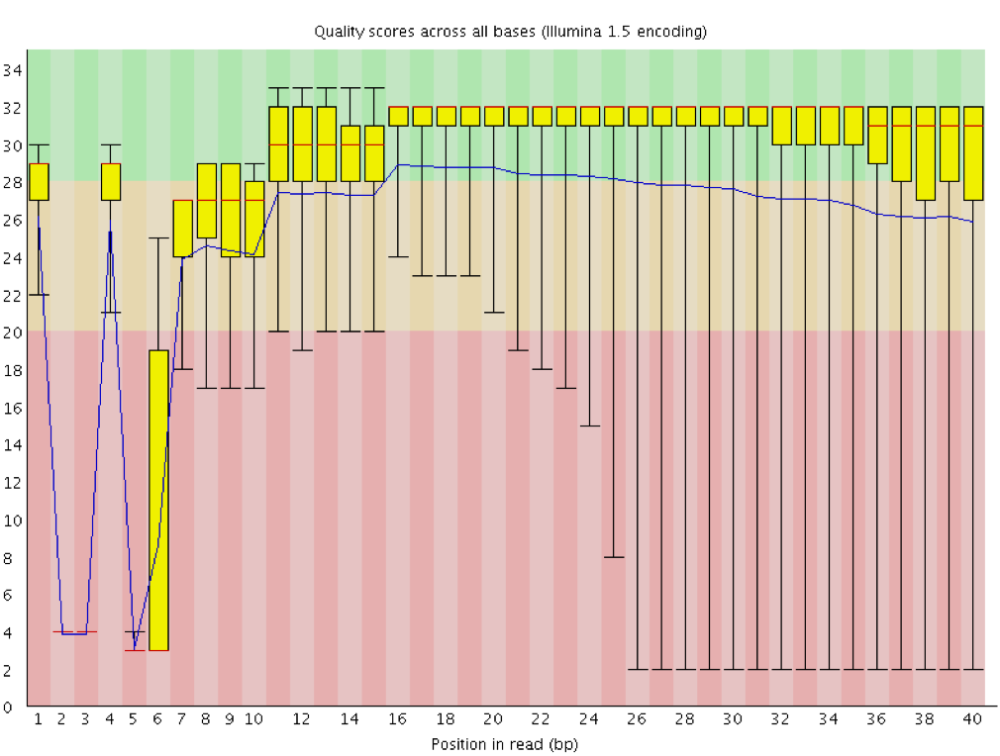
> 
>    - Read 2 failure
> 
>      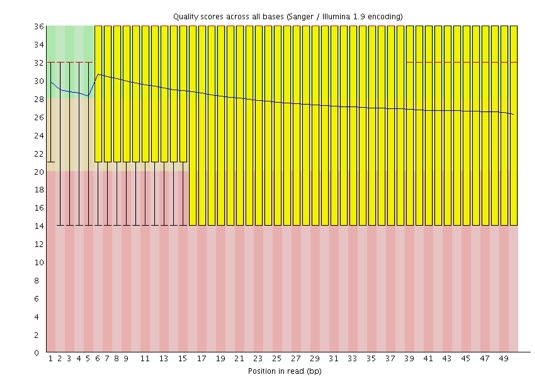
> 
>   Bei solchen Daten sollte die Sequenziereinrichtung kontaktiert werden, um sie zu besprechen. Oft ist dann eine erneute Sequenzierung erforderlich (und wird unserer Erfahrung nach auch von der Firma angeboten).
{: .details}

> <question-title></question-title>
> 
> 1. Wie verändert sich der mittlere Qualitätswert entlang der Sequenz?
> 2. Ist diese Tendenz bei allen Sequenzen zu beobachten?
> 
> > <solution-title></solution-title>
> > 1. Der mittlere Qualitätswert (blaue Linie) fällt etwa in der Mitte dieser Sequenzen ab. Es ist üblich, dass die mittlere Qualität zum Ende der Sequenzen hin abnimmt, da die Sequenzer am Ende mehr falsche Nukleotide einbauen. In dieser Probe gibt es jedoch einen sehr starken Qualitätsabfall ab der Mitte.
> > 2. Die Box-Plots werden ab Position ~100 immer breiter. Das bedeutet, dass bei vielen Sequenzen die Punktzahl ab der Mitte der Sequenz abfällt. Nach 100 Nukleotiden haben mehr als 10% der Sequenzen Scores unter 20.
> {: .solution }
{: .question}

Wenn der Median der Qualität unter einem Phred-Score von ~20 liegt, sollten wir in Erwägung ziehen, Basen schlechter Qualität aus der Sequenz zu entfernen. Wir werden diesen Prozess im Abschnitt Trimmen und Filtern erläutern.

### Adapter Inhalt

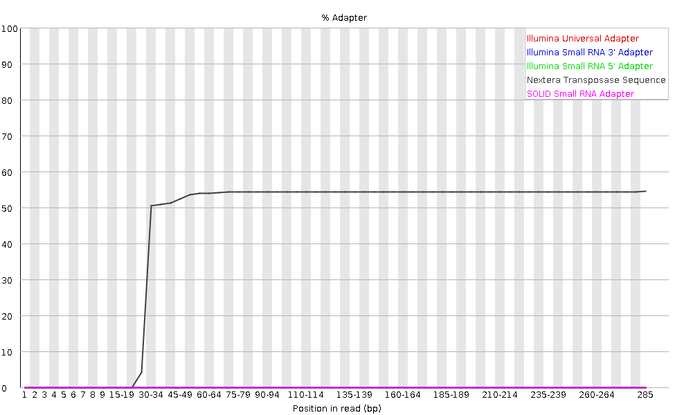

Die Grafik zeigt den kumulativen Prozentsatz der Reads mit den verschiedenen Adaptersequenzen an jeder Position. Sobald eine Adaptersequenz in einem Read vorkommt, wird sie bis zum Ende des Reads gezählt, so dass der Prozentsatz mit der Readlänge zunimmt. FastQC kann einige Adapter standardmäßig erkennen (z.B. Illumina, Nextera), für andere können wir eine Kontaminanten-Datei als Eingabe für das FastQC-Tool bereitstellen.

Idealerweise sollten Illumina-Sequenzdaten keine Adaptersequenz enthalten. Aber bei langen Reads sind einige der Bibliotheksinserts kürzer als die Leselänge, was zu einem Durchlesen des Adapters am 3'-Ende des Reads führt. Diese Mikrobiom-Probe hat relativ lange Reads und wir können sehen, dass Nextera dapater erkannt wurde.

> <details-title>Sonstige Adapterinhaltsprofile</details-title>
> 
> Der Adaptergehalt kann auch bei RNA-Seq-Bibliotheken festgestellt werden, bei denen die Verteilung der Bibliotheksinsertgrößen unterschiedlich ist und wahrscheinlich einige kurze Inserts enthält.
> 
> 
{: .details}

Wir können ein Trimming-Tool wie Cutadapt einsetzen, um diesen Adapter zu entfernen. Wir werden diesen Prozess im Abschnitt Filter und Trimmen erläutern.


> <tip-title>Eine Abkürzung nehmen</tip-title>
> 
> In den folgenden Abschnitten werden einige der anderen von FastQC erzeugten Diagramme ausführlich beschrieben. Beachten Sie, dass einige Plots/Module Warnungen ausgeben können, aber für die Art der Daten, mit denen Sie arbeiten, normal sind, wie unten und [in den FASTQC-FAQ](https://rtsf.natsci.msu.edu/genomics/tech-notes/fastqc-tutorial-and-faq/) beschrieben. Die anderen Diagramme geben uns Informationen, um die Qualität der Daten besser zu verstehen und um zu sehen, ob im Labor Änderungen vorgenommen werden können, um in Zukunft Daten von höherer Qualität zu erhalten. Diese Abschnitte sind **optional**, und wenn Sie sie überspringen möchten, können Sie das tun:
>   - Springen Sie direkt zum [nächsten Abschnitt](#trim-and-filter---short-reads), um mehr über das Trimmen von Paired-End-Daten zu erfahren
{: .tip}

### Qualität der Sequenz pro Kachel

Mit diesem Diagramm können Sie die Qualitätswerte der einzelnen Kacheln für alle Ihre Basen betrachten, um festzustellen, ob ein Qualitätsverlust nur mit einem Teil der Fließzelle verbunden ist. Das Diagramm zeigt die Abweichung von der durchschnittlichen Qualität für jede Fließzellenkachel an. Die wärmeren Farben zeigen an, dass die Reads in der jeweiligen Kachel eine schlechtere Qualität für diese Position aufweisen als die Reads in anderen Kacheln. Bei dieser Probe können Sie sehen, dass bestimmte Kacheln durchweg schlechte Qualität aufweisen, insbesondere ab ~100bp. Ein guter Plot sollte durchgängig blau sein.

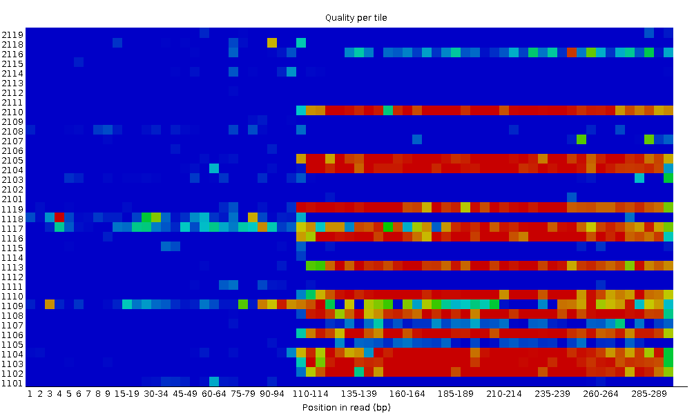

Dieses Diagramm wird nur für Illumina-Bibliotheken angezeigt, die ihre ursprünglichen Sequenzkennungen beibehalten. Darin kodiert ist die Fließzellenkachel, aus der jeder Read stammt.

> <details-title>Andere Kachelqualitätsprofile</details-title>
> 
> In einigen Fällen sind die bei der Sequenzierung verwendeten Chemikalien im Laufe der Zeit erschöpft und die letzten Kacheln haben die schlechtesten Chemikalien erhalten, was die Sequenzierungsreaktionen etwas fehleranfällig macht. Das Diagramm "Sequenzqualität pro Kachel" weist dann einige horizontale Linien wie diese auf:
> 
> 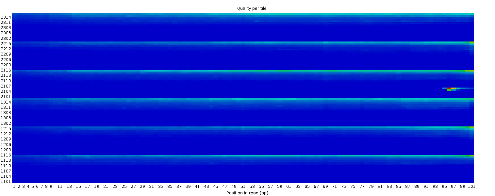
{: .details}

## Qualitätswerte pro Sequenz

Auf der x-Achse ist die durchschnittliche Qualitätsbewertung über die gesamte Länge aller Reads aufgetragen, auf der y-Achse die Gesamtzahl der Reads mit dieser Bewertung:


Die Verteilung der durchschnittlichen Lesequalität sollte einen engen Peak im oberen Bereich des Diagramms aufweisen. Es kann auch angezeigt werden, wenn eine Teilmenge der Sequenzen durchgängig niedrige Qualitätswerte aufweist: Dies kann vorkommen, weil einige Sequenzen schlecht abgebildet werden (am Rande des Sichtfelds usw.), diese sollten jedoch nur einen kleinen Prozentsatz der gesamten Sequenzen ausmachen.

## Inhalt pro Basensequenz

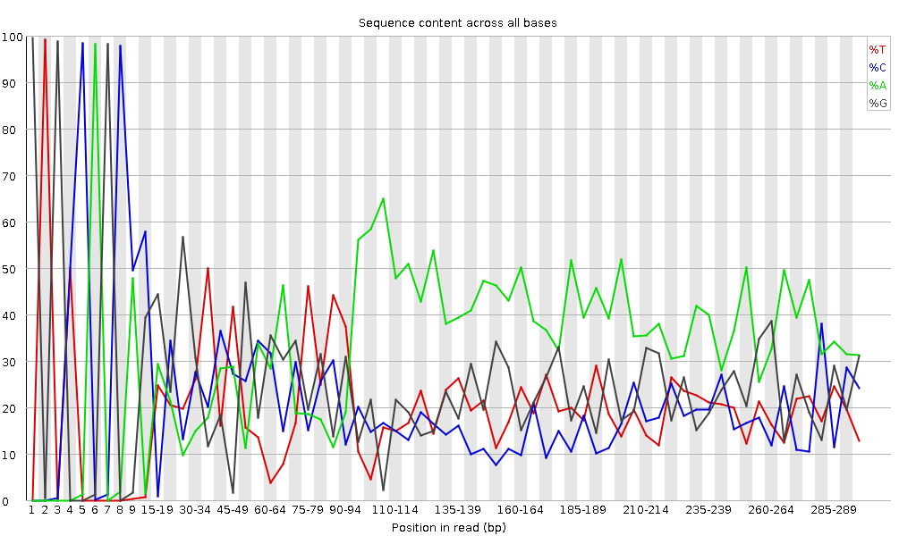

"Per Base Sequence Content" stellt den prozentualen Anteil jedes der vier Nukleotide (T, C, A, G) an jeder Position über alle Reads in der Eingabesequenzdatei dar. Wie bei der Qualität der Sequenz pro Base ist die x-Achse uneinheitlich.

In einer zufälligen Bibliothek würde man erwarten, dass sich die vier Basen wenig bis gar nicht unterscheiden. Der Anteil jeder der vier Basen sollte über die Länge des Reads mit `%A=%T` und `%G=%C` relativ konstant bleiben, und die Linien in diesem Diagramm sollten parallel zueinander verlaufen. Es handelt sich um Amplikondaten, bei denen 16S-DNA mittels PCR amplifiziert und sequenziert wird. Daher ist zu erwarten, dass diese Darstellung eine gewisse Verzerrung aufweist und keine Zufallsverteilung zeigt.

> <Details-title>Biases nach Bibliothekstyp</details-title>
> 
> Es ist erwähnenswert, dass einige Bibliothekstypen immer eine verzerrte Sequenzzusammensetzung erzeugen, normalerweise zu Beginn des Lesevorgangs. Bibliotheken, die durch Priming mit zufälligen Hexameren hergestellt wurden (einschließlich fast aller RNA-Seq-Bibliotheken), und solche, die mit Transposasen fragmentiert wurden, enthalten eine intrinsische Verzerrung an den Positionen, an denen Reads beginnen (die ersten 10-12 Basen). Diese Verzerrung bezieht sich nicht auf eine bestimmte Sequenz, sondern sorgt für eine Anreicherung einer Reihe verschiedener K-Mere am 5'-Ende der Reads. Dies ist zwar ein echter technischer Bias, kann aber nicht durch Trimming korrigiert werden und scheint in den meisten Fällen die nachgeschaltete Analyse nicht zu beeinträchtigen. Es wird jedoch eine Warnung oder ein Fehler in diesem Modul erzeugt.
> 
> 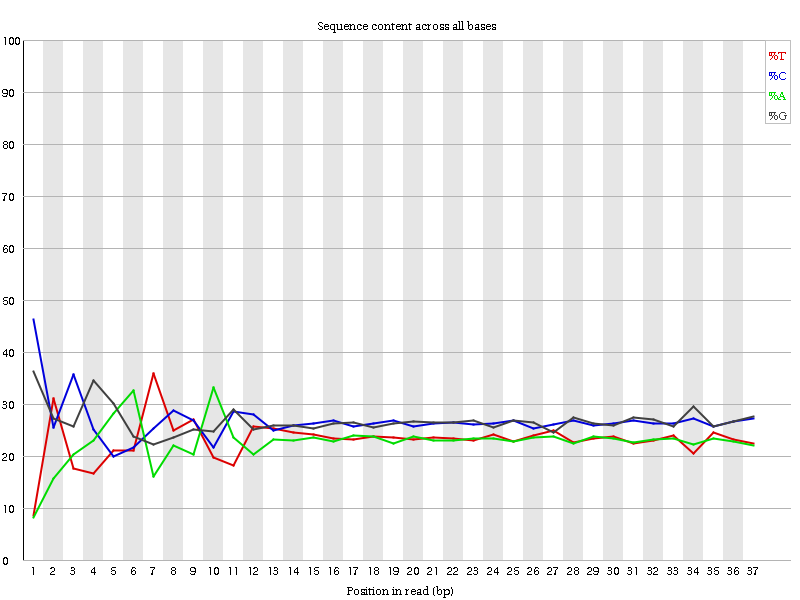
> 
> Bei ChIP-seq-Daten kann es bei der Fragmentierung mit Transposasen auch zu Verzerrungen der Lesestartsequenz kommen. Bei Bisulfit-konvertierten Daten, z. B. HiC-Daten, wird eine Trennung von G von C und A von T erwartet:
> 
> 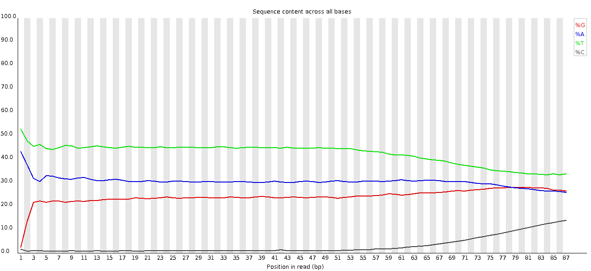
> 
> Am Ende ist eine allgemeine Verschiebung in der Sequenzzusammensetzung festzustellen. Wenn die Verschiebung mit einem Verlust an Sequenzierqualität korreliert, kann vermutet werden, dass Fehlanrufe mit einer gleichmäßigeren Sequenzverzerrung erfolgen als bei bisulfitkonvertierten Bibliotheken. Durch das Trimmen der Sequenzen wurde dieses Problem behoben, aber wenn dies nicht geschehen wäre, hätte es dramatische Auswirkungen auf die durchgeführten Methylierungs-Calls gehabt.
{: .details}

> <question-title></question-title>
> 
> Warum gibt es eine Warnung bei den Graphen für den Sequenzgehalt pro Base?
> 
> > <solution-title></solution-title> Am Anfang der Sequenzen ist der Sequenzgehalt pro Base nicht wirklich gut und die Prozentsätze sind nicht gleich, wie für 16S-Amplikon-Daten erwartet.
> {: .solution }
{: .question}


## GC-Gehalt pro Sequenz

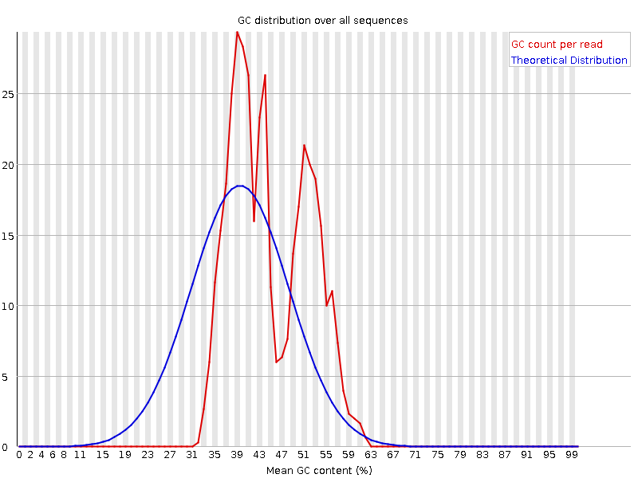

Diese Grafik zeigt die Anzahl der Reads im Vergleich zum Prozentsatz der Basen G und C pro Read. Sie wird mit einer theoretischen Verteilung verglichen, die von einem einheitlichen GC-Gehalt aller Reads ausgeht, wie er bei der Shotgun-Sequenzierung des gesamten Genoms erwartet wird, wobei der zentrale Peak dem gesamten GC-Gehalt des zugrunde liegenden Genoms entspricht. Da der GC-Gehalt des Genoms nicht bekannt ist, wird der modale GC-Gehalt aus den beobachteten Daten berechnet und zur Erstellung einer Referenzverteilung verwendet.

Eine ungewöhnlich geformte Verteilung könnte auf eine kontaminierte Bibliothek oder eine andere Art von verzerrter Teilmenge hinweisen. Eine verschobene Normalverteilung deutet auf eine systematische Verzerrung hin, die unabhängig von der Basenposition ist. Wenn es eine systematische Verzerrung gibt, die eine verschobene Normalverteilung erzeugt, wird dies vom Modul nicht als Fehler erkannt, da es nicht weiß, wie hoch der GC-Gehalt Ihres Genoms sein sollte.

Es gibt aber auch andere Situationen, in denen eine ungewöhnlich geformte Verteilung auftreten kann. Bei der RNA-Sequenzierung kann es beispielsweise zu einer mehr oder weniger starken Verteilung des mittleren GC-Gehalts unter den Transkripten kommen, was dazu führt, dass die beobachtete Kurve breiter oder schmaler ist als eine ideale Normalverteilung.

> <question-title></question-title>
> 
> Warum sind die Graphen für den GC-Gehalt pro Sequenz fehlerhaft?
> 
> > <solution-title></solution-title> Es gibt mehrere Peaks. Dies kann auf unerwartete Kontaminationen wie Adapter, rRNA oder überrepräsentierte Sequenzen hinweisen. Es kann aber auch normal sein, wenn es sich um Amplikon-Daten handelt oder Sie sehr reichhaltige RNA-seq-Transkripte haben.
> {: .solution }
{: .question}

### Sequenzlängenverteilung

Diese Grafik zeigt die Verteilung der Fragmentgrößen in der untersuchten Datei. In vielen Fällen ergibt sich ein einfaches Diagramm, das einen Peak nur bei einer Größe zeigt, aber bei FASTQ-Dateien mit variabler Länge zeigt es die relativen Mengen der einzelnen Sequenzfragmente unterschiedlicher Größe. Unser Diagramm zeigt die variable Länge, da wir die Daten getrimmt haben. Der größte Peak liegt bei 296bp, aber es gibt einen zweiten großen Peak bei ~100bp. Obwohl unsere Sequenzen bis zu 296bp lang sind, sind viele der qualitativ hochwertigen Sequenzen kürzer. Dies entspricht dem Abfall der Sequenzqualität bei ~100bp und den roten Streifen, die an dieser Position im Diagramm der Sequenzqualität pro Kachel beginnen.

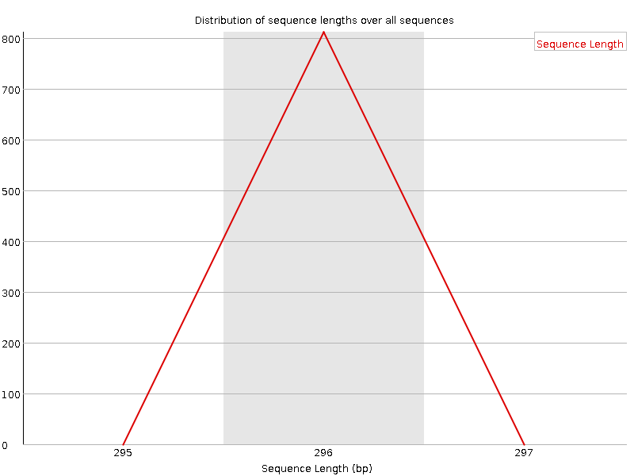

Einige Hochdurchsatz-Sequenzer erzeugen Sequenzfragmente von einheitlicher Länge, andere können jedoch Reads von sehr unterschiedlicher Länge enthalten. Selbst innerhalb von Bibliotheken mit einheitlicher Länge schneiden einige Pipelines Sequenzen zu, um Basen-Calls von schlechter Qualität vom Ende oder den ersten $$n$$ Basen zu entfernen, wenn sie mit den ersten $$n$$ Basen des Adapters bis zu 90% übereinstimmen (standardmäßig), wobei manchmal $$n = 1$$.

## Sequenzduplikationsstufen

Das Diagramm zeigt in Blau den Prozentsatz der Reads einer bestimmten Sequenz in der Datei, die eine bestimmte Anzahl von Malen in der Datei vorhanden sind:

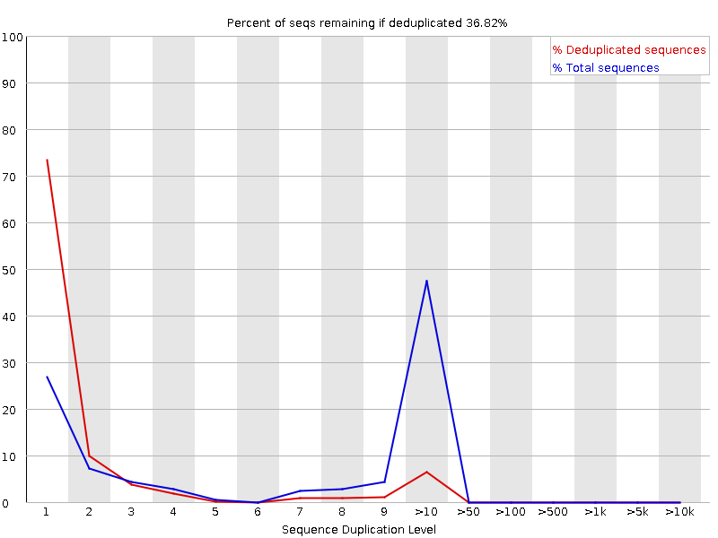

In einer heterogenen Bibliothek werden die meisten Sequenzen nur einmal im endgültigen Satz vorkommen. Eine geringe Duplizierung kann auf einen sehr hohen Abdeckungsgrad der Zielsequenz hinweisen, eine hohe Duplizierung deutet jedoch eher auf eine Art Anreicherungsbias hin.

Es lassen sich zwei Quellen für doppelte Reads finden:
- PCR-Duplikation, bei der Bibliotheksfragmente aufgrund einer verzerrten PCR-Anreicherung überrepräsentiert sind

  Dies ist besorgniserregend, weil PCR-Duplikate den wahren Anteil der Sequenzen in der Eingabe falsch darstellen.

- Wirklich überrepräsentierte Sequenzen, z. B. sehr häufig vorkommende Transkripte in einer RNA-Seq-Bibliothek oder in Amplikon-Daten (wie diese Probe)

  Dies ist ein erwarteter Fall und nicht besorgniserregend, da er die Eingabe getreu darstellt.

> <details-title>Mehr Details zur Duplikation</details-title>
> 
> FastQC zählt den Grad der Duplikation für jede Sequenz in einer Bibliothek und erstellt ein Diagramm, das die relative Anzahl der Sequenzen mit verschiedenen Duplikationsgraden anzeigt. Das Diagramm besteht aus zwei Linien:
> - Blaue Linie: Verteilung der Duplikationsgrade für den vollständigen Sequenzsatz
> - Rote Linie: Verteilung der entduplizierten Sequenzen mit den Anteilen der entduplizierten Menge, die aus verschiedenen Duplikationsstufen in den Originaldaten stammen.
> 
> Bei Shotgun-Daten für das gesamte Genom ist davon auszugehen, dass nahezu 100 % der Reads einzigartig sind (d. h. nur ein einziges Mal in den Sequenzdaten vorkommen). Die meisten Sequenzen sollten sowohl in der roten als auch in der blauen Linie ganz links im Diagramm liegen. Dies deutet auf eine hochdiverse Bibliothek hin, die nicht übersequenziert wurde. Wenn die Sequenzierungstiefe extrem hoch ist (z. B. > 100x die Größe des Genoms), kann es zu unvermeidlichen Sequenzduplikationen kommen: Theoretisch gibt es nur eine endliche Anzahl von völlig eindeutigen Sequenzlesungen, die aus einer gegebenen Eingangs-DNA-Probe gewonnen werden können.
> 
> Spezifischere Anreicherungen von Untergruppen oder das Vorhandensein von Verunreinigungen mit geringer Komplexität führen zu Spitzen auf der rechten Seite des Diagramms. Diese hohen Duplikationspeaks erscheinen meist in der blauen Kurve, da sie einen hohen Anteil der ursprünglichen Bibliothek ausmachen, verschwinden aber normalerweise in der roten Kurve, da sie einen unbedeutenden Anteil der deduplizierten Menge ausmachen. Bleiben die Peaks in der roten Kurve bestehen, deutet dies darauf hin, dass es eine große Anzahl verschiedener hoch duplizierter Sequenzen gibt, was entweder auf einen kontaminierten Satz oder eine sehr starke technische Duplikation hinweisen könnte.
> 
> Bei der RNA-Sequenzierung gibt es in der Regel einige sehr häufig vorkommende Transkripte und einige weniger häufig vorkommende. Es ist zu erwarten, dass doppelte Reads für Transkripte mit hoher Häufigkeit beobachtet werden:
> 
> 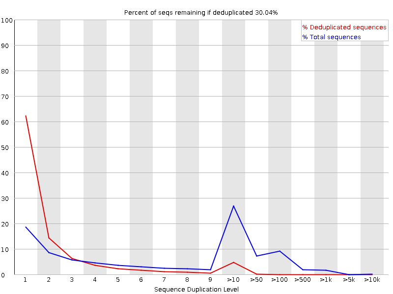
{: .details}

## Überrepräsentierte Sequenzen

Eine normale Bibliothek mit hohem Durchsatz enthält eine Vielzahl von Sequenzen, wobei keine einzelne Sequenz einen winzigen Bruchteil des Ganzen ausmacht. Die Feststellung, dass eine einzelne Sequenz in der Menge stark überrepräsentiert ist, bedeutet entweder, dass sie biologisch sehr bedeutsam ist, oder sie weist darauf hin, dass die Bibliothek kontaminiert oder nicht so vielfältig ist wie erwartet.

FastQC listet alle Sequenzen auf, die mehr als 0,1 % der Gesamtmenge ausmachen. Für jede überrepräsentierte Sequenz sucht FastQC nach Übereinstimmungen in einer Datenbank mit üblichen Verunreinigungen und meldet den besten gefundenen Treffer. Die Treffer müssen mindestens 20bp lang sein und dürfen nicht mehr als 1 Mismatch aufweisen. Das Auffinden eines Treffers bedeutet nicht unbedingt, dass es sich um die Quelle der Verunreinigung handelt, aber es kann Ihnen einen Hinweis auf die richtige Richtung geben. Es ist auch erwähnenswert, dass viele Adaptersequenzen einander sehr ähnlich sind, so dass ein Treffer gemeldet werden kann, der technisch nicht korrekt ist, aber eine sehr ähnliche Sequenz wie die eigentliche Übereinstimmung aufweist.

RNA-Sequenzierungsdaten können einige Transkripte enthalten, die so häufig vorkommen, dass sie als überrepräsentierte Sequenz registriert werden. Bei DNA-Sequenzierungsdaten sollte keine einzelne Sequenz so häufig vorkommen, dass sie aufgelistet wird, aber wir können manchmal einen kleinen Prozentsatz von Adapter-Reads sehen.

> <question-title></question-title>
> 
> Wie können wir herausfinden, welche Sequenzen überrepräsentiert sind?
> 
> > <solution-title></solution-title> Wir können überrepräsentierte Sequenzen mit BLAST untersuchen, um zu sehen, um welche es sich handelt. In diesem Fall nehmen wir die am stärksten überrepräsentierte Sequenz
> > ```
> > >overrep_seq1
> > GTGTCAGCCGCCGCGGTAGTCCGACGTGGCTGTCTCTTATACACATCTCC
> > ```
> > und [blastn](https://blast.ncbi.nlm.nih.gov/Blast.cgi) gegen die Standard-Nukleotiddatenbank (nr/nt) verwenden, erhalten wir keine Treffer. Aber wenn wir [VecScreen](https://www.ncbi.nlm.nih.gov/tools/vecscreen/) verwenden, sehen wir, dass es der Nextera-Adapter ist. 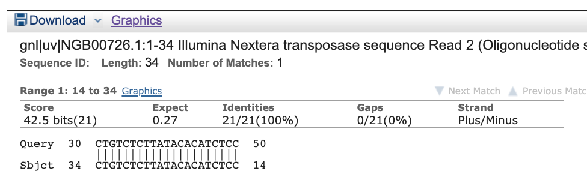
> {: .solution }
{: .question}


> <details-title>Mehr Details über andere FastQC-Plots</details-title>
> 
> 
> #### N-Gehalt pro Base
> 
> 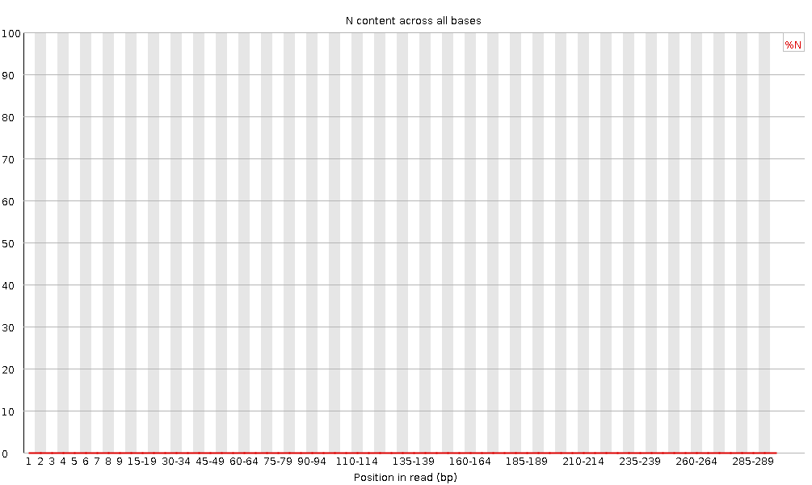
> 
> Wenn ein Sequenzer nicht in der Lage ist, einen Base-Call mit ausreichendem Vertrauen durchzuführen, schreibt er ein "N" anstelle eines herkömmlichen Base-Calls. Dieses Diagramm zeigt den Prozentsatz der Basenaufrufe an jeder Position oder jedem Bin an, für die ein "N" aufgerufen wurde.
> 
> Es ist nicht ungewöhnlich, dass ein sehr hoher Anteil von Ns in einer Sequenz auftritt, insbesondere gegen Ende der Sequenz. Aber diese Kurve sollte niemals merklich über Null ansteigen. Wenn dies der Fall ist, deutet dies auf ein Problem während des Sequenzierungslaufs hin. Im folgenden Beispiel führte ein Fehler dazu, dass das Gerät bei etwa 20 % der Reads an Position 29 keine Base aufrufen konnte:
> 
> 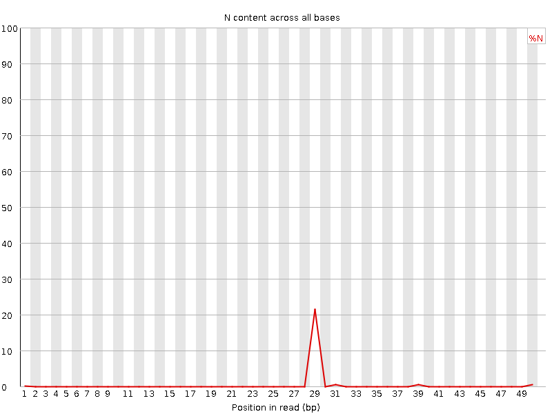
> 
> 
> #### Kmer-Gehalt
> 
> Dieser Plot wird standardmäßig nicht ausgegeben. Wie im Tool-Formular angegeben, muss dieses Modul mit Hilfe eines benutzerdefinierten Submoduls und einer Grenzwertdatei aktiviert werden, wenn Sie es wünschen. Mit diesem Modul führt FastQC eine generische Analyse aller kurzen Nukleotidsequenzen der Länge k (kmer, standardmäßig k = 7) durch, beginnend an jeder Position entlang des Reads in der Bibliothek, um diejenigen zu finden, die keine gleichmäßige Abdeckung über die Länge Ihrer Reads haben. Jedes gegebene kmer sollte gleichmäßig über die Länge des Reads vertreten sein.
> 
> FastQC meldet die Liste der kmers, die an bestimmten Positionen mit einer größeren Häufigkeit als erwartet auftreten. Dies kann auf verschiedene Quellen von Verzerrungen in der Bibliothek zurückzuführen sein, einschließlich des Vorhandenseins von Durchlese-Adaptersequenzen, die sich am Ende der Sequenzen ansammeln. Das Vorhandensein von überrepräsentierten Sequenzen in der Bibliothek (z. B. Adapterdimere) führt dazu, dass das Kmer-Diagramm von den Kmer-Werten dieser Sequenzen dominiert wird. Kmer, die aufgrund anderer interessanter Verzerrungen verzerrt sind, können dann verwässert werden und sind nicht leicht zu erkennen.
> 
> Das folgende Beispiel stammt aus einer hochwertigen DNA-Seq-Bibliothek. Die verzerrten kmers in der Nähe des Lesebeginns sind wahrscheinlich auf eine geringe sequenzabhängige Effizienz der DNA-Scherung oder auf ein zufälliges Priming zurückzuführen:
> 
> 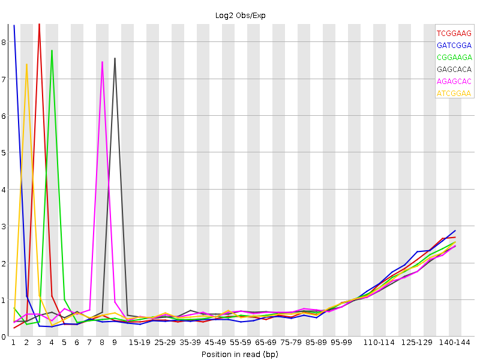
> 
> Dieses Modul kann sehr schwer zu interpretieren sein. Der Adapter-Content-Plot und die Tabelle der überrepräsentierten Sequenzen sind einfacher zu interpretieren und können Ihnen genügend Informationen liefern, ohne dass Sie diesen Plot benötigen. RNA-seq-Bibliotheken können stark vertretene kmers haben, die von hoch exprimierten Sequenzen stammen. Um mehr über diese Darstellung zu erfahren, lesen Sie bitte die [FastQC Kmer Content documentation](http://www.bioinformatics.babraham.ac.uk/projects/fastqc/Help/3%20Analysis%20Modules/11%20Kmer%20Content.html).
{: .details}

Wir haben versucht, hier verschiedene FastQC-Berichte und einige Anwendungsfälle zu erklären. Mehr darüber und auch einige häufige Probleme bei der Sequenzierung der nächsten Generation finden Sie auf [QCFAIL.com](https://sequencing.qcfail.com/)

> <details-title>Spezifisches Problem bei alternativen Bibliothekstypen</details-title>
> 
> #### Kleine/Mikro-RNA
> 
> In kleinen RNA-Bibliotheken haben wir in der Regel einen relativ kleinen Satz einzigartiger, kurzer Sequenzen. Kleine RNA-Bibliotheken werden vor dem Hinzufügen von Sequenzieradaptern an ihren Enden nicht zufällig geschert: Alle Reads für bestimmte Klassen von microRNAs werden identisch sein. Das Ergebnis wird sein:
> 
> - Extrem verzerrter Inhalt pro Basensequenz
> - Äußerst enge Verteilung des GC-Gehalts
> - Sehr hohe Sequenzduplikationsraten
> - Häufigkeit der überrepräsentierten Sequenzen
> - Durchlesen in Adaptern
> 
> #### Amplikon
> 
> Amplikon-Bibliotheken werden durch PCR-Amplifikation eines bestimmten Ziels hergestellt. Zum Beispiel die hypervariable Region V4 des bakteriellen 16S rRNA-Gens. Es wird erwartet, dass alle Reads aus dieser Art von Bibliothek nahezu identisch sind. Das Ergebnis wird sein:
> 
> - Extrem verzerrter Inhalt pro Basensequenz
> - Äußerst enge Verteilung des GC-Gehalts
> - Sehr hohe Sequenzduplikationsraten
> - Häufigkeit der überrepräsentierten Sequenzen
> 
> #### Bisulfit- oder Methylierungssequenzierung
> 
> Bei der Bisulfit- oder Methylierungssequenzierung wird die Mehrzahl der Cytosinbasen (C) in Thyminbasen (T) umgewandelt. Das Ergebnis ist:
> 
> - Verzerrter Inhalt pro Basensequenz
> - Verzerrter GC-Gehalt pro Sequenz
> 
> #### Adapter-Dimer-Kontamination
> 
> Jeder Bibliothekstyp kann einen sehr geringen Prozentsatz von Adapter-Dimer-Fragmenten (d. h. ohne Insert) enthalten. Sie sind eher in Amplikon-Bibliotheken zu finden, die vollständig durch PCR (durch Bildung von PCR-Primer-Dimern) aufgebaut sind, als in DNA-Seq- oder RNA-Seq-Bibliotheken, die durch Adapter-Ligation aufgebaut sind. Wenn ein ausreichender Anteil der Bibliothek aus Adapter-Dimeren besteht, wird dies im FastQC-Bericht sichtbar:
> 
> - Abfall der Sequenzqualität pro Base nach Base 60
> - Mögliche bimodale Verteilung der Qualitätswerte pro Sequenz
> - Ausgeprägtes Muster im Sequenzgehalt pro Base bis zur Base 60
> - Spike im GC-Gehalt pro Sequenz
> - Überrepräsentierte Sequenz mit passendem Adapter
> - Adaptergehalt > 0% ab Basis 1
{: .details}

> <comment-title>Schlechte Qualität der Sequenzen</comment-title> Wenn die Qualität der Reads nicht gut ist, sollten wir immer zuerst prüfen, was falsch ist und darüber nachdenken: Es kann an der Art der Sequenzierung liegen oder an dem, was wir sequenziert haben (hohe Anzahl überrepräsentierter Sequenzen in Transkriptomikdaten, verzerrter Prozentsatz von Basen in HiC-Daten).
> 
> Sie können sich auch an die Sequenziereinrichtung wenden, insbesondere wenn die Qualität wirklich schlecht ist: Die Qualitätsbehandlungen können nicht alles lösen. Wenn zu viele Basen von schlechter Qualität weggeschnitten werden, werden die entsprechenden Reads herausgefiltert und Sie verlieren sie.
{: .comment}

# Trimmen und Filtern - kurze Reads

Die Qualität nimmt in der Mitte dieser Sequenzen ab. Dies könnte bei nachgelagerten Analysen zu Verzerrungen durch diese möglicherweise falsch benannten Nukleotide führen. Die Sequenzen müssen behandelt werden, um eine Verzerrung in der nachgelagerten Analyse zu vermeiden. Trimming kann dazu beitragen, die Anzahl der Reads zu erhöhen, die der Aligner oder Assembler erfolgreich nutzen kann, und die Anzahl der nicht gemappten oder nicht assemblierten Reads zu verringern. Im Allgemeinen umfassen die Qualitätsbehandlungen:

1. Trimmen/Schneiden/Maskieren von Sequenzen
    - aus Regionen mit niedriger Qualitätsbewertung
    - Anfang/Ende der Sequenz
    - Entfernen von Adaptern
2. Filterung von Sequenzen
    - mit niedriger mittlerer Qualitätsbewertung
    - zu kurz
    - mit zu vielen mehrdeutigen (N) Basen

Um diese Aufgabe zu bewältigen, werden wir [Cutadapt](https://cutadapt.readthedocs.io/en/stable/guide.html)  verwenden, ein Tool, das die Sequenzqualität durch automatisiertes Adapter-Trimming und Qualitätskontrolle verbessert. Wir werden:

- Trimmen von Basen geringer Qualität an den Enden. Das Qualitätstrimming wird vor dem Adaptertrimming durchgeführt. Wir setzen den Qualitätsschwellenwert auf 20, ein häufig verwendeter Schwellenwert, siehe mehr [in GATK's Phred Score FAQ](https://gatk.broadinstitute.org/hc/en-us/articles/360035531872-Phred-scaled-quality-scores).
- Trimmen des Adapters mit Cutadapt. Dazu müssen wir die Sequenz des Adapters angeben. In diesem Beispiel ist Nextera der Adapter, der erkannt wurde. Wir können die Sequenz des Nextera-Adapters auf der [Illumina-Website hier](https://support.illumina.com/bulletins/2016/12/what-sequences-do-i-use-for-adapter-trimming.html) `CTGTCTCTTATACACATCT` finden. Wir werden diese Sequenz vom 3'-Ende der Reads abschneiden.
- Herausfiltern von Sequenzen mit einer Länge < 20 nach dem Trimmen

> <hands-on-title>Verbesserung der Sequenzqualität</hands-on-title>
> 
> 1.  mit den folgenden Parametern
>    - *"Single-end or Paired-end reads? "*: `Single-end`
>       -  *"FASTQ/A-Datei "*: `Reads` (Eingabe-Datensatz)
> 
>         > <tip-title>Dateien nicht auswählbar?</tip-title> Wenn Ihre FASTQ-Datei nicht ausgewählt werden kann, können Sie überprüfen, ob das Format FASTQ mit Sanger-skalierten Qualitätswerten (`fastqsanger.gz`) ist. Sie können den Datentyp bearbeiten, indem Sie auf das Bleistiftsymbol klicken.
> > 
>          {: .tip}
> 
>    - In *"Read 1 Adapters "*:
>       - *"1: 3' (End) Adapter "*:
>          - *"Quelle "*: `Enter custom sequence`
>          - *"Benutzerdefinierte 3'-Adaptersequenz "*: `CTGTCTCTTATACACATCT`
>    - In *"Other Read Trimming Options "*
>       - *"Quality cutoff(s) (R1) "*: `20`
>    - In *"Read Filtering Options "*
>       - *"Mindestlänge (R1) "*: `20`
>    -  *"Zusätzliche zu erzeugende Ausgaben "*: `Report`
> 
> 2. Prüfen Sie die erzeugte txt-Datei (`Report`)
> 
>    > <question-title></question-title>
>    > 
>    > 1. Wie viel % der Reads enthalten Adapter?
>    > 2. Wie viel % der Reads wurden wegen schlechter Qualität abgeschnitten?
>    > 3. Wie viel % der Reads wurden entfernt, weil sie zu kurz waren?
>    > 
>    > > <solution-title></solution-title>
>    > > 1. 56,8% der Reads enthalten Adapter (`Reads with adapters:`)
>    > > 2. 35,1% der Reads wurden wegen schlechter Qualität abgeschnitten (`Quality-trimmed:`)
>    > > 3. 0 % der Reads wurden entfernt, weil sie zu kurz waren
>    > {: .solution }
> {: .question}
{: .hands_on}


> <details-title>Trimming mit Cutadapt</details-title>
> 
> Einer der größten Vorteile von Cutadapt im Vergleich zu anderen Trimming-Tools (z.B. TrimGalore!) ist, dass es eine gute [Dokumentation] (https://cutadapt.readthedocs.io) gibt, die die Funktionsweise des Tools im Detail erklärt.
> 
> Der Cutadapt-Algorithmus zum Trimmen der Qualität besteht aus drei einfachen Schritten:
> 
> 1. Subtrahieren Sie den gewählten Schwellenwert vom Qualitätswert jeder Position
> 2. Berechnen Sie eine Teilsumme dieser Unterschiede vom Ende der Sequenz bis zu jeder Position (solange die Teilsumme negativ ist)
> 3. Schnitt beim Minimalwert der Partialsumme
> 
> Im folgenden Beispiel gehen wir davon aus, dass das 3'-Ende mit einem Schwellenwert von 10 qualitätsgekürzt werden soll und wir folgende Qualitätswerte haben
> 
> ```
> 42 40 26 27 8 7 11 4 2 3
> ```
> 
> 1. Subtrahieren Sie den Schwellenwert
> 
>     ```
>     32 30 16 17 -2 -3 1 -6 -8 -7
>     ```
> 
> 2. Addieren Sie die Zahlen, beginnend am 3'-Ende (Teilsummen) und hören Sie frühzeitig auf, wenn die Summe größer als Null ist
> 
>     ```
>     (70) (38) 8 -8 -25 -23 -20, -21 -15 -7
>     ```
> 
>    Die Zahlen in Klammern sind nicht berechnet (weil 8 größer als Null ist), werden hier aber der Vollständigkeit halber gezeigt.
> 
> 3. Wählen Sie die Position des Minimums (`-25`) als Trimmposition
> 
> Daher wird der Read auf die ersten vier Basen beschnitten, die Qualitätswerte aufweisen
> 
> ```
> 42 40 26 27
> ```
> 
> Man beachte, dass daher auch Positionen mit einem Qualitätswert größer als der gewählte Schwellenwert entfernt werden, wenn sie in Regionen mit geringerer Qualität eingebettet sind (die Teilsumme ist abnehmend, wenn die Qualitätswerte kleiner als der Schwellenwert sind). Der Vorteil dieses Verfahrens ist, dass es robust gegenüber einer kleinen Anzahl von Positionen mit einer Qualität über dem Schwellenwert ist.
> 
> 
> Alternativen zu diesem Verfahren wären:
> 
> * Schnitt nach der ersten Position mit einer Qualität kleiner als der Schwellenwert
> * Schiebefenster-Ansatz
> 
>   Der Ansatz des gleitenden Fensters prüft, ob die durchschnittliche Qualität jedes Sequenzfensters einer bestimmten Länge größer als der Schwellenwert ist. Beachten Sie, dass dieser Ansatz im Gegensatz zu cutadapt einen weiteren Parameter hat und die Robustheit von der Länge des Fensters (in Kombination mit dem Qualitätsschwellenwert) abhängt. Beide Ansätze sind in Trimmomatic implementiert.
{: .details}


Wir können unsere beschnittenen Daten mit FASTQE und/oder FastQC untersuchen.

> <hands-on-title>Überprüfung der Qualität nach dem Trimmen</hands-on-title>
> 
> 1. : Führen Sie **FASTQE** mit den folgenden Parametern erneut aus
>    -  *"FastQ-Daten "*: `Cutadapt Read 1 Output`
>    -  *"Anzuzeigende Score-Typen "*: `Mean`
> 
> 2. Prüfen Sie den neuen FASTQE-Bericht
> 
>    > <question-title></question-title>
>    > 
>    > Vergleichen Sie die FASTQE-Ausgabe mit der vorherigen Ausgabe vor dem obigen Trimmen. Wurde die Sequenzqualität verbessert?
>    > 
>    > 
>    > 
>    >   > <solution-title></solution-title> Ja, die Emojis für die Qualitätsbewertung sehen jetzt besser (fröhlicher) aus.
>    >   > 
>    >   > 
>    >   > 
>    >   > 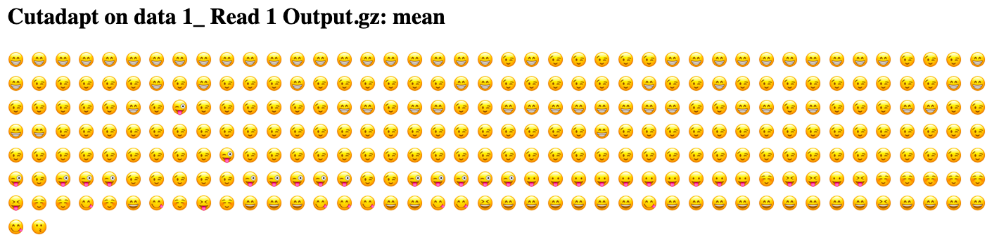
>    >   > 
>    > {: .solution }
> {: .question}
{: .hands_on}

Mit FASTQE konnten wir die Qualität der Basen im Datensatz verbessern.

Wir können auch, oder stattdessen, die qualitätskontrollierten Daten mit FastQC überprüfen.


> <hands-on-title>Überprüfung der Qualität nach dem Trimmen</hands-on-title>
> 
> 1.  mit den folgenden Parametern
>    -  *"Kurze Lesedaten aus Ihrer aktuellen Historie "*: `Cutadapt Read 1 Output`
> 
> 2. Prüfen Sie die generierte HTML-Datei
{: .hands_on}

> <question-title></question-title>
> 1. Sieht die Qualität der Sequenz pro Base besser aus?
> 2. Ist der Adapter weg?
> 
> > <solution-title></solution-title>
> > 1. Ja. Die überwiegende Mehrheit der Basen hat jetzt einen Qualitätswert von über 20. per base sequence quality](../../images/quality-control/per_base_sequence_quality-after.png "Per base sequence quality")
> > 
> > 2. Ja. Jetzt wird kein Adapter erkannt. 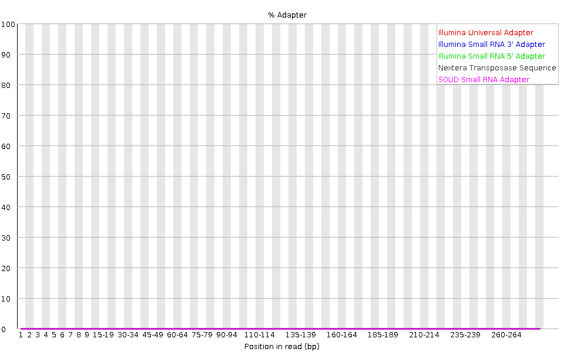
> {: .solution }
{: .question}

Mit FastQC konnten wir die Qualität der Basen im Datensatz verbessern und den Adapter entfernen.

> <details-title>Andere FastQC-Plots nach dem Trimmen</details-title>
> 
> 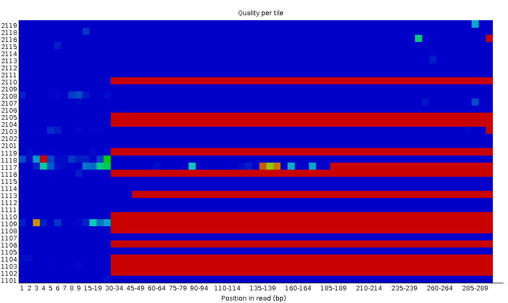 Wir haben einige rote Streifen, da wir diese Regionen aus den Reads herausgeschnitten haben.
> 
> 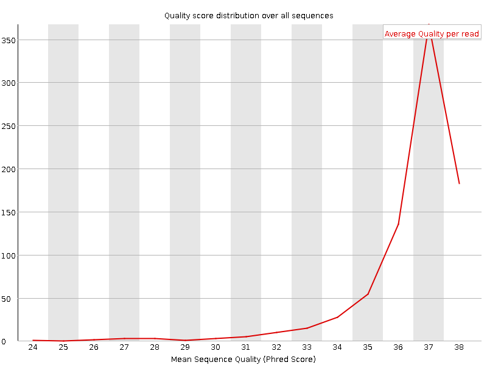 Wir haben jetzt einen Peak hoher Qualität anstelle eines hohen und eines niedrigeren, wie wir ihn vorher hatten.
> 
> 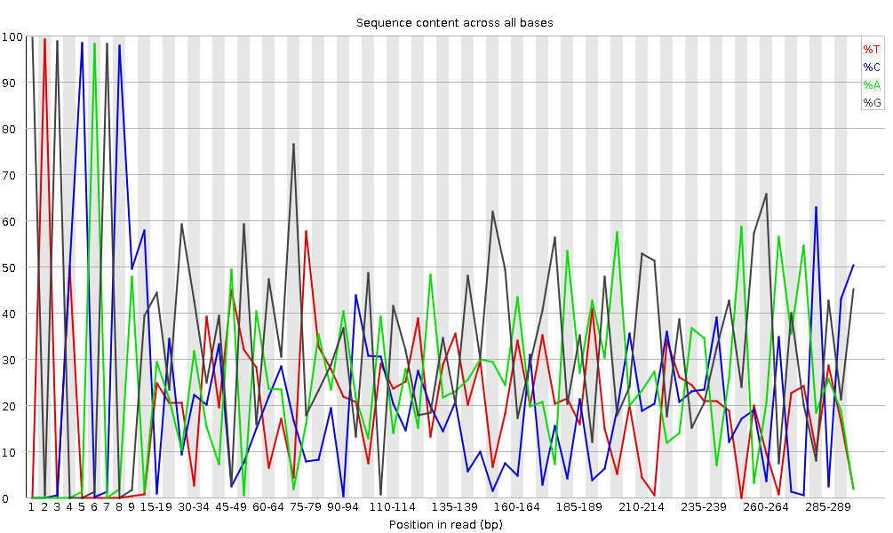 Da es sich um Amplikon-Daten handelt, sind die Basen nicht mehr gleichmäßig vertreten.
> 
> 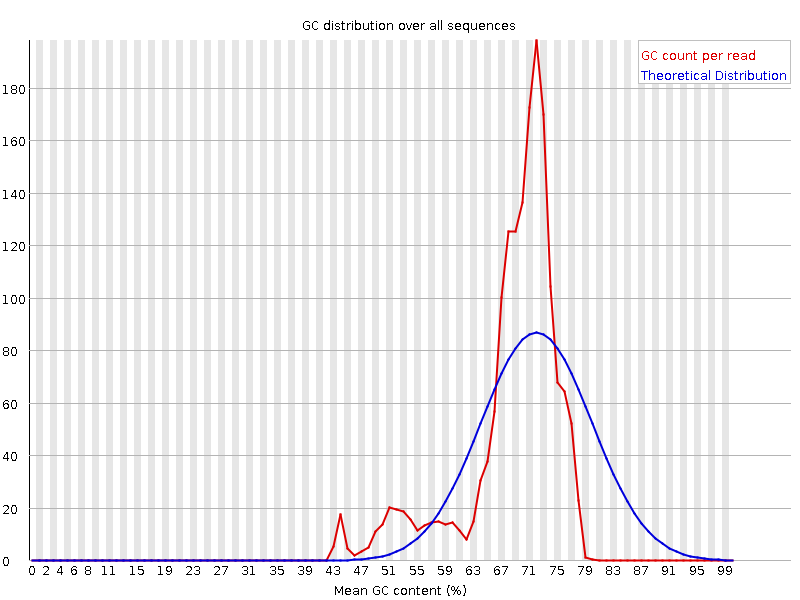 Wir haben jetzt einen einzigen Haupt-GC-Peak aufgrund der Entfernung des Adapters.
> 
> 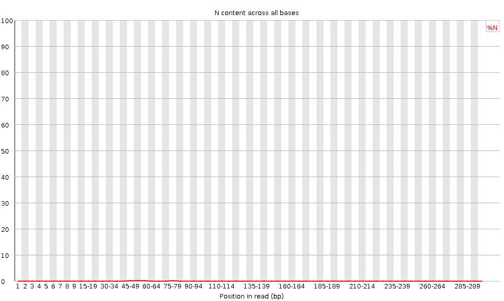 Dies ist dasselbe wie vorher, da wir keine Ns in diesen Reads haben.
> 
> 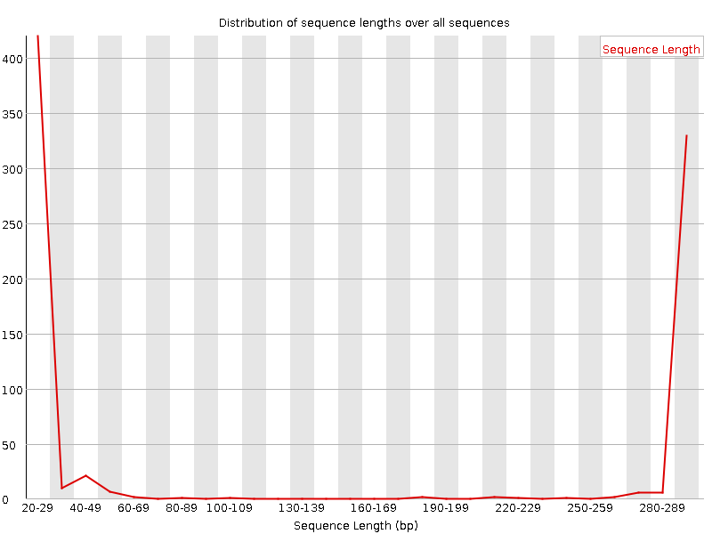 Wir haben jetzt mehrere Peaks und eine Reihe von Längen, anstelle des einzelnen Peaks, den wir vor dem Trimmen hatten, als alle Sequenzen die gleiche Länge hatten.
> 
> 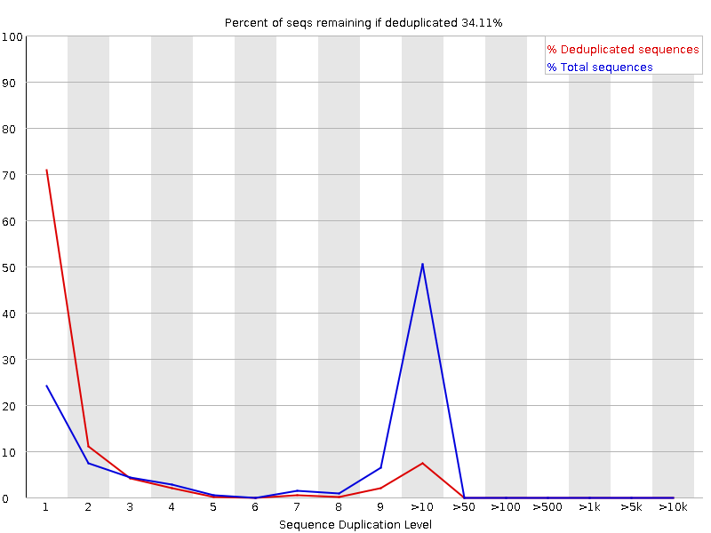
> > <question-title></question-title>
> > 
> > Was entspricht der am stärksten überrepräsentierten Sequenz `GTGTCAGCCGCCGCGGTAGTCCGACGTGG`?
> > 
> > > <solution-title></solution-title> Wenn wir die am stärksten überrepräsentierte Sequenz nehmen
> > > ```
> > > >overrep_seq1_after
> > > GTGTCAGCCGCCGCGGTAGTCCGACGTGG
> > > ```
> > > und [blastn](https://blast.ncbi.nlm.nih.gov/Blast.cgi) gegen die Standard-Nukleotiddatenbank (nr/nt) verwenden, sehen wir, dass die besten Treffer bei 16S rRNA-Genen zu finden sind. Dies ist sinnvoll, da es sich um 16S-Amplikon-Daten handelt, bei denen das 16S-Gen durch PCR amplifiziert wird.
> > {: .solution }
> {: .question}
{: .details}


# Verarbeitung mehrerer Datensätze

## Verarbeitung von Paired-End-Daten

Bei der Paired-End-Sequenzierung werden die Fragmente von beiden Seiten sequenziert. Dieser Ansatz führt zu zwei Reads pro Fragment, wobei der erste Read in Vorwärtsorientierung und der zweite Read in Rückwärtskomplement-Orientierung erfolgt. Mit dieser Technik haben wir den Vorteil, dass wir mehr Informationen über jedes DNA-Fragment erhalten, als wenn wir nur mit Single-End-Sequenzierung sequenzieren:

```
    ------>                       [single-end]

    ----------------------------- [fragment]

    ------>               <------ [paired-end]
```
Der Abstand zwischen den beiden Reads ist bekannt und stellt daher eine zusätzliche Information dar, die die Zuordnung der Reads verbessern kann.

Die Paired-End-Sequenzierung erzeugt 2 FASTQ-Dateien:
- Eine Datei mit den Sequenzen, die der **vorwärts** Orientierung aller Fragmente entsprechen
- Eine Datei mit den Sequenzen, die der **umgekehrten** Orientierung aller Fragmente entsprechen

Normalerweise erkennen wir diese beiden Dateien, die zu einer Probe gehören, an dem Namen, der den gleichen Bezeichner für die Reads, aber eine unterschiedliche Erweiterung hat, z. B. `sampleA_R1.fastq` für die Forward Reads und `sampleA_R2.fastq` für die Reverse Reads. Es kann auch `_f` oder `_1` für die Forward Reads und `_r` oder `_2` für die Reverse Reads sein.

Die Daten, die wir im vorigen Schritt analysiert haben, waren Single-End-Daten, so dass wir einen Paired-End-RNA-seq-Datensatz importieren werden. Wir werden FastQC ausführen und die beiden Berichte mit MultiQC  aggregieren.

> <hands-on-title>Bewertung der Qualität von Paired-End-Reads</hands-on-title>
> 
> 1. Importieren Sie die Paired-End-Reads `GSM461178_untreat_paired_subset_1.fastq` und `GSM461178_untreat_paired_subset_2.fastq` von [Zenodo] (https://zenodo.org/record/61771) oder aus der Datenbibliothek (fragen Sie Ihren Lehrer)
> 
>    ```
>    https://zenodo.org/record/61771/files/GSM461178_untreat_paired_subset_1.fastq
>    https://zenodo.org/record/61771/files/GSM461178_untreat_paired_subset_2.fastq
>    ```
> 
> 2.  mit beiden Datensätzen:
>    -  *"Raw read data from your current history "*: die beiden hochgeladenen Datensätze.
> 
>    
> 
> 3.  mit den folgenden Parametern, um die FastQC-Berichte von Vorwärts- und Rückwärts-Reads zu aggregieren
>      - In *"Ergebnisse "*
>        - *"Mit welchem Tool wurden die Protokolle erstellt? "*: `FastQC`
>        - In *"FastQC output "*
>           - *"Typ der FastQC-Ausgabe? "*: `Raw data`
>           -  *"FastQC-Ausgabe "*: `Raw data`-Dateien (Ausgabe der beiden **FastQC** )
> 
> 4. Prüfen Sie die Webpage-Ausgabe von MultiQC.
{: .hands_on}


> <question-title></question-title>
> 
> 1. Was halten Sie von der Qualität der Sequenzen?
> 2. Was sollten wir tun?
> 
> > <solution-title></solution-title>
> > 
> > 1. Die Qualität der Sequenzen scheint bei den Reverse-Reads schlechter zu sein als bei den Forward-Reads:
> >     - Per Sequence Quality Scores: Verteilung eher links, d. h. eine niedrigere mittlere Qualität der Sequenzen
> >     - Qualität der Sequenz pro Base: weniger glatte Kurve und stärkerer Abfall am Ende mit einem Mittelwert unter 28
> >     - Per Base Sequence Content: stärkere Verzerrung am Anfang und keine klare Unterscheidung zwischen C-G und A-T Gruppen
> > 
> >    Die anderen Indikatoren (Adapter, Duplikationsgrad, etc.) sind ähnlich.
> > 
> > 2. Wir sollten das Ende der Sequenzen abschneiden und sie mit **Cutadapt**  filtern
> {: .solution}
{: .question}

Bei Paired-End-Reads sind die durchschnittlichen Qualitätswerte für Forward-Reads fast immer höher als für Reverse-Reads.

Nach dem Trimmen sind die Reverse-Reads aufgrund ihrer Qualität kürzer und werden während des Filterungsschritts eliminiert. Wenn einer der Reverse-Reads entfernt wird, sollte auch der entsprechende Forward-Read entfernt werden. Andernfalls erhalten wir eine unterschiedliche Anzahl von Reads in beiden Dateien und in unterschiedlicher Reihenfolge, und die Reihenfolge ist für die nächsten Schritte wichtig. Daher **ist es wichtig, die Forward- und Reverse-Reads beim Trimmen und Filtern gemeinsam zu behandeln**.

> <hands-on-title>Verbesserung der Qualität von Paired-End-Daten</hands-on-title>
> 1.  mit den folgenden Parametern
>    - *"Single-end or Paired-end reads? "*: `Paired-end`
>       -  *"FASTQ/A-Datei #1"*: `GSM461178_untreat_paired_subset_1.fastq` (Eingabedatensatz)
>       -  *"FASTQ/A-Datei #2"*: `GSM461178_untreat_paired_subset_2.fastq` (Eingabedatensatz)
> 
>         Die Reihenfolge ist hier wichtig!
> 
>       - In *Read 1 Adapters* oder *Read 2 Adapters*
> 
>         In diesen Datensätzen wurden keine Adapter gefunden. Wenn Sie Ihre eigenen Daten verarbeiten und wissen, welche Adaptersequenzen bei der Bibliotheksvorbereitung verwendet wurden, sollten Sie die Sequenzen hier angeben.
> 
>    - In *"Other Read Trimming Options "*
>       - *"Quality cutoff(s) (R1) "*: `20`
>    - In *"Read Filtering Options "*
>       - *"Mindestlänge (R1) "*: `20`
>    -  *"Zusätzliche zu erzeugende Ausgaben "*: `Report`
> 
> 2. Prüfen Sie die erzeugte txt-Datei (`Report`)
> 
>    > <question-title></question-title>
>    > 
>    > 1. Wie viele Basenpaare wurden aufgrund schlechter Qualität aus den Reads entfernt?
>    > 2. Wie viele Sequenzpaare wurden entfernt, weil sie zu kurz waren?
>    > 
>    > > <solution-title></solution-title>
>    > > 1. 44.164 bp (`Quality-trimmed:`) für die Forward Reads und 138.638 bp für die Reverse Reads.
>    > > 2. 1.376 Sequenzen wurden entfernt, weil mindestens ein Read kürzer als der Längen-Cutoff war (322, wenn nur die Forward Reads analysiert wurden).
> > {: .solution }
> {: .question}
{: .hands_on}

Zusätzlich zu dem Bericht erzeugt Cutadapt 2 Dateien:
- Read 1 mit den getrimmten und gefilterten Forward Reads
- Read 2 mit den beschnittenen und gefilterten Reverse Reads

Diese Datensätze können für die nachgelagerte Analyse, z. B. für das Mapping, verwendet werden.

> <question-title></question-title>
> 
> 1. Welche Art von Alignment wird für die Suche nach Adaptern in Reads verwendet?
> 2. Welches ist das Kriterium für die Auswahl des besten Adapter-Alignments?
> 
> > <solution-title></solution-title>
> > 
> > 1. Semiglobales Alignment, d. h. nur der sich überlappende Teil der Lesung und der Adaptersequenz wird für die Auswertung verwendet.
> > 2. Es wird ein Alignment mit maximaler Überlappung berechnet, das die geringste Anzahl von Mismatches und Indels aufweist.
> {: .solution}
{: .question}

# Bewertung der Qualität mit Nanoplot - nur lange Reads

Bei langen Reads können wir die Sequenzqualität mit [Nanoplot](https://github.com/wdecoster/NanoPlot/) () überprüfen. Es bietet grundlegende Statistiken mit schönen Diagrammen für einen schnellen Überblick über die Qualitätskontrolle.

> <hands-on-title>Qualitätsprüfung von langen Reads</hands-on-title>
> 1. Erstellen Sie einen neuen Verlauf für diesen Teil und geben Sie ihm einen passenden Namen
> 
> 2. Importieren Sie die PacBio HiFi-Reads `m64011_190830_220126.Q20.subsample.fastq.gz` von [Zenodo](https://zenodo.org/record/5730295)
> 
>    ```
>    https://zenodo.org/records/5730295/files/m64011_190830_220126.Q20.subsample.fastq.gz
>    ```
> 
> 3.  mit den folgenden Parametern
>    -  *"files "*: `m64011_190830_220126.Q20.subsample.fastq.gz`
>    - *"Optionen für die Anpassung der erstellten Diagramme "*
>        -  *"Geben Sie das bivariate Format der Diagramme an. "*: `dot`, `kde`
>        -  *"Zeigt die N50-Markierung im Leselängenhistogramm an. "*: `Yes`
> 
> 4. Prüfen Sie die generierte HTML-Datei
{: .hands_on}

> <question-title></question-title>
> 
> Was ist der mittlere Qscore?
> 
> > <solution-title></solution-title> Der Qscore liegt bei Q32. Im Falle von PacBio CLR und Nanopore liegt er bei Q12 und bei Illumina (NovaSeq 6000) nahe bei Q31. plot of Qscore between Illumina, PacBio and Nanopore](../../images/quality-control/qscore-illumina-pacbio-nanopore.png "Comparison of Qscore between Illumina, PacBio and Nanopore")
> > 
> > Definition: Qscores ist die durchschnittliche Fehlerwahrscheinlichkeit pro Base, ausgedrückt auf der log (Phred)-Skala
> {: .solution }
> 
> Was ist der Median, Mittelwert und N50?
> > <solution-title></solution-title> Der Median, die mittlere Leselänge und auch N50 liegen nahe bei 18.000bp. Bei PacBio HiFi-Reads liegt die Mehrheit der Reads im Allgemeinen in der Nähe dieses Wertes, da die Bibliotheksvorbereitung einen Schritt zur Größenauswahl umfasst. Bei anderen Technologien wie PacBio CLR und Nanopore ist der Wert größer und hängt hauptsächlich von der Qualität Ihrer DNA-Extraktion ab.
> {: .solution }
{: .question}

## Histogramm der Leselängen

Diese Grafik zeigt die Verteilung der Fragmentgrößen in der analysierten Datei. Im Gegensatz zu den meisten Illumina-Läufen haben lange Reads eine variable Länge, und dies zeigt die relativen Mengen der einzelnen Sequenzfragmente unterschiedlicher Größe. In diesem Beispiel ist die Verteilung der Leselänge in der Nähe von 18kbp zentriert, aber die Ergebnisse können je nach Experiment sehr unterschiedlich sein.

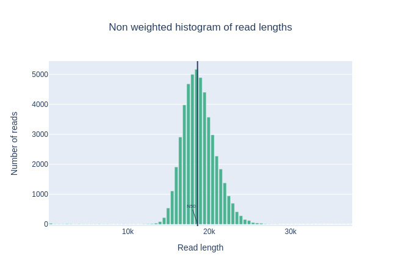

## Darstellung der Leselängen im Vergleich zur durchschnittlichen Lesequalität mit Punkten

Diese Darstellung zeigt die Verteilung der Fragmentgrößen entsprechend dem Qscore in der analysierten Datei. Im Allgemeinen gibt es keinen Zusammenhang zwischen Leselänge und Lesequalität, aber diese Darstellung ermöglicht es, beide Informationen in einem einzigen Diagramm zu visualisieren und mögliche Abweichungen zu erkennen. In Läufen mit vielen kurzen Reads sind die kürzeren Reads manchmal von geringerer Qualität als der Rest.

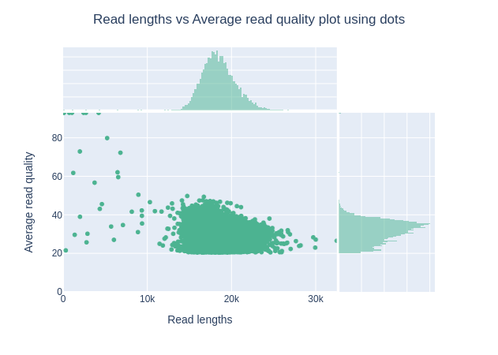

> <question-title></question-title> Betrachten Sie "Read lengths vs Average read quality plot using dots plot". Ist Ihnen beim Qscore etwas Ungewöhnliches aufgefallen? Können Sie das erklären?
> > <solution-title></solution-title> Es gibt keine Reads unter Q20. Die Qualifikation für HiFi-Reads lautet:
> > - Eine minimale Anzahl von 3 Subreads
> > - A read Qscore >=20 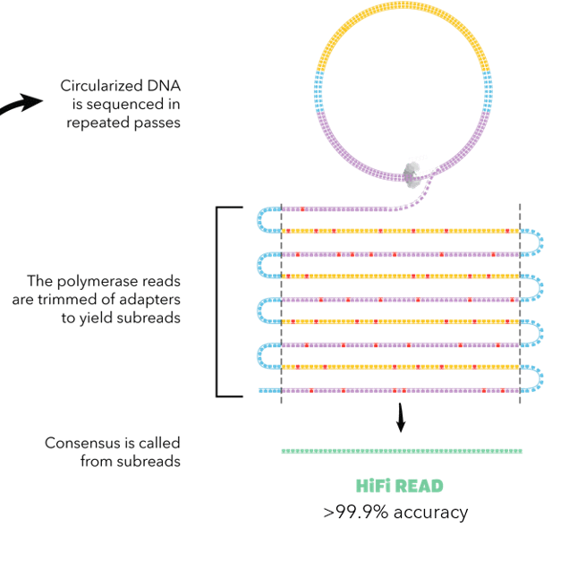
> {: .solution }
{: .question}

> <comment-title>Try it on!</comment-title> Führen Sie die Qualitätskontrolle mit **FastQC**  auf `m64011_190830_220126.Q20.subsample.fastq.gz` durch und vergleichen Sie die Ergebnisse!
{: .comment}

# Bewertung der Qualität mit PycoQC - nur Nanopore

[PycoQC](https://github.com/tleonardi/pycoQC) () ist ein Datenvisualisierungs- und Qualitätskontrollwerkzeug für Nanopore-Daten. Im Gegensatz zu FastQC/Nanoplot benötigt es eine spezifische sequencing_summary.txt Datei, die von Oxford Nanopore Basecallern wie Guppy oder dem älteren Albacore Basecaller generiert wird.

Eine der Stärken von PycoQC ist, dass es interaktiv und in hohem Maße anpassbar ist, z. B. können Plots beschnitten werden, man kann hinein- und herauszoomen, Bereiche unterwählen und Zahlen exportieren.

> <hands-on-title>Qualitätsprüfung von Nanopore-Reads</hands-on-title>
> 1. Erstellen Sie einen neuen Verlauf für diesen Teil und geben Sie ihm einen passenden Namen
> 
> 2. Import der Nanopore-Reads `nanopore_basecalled-guppy.fastq.gz` und `sequencing_summary.txt` von [Zenodo](https://zenodo.org/record/5730295)
> 
>    ```
>    https://zenodo.org/records/5730295/files/nanopore_basecalled-guppy.fastq.gz
>    https://zenodo.org/records/5730295/files/sequencing_summary.txt
>    ```
> 
> 3.  mit den folgenden Parametern
> 
>    -  *"Eine Sequenzierungs_Zusammenfassungsdatei "*: `sequencing_summary.txt`
> 
> 4. Prüfen Sie die Webpage-Ausgabe von PycoQC
{: .hands_on}

> <question-title></question-title>
> 
> Wie viele Reads haben Sie insgesamt?
> > <solution-title></solution-title> ~270k Reads insgesamt (siehe Basecall-Zusammenfassungstabelle "Alle Reads") Bei den meisten Basecalling-Profilen stuft Guppy die Reads als "Pass" ein, wenn der Qscore der Reads mindestens gleich 7 ist.
> {: .solution }
> 
> Was ist der Median, das Minimum und das Maximum der Leselänge, was ist der N50?
> > <solution-title></solution-title> Die mediane Leselänge und der N50-Wert können für alle sowie für alle bestandenen Reads, d. h. für Reads, die die Guppy-Qualitätseinstellungen (Qscore >= 7) bestanden haben, in der Basecall-Zusammenfassungstabelle gefunden werden. Für die minimale (195bp) und maximale (256kbp) Leselänge kann sie mit dem Leselängenplot ermittelt werden.
> {: .solution }
{: .question}

## Länge der basisabgerufenen Reads

Wie bei FastQC und Nanoplot zeigt diese Darstellung die Verteilung der Fragmentgrößen in der analysierten Datei. Wie bei PacBio CLR/HiFi haben lange Reads eine variable Länge, und dies zeigt die relativen Mengen der einzelnen Sequenzfragmente unterschiedlicher Größe. In diesem Beispiel ist die Verteilung der Leselänge recht breit gestreut mit einer minimalen Leselänge für die übergebenen Reads um 200bp und einer maximalen Länge von ~150.000bp.

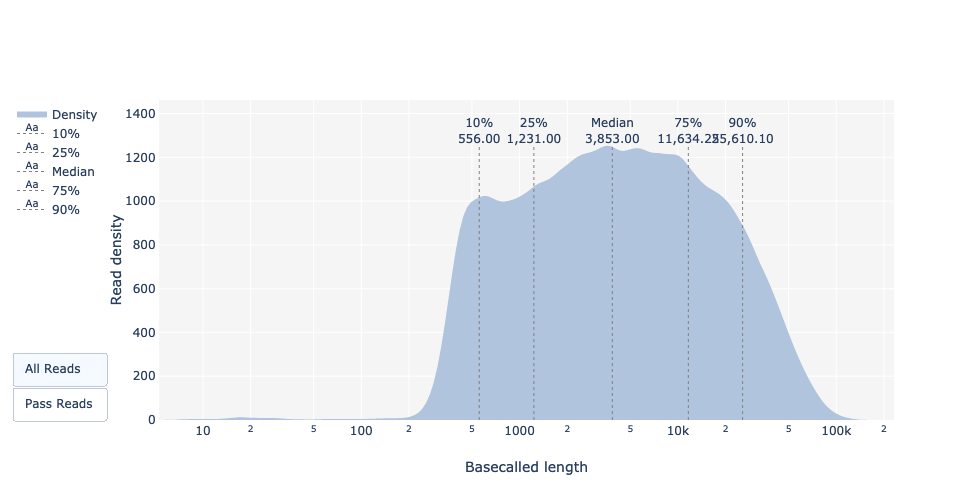

### Basecalled reads PHRED quality

Diese Grafik zeigt die Verteilung der Q-Scores (Q) für jeden Read. Dieser Wert soll eine globale Qualitätsbewertung für jeden Read liefern. Die genaue Definition von Qscores ist: die durchschnittliche Fehlerwahrscheinlichkeit pro Base, ausgedrückt auf der log (Phred) Skala. Bei Nanopore-Daten liegt die Verteilung in der Regel um 10 oder 12 herum. Bei alten Läufen kann die Verteilung niedriger sein, da die Basecalling-Modelle weniger genau sind als neuere Modelle.

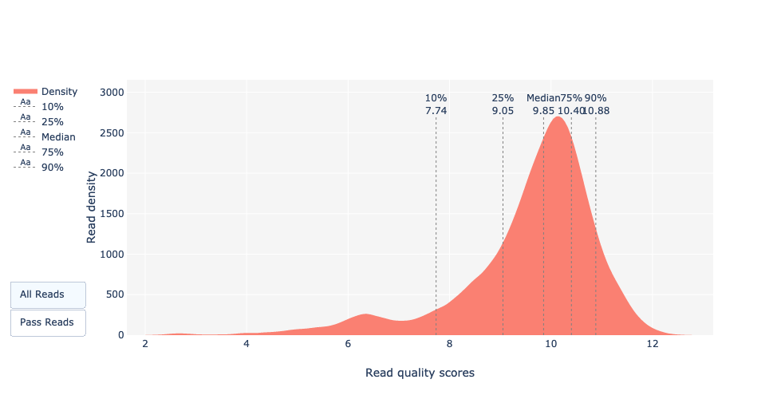

## Länge der Basecalled Reads vs. Reads PHRED-Qualität

> <question-title></question-title> Wie sehen die mittlere Qualität und die Qualitätsverteilung des Laufs aus?
> > <solution-title></solution-title> Die Mehrheit der Reads hat einen Qscore zwischen 8 und 11, was für Nanopore-Daten Standard ist. Beachten Sie, dass für dieselben Daten der verwendete Basecaller (Albacor, Guppy, Bonito), das Modell (fast, hac, sup) und die Toolversion unterschiedliche Ergebnisse liefern können.
> {: .solution }
{: .question}

Wie bei NanoPlot bietet diese Darstellung eine 2D-Visualisierung des Read-QScores in Abhängigkeit von der Länge.

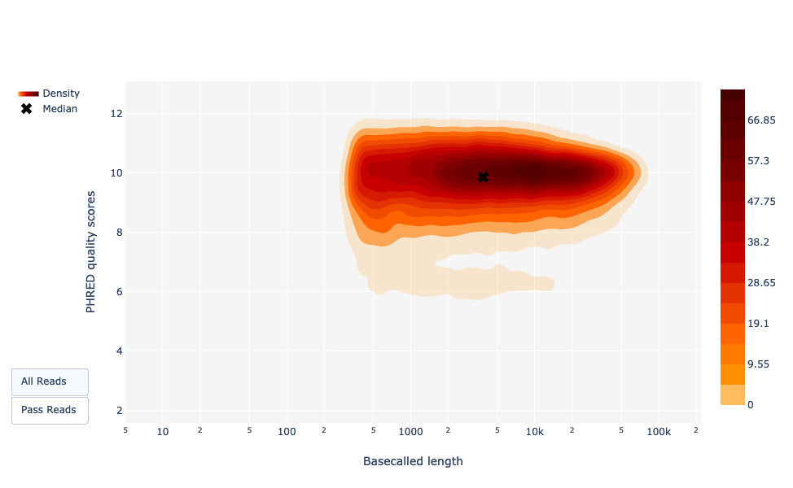

## Ausgabe über die Experimentierzeit

Diese Darstellung gibt Auskunft über die sequenzierten Reads über die Zeit für einen einzelnen Lauf:

- Jedes Bild zeigt eine neue Ladung der Fließzelle an (3 + die erste Ladung).
- Der Anteil an den gesamten Reads für jedes "Tanken".
- Die Produktion von Reads nimmt mit der Zeit ab:
  - Der größte Teil des Materials (DNA/RNA) ist sequenziert
  - Sättigung der Poren
  - Material-/Porendegradation
  - ...

In diesem Beispiel ist der Beitrag jeder Betankung sehr gering, und es kann als schlechter Lauf betrachtet werden. Der "Cummulative"-Plotbereich (hellblau) zeigt an, dass 50 % aller Reads und fast 50 % aller Basen in den ersten 5 Stunden des 25-Stunden-Experiments produziert wurden. Obwohl es normal ist, dass die Ausbeute mit der Zeit abnimmt, ist ein derartiger Rückgang kein gutes Zeichen.

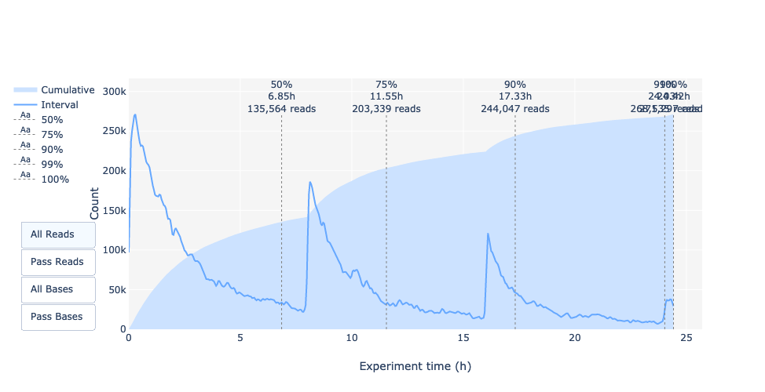

> <details-title>Sonstiges Profil "Output über die Experimentierzeit"</details-title>
> 
> In diesem Beispiel nahm die Datenproduktion im Laufe der 12 Stunden nur geringfügig ab, während die kumulativen Daten kontinuierlich zunahmen. Das Fehlen einer abfallenden Kurve am Ende des Laufs deutet darauf hin, dass sich noch biologisches Material auf der Fließzelle befindet. Der Lauf wurde beendet, bevor alles sequenziert war. Es ist ein ausgezeichneter Lauf, der sogar als außergewöhnlich bezeichnet werden kann.
> 
> 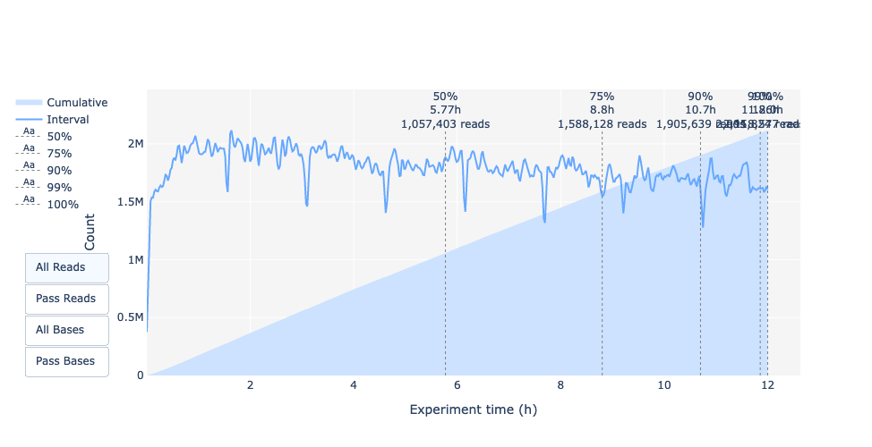
{: .details}

### Leselänge über die Experimentierzeit

> <question-title></question-title> Hat sich die Leselänge im Laufe der Zeit verändert? Was könnte der Grund dafür sein?
> > <solution-title></solution-title> Im vorliegenden Beispiel nimmt die Leselänge mit der Zeit des Sequenzierungslaufs zu. Eine Erklärung dafür ist, dass die Adapterdichte bei vielen kurzen Fragmenten höher ist und daher die Chance, dass sich ein kürzeres Fragment an eine Pore anlagert, größer ist. Außerdem bewegen sich kürzere Moleküle möglicherweise schneller über den Chip. Mit der Zeit werden die kürzeren Fragmente jedoch seltener, so dass mehr lange Fragmente an den Poren haften und sequenziert werden.
> {: .solution }
{: .question}

Die Leselänge über die Experimentierzeit sollte stabil sein. Sie kann im Laufe der Zeit leicht ansteigen, da kurze Fragmente zu Beginn übersequenziert werden und im Laufe der Zeit weniger vorhanden sind.

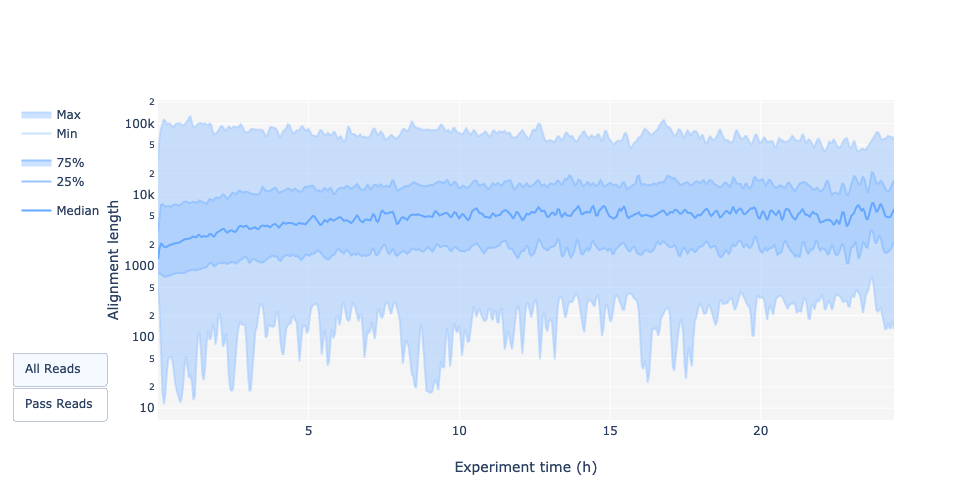

## Kanalaktivität im Zeitverlauf

Es gibt einen Überblick über die verfügbaren Poren, die Porenauslastung während des Experiments, die inaktiven Poren und zeigt, ob die Fließzelle gut ausgelastet ist (fast alle Poren werden genutzt). In diesem Fall ist die große Mehrheit der Kanäle/Poren während des gesamten Sequenzierungslaufs inaktiv (weiß), so dass der Lauf als schlecht eingestuft werden kann.

Man hofft auf eine Darstellung, die in der Nähe der X-Achse dunkel ist und bei höheren Y-Werten (mit zunehmender Zeit) nicht zu hell/weiß wird. Je nachdem, ob Sie links "Reads" oder "Basen" auswählen, zeigt die Farbe entweder die Anzahl der Basen oder der Reads pro Zeitintervall an

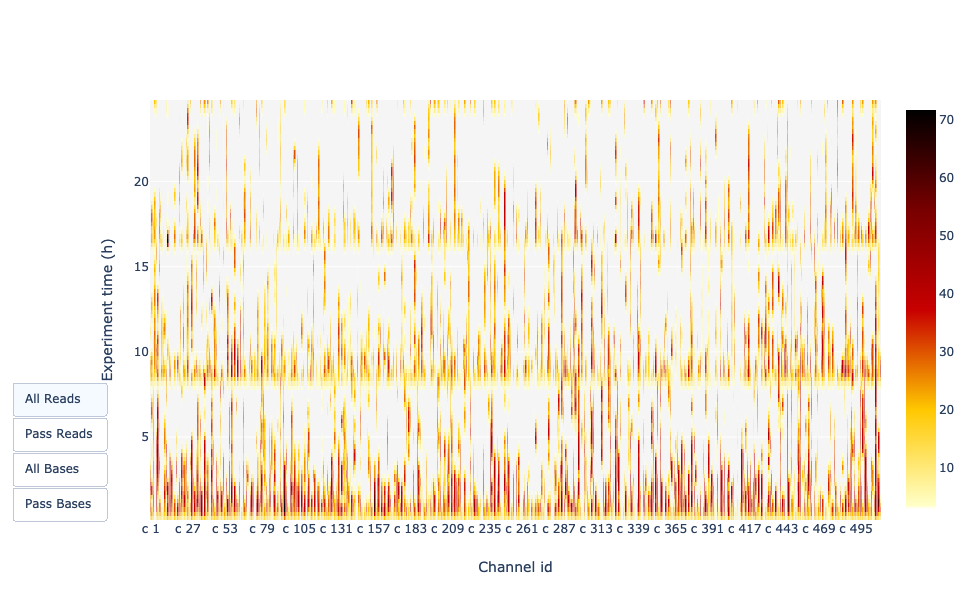

> <details-title>Sonstiges Profil "Kanalaktivität über die Zeit"</details-title>
> 
> In diesem Beispiel sind fast alle Poren während des gesamten Laufs aktiv (gelbes/rotes Profil), was auf einen ausgezeichneten Lauf hinweist.
> 
> 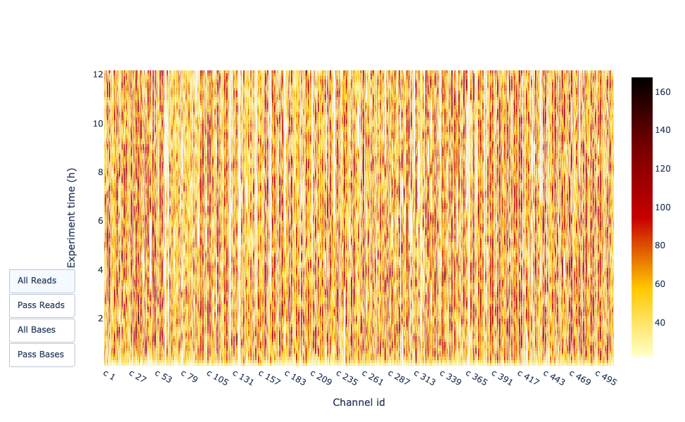
{: .details}


> <comment-title>Try it out!</comment-title> Führen Sie die Qualitätskontrolle mit **FastQC**  und/oder **Nanoplot**  auf `nanopore_basecalled-guppy.fastq.gz` durch und vergleichen Sie die Ergebnisse!
{: .comment}

# Schlussfolgerung


In diesem Lernprogramm haben wir die Qualität der FASTQ-Dateien überprüft, um sicherzustellen, dass die Daten gut aussehen, bevor wir weitere Informationen ableiten. Dieser Schritt ist der übliche erste Schritt für Analysen wie RNA-Seq, ChIP-Seq oder andere OMIC-Analysen, die auf NGS-Daten beruhen. Die Schritte der Qualitätskontrolle sind für jede Art von Sequenzierungsdaten ähnlich:

- Qualitätsbewertung mit Tools wie:
  - *Short Reads*: 
  - *Kurz+Lang*: 
  - *Long Reads*: 
  - *Nur Nanopore*: 
- Trimmen und Filtern nach **kurzen Reads** mit einem Tool wie **Cutadapt** 
