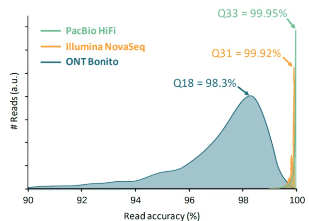

Durante la secuenciación, el secuenciador determina las bases nucleotídicas de una muestra de ADN o ARN (biblioteca). Para cada fragmento de la biblioteca se genera una secuencia, también llamada **lectura**, que no es más que una sucesión de nucleótidos.

Las tecnologías modernas de secuenciación pueden generar un gran número de lecturas de secuencias en un solo experimento. Sin embargo, ninguna tecnología de secuenciación es perfecta, y cada instrumento generará diferentes tipos y cantidad de errores, como la llamada incorrecta de nucleótidos. Estas bases mal llamadas se deben a las limitaciones técnicas de cada plataforma de secuenciación.

Por lo tanto, es necesario comprender, identificar y excluir los tipos de error que pueden afectar a la interpretación de los análisis posteriores. El control de calidad de la secuencia es, por tanto, un primer paso esencial en su análisis. Detectar los errores a tiempo ahorra tiempo más adelante.

> <agenda-title></agenda-title>
> 
> En este tutorial, nos ocuparemos de:
> 
> 1. TOC
> {:toc}
> 
{: .agenda}

# Inspeccionar un archivo de secuencia sin procesar

> <hands-on-title>Carga de datos</hands-on-title>
> 
> 1. Crea un nuevo historial para este tutorial y dale un nombre apropiado
> 
>    
> 
>    
> 
> 2. Importe el archivo `female_oral2.fastq-4143.gz` de [Zenodo](https://zenodo.org/record/3977236) o de la biblioteca de datos (pregunte a su instructor) Esta es una muestra de microbioma de una serpiente .
> 
>    ```
>    https://zenodo.org/record/3977236/files/female_oral2.fastq-4143.gz
>    ```
> 
>    
> 
>    
> 
> 3. Cambie el nombre del conjunto de datos importado a `Reads`.
> 
{: .hands_on}

Acabamos de importar un archivo a Galaxy. Este archivo es similar a los datos que podríamos obtener directamente de una instalación de secuenciación: un [archivo FASTQ](https://en.wikipedia.org/wiki/FASTQ_format).

> <hands-on-title>Inspeccione el archivo FASTQ</hands-on-title>
> 
> 1. Inspeccione el archivo haciendo clic en el  (ojo)
> 
{: .hands_on}

Aunque parece complicado (y puede que lo sea), el formato FASTQ es fácil de entender con un poco de decodificación.

Cada lectura, que representa un fragmento de la biblioteca, está codificada por 4 líneas:

| Line | Description                                                                                                                                                        |
| ---- | ------------------------------------------------------------------------------------------------------------------------------------------------------------------ |
| 1    | Empieza siempre con un `@` seguido de la información de la lecture                                                                                                  |
| 2    | La secuenciación de nucleótidos                                                                                                                                       |
| 3    |Empieza siempre con un `+` y contiene a veces la misma información qu ela línea 1                                                                                             |
| 4    | Contiene una cadena de caracteres que representa las puntuaciones de calidad asociadas a cada base de la secuencia nucleotídica; debe tener el mismo número de caracteres que la línea 2. |

Así, por ejemplo, la primera secuencia en nuestro archivo es:

```
@M00970:337:000000000-BR5KF:1:1102:17745:1557 1:N:0:CGCAGAAC+ACAGAGTT
GTGCCAGCCGCCGCGGTAGTCCGACGTGGCTGTCTCTTATACACATCTCCGAGCCCACGAGACCGAAGAACATCTCGTATGCCGTCTTCTGCTTGAAAAAAAAAAAAAAAAAAAACAAAAAAAAAAAAAGAAGCAAATGACGATTCAAGAAAGAAAAAAACACAGAATACTAACAATAAGTCATAAACATCATCAACATAAAAAAGGAAATACACTTACAACACATATCAATATCTAAAATAAATGATCAGCACACAACATGACGATTACCACACATGTGTACTACAAGTCAACTA
+
GGGGGGGGGGGGGGGGGGGGGGGGGGGGGGGGGGGGGGGGGGGGGGGGGGGGGGGGGGGGGFGGGFGGGGGGAFFGGFGGGGGGGGFGGGGGGGGGGGGGGFGGG+38+35*311*6,,31=******441+++0+0++0+*1*2++2++0*+*2*02*/***1*+++0+0++38++00++++++++++0+0+2++*+*+*+*+*****+0**+0**+***+)*.***1**//*)***)/)*)))*)))*),)0(((-((((-.(4(,,))).,(())))))).)))))))-))-(
```

Significa que el fragmento llamado `@M00970` corresponde a la secuencia de ADN `GTGCCAGCCGCCGCGGTAGTCCGACGTGGCTGTCTCTTATACACATCTCCGAGCCCACGAGACCGAAGAACATCTCGTATGCCGTCTTCTGCTTGAAAAAAAAAAAAAAAAAAAACAAAAAAAAAAAAAGAAGCAAATGACGATTCAAGAAAGAAAAAAACACAGAATACTAACAATAAGTCATAAACATCATCAACATAAAAAAGGAAATACACTTACAACACATATCAATATCTAAAATAAATGATCAGCACACAACATGACGATTACCACACATGTGTACTACAAGTCAACTA` y esta secuencia ha sido secuenciada con una calidad `GGGGGGGGGGGGGGGGGGGGGGGGGGGGGGGGGGGGGGGGGGGGGGGGGGGGGGGGGGGGGFGGGFGGGGGGAFFGGFGGGGGGGGFGGGGGGGGGGGGGGFGGG+38+35*311*6,,31=******441+++0+0++0+*1*2++2++0*+*2*02*/***1*+++0+0++38++00++++++++++0+0+2++*+*+*+*+*****+0**+0**+***+)*.***1**//*)***)/)*)))*)))*),)0(((-((((-.(4(,,))).,(())))))).)))))))-))-(`.



> <question-title></question-title>
> 
> 1. ¿Qué carácter ASCII corresponde a la peor puntuación Phred para Illumina 1.8+?
> 2. ¿Cuál es la puntuación de calidad Phred del 3er nucleótido de la 1ª secuencia?
> 3. ¿Cómo calcular la precisión de la base de nucleótidos con el código ASCII `/`?
> 4. ¿Cuál es la precisión de este 3er nucleótido?
> 
> > <solution-title></solution-title>
> > 1. La peor puntuación Phred es la más pequeña, por lo tanto 0. Para Illumina 1.8+, corresponde al carácter `!`.
> > 2. El 3er nucleótido de la 1ª secuencia tiene un carácter ASCII `G`, que corresponde a una puntuación de 38.
> > 3. Se puede calcular de la siguiente manera:
> >    - El código ASCII para `/` es 47
> >    - Puntuación de calidad = 47-33=14
> >    - Fórmula para hallar la probabilidad de error: \\(P = 10^-Q/10})
> >    - Probabilidad de error = \\(10^{-14/10}\\\) = 0.03981
> >    - Por lo tanto Exactitud = 100 - 0.03981 = 99.96%
> > 4. El nucleótido correspondiente `G` tiene una precisión de casi el 99,96%
> > 
> {: .solution }
> 
{: .question}

> <comment-title></comment-title> El lllumina actual (1.8+) utiliza el formato Sanger (Phred+33). Si está trabajando con conjuntos de datos más antiguos puede encontrarse con los esquemas de puntuación más antiguos. **FastQC** , una herramienta que utilizaremos más adelante en este tutorial, se puede utilizar para tratar de determinar qué tipo de codificación de calidad se utiliza (a través de la evaluación de la gama de valores Phred visto en el FASTQ).
> 
{: .comment}

Al mirar el archivo en Galaxy, parece que la mayoría de los nucleótidos tienen una puntuación alta (`G` correspondiente a una puntuación 38). ¿Es esto cierto para todas las secuencias? ¿Y a lo largo de toda la secuencia?


# Evaluar la calidad con FASTQE 🧬😎 - sólo lecturas cortas

Para echar un vistazo a la calidad de la secuencia a lo largo de todas las secuencias, podemos utilizar [FASTQE](https://fastqe.com/). Es una herramienta de código abierto que proporciona una forma sencilla y divertida de controlar la calidad de los datos de secuencias en bruto e imprimirlos como emoji. Puede utilizarla para hacerse una idea rápida de si sus datos presentan algún problema del que deba ser consciente antes de realizar cualquier otro análisis.

> <hands-on-title>Comprobación de calidad</hands-on-title>
> 
> 1.  con los siguientes parámetros
>    -  *"FastQ data "*: `Reads`
>    -  *"Tipos de puntuación a mostrar "*: `Mean`
> 
> 2. Inspeccione el archivo HTML generado
> 
{: .hands_on}

En lugar de analizar las puntuaciones de calidad de cada lectura individual, FASTQE analiza la calidad de forma colectiva en todas las lecturas de una muestra y puede calcular la media de cada posición de nucleótido a lo largo de la longitud de las lecturas. A continuación se muestran los valores medios de este conjunto de datos.


Puede ver la puntuación de cada [emoji en la documentación de fastqe](https://github.com/fastqe/fastqe#scale). Los emojis de abajo, con puntuaciones Phred inferiores a 20, son los que esperamos no ver mucho.

| Phred Quality Score | ASCII code | Emoji |
| ------------------- | ---------- | ----- |
| 0                   | !          | 🚫     |
| 1                   | "          | ❌     |
| 2                   | #          | 👺     |
| 3                   | $          | 💔     |
| 4                   | %          | 🙅     |
| 5                   | &          | 👾     |
| 6                   | '          | 👿     |
| 7                   | (          | 💀     |
| 8                   | )          | 👻     |
| 9                   | *          | 🙈     |
| 10                  | +          | 🙉     |
| 11                  | ,          | 🙊     |
| 12                  | -          | 🐵     |
| 13                  | .          | 😿     |
| 14                  | /          | 😾     |
| 15                  | 0          | 🙀     |
| 16                  | 1          | 💣     |
| 17                  | 2          | 🔥     |
| 18                  | 3          | 😡     |
| 19                  | 4          | 💩     |


> <question-title></question-title>
> 
> ¿Cuál es la puntuación media más baja en este conjunto de datos?
> 
> > <solution-title></solution-title> La puntuación más baja en este conjunto de datos es 😿 13.
> > 
> {: .solution }
> 
{: .question}


# Evaluar la calidad con FastQC - lecturas cortas y largas

Una forma adicional o alternativa de comprobar la calidad de la secuencia es con [FastQC](https://www.bioinformatics.babraham.ac.uk/projects/fastqc/). Proporciona un conjunto modular de análisis que podemos utilizar para comprobar si nuestros datos tienen algún problema del que debamos ser conscientes antes de realizar cualquier otro análisis. Podemos utilizarlo, por ejemplo, para evaluar si hay adaptadores conocidos presentes en los datos. Lo ejecutaremos en el archivo FASTQ

> <hands-on-title>Comprobación de calidad</hands-on-title>
> 
> 1.  con los siguientes parámetros
>    -  *"Datos de lectura crudos de su historia actual "*: `Reads`
> 
> 2. Inspeccione el archivo HTML generado
> 
{: .hands_on}

> <question-title></question-title>
> 
> ¿Qué codificación Phred se utiliza en el archivo FASTQ para estas secuencias?
> 
> > <solution-title></solution-title> Las puntuaciones Phred se codifican utilizando `Sanger / Illumina 1.9` (`Encoding` en la tabla superior).
> > 
> {: .solution }
> 
{: .question}

## Calidad de la secuencia por base

Con FastQC podemos utilizar el gráfico de calidad de secuencia por base para comprobar la calidad de base de las lecturas, de forma similar a lo que hicimos con FASTQE.


En el eje x se muestra la posición de la base en la lectura. En este ejemplo, la muestra contiene lecturas de hasta 296bp de longitud.

> <details-title>Eje x no uniforme</details-title>
> 
> El eje x no siempre es uniforme. Cuando se tienen lecturas largas, se aplica cierto binning para mantener las cosas compactas. Podemos verlo en nuestra muestra. Comienza con 1-10 bases individuales. Después, las bases se agrupan en una ventana de un cierto número de bases de ancho. Agrupar datos significa agrupar y es una técnica de preprocesamiento de datos utilizada para reducir los efectos de pequeños errores de observación. El número de posiciones de bases agrupadas depende de la longitud de la lectura. Con lecturas de más de 50bp, la última parte del gráfico mostrará estadísticas agregadas para ventanas de 5bp. Las lecturas más cortas tendrán ventanas más pequeñas y las más largas ventanas más grandes. El agrupamiento puede eliminarse al ejecutar FastQC estableciendo el parámetro "Disable grouping of bases for reads >50bp" en Yes.
> 
{: .details}

Para cada posición, se dibuja un boxplot con:

- el valor mediano, representado por la línea roja central
- el rango intercuartílico (25-75%), representado por el recuadro amarillo
- los valores 10% y 90% en los bigotes superior e inferior
- la calidad media, representada por la línea azul

El eje y muestra las puntuaciones de calidad. Cuanto más alta es la puntuación, mejor es la llamada de la base. El fondo del gráfico divide el eje y en puntuaciones de muy buena calidad (verde), puntuaciones de calidad razonable (naranja) y lecturas de mala calidad (rojo).

Es normal en todos los secuenciadores Illumina que la mediana de la puntuación de calidad comience siendo más baja en las primeras 5-7 bases y luego aumente. La calidad de las lecturas en la mayoría de las plataformas disminuirá al final de la lectura. Esto se debe a menudo a la decadencia de la señal o al desfase durante el proceso de secuenciación. Los recientes avances en la química aplicada a la secuenciación han mejorado algo este aspecto, pero las lecturas son ahora más largas que nunca.


> <details-title>Deterioro de la señal y desfase</details-title>
> 
> - Decaimiento de la señal
> 
> La intensidad de la señal fluorescente decae con cada ciclo del proceso de secuenciación. Debido a la degradación de los fluoróforos, una proporción de las hebras del cluster no se está elongando. La proporción de la señal que se emite sigue disminuyendo con cada ciclo, lo que produce una disminución de las puntuaciones de calidad en el extremo 3' de la lectura.
> 
> - Fases
> 
> La señal empieza a difuminarse con el aumento del número de ciclos porque el cluster pierde sincronicidad. A medida que avanzan los ciclos, en algunas hebras se producen fallos aleatorios de nucleótidos a incorporar debido a:
> 
>  - Eliminación incompleta de los terminadores 3' y fluoróforos
>  - Incorporación de nucleótidos sin terminadores 3' efectivos
> 
> Esto conduce a una disminución de las puntuaciones de calidad en el extremo 3' de la lectura.
> 
{: .details}


> <details-title>Otros perfiles de calidad de secuencia</details-title>
> 
> Estos son algunos perfiles de calidad de secuencias por base que pueden indicar problemas con la secuenciación.
> 
> - Sobreagrupamiento
> 
>   Las instalaciones de secuenciación pueden agrupar en exceso las celdas de flujo. El resultado son pequeñas distancias entre los clusters y un solapamiento de las señales. Dos clusters pueden interpretarse como un único cluster, detectándose señales fluorescentes mezcladas, lo que disminuye la pureza de la señal. Genera puntuaciones de calidad más bajas en toda la lectura.
> 
> - Desglose de la instrumentación
> 
>   Ocasionalmente pueden producirse algunos problemas con los instrumentos de secuenciación durante un experimento. Cualquier caída repentina en la calidad o un gran porcentaje de lecturas de baja calidad a lo largo de la lectura podría indicar un problema en la instalación. Algunos ejemplos de estos problemas:
> 
>    - Ráfaga múltiple
> 
>      
> 
>    - Pérdida de ciclos
> 
>      
> 
>    - Fallo de lectura 2
> 
>      
> 
>   Con estos datos, debe ponerse en contacto con el centro de secuenciación. A menudo, es necesaria una resecuenciación (que, según nuestra experiencia, también ofrece la empresa).
> 
{: .details}

> <question-title></question-title>
> 
> 1. ¿Cómo cambia la puntuación media de calidad a lo largo de la secuencia?
> 2. ¿Se observa esta tendencia en todas las secuencias?
> 
> > <solution-title></solution-title>
> > 1. La puntuación media de calidad (línea azul) desciende aproximadamente a mitad de estas secuencias. Es habitual que la calidad media descienda hacia el final de las secuencias, ya que los secuenciadores incorporan más nucleótidos incorrectos al final. Sin embargo, en esta muestra se observa un descenso muy acusado de la calidad a partir de la mitad.
> > 2. Los gráficos de caja son cada vez más amplios a partir de la posición ~100. Significa que la puntuación de muchas secuencias cae desde la mitad de la secuencia. Después de 100 nucleótidos, más del 10% de las secuencias tienen puntuaciones por debajo de 20.
> > 
> {: .solution }
> 
{: .question}

Cuando la mediana de calidad está por debajo de una puntuación Phred de ~20, deberíamos considerar la posibilidad de recortar las bases de mala calidad de la secuencia. Explicaremos este proceso en la sección Recortar y filtrar.

### Contenido del adaptador


El gráfico muestra el porcentaje acumulado de lecturas con las diferentes secuencias adaptadoras en cada posición. Una vez que una secuencia adaptadora se ve en una lectura, se cuenta como presente hasta el final de la lectura, por lo que el porcentaje aumenta con la longitud de la lectura. FastQC puede detectar algunos adaptadores por defecto (p.ej. Illumina, Nextera), para otros podemos proporcionar un archivo de contaminantes como entrada a la herramienta FastQC.

Lo ideal sería que los datos de secuencia Illumina no tuvieran ninguna secuencia adaptadora. Pero con lecturas largas, algunas de las inserciones de la biblioteca son más cortas que la longitud de la lectura, lo que da lugar a una lectura a través del adaptador en el extremo 3' de la lectura. Esta muestra de microbioma tiene lecturas relativamente largas y podemos ver que se ha detectado el adaptador Nextera.

> <details-title>Otros perfiles de contenido de adaptador</details-title>
> 
> El contenido de adaptadores también puede detectarse con bibliotecas RNA-Seq en las que la distribución de los tamaños de las inserciones de la biblioteca es variada y es probable que incluya algunas inserciones cortas.
> 
> 
> 
{: .details}

Podemos ejecutar una herramienta de recorte como Cutadapt para eliminar este adaptador. Explicaremos este proceso en la sección de filtrado y recorte.


> <tip-title>Toma un atajo</tip-title>
> 
> Las siguientes secciones detallan algunos de los otros gráficos generados por FastQC. Tenga en cuenta que algunos gráficos/módulos pueden dar advertencias, pero son normales para el tipo de datos con los que está trabajando, como se explica a continuación y [en el FAQ de FASTQC](https://rtsf.natsci.msu.edu/genomics/tech-notes/fastqc-tutorial-and-faq/). Los otros gráficos nos dan información para entender más profundamente la calidad de los datos, y para ver si se pueden hacer cambios en el laboratorio para obtener datos de mayor calidad en el futuro. Estas secciones son **opcionales**, y si desea saltárselas puede hacerlo:
>   - Vaya directamente a la [siguiente sección](#trim-and-filter---short-reads) para aprender sobre el recorte de datos de extremos pareados
> 
{: .tip}

### Calidad de la secuencia por mosaico

Este gráfico le permite observar las puntuaciones de calidad de cada mosaico en todas sus bases para ver si hubo una pérdida de calidad asociada a una sola parte de la celda de flujo. El gráfico muestra la desviación de la calidad media de cada mosaico de la célula de flujo. Los colores más vivos indican que las lecturas en el mosaico dado tienen peores calidades para esa posición que las lecturas en otros mosaicos. Con esta muestra, se puede ver que ciertos mosaicos muestran una calidad consistentemente pobre, especialmente a partir de ~100bp. Un buen gráfico debería ser azul en todas partes.


Este gráfico sólo aparecerá para las bibliotecas Illumina que conserven sus identificadores de secuencia originales. En ellos está codificada la celda de flujo de la que procede cada lectura.

> <details-title>Otros perfiles de calidad de mosaico</details-title>
> 
> En algunos casos, los productos químicos utilizados durante la secuenciación se agotan un poco con el tiempo y los últimos mosaicos tienen peores productos químicos, lo que hace que las reacciones de secuenciación sean un poco propensas a errores. El gráfico "Calidad de la secuencia por mosaico" tendrá entonces algunas líneas horizontales como esta:
> 
> 
> 
{: .details}

## Puntuaciones de calidad por secuencia

Traza la puntuación de calidad media sobre la longitud total de todas las lecturas en el eje x y da el número total de lecturas con esta puntuación en el eje y:


La distribución de la calidad media de lectura debe ser un pico agudo en el rango superior de la parcela. También puede informar si un subconjunto de las secuencias tiene valores de calidad universalmente bajos: puede ocurrir porque algunas secuencias tienen imágenes pobres (en el borde del campo de visión, etc.), sin embargo, éstas deberían representar sólo un pequeño porcentaje del total de secuencias.

## Contenido de la secuencia por base


"Per Base Sequence Content"  muestra el porcentaje de cada uno de los cuatro nucleótidos (T, C, A, G) en cada posición de todas las lecturas del archivo de secuencia de entrada. Como en el caso de la calidad de la secuencia por base, el eje x no es uniforme.

En una biblioteca aleatoria esperaríamos que hubiera poca o ninguna diferencia entre las cuatro bases. La proporción de cada una de las cuatro bases debería permanecer relativamente constante a lo largo de la lectura con `%A=%T` y `%G=%C`, y las líneas de este gráfico deberían ser paralelas entre sí. Estos son datos de amplicón, donde el ADN 16S es amplificado por PCR y secuenciado, por lo que esperaríamos que este gráfico tuviera algún sesgo y no mostrara una distribución aleatoria.

> <details-title>Biasis por tipo de biblioteca</details-title>
> 
> Cabe señalar que algunos tipos de bibliotecas siempre producirán una composición sesgada de la secuencia, normalmente al inicio de la lectura. Las bibliotecas producidas por cebado usando hexámeros aleatorios (incluyendo casi todas las bibliotecas RNA-Seq), y aquellas que fueron fragmentadas usando transposasas, contendrán un sesgo intrínseco en las posiciones en las que comienzan las lecturas (las primeras 10-12 bases). Este sesgo no implica una secuencia específica, sino que proporciona un enriquecimiento de una serie de diferentes K-mers en el extremo 5' de las lecturas. Aunque se trata de un verdadero sesgo técnico, no es algo que pueda corregirse recortando y, en la mayoría de los casos, no parece afectar negativamente al análisis posterior. Sin embargo, producirá una advertencia o un error en este módulo.
> 
> 
> 
> Los datos ChIP-seq también pueden encontrar sesgos en la secuencia de inicio de lectura en este gráfico si se fragmentan con transposasas. Con datos convertidos por bisulfito, por ejemplo datos HiC, se espera una separación de G de C y A de T:
> 
> 
> 
> Al final, hay un cambio general en la composición de la secuencia. Si el desplazamiento se correlaciona con una pérdida de calidad de la secuenciación, se puede sospechar que los errores se producen con un sesgo de secuencia más uniforme que las bibliotecas convertidas por bisulfito. El recorte de las secuencias solucionó este problema, pero si no se hubiera hecho habría tenido un efecto dramático en las llamadas de metilación que se hicieron.
> 
{: .details}

> <question-title></question-title>
> 
> ¿Por qué hay una advertencia para los gráficos de contenido de secuencia por base?
> 
> > <solution-title></solution-title> Al principio de las secuencias, el contenido de secuencia por base no es realmente bueno y los porcentajes no son iguales, como se espera para datos de amplicón 16S.
> > 
> > 
> {: .solution }
> 
{: .question}


## Contenido GC por secuencia


Este gráfico muestra el número de lecturas frente al porcentaje de bases G y C por lectura. Se compara con una distribución teórica que asume un contenido uniforme de GC para todas las lecturas, esperado para la secuenciación de escopeta del genoma completo, donde el pico central corresponde al contenido general de GC del genoma subyacente. Dado que no se conoce el contenido de GC del genoma, se calcula el contenido modal de GC a partir de los datos observados y se utiliza para construir una distribución de referencia.

Una distribución con forma inusual podría indicar una biblioteca contaminada o algún otro tipo de subconjunto sesgado. Una distribución normal desplazada indica algún sesgo sistemático, que es independiente de la posición de las bases. Si hay un sesgo sistemático que crea una distribución normal desplazada, el módulo no lo marcará como error, ya que no sabe cuál debería ser el contenido de GC de su genoma.

Pero también hay otras situaciones en las que puede producirse una distribución de forma inusual. Por ejemplo, con la secuenciación de ARN puede haber una distribución mayor o menor del contenido medio de GC entre los transcritos, lo que hace que el gráfico observado sea más ancho o más estrecho que una distribución normal ideal.

> <question-title></question-title>
> 
> ¿Por qué fallan los gráficos de contenido de GC por secuencia?
> 
> > <solution-title></solution-title> Hay múltiples picos. Esto puede ser indicativo de contaminación inesperada, como adaptador, ARNr o secuencias sobrerrepresentadas. O puede ser normal si se trata de datos de amplicón o si tiene transcritos de ARN-seq muy abundantes.
> > 
> {: .solution }
> 
{: .question}

### Distribución de la longitud de la secuencia

Este gráfico muestra la distribución de tamaños de fragmentos en el archivo analizado. En muchos casos, esto producirá un simple gráfico que mostrará un pico en un solo tamaño, pero para los archivos FASTQ de longitud variable mostrará las cantidades relativas de cada tamaño diferente de fragmento de secuencia. Nuestro gráfico muestra la longitud variable a medida que recortamos los datos. El pico más grande está a 296bp, pero hay un segundo pico grande a ~100bp. Así que, aunque nuestras secuencias tienen una longitud de hasta 296bp, muchas de las secuencias de buena calidad son más cortas. Esto se corresponde con la caída que observamos en la calidad de la secuencia a ~100bp y las rayas rojas que comienzan en esta posición en el gráfico de calidad de la secuencia por mosaico.


Algunos secuenciadores de alto rendimiento generan fragmentos de secuencias de longitud uniforme, pero otros pueden contener lecturas de longitudes muy variables. Incluso dentro de las bibliotecas de longitud uniforme, algunas pipelines recortarán las secuencias para eliminar las llamadas de bases de baja calidad del final o de las primeras $$n$$ bases si coinciden con las primeras $$n$$ bases del adaptador hasta un 90% (por defecto), con a veces $$n = 1$$.

## Niveles de duplicación de secuencias

El gráfico muestra en azul el porcentaje de lecturas de una secuencia dada en el archivo que están presentes un número determinado de veces en el archivo:


En una biblioteca diversa, la mayoría de las secuencias aparecerán sólo una vez en el conjunto final. Un nivel bajo de duplicación puede indicar un nivel muy alto de cobertura de la secuencia objetivo, pero un nivel alto de duplicación es más probable que indique algún tipo de sesgo de enriquecimiento.

Se pueden encontrar dos fuentes de lecturas duplicadas:
- Duplicación PCR en la que los fragmentos de la biblioteca se han sobre-representado debido a un enriquecimiento PCR sesgado

  Es preocupante porque los duplicados de PCR falsean la proporción real de secuencias en la entrada.

- Secuencias verdaderamente sobrerrepresentadas, como transcritos muy abundantes en una biblioteca de RNA-Seq o en datos de amplicón (como esta muestra)

  Es un caso esperado y no es preocupante porque representa fielmente la entrada.

> <details-title>Más detalles sobre la duplicación</details-title>
> 
> FastQC cuenta el grado de duplicación de cada secuencia en una biblioteca y crea un gráfico que muestra el número relativo de secuencias con diferentes grados de duplicación. Hay dos líneas en el gráfico:
> - Línea azul: distribución de los niveles de duplicación para el conjunto completo de secuencias
> - Línea roja: distribución para las secuencias deduplicadas con las proporciones del conjunto deduplicado que provienen de diferentes niveles de duplicación en los datos originales.
> 
> Para los datos *shotgun* de genoma completo se espera que casi el 100% de sus lecturas sean únicas (que aparezcan sólo una vez en los datos de la secuencia). La mayoría de las secuencias deberían situarse en el extremo izquierdo del gráfico, tanto en la línea roja como en la azul. Esto indica que la biblioteca es muy diversa y que no se ha secuenciado en exceso. Si la profundidad de secuenciación es extremadamente alta (por ejemplo, > 100 veces el tamaño del genoma) puede aparecer alguna duplicación inevitable de secuencias: en teoría, sólo hay un número finito de lecturas de secuencias completamente únicas que pueden obtenerse a partir de cualquier muestra de ADN de entrada.
> 
> Los enriquecimientos más específicos de subconjuntos o la presencia de contaminantes de baja complejidad tenderán a producir picos hacia la derecha del gráfico. Estos picos de alta duplicación aparecerán con mayor frecuencia en el trazo azul, ya que constituyen una proporción elevada de la biblioteca original, pero suelen desaparecer en el trazo rojo, ya que constituyen una proporción insignificante del conjunto deduplicado. Si los picos persisten en el trazo rojo, esto sugiere que hay un gran número de secuencias diferentes altamente duplicadas, lo que podría indicar un conjunto contaminante o una duplicación técnica muy grave.
> 
> Suele ocurrir en la secuenciación de ARN que hay transcritos muy abundantes y otros poco abundantes. Es de esperar que se observen lecturas duplicadas para los transcritos de alta abundancia:
> 
> 
> 
{: .details}

## Secuencias sobrerrepresentadas

Una biblioteca normal de alto rendimiento contendrá un conjunto diverso de secuencias, sin que ninguna secuencia individual represente una pequeña fracción del conjunto. Descubrir que una única secuencia está muy sobrerrepresentada en el conjunto significa que es altamente significativa desde el punto de vista biológico o indica que la biblioteca está contaminada o no es tan diversa como se esperaba.

FastQC enumera todas las secuencias que representan más del 0,1% del total. Para cada secuencia sobrerrepresentada, FastQC buscará coincidencias en una base de datos de contaminantes comunes e informará de la mejor coincidencia que encuentre. Las coincidencias deben tener al menos 20bp de longitud y no más de 1 desajuste. Encontrar una coincidencia no significa necesariamente que ésta sea la fuente de la contaminación, pero puede orientarle en la dirección correcta. También hay que tener en cuenta que muchas secuencias adaptadoras son muy similares entre sí, por lo que es posible que obtenga una coincidencia que no sea técnicamente correcta, pero que tenga una secuencia muy similar a la coincidencia real.

Los datos de secuenciación de ARN pueden tener algunas transcripciones que son tan abundantes que se registran como secuencia sobrerrepresentada. Con los datos de secuenciación de ADN, ninguna secuencia debería estar presente con una frecuencia lo suficientemente alta como para aparecer en la lista, pero a veces podemos ver un pequeño porcentaje de lecturas adaptadoras.

> <question-title></question-title>
> 
> ¿Cómo podríamos averiguar cuáles son las secuencias sobrerrepresentadas?
> 
> > <solution-title></solution-title> Podemos hacer BLAST con las secuencias sobrerrepresentadas para ver cuáles son. En este caso, si tomamos la secuencia más sobrerrepresentada
> > ```
> > >overrep_seq1
> > GTGTCAGCCGCCGCGGTAGTCCGACGTGGCTGTCTCTTATACACATCTCC
> > ```
> > y usamos [blastn](https://blast.ncbi.nlm.nih.gov/Blast.cgi) contra la base de datos Nucleotide (nr/nt) por defecto no obtenemos ningún resultado. Pero si usamos [VecScreen](https://www.ncbi.nlm.nih.gov/tools/vecscreen/) vemos que es el adaptador Nextera. vecScreen](../images/quality-control/vecscreen-nextera.png "Adaptador Nextera")
> > 
> {: .solution }
> 
{: .question}


> <details-title>Más detalles sobre otros gráficos FastQC</details-title>
> 
> 
> #### Contenido N por base
> 
> 
> 
> Si un secuenciador no puede realizar una llamada de base con suficiente confianza, escribirá una "N" en lugar de una llamada de base convencional. Este gráfico muestra el porcentaje de llamadas de base en cada posición o ubicación para las que se ha escrito una N.
> 
> No es inusual ver una proporción muy alta de Ns que aparecen en una secuencia, especialmente cerca del final de una secuencia. Pero esta curva nunca debería elevarse notablemente por encima de cero. Si lo hace, esto indica que se ha producido un problema durante la ejecución de la secuenciación. En el siguiente ejemplo, un error provocó que el instrumento no pudiera llamar una base en aproximadamente el 20% de las lecturas en la posición 29:
> 
> 
> 
> 
> #### Contenido Kmer
> 
> Este gráfico no se muestra por defecto. Como se indica en el formulario de la herramienta, si desea utilizar este módulo, debe habilitarlo mediante un submódulo personalizado y un archivo de límites. Con este módulo, FastQC realiza un análisis genérico de todas las secuencias cortas de nucleótidos de longitud k (kmer, con k = 7 por defecto) comenzando en cada posición a lo largo de la lectura en la biblioteca para encontrar aquellas que no tienen una cobertura uniforme a lo largo de la longitud de sus lecturas. Cualquier kmer dado debe estar representado uniformemente en toda la longitud de la lectura.
> 
> FastQC informará de la lista de kmers que aparecen en posiciones específicas con una frecuencia mayor de la esperada. Esto puede deberse a diferentes fuentes de sesgo en la biblioteca, incluida la presencia de secuencias adaptadoras de lectura que se acumulan al final de las secuencias. La presencia de secuencias sobrerrepresentadas en la biblioteca (como dímeros de adaptador) hace que el gráfico de kmer esté dominado por el kmer de estas secuencias. Cualquier kmer sesgado debido a otros sesgos interesantes puede entonces diluirse y no ser fácil de ver.
> 
> El siguiente ejemplo es de una biblioteca DNA-Seq de alta calidad. Los kmers sesgados cerca del inicio de la lectura probablemente se deban a una ligera eficiencia dependiente de la secuencia del cizallamiento del ADN o a un resultado de cebado aleatorio:
> 
> 
> 
> Este módulo puede ser muy difícil de interpretar. El gráfico de contenido de adaptadores y la tabla de secuencias sobrerrepesentadas son más fáciles de interpretar y pueden darle suficiente información sin necesidad de este gráfico. Las bibliotecas RNA-seq pueden tener kmers altamente representados que derivan de secuencias altamente expresadas. Para obtener más información sobre este gráfico, consulte la [FastQC Kmer Content documentation](http://www.bioinformatics.babraham.ac.uk/projects/fastqc/Help/3%20Analysis%20Modules/11%20Kmer%20Content.html).
> 
{: .details}

Intentamos explicar aquí diferentes informes de FastQC y algunos casos de uso. Puede encontrar más información sobre este tema y también sobre algunos problemas comunes de secuenciación de nueva generación en [QCFAIL.com](https://sequencing.qcfail.com/)

> <details-title>Problema específico para tipos de biblioteca alternativos</details-title>
> 
> #### ARN pequeño/micro
> 
> En las pequeñas bibliotecas de ARN, normalmente tenemos un conjunto relativamente pequeño de secuencias únicas y cortas. Las bibliotecas de ARN pequeño no se cizallan aleatoriamente antes de añadir adaptadores de secuenciación a sus extremos: todas las lecturas para clases específicas de microARN serán idénticas. El resultado será:
> 
> - Contenido de secuencia por base extremadamente sesgado
> - Distribución extremadamente estrecha del contenido de GC
> - Niveles muy altos de duplicación de secuencias
> - Abundancia de secuencias sobrerrepresentadas
> - Lectura en adaptadores
> 
> #### Amplicón
> 
> Las bibliotecas de amplicones se preparan mediante la amplificación por PCR de una diana específica. Por ejemplo, la región hipervariable V4 del gen 16S rRNA bacteriano. Se espera que todas las lecturas de este tipo de bibliotecas sean casi idénticas. El resultado será:
> 
> - Contenido de secuencia por base extremadamente sesgado
> - Distribución extremadamente estrecha del contenido de GC
> - Niveles muy altos de duplicación de secuencias
> - Abundancia de secuencias sobrerrepresentadas
> 
> #### Secuenciación por bisulfito o metilación
> 
> Con bisulfito o secuenciación por metilación, la mayoría de las bases de citosina (C) se convierten en timina (T). El resultado será:
> 
> - Contenido sesgado de la secuencia por base
> - Contenido de GC sesgado por secuencia
> 
> #### Contaminación de dímeros adaptadores
> 
> Cualquier tipo de biblioteca puede contener un porcentaje muy pequeño de fragmentos dímeros de adaptador (es decir, sin inserción). Es más probable encontrarlos en bibliotecas de amplicones construidas totalmente por PCR (por formación de dímeros de cebadores PCR) que en bibliotecas DNA-Seq o RNA-Seq construidas por ligadura de adaptadores. Si una fracción suficiente de la biblioteca está formada por dímeros de adaptador, se notará en el informe FastQC:
> 
> - Caída de la calidad de la secuencia por base después de la base 60
> - Posible distribución bimodal de las puntuaciones de calidad por secuencia
> - Patrón distinto observado en el contenido de la secuencia por base hasta la base 60
> - Pico en el contenido de GC por secuencia
> - Adaptador de coincidencia de secuencia sobrerrepresentada
> - Contenido de adaptador > 0% a partir de la base 1
> 
{: .details}

> <comment-title>Secuencias de mala calidad</comment-title> Si la calidad de las lecturas no es buena, siempre debemos comprobar primero qué es lo que está mal y pensar en ello: puede venir del tipo de secuenciación o de lo que secuenciamos (gran cantidad de secuencias sobrerrepresentadas en datos transcriptómicos, porcentaje sesgado de bases en datos HiC).
> 
> También puede preguntar en el centro de secuenciación, especialmente si la calidad es realmente mala: los tratamientos de calidad no pueden resolverlo todo. Si se cortan demasiadas bases de mala calidad, las lecturas correspondientes se filtrarán y se perderán.
> 
{: .comment}

# Recorte y filtrado - lecturas cortas

La calidad desciende en el centro de estas secuencias. Esto podría causar sesgos en los análisis posteriores con estos nucleótidos potencialmente mal llamados. Las secuencias deben ser tratadas para reducir el sesgo en los análisis posteriores. El recorte puede ayudar a aumentar el número de lecturas que el alineador o el ensamblador son capaces de utilizar con éxito, reduciendo el número de lecturas que quedan sin mapear o ensamblar. En general, los tratamientos de calidad incluyen:

1. Recorte/corte/enmascaramiento de secuencias
    - de regiones de baja puntuación de calidad
    - principio/final de secuencia
    - eliminación de adaptadores
2. Filtrado de secuencias
    - con una puntuación media de calidad baja
    - demasiado corto
    - con demasiadas bases ambiguas (N)

Para llevar a cabo esta tarea utilizaremos [Cutadapt](https://cutadapt.readthedocs.io/en/stable/guide.html) , una herramienta que mejora la calidad de la secuencia automatizando el recorte de adaptadores así como el control de calidad. Lo haremos:

- Recorte de bases de baja calidad de los extremos. El recorte de calidad se realiza antes de cualquier recorte de adaptador. Estableceremos el umbral de calidad en 20, un umbral de uso común, ver más [en GATK's Phred Score FAQ](https://gatk.broadinstitute.org/hc/en-us/articles/360035531872-Phred-scaled-quality-scores).
- Recorte del adaptador con Cutadapt. Para ello necesitamos suministrar la secuencia del adaptador. En este ejemplo, Nextera es el adaptador detectado. Podemos encontrar la secuencia del adaptador Nextera en el [sitio web de Illumina](https://support.illumina.com/bulletins/2016/12/what-sequences-do-i-use-for-adapter-trimming.html) `CTGTCTCTTATACACATCT`. Recortaremos esa secuencia del extremo 3' de las lecturas.
- Filtro de secuencias con longitud < 20 después del recorte

> <hands-on-title>Mejora de la calidad de la secuencia</hands-on-title>
> 
> 1.  con los siguientes parámetros
>    - *""Single-end or Paired-end reads?" "*: `Single-end`
>       -  *"FASTQ/A file "*: `Reads` (Conjunto de datos de entrada)
> 
>         > <tip-title>¿Archivos no seleccionables?</tip-title> Si su archivo FASTQ no se puede seleccionar, puede comprobar si el formato es FASTQ con valores de calidad escalados por Sanger (`fastqsanger.gz`). Puede editar el tipo de datos haciendo clic en el símbolo del lápiz.
> > 
>          {: .tip}
> 
>    - En *"Read 1 Adapters "*:
>       - *"1: 3' (Fin) Adapters "*:
>          - *"Source "*: `Enter custom sequence`
>          - *"Custom 3' adapter sequence"*: `CTGTCTCTTATACACATCT`
>    - En *"Other Read Trimming Options "*
>       - *"Quality cutoff(s) (R1) "*: `20`
>    - En *"Read Filtering Options "* (Opciones de filtrado de lectura)
>       - *"Minimum lenght (R1) "*: `20`
>    -  *"Additional outputs to generate "*: `Report`
> 
> 2. Inspeccione el archivo txt generado (`Report`)
> 
>    > <question-title></question-title>
>    > 
>    > 1. ¿Qué % de lecturas contienen adaptador?
>    > 2. ¿Qué % de lecturas se han recortado por mala calidad?
>    > 3. ¿Qué % de lecturas se han eliminado por ser demasiado cortas?
>    > 
>    > > <solution-title></solution-title>
>    > > 1. 56.8% lecturas contienen adaptador (`Reads with adapters:`)
>    > > 2. El 35,1% de las lecturas han sido recortadas por mala calidad (`Quality-trimmed:`)
>    > > 3. 0 % de lecturas eliminadas por ser demasiado cortas
> > > 
> > {: .solution }
> > 
> {: .question}
> 
{: .hands_on}


> <details-title>Recorte con Cutadapt</details-title>
> 
> Una de las mayores ventajas de Cutadapt en comparación con otras herramientas de recorte (¡por ejemplo TrimGalore!) es que tiene una buena [documentación](https://cutadapt.readthedocs.io) que explica cómo funciona la herramienta en detalle.
> 
> El algoritmo de recorte de calidad Cutadapt consta de tres sencillos pasos:
> 
> 1. Reste el valor umbral elegido del valor de calidad de cada posición
> 2. Calcule una suma parcial de estas diferencias desde el final de la secuencia hasta cada posición (siempre que la suma parcial sea negativa)
> 3. Corte en el valor mínimo de la suma parcial
> 
> En el siguiente ejemplo, suponemos que el extremo 3' debe ser de calidad recortada con un umbral de 10 y tenemos los siguientes valores de calidad
> 
> ```
> 42 40 26 27 8 7 11 4 2 3
> ```
> 
> 1. Restar el umbral
> 
>     ```
>     32 30 16 17 -2 -3 1 -6 -8 -7
>     ```
> 
> 2. Sume los números, empezando por el extremo 3' (sumas parciales) y deténgase antes si la suma es mayor que cero
> 
>     ```
>     (70) (38) 8 -8 -25 -23 -20, -21 -15 -7
>     ```
> 
>    Los números entre paréntesis no se calculan (porque 8 es mayor que cero), pero se muestran aquí para completar.
> 
> 3. Elija la posición del mínimo (`-25`) como posición de recorte
> 
> Por lo tanto, la lectura se recorta a las cuatro primeras bases, que tienen valores de calidad
> 
> ```
> 42 40 26 27
> ```
> 
> Obsérvese que, por lo tanto, las posiciones con un valor de calidad superior al umbral elegido también se eliminan si están incrustadas en regiones de menor calidad (la suma parcial es decreciente si los valores de calidad son inferiores al umbral). La ventaja de este procedimiento es que es robusto frente a un pequeño número de posiciones con una calidad superior al umbral.
> 
> 
> Las alternativas a este procedimiento serían:
> 
> * Corte tras la primera posición con una calidad inferior al umbral
> * Enfoque de ventana deslizante
> 
>   El enfoque de la ventana deslizante comprueba que la calidad media de cada ventana de secuencia de longitud especificada sea mayor que el umbral. Tenga en cuenta que, a diferencia del enfoque de cutadapt, este enfoque tiene un parámetro más y la robustez depende de la longitud de la ventana (en combinación con el umbral de calidad). Ambos enfoques están implementados en Trimmomatic.
> 
{: .details}


Podemos examinar nuestros datos recortados con FASTQE y/o FastQC.

> <hands-on-title>Comprobación de la calidad tras el recorte</hands-on-title>
> 
> 1. : Vuelva a ejecutar **FASTQE** con los siguientes parámetros
>    -  *"FastQ data "*: `Cutadapt Read 1 Output`
>    -  *"Score types to show ":*: `Mean`
> 
> 2. Inspeccione el nuevo informe FASTQE
> 
>    > <question-title></question-title>
>    > 
>    > Compare la salida FASTQE con la anterior antes del recorte anterior. ¿Ha mejorado la calidad de la secuencia?
>    > 
>    > 
>    > 
>    > > <solution-title></solution-title> Sí, los emojis de puntuación de calidad se ven mejor (más felices) ahora.
>    > > 
>    > > 
>    > > 
>    > > 
>    > > 
> > > 
> > {: .solution }
> > 
> {: .question}
> 
{: .hands_on}

Con FASTQE podemos ver que hemos mejorado la calidad de las bases en el conjunto de datos.

También podemos, o en su lugar, comprobar los datos de calidad controlada con FastQC.


> <hands-on-title>Comprobación de la calidad tras el recorte</hands-on-title>
> 
> 1.  con los siguientes parámetros
>    -  *"Datos de lecturas cortas de su historial actual "*: `Cutadapt Read 1 Output`
> 
> 2. Inspeccione el archivo HTML generado
> 
{: .hands_on}

> <question-title></question-title>
> 1. ¿La calidad de la secuencia por base parece mejor?
> 2. ¿Ha desaparecido el adaptador?
> 
> > <solution-title></solution-title>
> > 1. Sí. La gran mayoría de las bases tienen una puntuación de calidad por encima de 20 ahora. calidad de la secuencia por base](../../images/quality-control/per_base_sequence_quality-after.png "Calidad de la secuencia por base")
> > 
> > 2. Sí. Ahora no se detecta ningún adaptador. contenido del adaptador](../../images/quality-control/adapter_content-after.png)
> > 
> {: .solution }
> 
{: .question}

Con FastQC podemos ver que mejoramos la calidad de las bases en el conjunto de datos y eliminamos el adaptador.

> <details-title>Otros gráficos FastQC tras el recorte</details-title>
> 
>  Tenemos algunas rayas rojas porque hemos recortado esas regiones de las lecturas.
> 
>  Ahora tenemos un pico de alta calidad en lugar de uno de alta y otro de baja calidad que teníamos anteriormente.
> 
>  No tenemos la misma representación de las bases que antes, ya que se trata de datos de amplicones.
> 
>  Ahora tenemos un único pico principal de GC debido a la eliminación del adaptador.
> 
>  Esto es lo mismo que antes, ya que no tenemos Ns en estas lecturas.
> 
>  Ahora tenemos múltiples picos y un rango de longitudes, en lugar del único pico que teníamos antes del recorte cuando todas las secuencias tenían la misma longitud.
> 
> 
> > <question-title></question-title>
> > 
> > ¿A qué corresponde la secuencia más sobrerrepresentada `GTGTCAGCCGCCGCGGTAGTCCGACGTGG`?
> > 
> > > <solution-title></solution-title> Si tomamos la secuencia más sobrerrepresentada
> > > ```
> > > >overrep_seq1_after
> > > GTGTCAGCCGCCGCGGTAGTCCGACGTGG
> > > ```
> > > y usamos [blastn](https://blast.ncbi.nlm.nih.gov/Blast.cgi) contra la base de datos por defecto Nucleotide (nr/nt) vemos que los resultados más altos son para genes 16S rRNA. Esto tiene sentido, ya que se trata de datos de amplicones 16S, en los que el gen 16S se amplifica por PCR.
> > > 
> > {: .solution }
> > 
> {: .question}
> 
{: .details}


# Procesamiento de múltiples conjuntos de datos

## Procesamiento de datos por pares

En la secuenciación por pares, los fragmentos se secuencian por ambos lados. Este enfoque da lugar a dos lecturas por fragmento, con la primera lectura orientada hacia delante y la segunda hacia atrás. Con esta técnica, tenemos la ventaja de obtener más información sobre cada fragmento de ADN en comparación con las lecturas secuenciadas únicamente por secuenciación de un solo extremo:

```
    ------>                       [single-end]

    ----------------------------- [fragment]

    ------>               <------ [paired-end]
```
Se conoce la distancia entre ambas lecturas y, por lo tanto, es información adicional que puede mejorar el mapeo de lecturas.

La secuenciación por pares genera 2 archivos FASTQ:
- Un archivo con las secuencias correspondientes a la orientación **hacia adelante** de todos los fragmentos
- Un archivo con las secuencias correspondientes a la orientación **inversa** de todos los fragmentos

Normalmente reconocemos estos dos archivos que pertenecen a una muestra por el nombre que tiene el mismo identificador para las lecturas pero una extensión diferente, por ejemplo `sampleA_R1.fastq` para las lecturas hacia adelante y `sampleA_R2.fastq` para las lecturas hacia atrás. También puede ser `_f` o `_1` para las lecturas directas y `_r` o `_2` para las lecturas inversas.

Los datos que analizamos en el paso anterior eran datos de extremo único, por lo que importaremos un conjunto de datos de ARN-seq de extremo pareado. Ejecutaremos FastQC y agregaremos los dos informes con MultiQC .

> <hands-on-title>Evaluación de la calidad de las lecturas paired-end</hands-on-title>
> 
> 1. Importe las lecturas pareadas `GSM461178_untreat_paired_subset_1.fastq` y `GSM461178_untreat_paired_subset_2.fastq` de [Zenodo](https://zenodo.org/record/61771) o de la biblioteca de datos (pregunte a su instructor)
> 
>    ```
>    https://zenodo.org/record/61771/files/GSM461178_untreat_paired_subset_1.fastq
>    https://zenodo.org/record/61771/files/GSM461178_untreat_paired_subset_2.fastq
>    ```
> 
> 2.  con ambos conjuntos de datos:
>    -  *"Raw read data from your current history "*: ambos conjuntos de datos cargados.
> 
>    
> 
> 3.  con los siguientes parámetros para agregar los reportes FastQC de las lecturas hacia adelante y hacia detrás
>      - En *"Results "*
>        - *"Which tool was used generate logs?*: `FastQC`
>        - En *"FastQC output "* (Salida de FastQC)
>           - *"Type of FastQC output? "*: `Raw data`
>           -  *"FastQC output "*: archivos `Raw data` (salida de ambos **FastQC** )
> 
> 4. Inspeccione la página web de MultiQC.
> 
{: .hands_on}


> <question-title></question-title>
> 
> 1. ¿Qué opina de la calidad de las secuencias?
> 2. ¿Qué debemos hacer?
> 
> > <solution-title></solution-title>
> > 
> > 1. La calidad de las secuencias parece peor para las lecturas inversas que para las lecturas hacia delante:
> >     - Puntuaciones de calidad por secuencia: distribución más a la izquierda, es decir, una menor calidad media de las secuencias
> >     - Calidad de la secuencia por base: curva menos suave y mayor disminución al final con un valor medio inferior al 28
> >     - Contenido de la secuencia por base: sesgo más fuerte al principio y sin distinción clara entre los grupos C-G y A-T
> > 
> >    Los demás indicadores (adaptadores, niveles de duplicación, etc.) son similares.
> > 
> > 2. Deberíamos recortar el final de las secuencias y filtrarlas con **Cutadapt** 
> > 
> {: .solution}
> 
{: .question}

Con lecturas pareadas, las puntuaciones medias de calidad de las lecturas hacia delante serán casi siempre superiores a las de las lecturas hacia atrás.

Tras el recorte, las lecturas inversas serán más cortas debido a su calidad y se eliminarán durante el paso de filtrado. Si se elimina una de las lecturas inversas, debe eliminarse también su correspondiente lectura hacia adelante. De lo contrario, obtendremos un número diferente de lecturas en ambos archivos y en diferente orden, y el orden es importante para los siguientes pasos. Por lo tanto, **es importante tratar las lecturas directas e inversas juntas para recortarlas y filtrarlas**.

> <hands-on-title>Mejorando la calidad de los datos paired-end</hands-on-title>
> 1.  con los siguientes parámetros
>    - *"¿Lecturas de extremo único o de extremo pareado? "*: `Paired-end`
>       -  *"FASTQ/A file #1"*: `GSM461178_untreat_paired_subset_1.fastq` (Input dataset)
>       -  *"FASTQ/A file #2"*: `GSM461178_untreat_paired_subset_2.fastq` (Input dataset)
> 
>         ¡El orden es importante aquí!
> 
>       - En *Lectura 1 Adaptadores* o *Lectura 2 Adaptadores*
> 
>         No se encontraron adaptadores en estos conjuntos de datos. Cuando procese sus propios datos y sepa qué secuencias de adaptador se utilizaron durante la preparación de la biblioteca, debe proporcionar sus secuencias aquí.
> 
>    - En *"Other Read Trimming Options "*
>       - *"Quality cutoff(s)  (R1) "*: `20`
>    - En *"Read Filtering Options "* (Opciones de filtrado de lectura)
>       - *"Minimum lenght (R1) "*: `20`
>    -  *"Resultados adicionales a generar "*: `Report`
> 
> 2. Inspeccione el archivo txt generado (`Report`)
> 
>    > <question-title></question-title>
>    > 
>    > 1. ¿Cuántos pares de bases se han eliminado de las lecturas debido a la mala calidad?
>    > 2. ¿Cuántos pares de secuencias se han eliminado por ser demasiado cortos?
>    > 
>    > > <solution-title></solution-title>
>    > > 1. 44.164bp (`Quality-trimmed:`) para las lecturas hacia adelante y 138.638bp para las lecturas hacia atrás.
>    > > 2. Se han eliminado 1.376 secuencias porque al menos una lectura era más corta que el corte de longitud (322 cuando sólo se analizaron las lecturas hacia adelante).
> > > 
> > {: .solution }
> > 
> {: .question}
> 
{: .hands_on}

Además del informe, Cutadapt genera 2 archivos:
- Lectura 1 con las lecturas forward recortadas y filtradas
- Lectura 2 con las lecturas inversas recortadas y filtradas

Estos conjuntos de datos pueden utilizarse para el análisis posterior, por ejemplo, el mapeo.

> <question-title></question-title>
> 
> 1. ¿Qué tipo de alineación se utiliza para encontrar adaptadores en las lecturas?
> 2. ¿Cuál es el criterio para elegir la mejor alineación de adaptadores?
> 
> > <solution-title></solution-title>
> > 
> > 1. Alineación semiglobal, es decir, sólo se utiliza para la puntuación la parte solapada de la lectura y la secuencia adaptadora.
> > 2. Se calcula un alineamiento con solapamiento máximo que tiene el menor número de desajustes e indels.
> > 
> {: .solution}
> 
{: .question}

# Evaluar la calidad con Nanoplot - Sólo lecturas largas

En caso de lecturas largas, podemos comprobar la calidad de la secuencia con [Nanoplot](https://github.com/wdecoster/NanoPlot/) (). Proporciona estadísticas básicas con bonitos gráficos para un rápido control de calidad.

> <hands-on-title>Comprobación de la calidad de las lecturas largas</hands-on-title>
> 1. Crea un nuevo historial para esta parte y dale un nombre apropiado
> 
> 2. Importe las lecturas PacBio HiFi `m64011_190830_220126.Q20.subsample.fastq.gz` de [Zenodo](https://zenodo.org/record/5730295)
> 
>    ```
>    https://zenodo.org/records/5730295/files/m64011_190830_220126.Q20.subsample.fastq.gz
>    ```
> 
> 3.  con los siguientes parámetros
>    -  *"files "*: `m64011_190830_220126.Q20.subsample.fastq.gz`
>    - *"Options for customizing the plots created "*
>        -  *"Specify the bivariate format of the plots. "*: `dot`, `kde`
>        -  *"Show the N50 mark in the read length histogram. "*: `Yes`
> 
> 4. Inspeccione el archivo HTML generado
> 
{: .hands_on}

> <question-title></question-title>
> 
> ¿Cuál es el Qscore medio?
> 
> > <solution-title></solution-title> El Qscore está en torno a Q32. En el caso de PacBio CLR y Nanopore, está alrededor de Q12 y cerca de Q31 para Illumina (NovaSeq 6000). 
> > 
> > Definición: Qscores es la probabilidad media de error por base, expresada en la escala log (Phred)
> > 
> {: .solution }
> 
> ¿Cuál es la mediana, la media y N50?
> > <solution-title></solution-title> La mediana, la longitud media de lectura y el N50 también están cerca de 18.000bp. Para las lecturas PacBio HiFi, la mayoría de las lecturas están generalmente cerca de este valor ya que la preparación de la biblioteca incluye un paso de selección de tamaño. Para otras tecnologías como PacBio CLR y Nanopore, es mayor y depende principalmente de la calidad de la extracción de ADN.
> > 
> {: .solution }
> 
{: .question}

## Histograma de longitudes de lectura

Este gráfico muestra la distribución de tamaños de fragmentos en el archivo analizado. A diferencia de la mayoría de las ejecuciones de Illumina, las lecturas largas tienen una longitud variable y esto mostrará las cantidades relativas de cada tamaño diferente de fragmento de secuencia. En este ejemplo, la distribución de la longitud de lectura se centra cerca de 18kbp pero los resultados pueden ser muy diferentes dependiendo de su experimento.


## Gráfico de longitudes de lectura frente a calidad media de lectura mediante puntos

Este gráfico muestra la distribución del tamaño de los fragmentos en función de la puntuación Q del archivo analizado. En general, no hay relación entre la longitud de la lectura y la calidad de la lectura, pero esta representación permite visualizar ambas informaciones en un único gráfico y detectar posibles aberraciones. En *runs* con muchas lecturas cortas las lecturas más cortas son a veces de menor calidad que el resto.


> <question-title></question-title> Observando el "Gráfico de longitudes de lectura frente a calidad media de lectura utilizando el gráfico de puntos". ¿Notaste algo inusual con el Qscore? ¿Puede explicarlo?
> > <solution-title></solution-title> No hay lecturas bajo Q20. La calificación para las lecturas HiFi es:
> > - Un número mínimo de 3 subreads
> > - A read Qscore >=20 
> > 
> {: .solution }
> 
{: .question}

> <comment-title>¡Pruébalo!</comment-title> Haz el control de calidad con **FastQC**  en `m64011_190830_220126.Q20.subsample.fastq.gz` y compare los resultados!
> 
{: .comment}

# Evaluar la calidad con PycoQC - Sólo Nanopore

[PycoQC](https://github.com/tleonardi/pycoQC) () es una herramienta de visualización de datos y control de calidad para datos de nanoporos. A diferencia de FastQC/Nanoplot, necesita un archivo específico sequencing_summary.txt generado por Oxford nanopore basecallers como Guppy o el antiguo albacore basecaller.

Uno de los puntos fuertes de PycoQC es que es interactivo y altamente personalizable, por ejemplo, los gráficos se pueden recortar, se puede acercar y alejar, sub-seleccionar áreas y exportar figuras.

> <hands-on-title>Comprobación de calidad de las lecturas Nanopore</hands-on-title>
> 1. Crea un nuevo historial para esta parte y dale un nombre apropiado
> 
> 2. Importar las lecturas nanopore `nanopore_basecalled-guppy.fastq.gz` y `sequencing_summary.txt` de [Zenodo](https://zenodo.org/record/5730295)
> 
>    ```
>    https://zenodo.org/records/5730295/files/nanopore_basecalled-guppy.fastq.gz
>    https://zenodo.org/records/5730295/files/sequencing_summary.txt
>    ```
> 
> 3.  con los siguientes parámetros
> 
>    -  *"A sequencing_summary file "*: `sequencing_summary.txt`
> 
> 4. Inspeccione la salida de la página web de PycoQC
> 
{: .hands_on}

> <question-title></question-title>
> 
> ¿Cuántas lecturas tiene en total?
> > <solution-title></solution-title> ~270k lecturas en total (ver la tabla de resumen de Basecall, "All reads") Para la mayoría de los perfiles de basecall, Guppy asignará lecturas como "Pass" si el Qscore de la lectura es al menos igual a 7.
> > 
> {: .solution }
> 
> ¿Cuál es la mediana, el mínimo y el máximo de longitud de lectura, y cuál es el N50?
> > <solution-title></solution-title> La mediana de la longitud de lectura y el N50 se pueden encontrar para todos, así como para todas las lecturas aprobadas, es decir, las lecturas que pasaron los ajustes de calidad de Guppy (Qscore >= 7), en la tabla de resumen basecall. Para las longitudes de lectura mínima (195bp) y máxima (256kbp), se puede encontrar con el gráfico de longitudes de lectura.
> > 
> {: .solution }
> 
{: .question}

## Longitud de las lecturas base

Como para FastQC y Nanoplot, este gráfico muestra la distribución de tamaños de fragmentos en el archivo analizado. En cuanto a PacBio CLR/HiFi, las lecturas largas tienen una longitud variable y esto mostrará las cantidades relativas de cada tamaño diferente de fragmento de secuencia. En este ejemplo, la distribución de la longitud de lectura es bastante dispersa, con una longitud de lectura mínima para las lecturas pasadas de alrededor de 200bp y una longitud máxima de ~150.000bp.


### Calidad PHRED de las lecturas por base

Este gráfico muestra la distribución de las puntuaciones de calidad (Q) para cada lectura. Esta puntuación pretende dar una puntuación de calidad global para cada lectura. La definición exacta de Qscores es: la probabilidad media de error por base, expresada en la escala log (Phred). En el caso de los datos Nanopore, la distribución se centra generalmente en torno a 10 o 12. En el caso de ejecuciones antiguas, la distribución puede ser menor, ya que los modelos de basecalling son menos precisos que los modelos recientes.


## Longitud de las lecturas por base frente a la calidad de las lecturas PHRED

> <question-title></question-title> ¿Qué aspecto tienen la calidad media y la distribución de la calidad del experimento?
> > <solution-title></solution-title> La mayoría de las lecturas tienen un Qscore entre 8 y 11 que es estándar para los datos Nanopore. Tenga en cuenta que para los mismos datos, el basecaller utilizado (Albacor, Guppy, Bonito), el modelo (fast, hac, sup) y la versión de la herramienta pueden dar resultados diferentes.
> > 
> {: .solution }
> 
{: .question}

Al igual que NanoPlot, esta representación ofrece una visualización en 2D de la puntuación Q de las lecturas en función de su longitud.


## Resultados durante el experimento

Esta representación ofrece información sobre las lecturas secuenciadas a lo largo del tiempo para una única ejecución:

- Cada imagen indica una nueva carga de la celda de flujo (3 + la primera carga).
- La contribución en lecturas totales para cada "recarga".
- La producción de lecturas está disminuyendo con el tiempo:
  - Se secuencia la mayor parte del material (ADN/ARN)
  - Saturación de poros
  - Degradación de material/poros
  - ...

En este ejemplo, la contribución de cada repostaje es muy baja, y puede considerarse una mala ejecución. El área del gráfico "Acumulativo" (azul claro) indica que el 50% de todas las lecturas y casi el 50% de todas las bases se produjeron en las primeras 5h del experimento de 25h. Aunque es normal que el rendimiento disminuya con el tiempo, una disminución como ésta no es una buena señal.


> <details-title>Otro perfil de "Salida a lo largo del tiempo del experimento"</details-title>
> 
> En este ejemplo, la producción de datos a lo largo del tiempo sólo disminuyó ligeramente durante las 12h con un aumento continuo de los datos acumulados. La ausencia de una curva decreciente al final del experimento indica que todavía hay material biológico en la celda de flujo. El experimento finalizó antes de que se secuenciara todo. Es una corrida excelente, incluso puede considerarse como excepcional.
> 
> 
> 
{: .details}

### Longitud de lectura durante el experimento

> <question-title></question-title> ¿Ha cambiado la longitud de la lectura con el tiempo? ¿Cuál podría ser la razón?
> > <solution-title></solution-title> En el ejemplo actual, la longitud de la lectura aumenta con el tiempo de la carrera de secuenciación. Una explicación es que la densidad del adaptador es mayor para muchos fragmentos cortos y, por tanto, la posibilidad de que un fragmento más corto se adhiera a un poro es mayor. Además, las moléculas más cortas pueden desplazarse más rápidamente por el chip. Sin embargo, con el tiempo, los fragmentos más cortos son cada vez más raros y, por tanto, son más los fragmentos largos que se adhieren a los poros y se secuencian.
> > 
> {: .solution }
> 
{: .question}

La longitud de lectura a lo largo del experimento debería ser estable. Puede aumentar ligeramente a lo largo del tiempo, ya que los fragmentos cortos tienden a sobre-secuenciarse al principio y están menos presentes a lo largo del tiempo.


## Actividad del canal en el tiempo

Ofrece una visión general de los poros disponibles, el uso de los poros durante el experimento, los poros inactivos y muestra si la carga de la celda de flujo es buena (se utilizan casi todos los poros). En este caso, la gran mayoría de canales/poros están inactivos (blanco) durante todo el experimento de secuenciación, por lo que el experimento puede considerarse malo.

Es de esperar que el gráfico sea oscuro cerca del eje X y que con valores Y más altos (tiempo creciente) no se vuelva demasiado claro/blanco. Dependiendo de si elige "Reads" o "Bases" a la izquierda, el color indica el número de bases o de lecturas por intervalo de tiempo


> <details-title>Otro perfil "Actividad del canal a lo largo del tiempo"</details-title>
> 
> En este ejemplo, casi todos los poros están activos a lo largo de la secuencia (perfil amarillo/rojo), lo que indica una secuencia excelente.
> 
> 
> 
{: .details}


> <comment-title>¡Pruébelo!</comment-title> Haga el control de calidad con **FastQC**  y/o **Nanoplot**  en `nanopore_basecalled-guppy.fastq.gz` y compare los resultados!
> 
{: .comment}

# Conclusión


En este tutorial comprobamos la calidad de los archivos FASTQ para asegurarnos de que sus datos tienen buen aspecto antes de inferir más información. Este paso es el primer paso habitual para análisis como RNA-Seq, ChIP-Seq, o cualquier otro análisis OMIC que dependa de datos NGS. Los pasos de control de calidad son similares para cualquier tipo de datos de secuenciación:

- Evaluación de la calidad con herramientas como:
  - *Lecturas cortas*: 
  - *Corto+Largo*: 
  - *Lecturas largas*: 
  - *Sólo Nanopore*: 
- Recorte y filtrado de **lecturas cortas** con una herramienta como **Cutadapt** 

