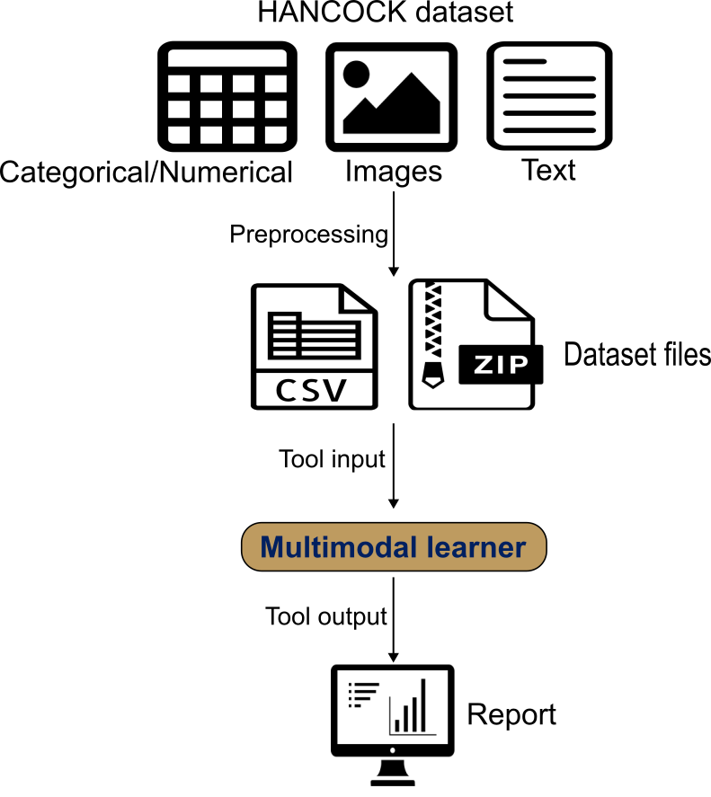
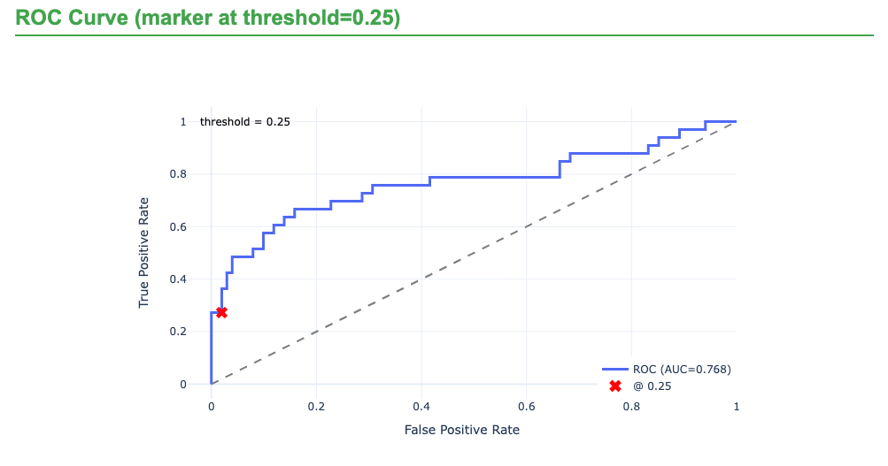

In this tutorial, we use the **HANCOCK** head-and-neck cancer cohort () to build a **recurrence prediction** model with **GLEAM Multimodal Learner**.

Multimodal Learner wraps AutoGluon Multimodal to train a **late-fusion** model. It automatically builds modality-specific encoders—tabular features with a tabular transformer, text fields with a pretrained language model, and images with a pretrained vision backbone—and learns a fusion network that combines the modality embeddings into a single prediction.

You provide a single CSV/TSV with one row per patient containing the target label and modality references (text columns and image-path columns). Image files are uploaded as one or more ZIP archives; the paths in the table must match filenames inside the ZIP. We use the **published train/test split** and interpret results with ROC/PR curves, confusion matrices, and threshold-dependent metrics.

> <agenda-title></agenda-title>
>
> In this tutorial, we will cover:
>
> 1. TOC
> {:toc}
>
{: .agenda}

# Dataset Overview and Composition

The HANCOCK dataset used in this tutorial is a multimodal precision oncology resource that integrates multiple data types to enable comprehensive cancer outcome prediction.

## Dataset Description

The HANCOCK (Head and Neck Cancer Outcome Cohort) dataset was published by  and represents one of the first large-scale multimodal datasets specifically designed for head and neck cancer outcome prediction. The dataset includes:

### Patient Cohort
- **Total patients**: 763 head and neck cancer patients
- **Cancer sites**: Oral cavity, oropharynx, hypopharynx, larynx
- **Follow-up**: Comprehensive outcome tracking with recurrence and survival data
- **Data collection**: Multi-institutional cohort with standardized data collection protocols

### Data Modalities

#### 1. Tabular Data (Clinical and Pathological Features)
- **Clinical features**: Age, sex, smoking status, primary tumor site
- **Pathological features**: Tumor grade, stage, histological type
- **Blood biomarkers**: Complete blood count, liver function, kidney function
- **TMA cell density**: Quantitative cell counts from tissue microarray analysis

#### 2. Image Data (Tissue Microarray Cores)
- **Modality**: CD3 and CD8 immunohistochemistry staining
- **Resolution**: High-resolution digital pathology images
- **Content**: Tumor microenvironment immune cell infiltration
- **Format**: PNG images of individual TMA cores

#### 3. Text Data (ICD Diagnostic Codes)
- **Source**: International Classification of Diseases (ICD-10) codes
- **Content**: Diagnostic codes representing comorbidities and medical history
- **Format**: Free-text ICD code descriptions

## Target Variable: 3-Year Recurrence

The primary prediction task is **3-year recurrence**, defined as:
- **Positive (recurrence = 1)**: Recurrence within 3 years (1,095 days) of diagnosis
- **Negative (recurrence = 0)**: No recurrence with adequate follow-up (>3 years) or currently living without recurrence

This binary classification task is clinically relevant as early recurrence (within 3 years) is associated with poor prognosis and may benefit from more aggressive treatment strategies.

## Data Splits

The dataset provides three pre-defined splits:
1. **In-distribution split**: Random split for general model development
2. **Out-of-distribution split**: Temporal split to test model generalization
3. **Oropharynx split**: Site-specific split for oropharyngeal cancer

For this tutorial, we use the **in-distribution split** which provides:
- **Training set**: ~70% of patients for model training
- **Test set**: ~30% of patients for final evaluation## Expected table structure

Because Multimodal Learner requires a specific input structure—a single sample-level table that contains the label and all modality references, plus, when using images, a ZIP archive containing the referenced image files—you must preprocess the dataset to match this format before running the tool. For a HANCOCK-like setup, the training and test tables typically include:

target: recurrence label (0 = no recurrence, 1 = recurrence/progression)

clinical covariates: numeric and categorical clinical/pathological variables

icd_text: free-text ICD descriptions

cd3_path and cd8_path: image filenames (or relative paths) for CD3 and CD8 TMA images, which must match files inside the ZIP archive

> <comment-title>Data preparation: shaping HANCOCK for the tool</comment-title>
>
> The raw data published by () can be found here: 
> [HANCOCK raw dataset](https://www.hancock.research.uni-erlangen.org/download)
> 
> We preprocessed the raw data using a Python script to:
>
> 1) Normalize identifiers consistently (e.g., remove leading zeros; standardize missing values) before merging.
>
> 2) Join modality tables using a stable identifier (e.g., patient_id).
>
> 3) Construct recurrence label for each patient.
>
> 4) Extract the ICD code text as is.
>
> 5) Use filenames in the table that match entries for each patient.
>
> 6) Preserve the reference benchmark split and avoids leakage across patients.
>
> 7) Save the dataset as a .csv file.
>
> 8) Provide the images as one **ZIP** archive.
>
> A python script for preprocessing can be found at: [HANCOCK_preprocessing](https://github.com/goeckslab/gleam_use_cases/tree/main/multimodal_learner)
>
{:  .comment}

{: style="width: 60%; display: block; margin-left: auto; margin-right: auto;"}

# Using Multimodal Learner Tool

## How it works

Multimodal Learner trains **late-fusion prediction models** using **AutoGluon Multimodal**.

- **One row per sample:** a single CSV/TSV contains the target label plus tabular features and (optionally) text and image references for the same sample (e.g., patient).
- **Encoders per modality:**
  - tabular features are encoded by a transformer-based tabular backbone (handled automatically),
  - text columns are encoded by a user-selected pretrained language model,
  - image columns are encoded by a user-selected pretrained vision backbone.
- **Fusion:** modality embeddings are combined by a learned fusion network to produce the final prediction.
- **Outputs:** an interactive HTML report (ROC/PR curves, confusion matrix, calibration and threshold views), plus a YAML config record and JSON metrics.

## Prepare environment and get the data

> <hands-on-title>Environment and Data Upload</hands-on-title>
>
> 1. Create a new history for this tutorial. For example, name it *HANCOCK Multimodal Recurrence*.
>
>    
>
> 2. Import the dataset files from Zenodo:
>
>    ```
>    https://zenodo.org/records/18603388/files/HANCOCK_train_split.csv
>    https://zenodo.org/records/18603388/files/HANCOCK_test_split.csv
>    https://zenodo.org/records/18603388/files/CD3_CD8_images.zip
>    ```
>
>    
>
> 3. Check that the data formats are assigned correctly. If not, follow the Changing the datatype tip:
>
>    
>
{: .hands_on}

## Tool setup and run

After the train and test tables were upload, configure Multimodal Learner with the following parameters.

> <hands-on-title>Configure Multimodal Learner for HANCOCK</hands-on-title>
>
> 1.  with the following parameters:
>    -  *Training dataset (CSV/TSV)*: `HANCOCK_train_split.csv`
>    -  *Target / Label column*: `target`
>    -  *Provide separate test dataset?*: `Yes`
>    -  *Test dataset (CSV/TSV)*: `HANCOCK_test_split.csv`
>    -  *Text backbone*: `google/electra-base-discriminator`
>    -  *Use image modality?*: `Yes`
>    -  *+ Insert Image archive*: `click`
>    -  *ZIP file containing images*: `tma_cores_cd3_cd8_images.zip`
>    -  *Image backbone*: `caformer_b36.sail_in22k_ft_in1k`
>    -  *Drop rows with missing images?*: `No`
>    -  *Primary evaluation metric*: `ROC AUC`
>    -  *Random seed*: `42`
>    -  *Advanced: customize training settings?*: `Yes`
>    -  *Binary classification threshold*: `0.25`
>
> 2. Run the tool and review the HTML report.
>
{: .hands_on}

> <tip-title>Recommended Multimodal Learner configuration (and why)</tip-title>
>
> | Parameter | Rationale |
> |---|---|
> | Text backbone | ELECTRA base performs well on clinical free text |
> | Image backbone | CAFormer b36 matches the HANCOCK benchmark setup |
> | ROC AUC metric | Robust for imbalanced binary outcomes |
> | 5-fold CV | Estimates stability across folds |
> | Threshold 0.25 | Matches the recurrence decision rule used in the use case |
>
{: .tip}

## Tool Output Files

After the run finishes, you should see these outputs in your history:

- **Multimodal Learner analysis report (HTML)**: Summary metrics, ROC/PR curves, and diagnostic plots
- **Multimodal Learner metric results (JSON)**: Machine-readable metrics for train/validation/test
- **Multimodal Learner training config (YAML)**: Full run settings for reproducibility

## Interpreting the Multimodal Learner Report

The HTML report is designed to help you answer two questions quickly: **how well does the model discriminate outcomes** and **what kinds of errors it makes at a chosen operating point**.


- **Performance summary (by split)**  
  Review ROC–AUC and PR–AUC alongside threshold-dependent metrics (precision, recall, F1). For recurrence prediction, PR–AUC is often especially informative because the positive class can be relatively rare, and false negatives directly reduce recall.
- **Diagnostics (curves and confusion matrix)**  
  Use ROC/PR curves to understand ranking performance, then move to the confusion matrix and class-wise metrics to see *where* errors occur. In the HANCOCK recurrence use case, a common pattern is **stronger performance for the negative class (no recurrence)** than the positive class, so the main concern is typically **missed recurrence cases (false negatives)**.
- **Calibration and threshold behavior**  
  Calibration plots help you decide whether predicted probabilities can be interpreted as risk. Threshold views show how changing the cutoff trades off false negatives versus false positives. The configuration used was **0.25** decision threshold to make this tradeoff explicit (rather than relying on the default 0.5).
- **Configuration and reproducibility**  
  Confirm that the report  match your intended setup: which modalities were used, chosen text and image backbones, missing-image handling, split strategy, random seed, and time budget.

# Results and Benchmark Comparison

The original HANCOCK study reported an ROC–AUC of **0.79** for recurrence prediction using **engineered multimodal features** (). In this use case, Multimodal Learner replaces engineered summaries with **raw modalities**—ICD as free text and CD3/CD8 as pixel images—combined with structured clinical variables in a **late-fusion** model. On the held-out test set, the model achieves **ROC–AUC = 0.768** (≈ **0.77**), which is close to the published benchmark given the change in representation and training setup.

| Metric | HANCOCK (reference) | Multimodal Learner (test) |
|---|---:|---:|
| ROC–AUC | 0.79 | 0.77 |



**What the benchmark teaches (and how to reuse it)**  
The HANCOCK benchmark emphasizes a simple but powerful pattern: **multimodal models perform best when the modalities are complementary**, and performance drops when you remove a modality. This is why the original study compared single-modality baselines to multimodal combinations. You can reuse this same logic for other datasets by treating the benchmark as an **ablation template**, not just a single number.

Use the following checklist when adapting the workflow:
- **Start with a tabular-only baseline**, then add text and images one at a time to quantify each modality’s contribution.
- **Keep splits and preprocessing fixed** across runs so improvements reflect modeling choices rather than data leakage.
- **Report both ROC–AUC and PR–AUC**, then inspect threshold-dependent metrics to match the clinical trade-off you care about.
- **Interpret deltas, not just absolutes**: a small gain over a strong baseline can be meaningful when data are imbalanced.

## Class imbalance and what it changes in practice

Recurrence is the minority class across splits:

| Label | Train | Validation | Test |
|---|---:|---:|---:|
| 0 (no recurrence) | 332 | 84 | 101 |
| 1 (recurrence) | 94 | 23 | 33 |

This imbalance strongly shapes the metrics you see in the report. In particular, **accuracy and specificity can look high even when recurrence detection is weak**, because most samples are negative.

### Model Performance Summary (reported)

| Metric | Train | Validation | Test |
|---|---:|---:|---:|
| Accuracy | 0.8005 | 0.7944 | 0.8134 |
| ROC–AUC | 0.7812 | 0.7748 | 0.7681 |
| Precision | 0.9091 | 1.0000 | 0.9000 |
| Recall | 0.1064 | 0.0435 | 0.2727 |
| F1-Score | 0.1905 | 0.0833 | 0.4186 |
| PR-AUC | 0.5770 | 0.5325 | 0.6743 |
| Specificity | 0.9970 | 1.0000 | 0.9901 |

How to read this:

- **ROC–AUC stays reasonably strong (~0.77 on test)**, suggesting the model ranks recurrence risk meaningfully even if the default operating point is conservative.
- **Precision is high (0.90) but recall is modest (0.27) on test**: when the model predicts recurrence it is often correct, but it misses many recurrent cases at the current threshold.
- **PR–AUC (0.67 on test)** is particularly informative under class imbalance; it emphasizes performance on the positive class more than ROC–AUC does.
- **Very high specificity (~0.99)** indicates few false positives; if clinical priorities favor catching more recurrence cases, you will likely trade some specificity for higher recall.

## Key observations and how to iterate

- **Near-benchmark performance with raw inputs** supports the manuscript’s conclusion that the tool’s encoders can recover comparable signal directly from text and pixels under standardized training.
- **Error profile is dominated by under-detection of recurrence** at the current decision threshold. Use the report’s threshold plots to **move the operating point** (often lowering the threshold increases recall, typically reducing precision).

## Conclusion

Using the HANCOCK recurrence task as an example, this tutorial demonstrates how Multimodal Learner integrates **tabular clinical variables**, **free-text ICD descriptions**, and **CD3/CD8 images** in a single late-fusion workflow. The results show that a standardized, no-code configuration can approach a published benchmark while reducing reliance on modality-specific feature engineering, and that the generated report provides the diagnostics needed to understand errors, assess calibration, and select an operating point aligned to clinical priorities—especially in the presence of class imbalance.
