In den letzten Jahren hat sich die RNA-Sequenzierung (kurz RNA-Seq) zu einer weit verbreiteten Technologie entwickelt, um das sich ständig verändernde zelluläre Transkriptom zu analysieren, d. h. die Menge aller RNA-Moleküle in einer Zelle oder einer Zellpopulation. Eines der häufigsten Ziele von RNA-Seq ist die Erstellung von Profilen der Genexpression durch die Identifizierung von Genen oder molekularen Pfaden, die zwischen zwei oder mehreren biologischen Bedingungen unterschiedlich exprimiert werden. Dieses Tutorial demonstriert einen computergestützten Arbeitsablauf für die Erkennung von DE-Genen und -Pfaden aus RNA-Seq-Daten, indem es eine vollständige Analyse eines RNA-Seq-Experiments vorstellt, bei dem *Drosophila*-Zellen nach der Deletion eines regulatorischen Gens profiliert wurden.

In der Studie von  identifizierten die Autoren anhand von RNA-Seq-Daten Gene und Signalwege, die durch das *Pasilla*-Gen (das *Drosophila*-Homolog der Nova-1- und Nova-2-Proteine, die das Spleißen bei Säugetieren regulieren) reguliert werden. Sie entfernten das *Pasilla* (*PS*) Gen in *Drosophila melanogaster* durch RNA-Interferenz (RNAi). Anschließend wurde die gesamte RNA isoliert und zur Herstellung von Single-End- und Paired-End-RNA-Seq-Bibliotheken für behandelte (PS-depletierte) und unbehandelte Proben verwendet. Diese Bibliotheken wurden sequenziert, um RNA-Seq-Reads für jede Probe zu erhalten. Die RNA-Seq-Daten für die behandelten und die unbehandelten Proben können verglichen werden, um die Auswirkungen der *Pasilla*-Gendepletion auf die Genexpression zu ermitteln.

In diesem Tutorial wird die Analyse der Genexpressionsdaten Schritt für Schritt anhand von 7 der Originaldatensätze veranschaulicht:

- 4 unbehandelte Proben: [GSM461176](https://www.ncbi.nlm.nih.gov/geo/query/acc.cgi?acc=GSM461176), [GSM461177](https://www.ncbi.nlm.nih.gov/geo/query/acc.cgi?acc=GSM461177), [GSM461178](https://www.ncbi.nlm.nih.gov/geo/query/acc.cgi?acc=GSM461178), [GSM461182](https://www.ncbi.nlm.nih.gov/geo/query/acc.cgi?acc=GSM461182)
- 3 behandelte Proben (*Pasilla*-Gen durch RNAi abgetrennt): [GSM461179](https://www.ncbi.nlm.nih.gov/geo/query/acc.cgi?acc=GSM461179), [GSM461180](https://www.ncbi.nlm.nih.gov/geo/query/acc.cgi?acc=GSM461180), [GSM461181](https://www.ncbi.nlm.nih.gov/geo/query/acc.cgi?acc=GSM461181)

Jede Probe ist ein separates biologisches Replikat der entsprechenden Bedingung (behandelt oder unbehandelt). Außerdem stammen zwei der behandelten und zwei der unbehandelten Proben aus einem Paired-End-Sequenzierungsassay, während die übrigen Proben aus einem Single-End-Sequenzierungsexperiment stammen.

> <comment-title>Full data</comment-title>
> 
> Die Originaldaten sind im NCBI Gene Expression Omnibus (GEO) unter der Zugriffsnummer [GSE18508] (https://www.ncbi.nlm.nih.gov/geo/query/acc.cgi?acc=GSE18508) verfügbar. Die RNA-Seq-Rohdaten wurden aus den Dateien des Sequence Read Archive (SRA) extrahiert und in FASTQ-Dateien umgewandelt.
> 
{: .comment}

> 
> <agenda-title></agenda-title>
> 
> In diesem Tutorium werden wir uns mit folgenden Themen beschäftigen:
> 
> 1. TOC {:toc}
> 
{: .agenda}

# Daten hochladen

Im ersten Teil dieses Tutorials werden wir die Dateien für 2 der 7 Proben verwenden, um zu demonstrieren, wie die Anzahl der Lesevorgänge (ein Maß für die Genexpression) aus FASTQ-Dateien berechnet wird (Qualitätskontrolle, Mapping, Lesezählung). Wir stellen die FASTQ-Dateien für die anderen 5 Proben zur Verfügung, falls Sie die gesamte Analyse später reproduzieren möchten.

Im zweiten Teil des Tutorials werden die Read-Zahlen aller 7 Proben verwendet, um die DE-Gene, Genfamilien und molekularen Pfade zu identifizieren und zu visualisieren, die durch die Abreicherung des *PS*-Gens entstehen.

> <hands-on-title>Daten-Upload</hands-on-title>
> 
> 1. Erstellen Sie einen neuen Verlauf für diese RNA-Seq-Übung
> 
>    
> 
> 2. Importieren Sie die FASTQ-Dateipaare von [Zenodo]({{ page.zenodo_link }}) oder einer Datenbibliothek:
>    - `GSM461177` (unbehandelt): `GSM461177_1` und `GSM461177_2`
>    - `GSM461180` (behandelt): `GSM461180_1` und `GSM461180_2`
> 
>    ```text
>    {{ page.zenodo_link }}/files/GSM461177_1.fastqsanger
>    {{ page.zenodo_link }}/files/GSM461177_2.fastqsanger
>    {{ page.zenodo_link }}/files/GSM461180_1.fastqsanger
>    {{ page.zenodo_link }}/files/GSM461180_2.fastqsanger
>    ```
> 
>    
> 
>    
> 
>    > <comment-title></comment-title>
>    > 
>    > Beachten Sie, dass es sich hierbei um vollständige Dateien für die Proben handelt, die jeweils ~1,5 GB groß sind, so dass der Import einige Minuten dauern kann.
>    > 
>    > Für einen schnelleren Durchlauf der FASTQ-Schritte kann eine kleine Teilmenge jeder FASTQ-Datei (~5Mb) hier auf [Zenodo]({{ page.zenodo_link }}) gefunden werden:
>    > 
>    > ```text
>    > {{ page.zenodo_link }}/files/GSM461177_1_subsampled.fastqsanger
>    > {{ page.zenodo_link }}/files/GSM461177_2_subsampled.fastqsanger
>    > {{ page.zenodo_link }}/files/GSM461180_1_subsampled.fastqsanger
>    > {{ page.zenodo_link }}/files/GSM461180_2_subsampled.fastqsanger
>    > ```
>    > 
> > 
> {: .comment}
> 
> 3. Überprüfen Sie, ob der Datentyp `fastqsanger` ist (z.B. **nicht** `fastq`). Ist dies nicht der Fall, ändern Sie bitte den Datentyp in `fastqsanger`.
> 
>    
> 
> 4. Erstellen Sie eine gepaarte Sammlung mit dem Namen `2 PE fastqs`, benennen Sie Ihre Paare mit dem Probennamen, gefolgt von den Attributen:`GSM461177_untreat_paired` und `GSM461180_treat_paired`.
> 
>    
> 
{: .hands_on}



Die Reads sind Rohdaten aus dem Sequenziergerät ohne jegliche Vorbehandlung. Sie müssen auf ihre Qualität geprüft werden.

# Qualitätskontrolle

Während der Sequenzierung treten Fehler auf, z. B. werden falsche Nukleotide aufgerufen. Diese sind auf die technischen Beschränkungen der einzelnen Sequenzierplattformen zurückzuführen. Sequenzierungsfehler können die Analyse verfälschen und zu einer Fehlinterpretation der Daten führen. Es können auch Adapter vorhanden sein, wenn die Reads länger sind als die sequenzierten Fragmente, und das Trimmen dieser kann die Anzahl der gemappten Reads verbessern.

Die Qualitätskontrolle der Sequenzen ist daher ein wichtiger erster Schritt in Ihrer Analyse. Wir werden ähnliche Werkzeuge verwenden, wie sie im ["Qualitätskontrolle"-Tutorial]() beschrieben sind:
- [Falco](https://falco.readthedocs.io/en/latest/), eine effizienzoptimierte Neuformulierung von [FastQC](https://www.bioinformatics.babraham.ac.uk/projects/fastqc/), um einen Bericht über die Sequenzqualität zu erstellen
- [MultiQC](https://multiqc.info/) (), um generierte Berichte zu aggregieren
- [Cutadapt](https://cutadapt.readthedocs.io/en/stable/guide.html) (), um die Qualität der Sequenzen durch Trimmen und Filtern zu verbessern.

Leider unterstützt die aktuelle Version von MultiQC (das Tool, das wir zum Kombinieren von Berichten verwenden) keine Listen von Paarsammlungen. Wir müssen zunächst unsere Liste von Paaren in eine einfache Liste umwandeln.

> <details-title>Was bedeutet das genau?</details-title>
> 
> Die aktuelle Situation ist oben, und das Tool **Flatten collection** wandelt sie in die unten angezeigte Situation um: 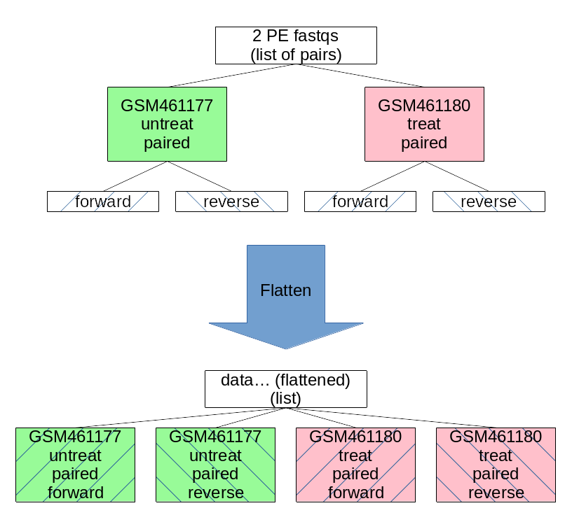
> 
{: .details}

> <hands-on-title>Qualitätskontrolle</hands-on-title>
> 
> 1.  mit den folgenden Parametern konvertiert die Liste der Paare in eine einfache Liste:
>     - *"Input Collection "*: `2 PE fastqs`
> 
> 2.  mit den folgenden Parametern:
>    -  *"Rohe Lesedaten aus Ihrer aktuellen Historie "*: Ausgabe von **Flatten collection**  ausgewählt als **Dataset collection**
> 
>    
> 
> 3. Untersuchen Sie die Ausgabe der Webseite von **Falco**  für die Probe `GSM461177_untreat_paired` (vorwärts und rückwärts)
> 
>    > <question-title></question-title>
>    > 
>    > Wie lang ist der Read?
>    > 
>    > > <solution-title></solution-title>
>    > > 
>    > > Die Leselänge der beiden Partner beträgt 37 bp.
>    > > 
> > > 
> > {: .solution}
> > 
> > 
> > 
> {: .question}
> 
> Da es mühsam ist, alle diese Berichte einzeln zu prüfen, werden wir sie mit  kombinieren.
> 
> 4.  um die Falco-Berichte mit den folgenden Parametern zu aggregieren:
>    - In *"Results "*:
>        - *"Ergebnisse "*
>            - *"Mit welchem Tool wurden die Protokolle erstellt? "*: `FastQC`
> 
>              **Falco** ist ein einfacher Ersatz für *FastQC* und wir können seine Ausgabe an MultiQC weitergeben, als ob sie von dem ursprünglichen Tool erzeugt worden wäre.
>                - In *"FastQC output "*:
>                    -  *"FastQC-Ausgabe einfügen "*
>                        -  *"FastQC-Ausgabe "*: `Falco on collection N: RawData` (Ausgabe von **Falco** )
> 
> 5. Prüfen Sie die Webseitenausgabe von MultiQC für jeden FASTQ
> 
>    > <question-title></question-title>
>    > 
>    > 1. Was halten Sie von der Qualität der Sequenzen?
>    > 2. Was sollten wir tun?
>    > 
>    > > <solution-title></solution-title>
>    > > 
>    > > 1. Bei 3 der Dateien scheint alles in Ordnung zu sein. Die `GSM461177_untreat_paired` haben 10,6 Millionen gepaarte Sequenzen und `GSM461180_treat_paired` 12,3 Millionen gepaarte Sequenzen. Aber in `GSM461180_treat_paired_reverse` (Reverse Reads von GSM461180) nimmt die Qualität am Ende der Sequenzen ziemlich stark ab.
>    > > 
>    > >    Alle Dateien außer `GSM461180_treat_paired_reverse` haben einen hohen Anteil an duplizierten Reads (zu erwarten bei RNA-Seq-Daten).
>    > > 
>    > >    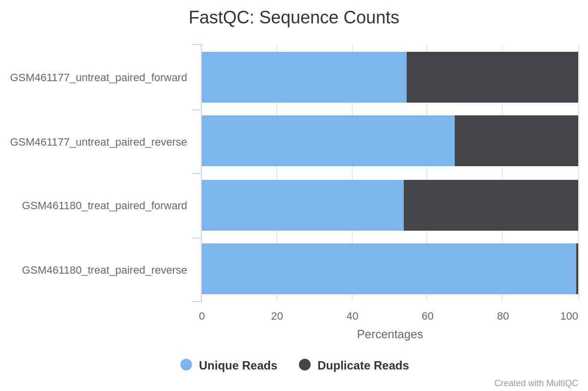
>    > > 
>    > >    Die "Pro-Base-Sequenzqualität" ist insgesamt gut mit einer leichten Abnahme am Ende der Sequenzen. Für `GSM461180_treat_paired_reverse` ist die Abnahme ziemlich groß.
>    > > 
>    > >    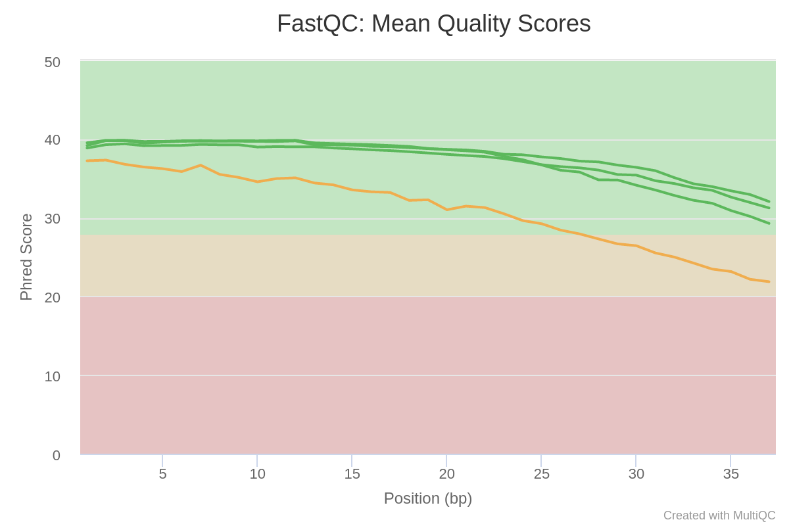
>    > > 
>    > >    Der mittlere Qualitätsscore über die Reads ist recht hoch, aber die Verteilung ist für `GSM461180_treat_paired_reverse` etwas anders.
>    > > 
>    > >    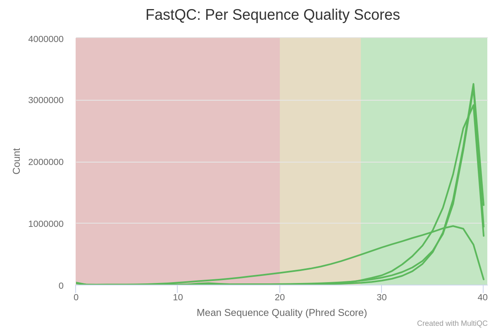
>    > > 
>    > >    Die Reads folgen nicht wirklich einer normalen Verteilung des GC-Gehalts, mit Ausnahme von `GSM461180_treat_paired_reverse`.
>    > > 
>    > >    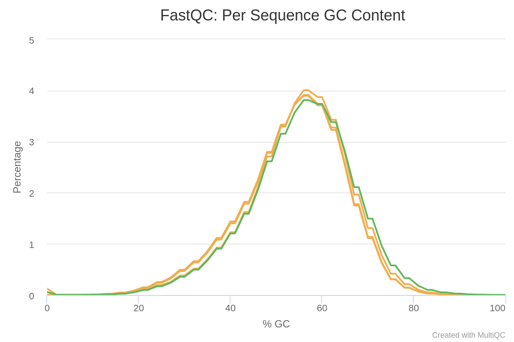
>    > > 
>    > >    Der Anteil von N in den Reads (Basen, die nicht aufgerufen werden konnten) ist gering.
>    > > 
>    > >    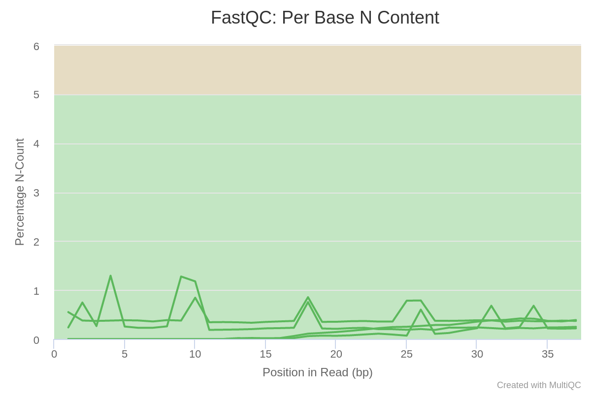
>    > > 
>    > >    Duplizierte Sequenzen: >10 bis >500
>    > > 
>    > >    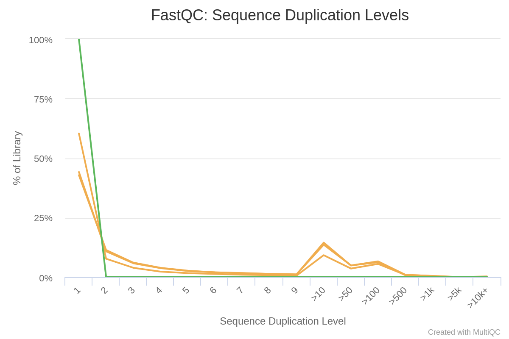
>    > > 
>    > >    Es gibt fast keine bekannten Adapter und überrepräsentierte Sequenzen.
>    > > 
>    > > 2. Wenn die Qualität der Reads schlecht ist, sollten wir:
>    > >    1. Überprüfen Sie, was falsch ist, und denken Sie über mögliche Gründe für die schlechte Lesequalität nach: Sie kann von der Art der Sequenzierung oder von dem, was wir sequenziert haben, herrühren (hohe Anzahl überrepräsentierter Sequenzen in Transkriptomikdaten, verzerrter Prozentsatz von Basen in Hi-C-Daten)
>    > >    2. Fragen Sie die Sequenziereinrichtung danach
>    > >    3. Führen Sie eine Qualitätsbehandlung durch (wobei Sie darauf achten sollten, nicht zu viele Informationen zu verlieren) und entfernen Sie schlechte Reads
>    > > 
> > > 
> > {: .solution}
> > 
> {: .question}
> 
{: .hands_on}

Wir sollten die Reads trimmen, um Basen zu entfernen, die mit hoher Unsicherheit (d.h. Basen mit niedriger Qualität) an den Read-Enden sequenziert wurden, und auch die Reads mit insgesamt schlechter Qualität entfernen.



> <hands-on-title>Trimmen von FASTQs</hands-on-title>
> 
> 1.  mit den folgenden Parametern, um Sequenzen geringer Qualität zu trimmen:
>    - *"Single-End- oder Paired-End-Reads? "*: `Paired-end Collection`
>       -  *"Gepaarte Sammlung "*: `2 PE fastqs`
>    - In *"Other Read Trimming Options "*
>       - *"Quality cutoff(s) (R1) "*: `20`
>    - In *"Read Filtering Options "*
>       - *"Mindestlänge (R1) "*: `20`
>    - In *"Additional outputs to generate "*
>       - Auswählen: `Report: Cutadapt's per-adapter statistics. You can use this file with MultiQC.`
> 
>      
> 
> 2.  um die Cutadapt-Berichte mit den folgenden Parametern zu aggregieren:
>    - In *"Results "*:
>        -  *"Ergebnisse "*
>            - *"Mit welchem Tool wurden die Protokolle erstellt? "*: `Cutadapt/Trim Galore!`
>               -  *"Ausgabe von Cutadapt "*: `Cutadapt on collection N: Report` (Ausgabe von **Cutadapt** ) ausgewählt als **Datensatzsammlung**
> 
>    > <question-title></question-title>
>    > 
>    > 1. Wie viele Sequenzpaare wurden entfernt, weil mindestens ein Read kürzer war als der Längen-Cutoff?
>    > 2. Wie viele Basenpaare wurden aufgrund schlechter Qualität aus den Forward Reads entfernt? Und aus den Reverse-Reads?
>    > 
>    > > <solution-title></solution-title>
>    > > 
>    > > 1. 147.810 (1,4%) Reads waren zu kurz für `GSM461177_untreat_paired` und 1.101.875 (9%) für `GSM461180_treat_paired`. 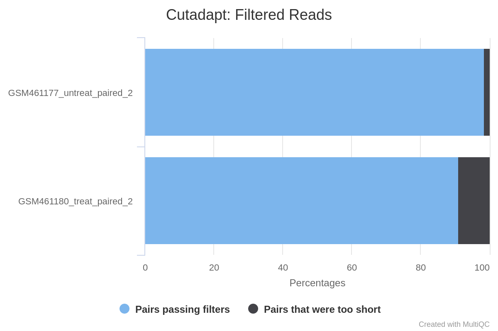
>    > > 2. Die MultiQC-Ausgabe gibt nur den Anteil der insgesamt getrimmten Bp an, nicht für jeden einzelnen Read. Um diese Information zu erhalten, müssen Sie auf die einzelnen Berichte zurückgreifen. Für `GSM461177_untreat_paired` wurden 5.072.810 bp von den Forward Reads (Read 1) und 8.648.619 bp von den Reverse Reads (Read 2) aus Qualitätsgründen abgeschnitten. Für `GSM461180_treat_paired` wurden 10.224.537 bp aus den Forward Reads und 51.746.850 bp aus den Reverse Reads entfernt. Dies ist keine Überraschung; wir haben gesehen, dass am Ende der Reads die Qualität bei den Reverse Reads stärker abnimmt als bei den Forward Reads, insbesondere bei `GSM461180_treat_paired`.
> > > 
> > {: .solution }
> > 
> {: .question}
> 
{: .hands_on}

# Mapping

Um aus den Reads einen Sinn zu machen, müssen wir zunächst herausfinden, woher die Sequenzen im Genom stammen, damit wir anschließend bestimmen können, zu welchen Genen sie gehören. Wenn ein Referenzgenom für den Organismus zur Verfügung steht, wird dieser Prozess als Alignment oder "Mapping" der Reads auf das Referenzgenom bezeichnet. Dies ist vergleichbar mit dem Lösen eines Puzzles, aber leider sind nicht alle Teile eindeutig.

> <comment-title></comment-title>
> 
> Möchten Sie mehr über die Prinzipien des Mappings erfahren? Folgen Sie unserem [training]().
> 
{: .comment}

In dieser Studie haben die Autoren *Drosophila melanogaster*-Zellen verwendet. Wir sollten daher die qualitätskontrollierten Sequenzen auf das Referenzgenom von *Drosophila melanogaster* abbilden.

{% include topics/sequence-analysis/tutorials/mapping/ref_genome_explanation.md answer_3="Das Genom von *Drosophila melanogaster* ist bekannt und zusammengesetzt und kann in dieser Analyse als Referenzgenom verwendet werden. Beachten Sie, dass neue Versionen von Referenzgenomen veröffentlicht werden können, wenn die Assemblierung verbessert wird. Für dieses Tutorial werden wir die Version 6 der *Drosophila melanogaster* Referenzgenom-Assemblierung [(dm6)](https://www.ncbi.nlm.nih.gov/pmc/articles/PMC4383921/) verwenden."%}

Bei eukaryotischen Transkriptomen stammen die meisten Reads von prozessierten mRNAs, denen Introns fehlen:

: Reads, die vollständig innerhalb eines Exons gemappt wurden (in rot), Reads, die sich über 2 Exons erstrecken (in blau), Reads, die sich über mehr als 2 Exons erstrecken (in lila)")

Daher können sie nicht einfach auf das Genom zurückgemappt werden, wie wir es normalerweise bei DNA-Daten tun. Es wurden Mapper mit gespleißten Enden entwickelt, um von Transkripten abgeleitete Reads effizient gegen ein Referenzgenom abzubilden:

 Identifizierung der Reads, die ein einzelnes Exon überspannen, (2) Identifizierung der Spleißverbindungen auf den ungemappten Reads")

> <details-title>Mehr Details zu den verschiedenen gespleißten Mappern</details-title>
> 
> In den letzten Jahren wurden mehrere Spleiß-Mapper entwickelt, um die explosionsartige Zunahme von RNA-Seq-Daten zu verarbeiten.
> 
> [**TopHat**](https://ccb.jhu.edu/software/tophat/index.shtml) () war eines der ersten Tools, das speziell zur Lösung dieses Problems entwickelt wurde. In **TopHat** werden Reads gegen das Genom gemappt und in zwei Kategorien unterteilt: (1) diejenigen, die gemappt werden, und (2) diejenigen, die zunächst nicht gemappt sind (IUM). "Stapel" von Reads, die potenzielle Exons darstellen, werden auf der Suche nach potenziellen Donor-/Akzeptor-Spleißstellen erweitert, und potenzielle Spleißverbindungen werden rekonstruiert. Die IUMs werden dann auf diese Verbindungsstellen abgebildet.
> 
> ")
> 
> **TopHat** wurde später durch die Entwicklung von **TopHat2** () verbessert:
> 
> ")
> 
> Zur weiteren Optimierung und Beschleunigung des Alignments gespleißter Lesungen wurde [**HISAT2**](https://ccb.jhu.edu/software/hisat2/index.shtml) () entwickelt. Es verwendet einen hierarchischen Graph [FM](https://en.wikipedia.org/wiki/FM-index) (HGFM)-Index, der das gesamte Genom und eventuelle Varianten repräsentiert, zusammen mit überlappenden lokalen Indizes (die jeweils ~57 kb umfassen), die das Genom und seine Varianten gemeinsam abdecken. Auf diese Weise lassen sich mithilfe des globalen Index erste Ansatzpunkte für potenzielle Read-Alignments im Genom finden und diese Alignments mithilfe eines entsprechenden lokalen Index schnell verfeinern:
> 
> ")
> 
> Ein Teil des Reads (blauer Pfeil) wird zunächst mit Hilfe des globalen FM-Index auf das Genom abgebildet. *anschließend versucht *HISAT2**, das Alignment direkt mit Hilfe der Genomsequenz (violetter Pfeil) zu erweitern. In (**a**) gelingt dies, und der Read wird ausgerichtet, da er sich vollständig innerhalb eines Exons befindet. In (**b**) trifft die Erweiterung auf eine Fehlanpassung. Nun nutzt **HISAT2** den lokalen FM-Index, der sich mit dieser Stelle überschneidet, um das passende Mapping für den Rest dieses Reads zu finden (grüner Pfeil). Die Abbildung (**c**) zeigt eine Kombination dieser beiden Strategien: Der Anfang des Read wird mit Hilfe des globalen FM-Index abgebildet (blauer Pfeil), bis zum Ende des Exons verlängert (violetter Pfeil), mit Hilfe des lokalen FM-Index abgebildet (grüner Pfeil) und erneut verlängert (violetter Pfeil).
> 
> [**STAR** aligner](https://github.com/alexdobin/STAR) () ist eine schnelle Alternative für das Mapping von RNA-Seq-Reads gegen ein Referenzgenom unter Verwendung eines unkomprimierten [suffix array](https://en.wikipedia.org/wiki/Suffix_array). Es arbeitet in zwei Stufen. In der ersten Stufe wird eine Seed-Suche durchgeführt:
> 
> ")
> 
> Hier wird ein Read zwischen zwei aufeinanderfolgenden Exons aufgeteilt. **STAR** beginnt mit der Suche nach einem maximal mappbaren Präfix (MMP) ab dem Beginn des Reads, bis es nicht mehr kontinuierlich übereinstimmen kann. Danach beginnt er mit der Suche nach einem MMP für den nicht übereinstimmenden Teil des Read (**a**). Im Falle von Mismatches (**b**) und nicht ausrichtbaren Regionen (**c**) dienen MMPs als Anker, von denen aus die Ausrichtungen erweitert werden können.
> 
> In der zweiten Phase sticht **STAR** MMPs zusammen, um Alignments auf Leseebene zu erzeugen, die (im Gegensatz zu MMPs) Mismatches und Indels enthalten können. Ein Scoring-Schema wird verwendet, um Stitching-Kombinationen zu bewerten und zu priorisieren und um Reads zu bewerten, die mehreren Orten zugeordnet sind. **STAR** ist extrem schnell, benötigt aber eine beträchtliche Menge an RAM, um effizient zu arbeiten.
> 
{: .details}

## Mapping

Wir werden unsere Reads mit Hilfe von **STAR** () auf das Genom von *Drosophila melanogaster* mappen.

> <hands-on-title>Spliced mapping</hands-on-title>
> 
> 1. Importieren Sie die Ensembl-Gen-Annotation für *Drosophila melanogaster* (`Drosophila_melanogaster.BDGP6.32.109_UCSC.gtf.gz`) aus der Shared Data-Bibliothek, falls verfügbar, oder von [Zenodo]({{ page.zenodo_link }}/files/Drosophila_melanogaster.BDGP6.32.109_UCSC.gtf.gz) in Ihre aktuelle Galaxy-History
> 
>    ```text
>    {{ page.zenodo_link }}/files/Drosophila_melanogaster.BDGP6.32.109_UCSC.gtf.gz
>    ```
> 
>    1. Benennen Sie den Datensatz bei Bedarf um
>    2. Vergewissern Sie sich, dass der Datentyp `gtf` und nicht `gff` ist, und dass die Datenbank `dm6` ist
> 
>    > <comment-title>Wie erhält man eine Annotationsdatei?</comment-title>
>    > 
>    > Annotationsdateien von Modellorganismen können in der Shared Data Bibliothek verfügbar sein (der Pfad zu diesen Dateien ändert sich von einem Galaxy-Server zum anderen). Sie können die Annotationsdatei auch von der UCSC abrufen (mit dem Tool **UCSC Main**).
>    > 
>    > Um diese spezielle Datei zu erstellen, wurde die Annotationsdatei von Ensembl heruntergeladen, das eine umfassendere Datenbank von Transkripten bereitstellt, und wurde weiter angepasst, damit sie mit dem dm6-Genom funktioniert, das auf kompatiblen Galaxy-Servern installiert ist.
>    > 
> > 
> {: .comment}
> 
> 2.  mit den folgenden Parametern, um Ihre Reads auf das Referenzgenom zu mappen:
>    - *"Single-end oder paired-end reads "*: `Paired-end (as collection)`
>       -  *"RNA-Seq FASTQ/FASTA paired reads "*: die `Cutadapt on collection N: Reads` (Ausgabe von **Cutadapt** )
>    - *"Benutzerdefiniertes oder eingebautes Referenzgenom "*: `Use a built-in index`
>       - *"Referenzgenom mit oder ohne Annotation "*: `use genome reference without builtin gene-model but provide a gtf`
>           - *"Referenzgenom auswählen "*: `Fly (Drosophila melanogaster): dm6 Full`
>           -  *"Genmodell (gff3,gtf) Datei für Spleißverbindungen "*: die importierte `Drosophila_melanogaster.BDGP6.32.109_UCSC.gtf.gz`
>           - *"Länge der genomischen Sequenz um annotierte Kreuzungen "*: `36`
> 
>             Dieser Parameter sollte Länge der Reads - 1 sein
>                - *"Ausgabe pro Gen/Transkript "*: `Per gene read counts (GeneCounts)`
>    - *"Compute coverage "*:
>       - `Yes in bedgraph format`
> 
> 3.  um die STAR-Logs mit den folgenden Parametern zu aggregieren:
>    - In *"Results "*:
>        - *"Ergebnisse "*
>            - *"Mit welchem Tool wurden die Protokolle erstellt? "*: `STAR`
>                - In *"STAR output "*:
>                    -  *"STAR-Ausgabe einfügen "*
>                        - *"Art der STAR-Ausgabe? "*: `Log`
>                            -  *"STAR log output "*: `RNA STAR on collection N: log` (Ausgabe von **RNA STAR** )
> 
>    > <question-title></question-title>
>    > 
>    > 1. Wie viel Prozent der Reads werden für beide Proben genau einmal gemappt?
>    > 2. Welche anderen Statistiken sind verfügbar?
>    > 
>    > > <solution-title></solution-title>
>    > > 
>    > > 1. Mehr als 83% für `GSM461177_untreat_paired` und 79% für `GSM461180_treat_paired`. Wir können mit der Analyse fortfahren, da nur Prozentsätze unter 70% auf mögliche Kontaminationen untersucht werden sollten.
>    > > 2. Wir haben auch Zugriff auf die Anzahl und den Prozentsatz der Reads, die an mehreren Stellen gemappt wurden, an zu vielen verschiedenen Stellen gemappt wurden oder nicht gemappt wurden, weil sie zu kurz sind.
>    > > 
>    > >    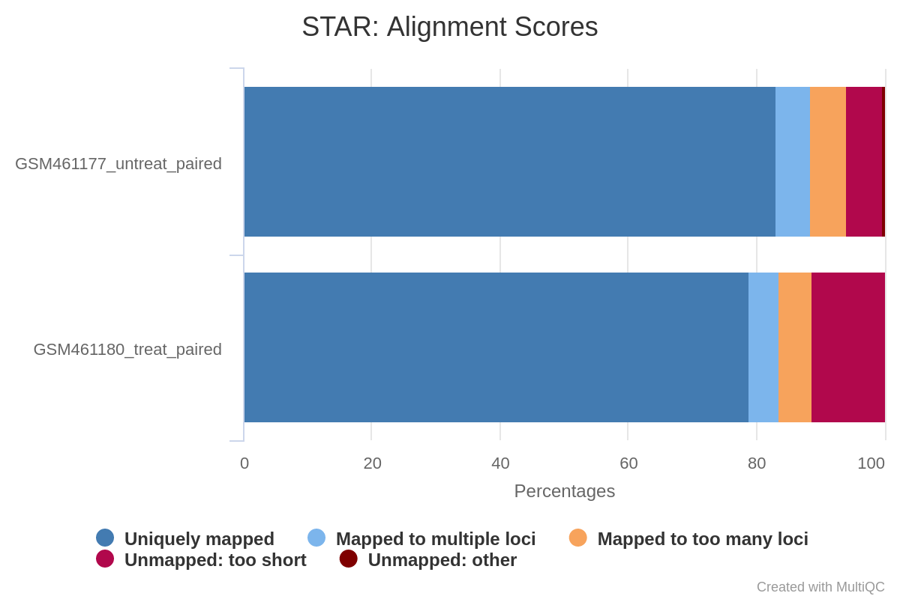
>    > > 
>    > >    Wir hätten bei der minimalen Leselänge strenger sein können, um diese nicht gemappten Reads aufgrund ihrer Länge zu vermeiden.
> > > 
> > {: .solution}
> > 
> > 
> > 
> {: .question}
> 
{: .hands_on}

Dem **MultiQC**-Bericht zufolge werden etwa 80 % der Reads für beide Proben genau einmal auf das Referenzgenom abgebildet. Wir können mit der Analyse fortfahren, da nur Prozentsätze unter 70% auf mögliche Kontaminationen untersucht werden sollten. Beide Proben weisen einen geringen Prozentsatz (weniger als 10 %) von Reads auf, die an mehreren Stellen des Referenzgenoms gemappt wurden. Dies liegt im normalen Bereich für Illumina Short-Read-Sequenzierung, kann aber bei neueren Long-Read-Sequenzierungsdatensätzen, die größere wiederholte Regionen im Referenzgenom umfassen können, niedriger sein und wird bei 3'-End-Bibliotheken höher sein.

Die Hauptausgabe von **STAR** ist eine BAM-Datei.



## Inspektion der Mapping-Ergebnisse

Die BAM-Datei enthält Informationen für alle unsere Reads, was eine Überprüfung und Untersuchung im Textformat erschwert. Ein leistungsstarkes Tool zur Visualisierung des Inhalts von BAM-Dateien ist der Integrative Genomics Viewer (**IGV**, ).

> <hands-on-title>Inspektion der Kartierungsergebnisse</hands-on-title>
> 
> 1. Installieren Sie [**IGV**](https://software.broadinstitute.org/software/igv/download) (falls nicht bereits installiert)
> 2. IGV lokal starten
> 3. Klicken Sie auf die Sammlung `RNA STAR on collection N: mapped.bam` (Ausgabe von **RNA STAR** )
> 4. Erweitern Sie die  datei `GSM461177_untreat_paired`.
> 5. Klicken Sie auf das  visualize icon im `GSM461177` file block.
> 6. Klicken Sie im mittleren Feld auf das `local` in `display with IGV (local, D. melanogaster (dm6))`, um die Reads in den IGV-Browser zu laden
>    > <comment-title></comment-title>
>    > 
>    > Damit dieser Schritt funktioniert, müssen Sie entweder IGV oder [Java Web Start](https://www.java.com/en/download/faq/java_webstart.xml) auf Ihrem Rechner installiert haben. Die Fragen in diesem Abschnitt können jedoch auch durch die Betrachtung der IGV-Screenshots unten beantwortet werden.
>    > 
>    > Weitere Informationen finden Sie in der [IGV-Dokumentation] (https://software.broadinstitute.org/software/igv/AlignmentData).
>    > 
> > 
> {: .comment}
> 
> 6. **IGV** : Zoom auf `chr4:540,000-560,000` (Chromosom 4 zwischen 540 kb und 560 kb)
> 
>    > <question-title></question-title>
>    > 
>    > 
>    > 
>    > 1. Welche Informationen werden oben als graue Peaks angezeigt?
>    > 2. Was bedeuten die Verbindungslinien zwischen einigen der alignierten Reads?
>    > 
>    > > <solution-title></solution-title>
>    > > 
>    > > 1. Der Coverage Plot: die Summe der gemappten Reads an jeder Position
>    > > 2. Sie kennzeichnen Kreuzungsereignisse (oder Spleißstellen), *d.h.* Reads, die über ein Intron gemappt werden
>    > > 
> > > 
> > {: .solution}
> > 
> {: .question}
> 
> 7. **IGV** : Untersuchen Sie die Spleißverbindungen mithilfe eines **Sashimi-Plots**
> 
>    > <comment-title>Erstellung eines Sashimi-Plots</comment-title>
>    > 
>    > - Rechtsklick auf die BAM-Datei (in IGV)
>    > - Wählen Sie **Sashimi Plot** aus dem Menü
>    > 
> > 
> {: .comment}
> 
> > 
> > <question-title></question-title>
> > 
> > 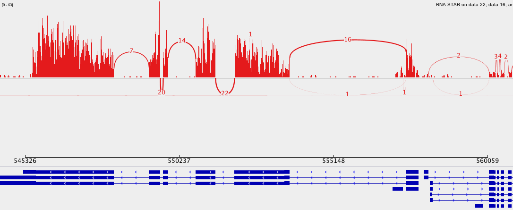
> > 
> > 1. Was stellt das vertikale rote Balkendiagramm dar? Was ist mit den Bögen mit Zahlen?
> > 2. Was bedeuten die Zahlen auf den Bögen?
> > 3. Warum sehen wir verschiedene gestapelte Gruppen von blauen verknüpften Boxen am unteren Rand?
> > 
> > > <solution-title></solution-title>
> > > 
> > > 1. Die Abdeckung für jede Alignment-Spur wird als rotes Balkendiagramm dargestellt. Die Bögen stellen beobachtete Spleißverbindungen dar, *d.h.*, Reads, die Introns überspannen.
> > > 2. Die Zahlen beziehen sich auf die Anzahl der beobachteten Junction Reads.
> > > 3. Die verschiedenen Gruppen von verknüpften Kästchen am unteren Rand stellen die verschiedenen Transkripte der Gene an dieser Stelle dar, die in der GTF-Datei vorhanden sind.
> > > 
> > {: .solution}
> > 
> {: .question}
> 
> > 
> > <comment-title></comment-title>
> > 
> > Schauen Sie in der [IGV-Dokumentation zu Sashimi-Plots] (https://software.broadinstitute.org/software/igv/Sashimi) nach, um einige Hinweise zu finden
> > 
> {: .comment}
> 
{: .hands_on}

> <details-title>Weitere Prüfung der Datenqualität</details-title>
> 
> Die Qualität der Daten und des Mappings kann weiter überprüft werden, z. B. durch Inspektion des Read-Duplizierungsgrads, der Anzahl der auf jedes Chromosom gemappten Reads, der Genkörperabdeckung und der Read-Verteilung über die Merkmale.
> 
> *Diese Schritte wurden von den Schritten im [großartigen Tutorial "RNA-Seq reads to counts"]() inspiriert und an unsere Datensätze angepasst.*
> 
> #### Duplizierte Reads
> 
> Im Falco/MultiQC-Bericht haben wir gesehen, dass einige Reads dupliziert sind:
> 
> 
> 
> Doppelte Reads können von hochexprimierten Genen stammen und werden daher in der Regel in der differenziellen RNA-Seq-Expressionsanalyse beibehalten. Ein hoher Prozentsatz an Duplikaten kann jedoch auf ein Problem hinweisen, z. B. eine Überamplifikation während der PCR einer Bibliothek mit geringer Komplexität.
> 
> **MarkDuplicates** aus der [Picard-Suite](http://broadinstitute.github.io/picard/) untersucht ausgerichtete Datensätze aus einer BAM-Datei, um doppelte Reads zu finden, d. h. Reads, die auf dieselbe Stelle abgebildet werden (basierend auf der Startposition der Abbildung).
> 
> > <hands-on-title>Doppelte Reads überprüfen</hands-on-title>
> > 
> > 1.  mit den folgenden Parametern:
> >    -  *"SAM/BAM-Datensatz oder Datensatzsammlung auswählen "*: `RNA STAR on collection N: mapped.bam` (Ausgabe von **RNA STAR** )
> > 
> > 2.  um die MarkDuplicates-Protokolle mit den folgenden Parametern zu aggregieren:
> >    - In *"Results "*:
> >        - *"Ergebnisse "*
> >            - *"Mit welchem Tool wurden die Protokolle erstellt? "*: `Picard`
> >                - In *"Picard output "*:
> >                    -  *"Picard-Ausgabe einfügen "*
> >                        - *"Art der Picard-Ausgabe? "*: `Markdups`
> >                        -  *"Picard-Ausgabe "*: `MarkDuplicates on collection N: MarkDuplicate metrics` (Ausgabe von **MarkDuplicates** )
> > 
> >    > <question-title></question-title>
> >    > 
> >    > Wie hoch ist der Prozentsatz der doppelten Reads für jede Probe?
> >    > 
> >    > > <solution-title></solution-title>
> >    > > 
> >    > > Die Probe `GSM461177_untreat_paired` hat 25,9% duplizierte Reads, während `GSM461180_treat_paired` 27,8% hat. {: .solution}
> > > 
> > {: .question}
> > 
> {: .hands_on}
> 
> Im Allgemeinen wird ein Anteil von bis zu 50% duplizierter Reads als normal angesehen. Unsere beiden Proben sind also in Ordnung.
> 
> #### Anzahl der auf jedes Chromosom abgebildeten Reads
> 
> Um die Qualität der Proben zu beurteilen (z. B. übermäßige mitochondriale Kontamination), können wir das Geschlecht der Proben überprüfen, oder um zu sehen, ob einige Chromosomen stark exprimierte Gene haben, können wir die Anzahl der Reads, die jedem Chromosom zugeordnet sind, mit **IdxStats** aus der **Samtools** Suite überprüfen.
> 
> > <hands-on-title>Überprüfen Sie die Anzahl der Reads, die jedem Chromosom zugeordnet sind</hands-on-title>
> > 
> > 1.  mit den folgenden Parametern:
> >    -  *"BAM-Datei "*: `RNA STAR on collection N: mapped.bam` (Ausgabe von **RNA STAR** )
> > 
> > 2.  um die idxstats-Protokolle mit den folgenden Parametern zu aggregieren:
> >    - In *"Results "*:
> >        - *"Ergebnisse "*
> >            - *"Mit welchem Tool wurden die Protokolle erstellt? "*: `Samtools`
> >                - In *"Samtools output "*:
> >                    -  *"Samtools-Ausgabe einfügen "*
> >                        - *"Art der Samtools-Ausgabe? "*: `idxstats`
> >                            -  *"Samtools idxstats Ausgabe "*: `Samtools idxstats on collection N` (Ausgabe von **Samtools idxstats** )
> > 
> >    > <question-title></question-title>
> >    > 
> >    > 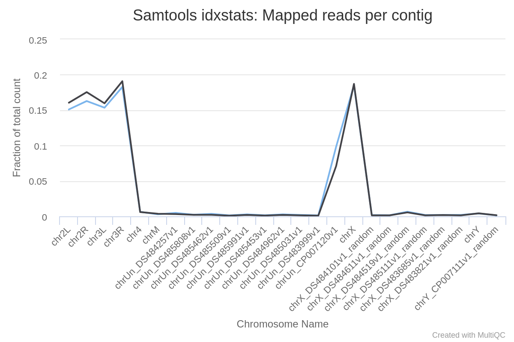
> >    > 
> >    > 1. Wie viele Chromosomen hat das Genom von *Drosophila*?
> >    > 2. Wo wurden die Reads hauptsächlich zugeordnet?
> >    > 3. Können wir das Geschlecht der Proben bestimmen?
> >    > 
> >    > > <solution-title></solution-title>
> >    > > 
> >    > > 1. Das Genom von *Drosophila* hat 4 Chromosomenpaare: X/Y, 2, 3 und 4.
> >    > > 2. Die Reads kartieren hauptsächlich auf Chromosom 2 (chr2L und chr2R), 3 (chr3L und chr3R) und X. Nur wenige Reads kartieren auf Chromosom 4, was zu erwarten ist, da dieses Chromosom sehr klein ist.
> >    > > 3. Nach dem Prozentsatz der X+Y-Reads zu urteilen, gehören die meisten Reads zu X und nur wenige zu Y. Das deutet darauf hin, dass es wahrscheinlich nicht viele Gene auf Y gibt, so dass die Proben wahrscheinlich beide weiblich sind.
> >    > > 
> >    > >    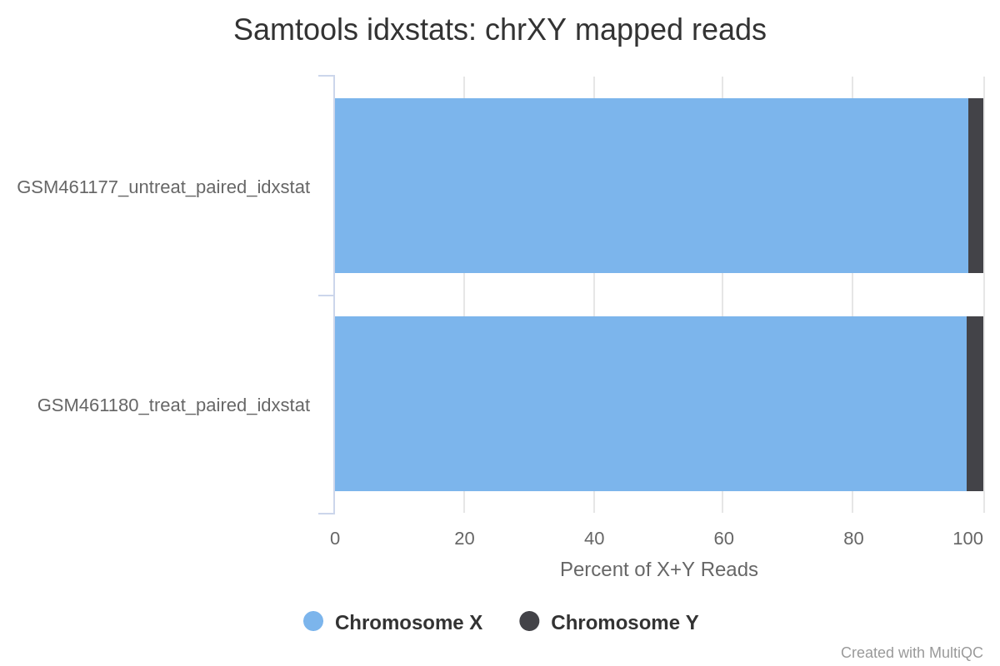 {: .solution}
> > > 
> > {: .question}
> > 
> {: .hands_on}
> 
> #### Genkörperabdeckung
> 
> Die verschiedenen Regionen eines Gens bilden den Genkörper. Es ist wichtig zu prüfen, ob die Leseabdeckung im gesamten Genkörper gleichmäßig ist. Ein Bias zum 5'-Ende von Genen könnte beispielsweise auf einen Abbau der RNA hinweisen. Andererseits könnte eine 3'-Vorspannung darauf hinweisen, dass die Daten von einem 3'-Assay stammen. Um dies zu beurteilen, können wir das Tool **Gen Body Coverage** aus der RSeQC () Tool-Suite verwenden. Dieses Tool skaliert alle Transkripte auf 100 Nukleotide (unter Verwendung einer bereitgestellten Annotationsdatei) und berechnet die Anzahl der Reads, die jede (skalierte) Nukleotidposition abdecken. Da dieses Tool sehr langsam ist, werden wir die Abdeckung nur für 200.000 zufällige Reads berechnen.
> 
> > <hands-on-title>Genkörperabdeckung prüfen</hands-on-title>
> > 
> > 1.  mit den folgenden Parametern:
> >    -  *"SAM/BAM/CRAM-Datensatz "*: `mapped_reads` (Ausgabe von **RNA STAR** )
> >    - *"Was möchten Sie sich ansehen? "*: `A filtered/subsampled selection of reads`
> >        - In *"Configure subsampling "*:
> >            - *"Subsample alignment "*: `Specify a target # of reads`
> >                - *"Target # of reads "*: `200000`
> >                - *"Seed für Zufallszahlengenerator "*: `1`
> >        - *"Was möchten Sie gemeldet haben? "*: `All reads retained after filtering and subsampling`
> >            - *"Ausgabeformat "*: `BAM (-b)`
> >    - *"Verwenden Sie eine Referenzsequenz "*: `No`
> > 
> > 2.  um die GTF-Datei in BED zu konvertieren:
> >    -  *"Zu konvertierende GTF-Datei "*: `Drosophila_melanogaster.BDGP6.32.109.gtf.gz`
> > 
> > 3.  mit den folgenden Parametern:
> >    - *"Führen Sie jede Probe einzeln aus, oder kombinieren Sie mehrere Proben in einem Plot "*: `Run each sample separately`
> >        -  *"Input .bam file "*: Ausgabe von **Samtools view** 
> >    -  *"Referenz-Genmodell "*: `Convert GTF to BED12 on data N: BED12` (Ausgabe von **Convert GTF to BED12** )
> > 
> > 4.  um die RSeQC-Ergebnisse mit den folgenden Parametern zu aggregieren:
> >    - In *"Results "*:
> >        - *"Ergebnisse "*
> >            - *"Mit welchem Tool wurden die Protokolle erstellt? "*: `RSeQC`
> >                - In *"RSeQC output "*:
> >                    -  *"RSeQC-Ausgabe einfügen "*
> >                        - *"Art der RSeQC-Ausgabe? "*: `gene_body_coverage`
> >                            -  *"RSeQC gene_body_coverage output "*: `Gene Body Coverage (BAM) on collection N (text)` (Ausgabe von **Gen Body Coverage (BAM)** )
> > 
> >    > <question-title></question-title>
> >    > 
> >    > 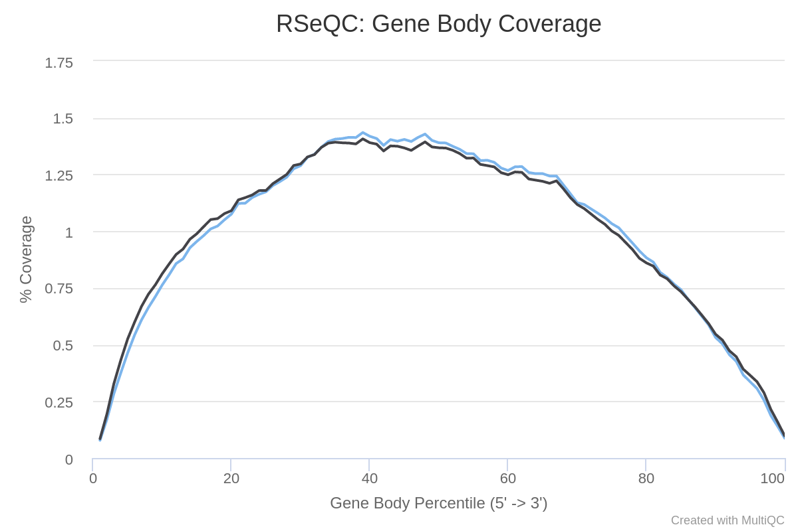
> >    > 
> >    > Wie ist die Abdeckung über die Genkörper hinweg? Sind die Proben in 3' oder 5' verzerrt?
> >    > 
> >    > > <solution-title></solution-title>
> >    > > 
> >    > > Für beide Proben gibt es eine ziemlich gleichmäßige Abdeckung von den 5'- bis zu den 3'-Enden (trotz etwas Rauschen in der Mitte). Also keine offensichtliche Verzerrung in beiden Proben. {: .solution}
> > > 
> > {: .question}
> > 
> {: .hands_on}
> 
> #### Read-Verteilung über Merkmale
> 
> Bei RNA-Seq-Daten erwarten wir, dass die meisten Reads eher auf Exons als auf Introns oder intergene Regionen abgebildet werden. Bevor man mit der Zählung und der differenziellen Expressionsanalyse fortfährt, kann es interessant sein, die Verteilung der Reads auf bekannte Genmerkmale (Exons, CDS, 5'UTR, 3'UTR, Introns, intergene Regionen) zu überprüfen. Eine hohe Anzahl von Reads, die auf intergene Regionen abgebildet werden, kann beispielsweise auf das Vorhandensein einer DNA-Kontamination hinweisen.
> 
> Hier werden wir das Tool **Read Distribution** aus der RSeQC () Tool-Suite verwenden, das die Annotationsdatei verwendet, um die Position der verschiedenen Genmerkmale zu identifizieren.
> 
> > <hands-on-title>Überprüfen Sie die Anzahl der Reads, die jedem Chromosom zugeordnet sind</hands-on-title>
> > 
> > 1.  mit den folgenden Parametern:
> >    -  *"Eingabe .bam/.sam-Datei "*: `RNA STAR on collection N: mapped.bam` (Ausgabe von **RNA STAR** )
> >    -  *"Referenz-Genmodell "*: BED12-Datei (Ausgabe von **Convert GTF to BED12** )
> > 
> > 2.  um die Ergebnisse der Read-Verteilung mit den folgenden Parametern zu aggregieren:
> >    - In *"Results "*:
> >        - *"Ergebnisse "*
> >            - *"Mit welchem Tool wurden die Protokolle erstellt? "*: `RSeQC`
> >                - In *"RSeQC output "*:
> >                    -  *"RSeQC-Ausgabe einfügen "*
> >                        - *"Art der RSeQC-Ausgabe? "*: `read_distribution`
> >                            -  *"RSeQC read_distribution output "*: `Read Distribution on collection N` (Ausgabe von **Read Distribution** )
> > 
> >    > <question-title></question-title>
> >    > 
> >    > 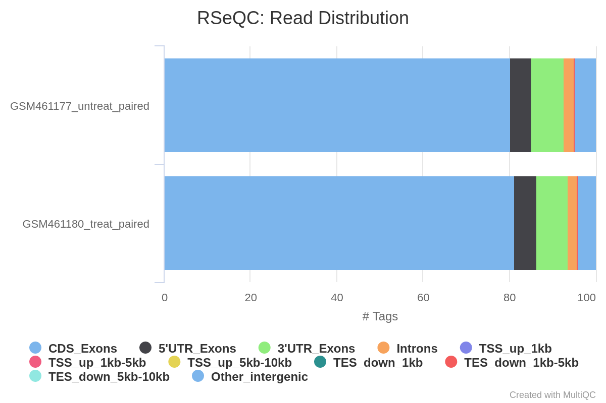
> >    > 
> >    > Was halten Sie von der Read-Verteilung?
> >    > 
> >    > > <solution-title></solution-title>
> >    > > 
> >    > > Die meisten Reads werden auf Exons gemappt (>80%), nur ~2% auf Introns und ~5% auf intergene Regionen, was dem entspricht, was wir erwarten. Dies bestätigt, dass es sich bei unseren Daten um RNA-Seq-Daten handelt und dass das Mapping erfolgreich war. {: .solution}
> > > 
> > {: .question}
> > 
> {: .hands_on}
> 
> Nachdem wir nun die Ergebnisse des Read-Mappings überprüft haben, können wir mit der nächsten Phase der Analyse fortfahren.
> 
{: .details}

Nach dem Mapping haben wir nun die Information, wo sich die Reads auf dem Referenzgenom befinden und wie gut sie gemappt wurden. Der nächste Schritt in der RNA-Seq-Datenanalyse ist die Quantifizierung der Anzahl der Reads, die auf genomische Merkmale (Gene, Transkripte, Exons, ...) abgebildet wurden.

> <comment-title></comment-title>
> 
> Die Quantifizierung hängt sowohl vom Referenzgenom (der FASTA-Datei) als auch von den zugehörigen Annotationen (der GTF-Datei) ab. Es ist äußerst wichtig, eine Annotationsdatei zu verwenden, die derselben Version des Referenzgenoms entspricht, die Sie für das Mapping verwendet haben (z. B. `dm6` hier), da die chromosomalen Koordinaten von Genen in der Regel zwischen verschiedenen Versionen des Referenzgenoms unterschiedlich sind.
> 
{: .comment}

Hier werden wir uns auf die Gene konzentrieren, da wir diejenigen identifizieren möchten, die aufgrund des Knockdowns des Pasilla-Gens differenziell exprimiert werden.

# Zählen der Anzahl der Reads pro annotiertem Gen

Um die Expression einzelner Gene unter verschiedenen Bedingungen (*z.B.* mit oder ohne PS-Abreicherung) zu vergleichen, muss zunächst die Anzahl der Reads pro Gen quantifiziert werden, genauer gesagt die Anzahl der Reads, die den Exons jedes Gens zugeordnet sind.

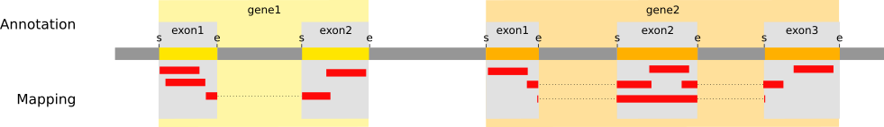

> <question-title></question-title>
> 
> Im vorherigen Bild,
> 
> 1. Wie viele Reads werden für die verschiedenen Exons gefunden?
> 2. Wie viele Reads werden für die verschiedenen Gene gefunden?
> 
> > <solution-title></solution-title>
> > 
> > 1. Anzahl der Reads pro Exon
> > 
> >    | Exon          | Number of reads |
> >    | ------------- | --------------- |
> >    | gene1 - exon1 | 3               |
> >    | gene1 - exon2 | 2               |
> >    | gene2 - exon1 | 3               |
> >    | gene2 - exon2 | 4               |
> >    | gene2 - exon3 | 3               |
> > 
> > 2. Gen1 hat 4 Reads, nicht 5, wegen des Spleißens des letzten Reads (Gen1 - Exon1 + Gen1 - Exon2). Gen2 hat 6 Reads, von denen 3 gespleißt sind.
> > 
> {: .solution}
> 
{: .question}

Für die Lesezählung stehen hauptsächlich zwei Tools zur Verfügung: [**HTSeq-count**](http://htseq.readthedocs.io/en/release_0.9.1/count.html) () oder **featureCounts** (). Zusätzlich erlaubt **STAR** das Zählen von Reads während des Mappings: Die Ergebnisse sind identisch mit denen von **HTSeq-count**. Während diese Ausgabe für die meisten Analysen ausreicht, bietet **featureCounts** mehr Anpassungsmöglichkeiten für die Zählung von Reads (minimale Mapping-Qualität, Zählen von Reads anstelle von Fragmenten, Zählen von Transkripten anstelle von Genen usw.).

Im Prinzip ist das Zählen von Reads, die sich mit genomischen Merkmalen überschneiden, eine recht einfache Aufgabe. Allerdings muss die Strandness der Bibliothek bestimmt werden. Dies ist in der Tat ein Parameter von **featureCounts**. Im Gegensatz dazu wertet **STAR** die Zählungen in die drei möglichen Strandnesses aus, aber Sie benötigen diese Information trotzdem, um die Zählungen zu extrahieren, die Ihrer Bibliothek entsprechen.

## Schätzung der Strandness

RNAs, auf die in RNA-Seq-Experimenten typischerweise abgezielt wird, sind einzelsträngig (*z.B.*, mRNAs) und weisen daher eine Polarität auf (5'- und 3'-Enden, die sich funktionell unterscheiden). Bei einem typischen RNA-Seq-Experiment geht die Information über die Strangigkeit verloren, nachdem beide Stränge der cDNA synthetisiert, auf ihre Größe hin selektiert und in eine Sequenzierungsbibliothek umgewandelt wurden. Diese Information kann jedoch für den Schritt des Read-Counting sehr nützlich sein, insbesondere für Reads, die sich auf der Überlappung von 2 Genen befinden, die auf unterschiedlichen Strängen liegen.

 als auch Gen2 (Rückwärtsstrang) zugeordnet werden kann.")

Einige Bibliotheksvorbereitungsprotokolle erzeugen sogenannte *stranded* RNA-Seq-Bibliotheken, bei denen die Stranginformationen erhalten bleiben ( bietet einen hervorragenden Überblick). In der Praxis ist es unwahrscheinlich, dass Sie bei Illumina RNA-Seq-Protokollen auf alle in diesem Artikel beschriebenen Möglichkeiten stoßen. Höchstwahrscheinlich werden Sie es entweder mit:

- Unstranded RNA-Seq-Daten
- Gestrandete RNA-Seq-Daten, die durch die Verwendung spezieller RNA-Isolierungskits während der Probenvorbereitung erzeugt wurden

> <details-title>Mehr Details zur Strenge</details-title>
> 
> 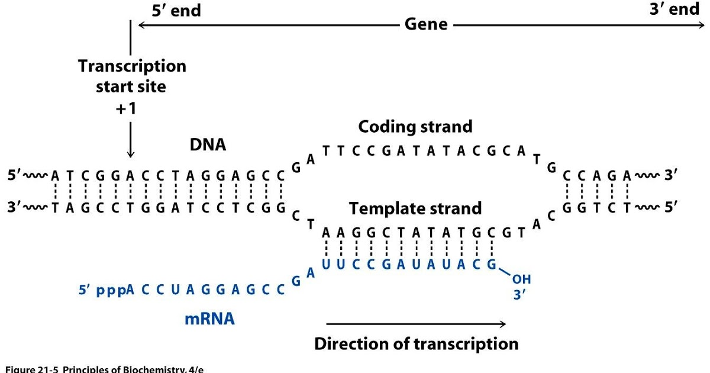
> 
> Der Vorteil von gestrandeter RNA-Seq ist, dass man unterscheiden kann, ob die Reads von vorwärts oder rückwärts kodierten Transkripten stammen. Im folgenden Beispiel kann die Anzahl der Reads für das Gen Mrpl43 nur in einer gestrandeten Bibliothek effizient geschätzt werden, da die meisten Reads das Gen Peo1 in umgekehrter Orientierung überlappen:
> 
>  vs. reverse strand-specific (unten) RNA-Seq read alignment (using IGV, forward mapping reads are red and reverse mapping reads are blue )")
> 
> Je nach Ansatz und je nachdem, ob man eine Single-End- oder eine Paired-End-Sequenzierung durchführt, gibt es mehrere Möglichkeiten, wie man die Ergebnisse der Zuordnung dieser Reads zum Genom interpretieren kann:
> 
> ")
> 
{: .details}

Diese Information sollte in den FASTQ-Dateien enthalten sein, fragen Sie Ihre Sequenziereinrichtung! Wenn nicht, versuchen Sie, sie auf der Website zu finden, von der Sie die Daten heruntergeladen haben, oder in der entsprechenden Veröffentlichung.

.")

Es gibt 4 Möglichkeiten, die Strenge von **STAR**-Ergebnissen abzuschätzen (wählen Sie die von Ihnen bevorzugte)

1. Wir können eine visuelle Inspektion der Read-Stränge auf IGV durchführen (bei Paired-End-Datensätzen ist dies weniger einfach als bei Single-Read-Daten, und wenn Sie viele Proben haben, kann dies schmerzhaft sein).

   > <hands-on-title>Schätzung der Strangigkeit mit IGV für eine Paired-End-Bibliothek</hands-on-title>
   > 
   > 1. Kehren Sie zu Ihrer IGV-Sitzung zurück und öffnen Sie die BAM-Datei `GSM461177_untreat_paired`.
   > 
   >    > <tip-title>Wenn Sie es nicht haben</tip-title>
   >    > 
   >    > Kein Problem, Sie müssen nur die vorherigen Schritte wiederholen:
   >    > 
   >    > 1. IGV lokal starten
   >    > 2. Klicken Sie auf die Sammlung `RNA STAR on collection N: mapped.bam` (Ausgabe von **RNA STAR** )
   >    > 3. Erweitern Sie die  datei `GSM461177_untreat_paired`.
   >    > 4. Klicken Sie auf das `local` in `display with IGV local D. melanogaster (dm6)`, um die Reads in den IGV-Browser zu laden
   >    > 
   >    {: .tip}
   > 
   > 2. **IGV** 
   >    1. Zoom auf `chr3R:9,445,000-9,448,000` (Chromosom 3 zwischen 9,445 kb und 9,448 kb), auf der `mapped.bam` Spur
   >    2. Klicken Sie mit der rechten Maustaste und wählen Sie dann `Color Aligments by` -> `first-in-pair strand`
   >    3. Rechtsklick und `Squished` auswählen
   > 
   {: .hands_on}

   > <question-title></question-title>
   > 
   > 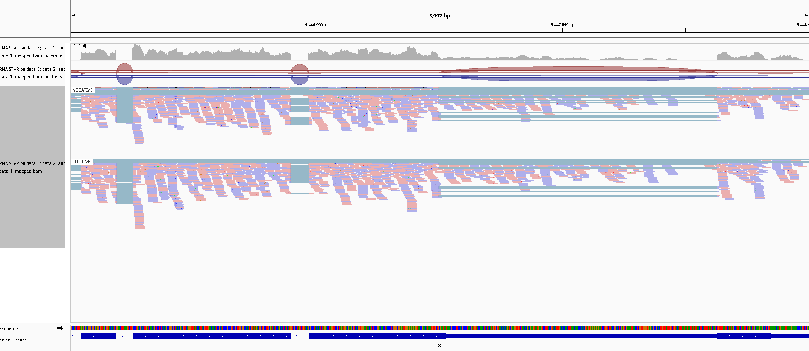
   > 
   > 1. Sind die Reads gleichmäßig auf die beiden Gruppen (NEGATIV und POSITIV) verteilt?
   > 2. Welcher Art ist der Bibliotheksstrand?
   > 
   > > <solution-title></solution-title>
   > > 
   > > 1. Ja, wir sehen in beiden Gruppen die gleiche Anzahl von Reads.
   > > 2. Dies bedeutet, dass die Bibliothek nicht gestreut war.
   > > 
   > > > <comment-title>Wie wäre es, wenn die Bibliothek gestrandet wäre?</comment-title>
   > > > 
   > > >  vs. reverse strand-specific (unten)")
   > > > 
   > > > Beachten Sie, dass es keinen Read auf der POSITIV-Gruppe für den Rückwärtsstrang gibt. {: .comment} {: .solution} {: .question}

2. Alternativ können Sie statt der BAM auch die von **STAR** generierte Strangabdeckung verwenden. Mit **pyGenomeTracks** können wir die Abdeckung auf jedem Strang für jede Probe visualisieren. Dieses Tool verfügt über eine Vielzahl von Parametern, mit denen Sie Ihre Diagramme anpassen können.

   > <hands-on-title>Abschätzung der Strenge mit pyGenometracks aus der STAR-Abdeckung</hands-on-title>
   > 
   > 1. :
   >    - *"Region des Genoms zum Plotten "*: `chr4:540,000-560,000`
   >    - In *"Include tracks in your plot "*:
   >        -  *"Fügen Sie Spuren in Ihren Plot ein "*
   >            - *"Stil des Tracks wählen "*: `Bedgraph track`
   >                - *"Plot-Titel "*: Sie müssen dieses Feld leer lassen, damit der Titel des Plots der Name der Probe ist.
   >                -  *"Track file(s) bedgraph format "*: Wählen Sie `RNA STAR on collection N: Coverage Uniquely mapped strand 1`.
   >                - *"Farbe der Spur "*: Wählen Sie eine Farbe Ihrer Wahl, zum Beispiel blau
   >                - *"Mindestwert "*: `0`
   >                - *"Höhe "*: `3`
   >                - *"Visualisierung des Datenbereichs anzeigen "*: `Yes`
   >        -  *"Fügen Sie Spuren in Ihren Plot ein "*
   >            - *"Stil des Tracks wählen "*: `Bedgraph track`
   >                - *"Plot-Titel "*: Sie müssen dieses Feld leer lassen, damit der Titel des Plots der Name der Probe ist.
   >                -  *"Track file(s) bedgraph format "*: Wählen Sie `RNA STAR on collection N: Coverage Uniquely mapped strand 2`.
   >                - *"Farbe der Spur "*: Wählen Sie eine Farbe Ihrer Wahl, die sich von der ersten unterscheidet, z. B. rot
   >                - *"Mindestwert "*: `0`
   >                - *"Höhe "*: `3`
   >                - *"Visualisierung des Datenbereichs anzeigen "*: `Yes`
   >        -  *"Fügen Sie Spuren in Ihren Plot ein "*
   >            - *"Stil des Tracks wählen "*: `Gene track / Bed track`
   >                - *"Plot title "*: `Genes`
   >                -  *"Track-Datei(en) bed oder gtf-Format "*: Wählen Sie `Drosophila_melanogaster.BDGP6.32.109_UCSC.gtf.gz`
   >                - *"Höhe "*: `5`
   {: .hands_on}

   > <question-title></question-title>
   > 
   > 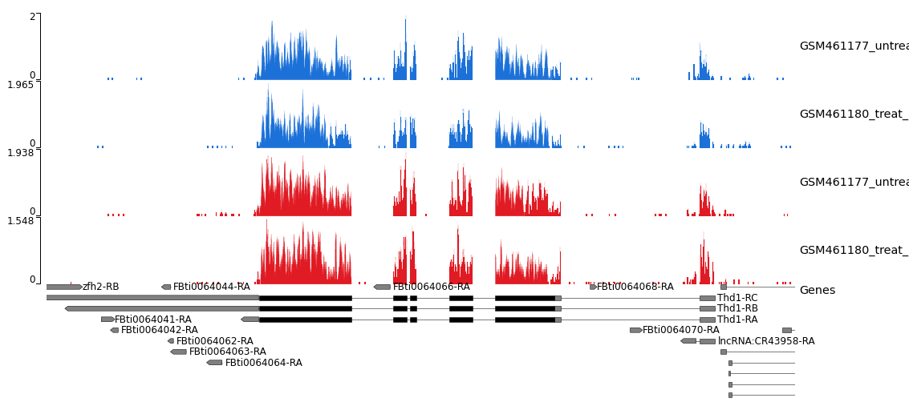
   > 
   > 1. Um welches Gen handelt es sich? Welcher Strang ist es?
   > 2. Wie hoch ist die durchschnittliche Abdeckung für jeden Strang?
   > 3. Wie hoch ist die Strenge der Bibliothek?
   > 
   > > <solution-title></solution-title>
   > > 
   > > 1. Wir sehen 3 Transkripte namens Thd1-RC, Thd1-RB und Thd1-RA des Gens Thd1. Das Gen befindet sich auf dem Rückwärtsstrang.
   > > 2. Die Skala geht bei den 4 Profilen auf 1,5-2. Die durchschnittliche Abdeckung sollte etwa 1,2-1,5 betragen
   > > 3. Wir schließen daraus, dass die Bibliothek nicht stranded ist.
   > > 
   > > > <comment-title>Wie wäre es, wenn die Bibliothek gestrandet wäre?</comment-title>
   > > > 
   > > > 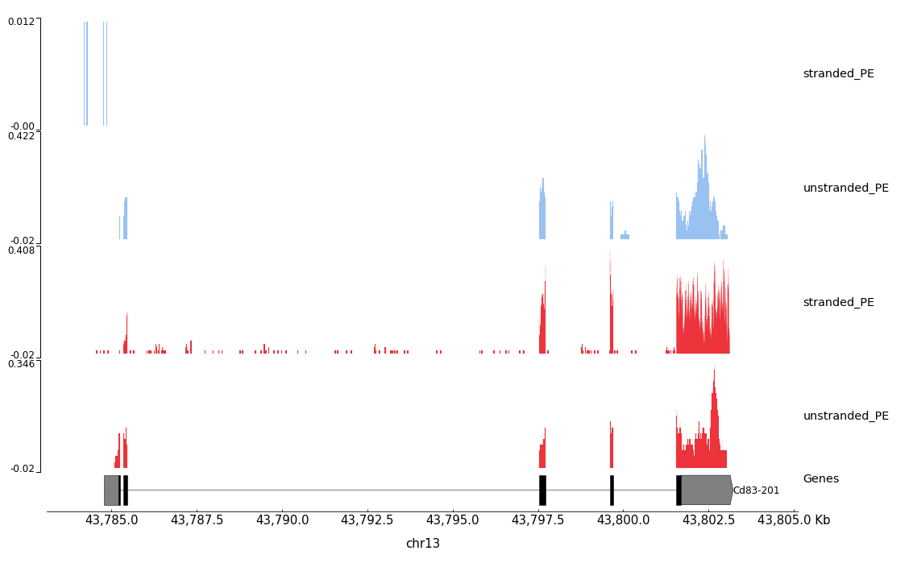 Beachten Sie, dass die Abdeckung auf dem Strang 1 für die stranded_PE-Probe sehr niedrig ist, während das Gen vorwärts ist. Dies bedeutet, dass die Bibliothek von stranded_PE rückwärts gestrandet ist. Im Gegensatz dazu ist bei unstranded_PE der Umfang für beide Stränge vergleichbar. {: .comment} {: .solution}
   > 
   {: .question}

3. Sie können die Ausgabe von **STAR** mit den Zählungen verwenden. Wie bereits erläutert, wertet **STAR** die Anzahl der Reads auf den Genen für die drei möglichen Szenarien aus: unstranded library, stranded forward oder stranded reverse. Die Bedingung, die den Genen mehr Reads zuordnet, muss die Bedingung sein, die zu Ihrer Bibliothek passt.

   > <hands-on-title>Schätzung der Strenge mit STAR counts</hands-on-title>
   > 
   > 1. , um die STAR Counts mit den folgenden Parametern zu aggregieren:
   >    - In *"Results "*:
   >        - *"Ergebnisse "*
   >            - *"Mit welchem Tool wurden die Protokolle erstellt? "*: `STAR`
   >                - In *"STAR output "*:
   >                    -  *"STAR-Ausgabe einfügen "*
   >                        - *"Art der STAR-Ausgabe? "*: `Gene counts`
   >                            -  *"STAR gene count output "*: `RNA STAR on collection N: reads per gene` (Ausgabe von **RNA STAR** )
   > 
   {: .hands_on}

   > <question-title></question-title>
   > 
   > 1. Wie viel Prozent der Reads werden den Genen zugeordnet, wenn die Bibliothek nichtstrandig/gleichsträngig/rückwärtssträngig ist?
   > 2. Wie hoch ist die Strenge der Bibliothek?
   > 
   > > <solution-title></solution-title>
   > > 
   > > 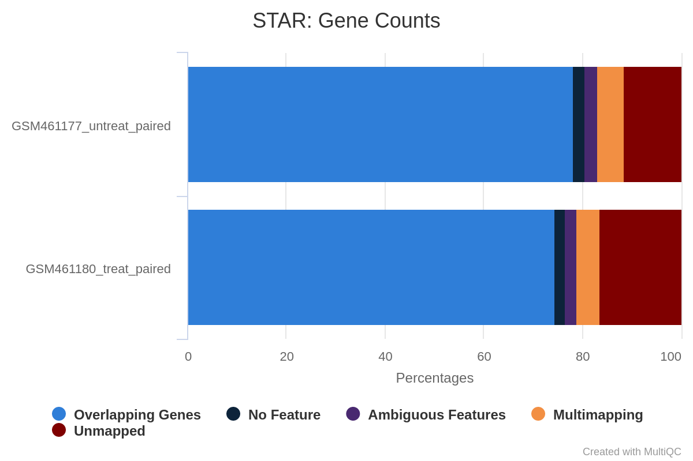 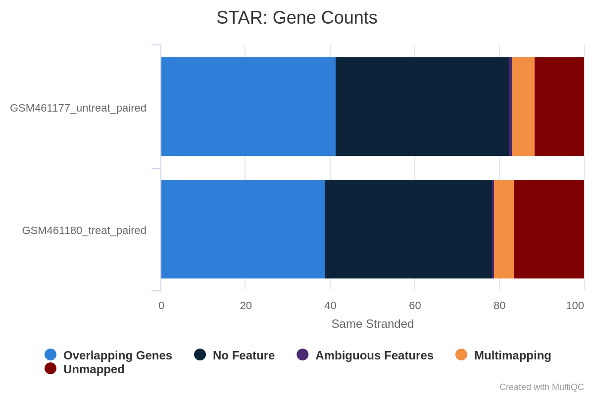 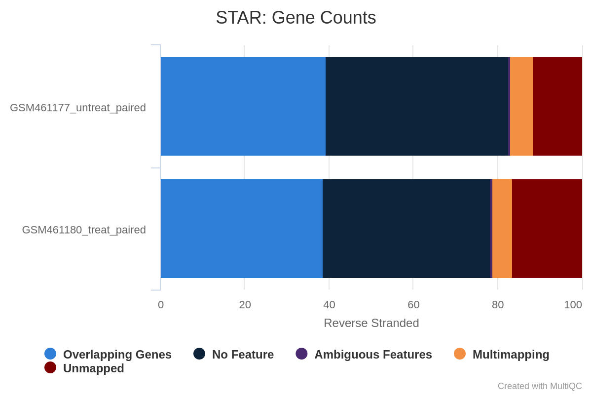
   > > 
   > > 1. Etwa 75% der Reads werden den Genen zugeordnet, wenn die Bibliothek nicht stranded ist, während es in den anderen Fällen etwa 40% sind.
   > > 2. Dies deutet darauf hin, dass die Bibliothek nicht stranded ist.
   > > 
   > > > <comment-title>Wie wäre es, wenn die Bibliothek gestrandet wäre?</comment-title>
   > > > 
   > > > 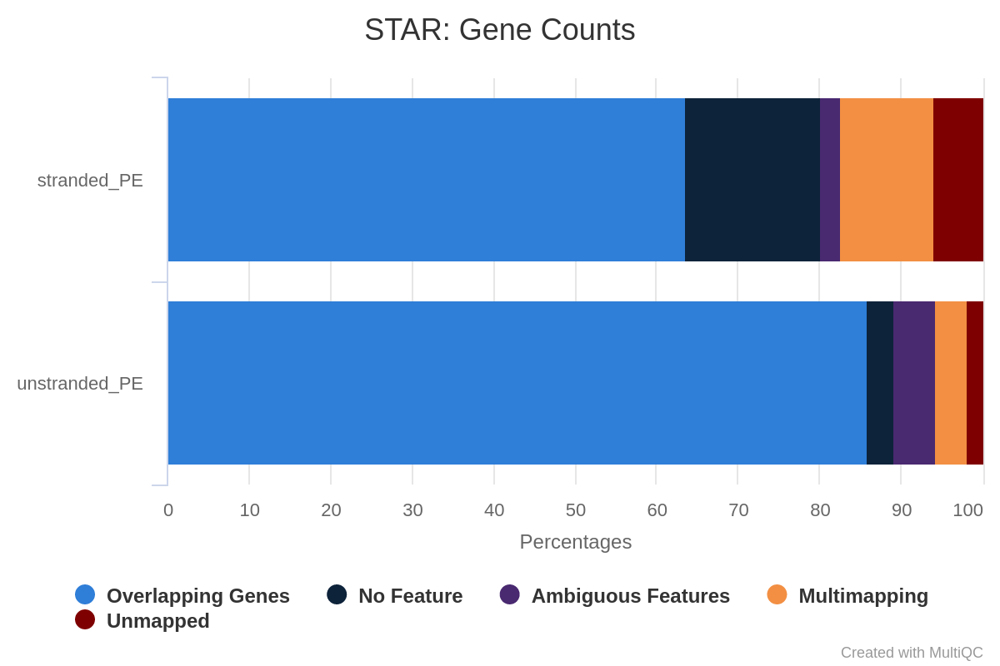 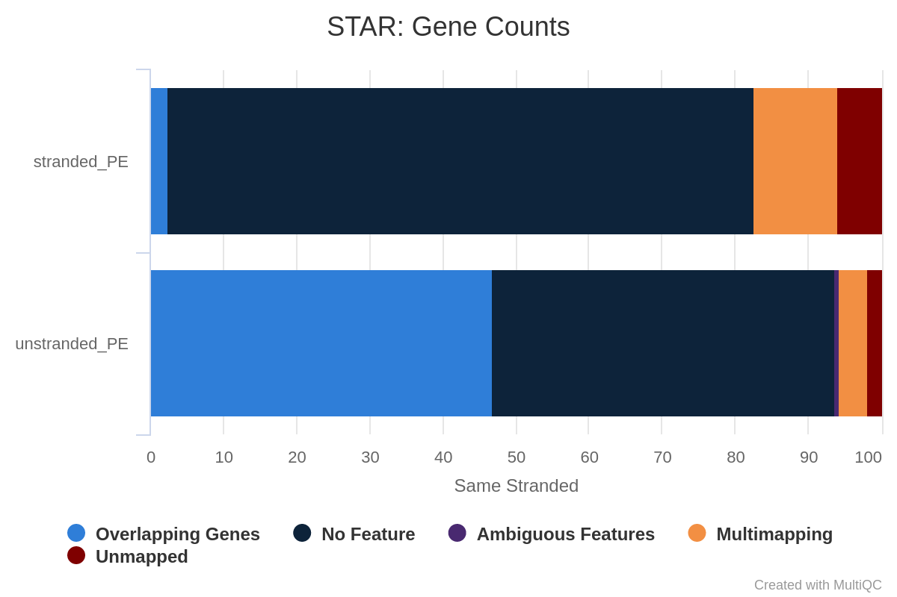 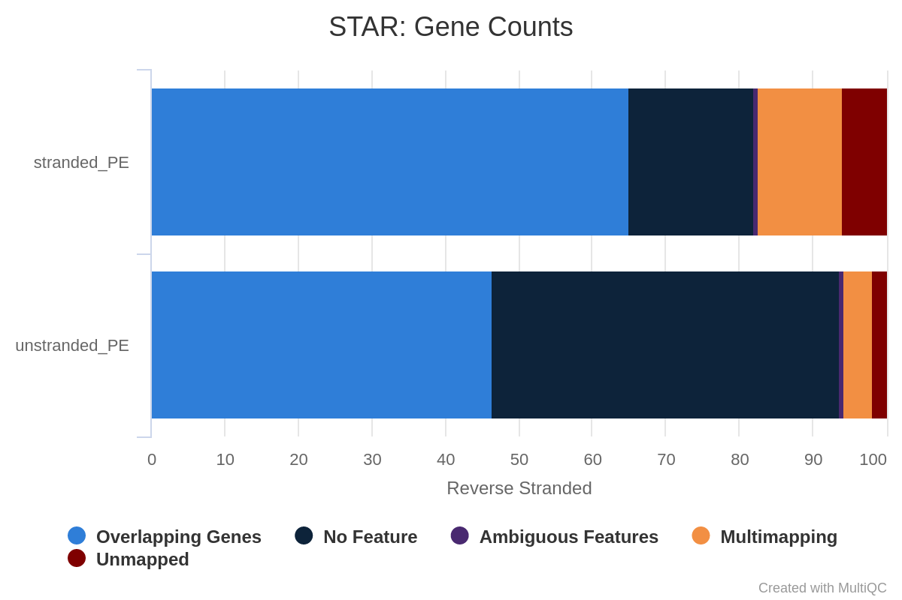 Man beachte, dass es sehr wenige Reads gibt, die den Genen für same stranded zugeordnet werden. Die Zahlen sind zwischen unstranded und reverse stranded vergleichbar, da sich nur wenige Gene auf den gegenüberliegenden Strängen überlappen, aber dennoch geht es von 63,6% (unstranded) auf 65% (reverse stranded). {: .comment} {: .solution}
   > 
   {: .question}

4. Eine weitere Möglichkeit ist die Schätzung dieser Parameter mit einem Tool namens **Infer Experiment** aus der RSeQC () Tool-Suite.

   Dieses Tool nimmt die BAM-Dateien aus dem Mapping, wählt eine Teilprobe der Reads aus und vergleicht deren Genomkoordinaten und Stränge mit denen des Referenzgenmodells (aus einer Annotationsdatei). Anhand des Strangs der Gene kann es abschätzen, ob die Sequenzierung strangspezifisch ist, und wenn ja, wie die Reads gestrandet sind (vorwärts oder rückwärts).

   > <hands-on-title>Bestimmung der Strenge der Bibliothek mit dem Infer-Experiment</hands-on-title>
   > 
   > 1.  um die GTF-Datei in BED zu konvertieren:
   >    -  *"Zu konvertierende GTF-Datei "*: `Drosophila_melanogaster.BDGP6.32.109_UCSC.gtf.gz`
   > 
   >    Möglicherweise haben Sie diese `BED12`-Datei bereits aus dem `Drosophila_melanogaster.BDGP6.32.109_UCSC.gtf.gz`-Datensatz konvertiert, wenn Sie den ausführlichen Teil über Qualitätsprüfungen durchgeführt haben. In diesem Fall ist es nicht notwendig, die Konvertierung ein zweites Mal vorzunehmen
   > 
   > 2. , um die Strenge der Bibliothek mit den folgenden Parametern zu bestimmen:
   >    -  *"Eingabe .bam-Datei "*: `RNA STAR on collection N: mapped.bam` (Ausgabe von **RNA STAR** )
   >    -  *"Referenz-Genmodell "*: BED12-Datei (Ausgabe von **Convert GTF to BED12** )
   >    - *"Anzahl der abgetasteten Reads "*: `200000` {: .hands_on}

    tool erzeugt eine Datei mit Informationen über:
    - Paired-End- oder Single-End-Bibliothek
    - Anteil der Reads, die nicht bestimmt werden konnten
    - 2 Zeilen
        - Für Single-End
            - `Fraction of reads explained by "++,--"`: der Anteil der Reads, die dem Vorwärtsstrang zugeordnet sind
            - `Fraction of reads explained by "+-,-+"`: der Anteil der Reads, die dem Rückwärtsstrang zugeordnet sind
        - Für Paired-End
            - `Fraction of reads explained by "1++,1--,2+-,2-+"`: der Anteil der Reads, die dem Vorwärtsstrang zugeordnet sind
            - `Fraction of reads explained by "1+-,1-+,2++,2--"`: der Anteil der Reads, die dem Rückwärtsstrang zugeordnet sind

   Wenn die beiden "Fraction of reads explained by"-Zahlen nahe beieinander liegen, schließen wir daraus, dass es sich bei der Bibliothek nicht um einen strangspezifischen Datensatz (oder um einen nicht stranggebundenen Datensatz) handelt.

   > <question-title></question-title>
   > 
   > 1. Was sind die "Fraction of the reads explained by" Ergebnisse für `GSM461177_untreat_paired`?
   > 2. Glauben Sie, dass der Bibliothekstyp der beiden Proben stranded oder unstranded ist?
   > 
   > > <solution-title></solution-title>
   > > 
   > > 1. Ergebnisse für `GSM461177_untreat_paired`:
   > > 
   > >    
   > > 
   > >    ```text
   > >    This is PairEnd Data
   > >    Fraction of reads failed to determine: 0.1013
   > >    Fraction of reads explained by "1++,1--,2+-,2-+": 0.4626
   > >    Fraction of reads explained by "1+-,1-+,2++,2--": 0.4360
   > >    ```
   > > 
   > >    46,26% der Reads werden also dem Vorwärtsstrang und 43,60% dem Rückwärtsstrang zugeordnet.
   > > 
   > > 2. Ähnliche Statistiken werden für `GSM461180_treat_paired` gefunden, also scheint die Bibliothek für beide Proben vom Typ unstranded zu sein.
   > > 
   > > > <comment-title>Wie wäre es, wenn die Bibliothek gestrandet wäre?</comment-title>
   > > > 
   > > > Nehmen wir weiterhin die 2 BAM als Beispiel, so erhalten wir für die unstranded:
   > > > 
   > > > ```text
   > > > This is PairEnd Data
   > > > Fraction of reads failed to determine: 0.0382
   > > > Fraction of reads explained by "1++,1--,2+-,2-+": 0.4847
   > > > Fraction of reads explained by "1+-,1-+,2++,2--": 0.4771
   > > > ```
   > > > 
   > > > Und für den Rückwärtsstrang:
   > > > 
   > > > ```text
   > > > This is PairEnd Data
   > > > Fraction of reads failed to determine: 0.0504
   > > > Fraction of reads explained by "1++,1--,2+-,2-+": 0.0061
   > > > Fraction of reads explained by "1+-,1-+,2++,2--": 0.9435
   > > > ```
   > > > 
   > > {: .comment} {: .solution} {: .question}

> <details-title>Strandness und Softwareeinstellungen</details-title>
> 
> Da es manchmal recht schwierig ist, herauszufinden, welche Einstellungen denen anderer Programme entsprechen, könnte die folgende Tabelle hilfreich sein, um den Bibliothekstyp zu identifizieren:
> 
> | Library type         | **Infer Experiment** | **TopHat**       | **HISAT2**         | **HTSeq-count** | **featureCounts** |
> | -------------------- | -------------------- | ---------------- | ------------------ | --------------- | ----------------- |
> | Paired-End (PE) - SF | 1++,1--,2+-,2-+      | FR Second Strand | Second Strand F/FR | yes             | Forward (1)       |
> | PE - SR              | 1+-,1-+,2++,2--      | FR First Strand  | First Strand R/RF  | reverse         | Reverse (2)       |
> | Single-End (SE) - SF | ++,--                | FR Second Strand | Second Strand F/FR | yes             | Forward (1)       |
> | SE - SR              | +-,-+                | FR First Strand  | First Strand R/RF  | reverse         | Reverse (2)       |
> | PE, SE - U           | undecided            | FR Unstranded    | default            | no              | Unstranded (0)    |
> 
{: .details}

## Zählen der Reads pro Genen




<div class="featureCounts" markdown="1">

Da Sie sich für die featureCounts-Variante des Tutorials entschieden haben, führen wir jetzt **featureCounts** aus, um die Anzahl der Reads pro annotiertem Gen zu zählen.

> <hands-on-title>Anzahl der Reads pro annotiertem Gen zählen</hands-on-title>
> 
> 1.  mit den folgenden Parametern, um die Anzahl der Reads pro Gen zu zählen:
>    -  *"Alignment-Datei "*: `RNA STAR on collection N: mapped.bam` (Ausgabe von **RNA STAR** )
>    - *"Stranginformationen angeben "*: `Unstranded`
>    - *"Gen-Annotation-Datei "*: `A GFF/GTF file in your history`
>        -  *"Gen-Annotation-Datei "*: `Drosophila_melanogaster.BDGP6.32.109_UCSC.gtf.gz`
>    - *"GFF Merkmalstyp-Filter "*: `exon`
>    - *"GFF-Genbezeichner "*: `gene_id`
>    - *"Ausgabeformat "*: `Gene-ID "\t" read-count (MultiQC/DESeq2/edgeR/limma-voom compatible)`
>    - *"Genlängendatei erstellen "*: `Yes`
>    - *"Enthält die Eingabe Read-Paare "*: `Yes, paired-end and count them as 1 single fragment`
>    - In *"Read filtering options "*:
>        - *"Mindestabbildungsqualität pro Read "*: `10`
> 
> 2.  um die Berichte mit den folgenden Parametern zu aggregieren:
>    - In *"Results "*:
>        - *"Ergebnisse "*
>            - *"Mit welchem Tool wurden die Protokolle erstellt? "*: `featureCounts`
>                -  *"Ausgabe von FeatureCounts "*: `featureCounts on collection N: Summary` (Ausgabe von **featureCounts** )
> 
>    > <question-title></question-title>
>    > 
>    > 1. Wie viele Reads wurden einem Gen zugeordnet?
>    > 2. Wann sollten wir uns Sorgen um die Zuordnungsrate machen? Was sollten wir tun?
>    > 
>    > > <solution-title></solution-title>
>    > > 
>    > > 1. Etwa 63% der Reads wurden Genen zugeordnet: diese Menge ist gut genug.
>    > > 
>    > >    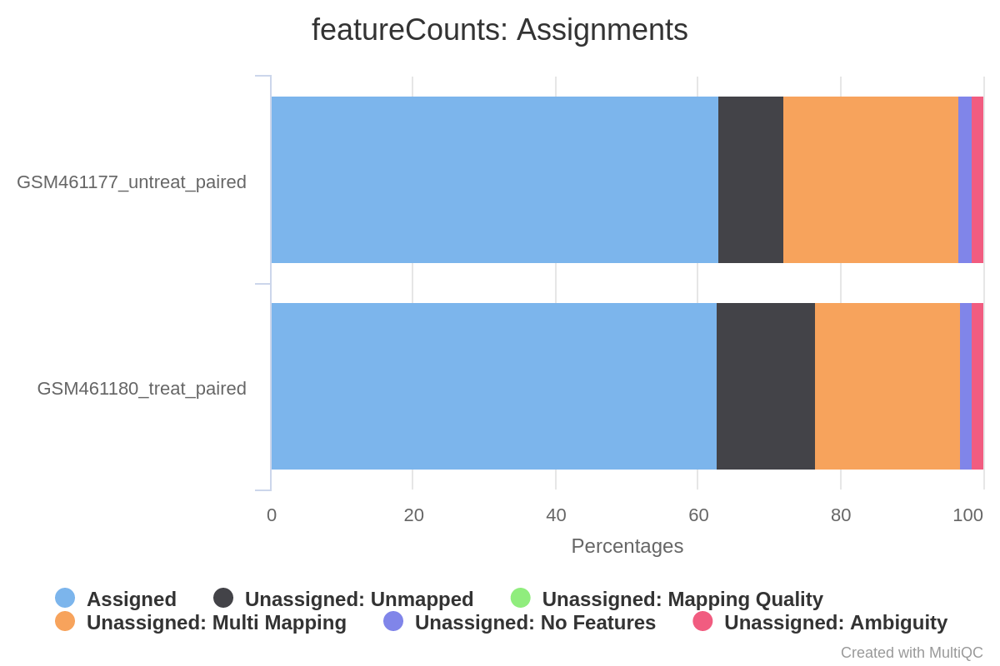
>    > > 
>    > >    Einige Reads sind nicht zugeordnet, weil sie mehrfach gemappt wurden; andere wurden keinen oder mehrdeutigen Features zugeordnet.
>    > > 
>    > > 2. Wenn der Prozentsatz unter 50% liegt, sollten Sie untersuchen, wo Ihre Reads gemappt werden (innerhalb von Genen oder nicht, mit IGV) und überprüfen, ob die Annotation der richtigen Referenzgenomversion entspricht.
>    > > 
> > > 
> > {: .solution}
> > 
> {: .question}
> 
{: .hands_on}

Die Hauptausgabe von **featureCounts** ist eine Tabelle mit den Counts, d.h. der Anzahl der Reads (oder Fragmente im Falle von Paired-End-Reads), die jedem Gen (in Zeilen, mit ihrer ID in der ersten Spalte) in der angegebenen Annotation zugeordnet sind. **FeatureCount** erzeugt auch die Ausgabedatensätze für die **Feature-Länge**. Wir werden diese Datei später benötigen, wenn wir das **goseq**-Tool ausführen.
</div>

<div class="STAR" markdown="1">

Da Sie sich für die STAR-Variante des Tutorials entschieden haben, werden wir **STAR** zum Zählen der Reads verwenden.

Wie oben geschrieben, hat **STAR** während des Mappings die Reads für jedes in der Genannotationsdatei angegebene Gen gezählt (dies wurde durch die Option `Per gene read counts (GeneCounts)` erreicht). Diese Ausgabe enthält jedoch zu Beginn einige Statistiken und die Zählungen für jedes Gen in Abhängigkeit von der Bibliothek (unstranded ist Spalte 2, stranded forward ist Spalte 3 und stranded reverse ist Spalte 4).

> <hands-on-title>Inspect STAR output</hands-on-title>
> 
> 1. Überprüfen Sie die Zählungen von `GSM461177_untreat_paired` in der Sammlung `RNA STAR on collection N: reads per gene`
> 
{: .hands_on}

> 
> <question-title></question-title>
> 
> 1. Wie viele Reads sind unmapped/multi-mapped?
> 2. In welcher Zeile beginnt die Zählung der Gene?
> 3. Was sind die verschiedenen Spalten?
> 4. Welche Spalten sind für unseren Datensatz am interessantesten?
> 
> > <solution-title></solution-title>
> > 
> > 1. Es gibt 1.190.029 ungemappte Reads und 571.324 mehrfach gemappte Reads.
> > 2. Es beginnt in Zeile 5 mit dem Gen `FBgn0250732`.
> > 3. Es gibt 4 Spalten:
> >    1. Gen-ID
> >    2. Zählungen für nicht-strängige RNA-seq
> >    3. Zählungen für den ersten Lesestrang, der mit der RNA abgeglichen wurde
> >    4. Zählungen für den 2. Lesestrang, der mit der RNA abgeglichen wurde
> > 4. Wir brauchen die Gene ID Spalte und die 2. Spalte wegen der Unschärfe unserer Daten
> > 
> {: .solution}
> 
{: .question}

Wir werden die Ausgabe von **STAR** so umformatieren, dass sie der Ausgabe von **featureCounts** (oder anderen Zählsoftwares) ähnelt, die nur zwei Spalten enthält, eine mit IDs und die andere mit Zählungen.

> <hands-on-title>Neuformatierung der STAR-Ausgabe</hands-on-title>
> 
> 1.  lines from a dataset (tail) to remove the first 4 lines with the following parameters:
>    -  *"Textdatei "*: `RNA STAR on collection N: reads per gene` (Ausgabe von **RNA STAR** )
>    - *"Operation "*: `Keep everything from this line on`
>    - *"Anzahl der Zeilen "*: `5`
> 
> 2.  Spalten aus einer Tabelle mit den folgenden Parametern:
>    - *"Spalten schneiden "*: `c1,c2`
>    - *"Abgegrenzt durch "*: `Tab`
>    -  *"From "*: `Select last on collection N` (Ausgabe des **Select last** )
> 
> 3. Umbenennen der Sammlung `FeatureCount-like files`
> 
{: .hands_on}

Im weiteren Verlauf des Tutorials werden wir die Größe der einzelnen Gene ermitteln müssen. Dies ist eine der Ausgaben von **FeatureCounts**, aber wir können sie auch direkt aus der Genannotationsdatei erhalten. Da diese Datei recht lang ist, empfehlen wir, sie jetzt zu starten.

> <hands-on-title>Genlänge ermitteln</hands-on-title>
> 
> 1.  mit den folgenden Parametern:
>    - *"Wählen Sie eine integrierte GTF-Datei oder eine aus Ihrer Historie "*: `Use a GTF from history`
>      -  *"Wählen Sie eine GTF-Datei "*: `Drosophila_melanogaster.BDGP6.32.109_UCSC.gtf.gz`
>    - *"Auszuführende Analyse "*: `gene lengths only`
> 
>    > <warning-title>Prüfen Sie die Version des Tools unten</warning-title>
>    > 
>    > Dies funktioniert nur mit Version 0.1.2 oder höher
>    > 
>    > 
>    > 
> > 
> {: .warning}
> 
{: .hands_on}

</div>

> <question-title></question-title>
> 
> Welches Feature hat die meisten counts für beide Proben? (Tipp: Verwenden Sie das Werkzeug Sortieren)
> 
> > <solution-title></solution-title>
> > 
> > Um das am häufigsten entdeckte Merkmal anzuzeigen, müssen wir die Tabelle der Zählungen sortieren. Dies kann wie folgt geschehen:
> > 
> > 1.  mit den folgenden Parametern:
> >    -  *"Sort Query "*: <span class="featureCounts" markdown="1">`featureCounts on collection N: Counts` (Ausgabe von **featureCounts** )</span><span class="STAR" markdown="1">Verwendet die Sammlung `FeatureCount-like files`</span>
> >    - *"Number of header "*: <span class="featureCounts" markdown="1">`1`</span><span class="STAR" markdown="1">`0`</span>
> >    - In *"1: Spaltenauswahlen "*:
> >      - *"on column "*: `Column: 2`
> > 
> >        Diese Spalte enthält die Anzahl der Reads = counts
> > 
> >      - *"in "*: `Descending order`
> > 
> > 2. Prüfen Sie das Ergebnis
> > 
> >    Das Ergebnis der Sortierung der Tabelle nach Spalte 2 zeigt, dass FBgn0284245 das Merkmal mit den meisten Counts ist (etwa 128.740 in `GSM461177_untreat_paired` und 127.400 in `GSM461180_treat_paired`).
> > 
> >    Der Vergleich verschiedener Ausgabedateien ist einfacher, wenn wir mehr als einen Datensatz gleichzeitig betrachten können. Mit der Scratchbook-Funktion können wir eine Sammlung von Datensätzen zusammenstellen, die dann gemeinsam auf dem Bildschirm angezeigt werden.
> > 
> >    > <hands-on-title>(Optional) Anzeige der sortierten Reads mit dem Scratchbook</hands-on-title>
> >    > 
> >    > 1. Das **Scratchbook** wird durch Klicken auf das Neun-Blöcke-Symbol rechts in der oberen Menüleiste von Galaxy aktiviert:
> >    > 
> >    >    
> >    > 
> >    > 2. Wenn das Scratchbook **aktiviert** ist, werden die betrachteten Datensätze (durch Anklicken des Augensymbols) zur Scratchbook-Ansicht hinzugefügt:
> >    > 
> >    >    
> >    > 
> >    > 3. Klicken Sie auf das  (Auge), um eine der **sortierten Zähldateien** anzuzeigen. Anstatt die gesamte mittlere Leiste zu belegen, wird die Datensatzansicht nun als Overlay angezeigt:
> >    > 
> >    >    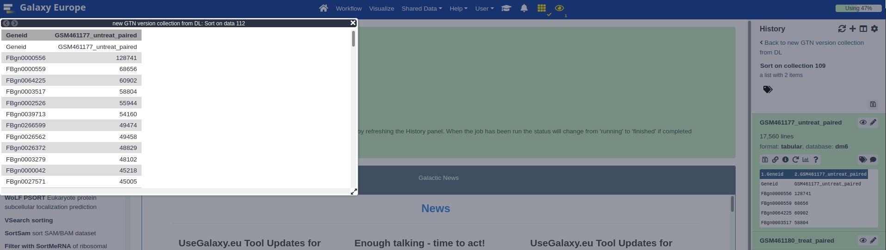
> >    > 
> >    > 4. Klicken Sie anschließend auf das  (Auge) auf die **zweite sortierte Zähldatei**. Der zweite Datensatz wird über den ersten gelegt, aber Sie können das Fenster verschieben, um die beiden Datensätze nebeneinander zu sehen:
> >    > 
> >    >    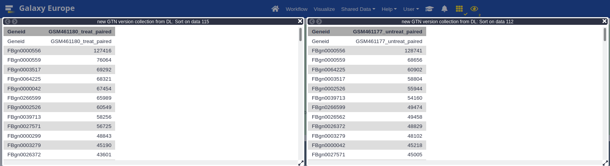
> >    > 
> >    > 5. Um den Scratchbook-Auswahlmodus zu **verlassen**, klicken Sie erneut auf das **Scratchbook-Symbol**. Sie können entscheiden, ob Sie die Fenster schließen oder verkleinern wollen, um sie später anzuzeigen.
> >    > 
> > > 
> > {: .hands_on}
> > 
> > 
> > 
> {: .solution}
> 
{: .question}

Hier haben wir die Reads gezählt, die den Genen von zwei Proben zugeordnet wurden. Es ist wirklich interessant, dasselbe Verfahren für die anderen Datensätze zu wiederholen, insbesondere um zu prüfen, wie sich die Parameter angesichts der unterschiedlichen Datentypen (single-end versus paired-end) unterscheiden.

> <hands-on-title>(Optional) Wiederholung mit den anderen Datensätzen</hands-on-title>
> 
> Sie können den gleichen Prozess mit den anderen Sequenzdateien, die auf [Zenodo]({{ page.zenodo_link }}) verfügbar sind, und mit der Datenbibliothek durchführen.
> 
> - Paired-End-Daten
>   - `GSM461178_1` und `GSM461178_2`, die man als `GSM461178_untreat_paired` bezeichnen kann
>   - `GSM461181_1` und `GSM461181_2`, die man als `GSM461181_treat_paired` bezeichnen kann
> - Single-End-Daten
>   - `GSM461176`, die man als `GSM461176_untreat_single` bezeichnen kann
>   - `GSM461179`, die man als `GSM461179_treat_single` bezeichnen kann
>   - `GSM461182`, die man als `GSM461182_untreat_single` bezeichnen kann
> 
> Die Links zu diesen Dateien finden Sie unten:
> 
> ```text
> {{ page.zenodo_link }}/files/GSM461178_1.fastqsanger
> {{ page.zenodo_link }}/files/GSM461178_2.fastqsanger
> {{ page.zenodo_link }}/files/GSM461181_1.fastqsanger
> {{ page.zenodo_link }}/files/GSM461181_2.fastqsanger
> {{ page.zenodo_link }}/files/GSM461176.fastqsanger
> {{ page.zenodo_link }}/files/GSM461179.fastqsanger
> {{ page.zenodo_link }}/files/GSM461182.fastqsanger
> ```
> 
> Für die Single-End-Daten ist es nicht notwendig, die Sammlung vor dem Schritt **Falco** zu glätten. Die Parameter aller Tools sind gleich, mit Ausnahme von **STAR**, für das Sie `Length of the genomic sequence around annotated junctions` auf 74 setzen können, da ein Datensatz 75bp Reads hat (andere sind 44bp und 45bp) und **FeatureCount**, wenn Ihre Daten nicht mehr gepaart sind.
> 
{: .hands_on}

# Analyse der differentiellen Genexpression

## Identifizierung der differentiell exprimierten Merkmale

Um die durch die PS-Abreicherung induzierte differentielle Genexpression identifizieren zu können, müssen alle Datensätze (3 behandelte und 4 unbehandelte) nach demselben Verfahren analysiert werden. Um Zeit zu sparen, haben wir die vorherigen Schritte für Sie ausgeführt. Wir erhalten dann 7 Dateien mit den Zählungen für jedes Gen von *Drosophila* für jede Probe.

> <hands-on-title>Importiere alle Zähldateien</hands-on-title>
> 
> 1. Erstellen eines **neuen leeren Verlaufs**
> 
>    
> 
> 2. Importieren Sie die sieben Zähldateien von [Zenodo]({{ page.zenodo_link }}) oder der Shared Data Bibliothek:
> 
>    - `GSM461176_untreat_single_featureCounts.counts`
>    - `GSM461177_untreat_paired_featureCounts.counts`
>    - `GSM461178_untreat_paired_featureCounts.counts`
>    - `GSM461179_treat_single_featureCounts.counts`
>    - `GSM461180_treat_paired_featureCounts.counts`
>    - `GSM461181_treat_paired_featureCounts.counts`
>    - `GSM461182_untreat_single_featureCounts.counts`
> 
>    ```text
>    {{ page.zenodo_link }}/files/GSM461176_untreat_single_featureCounts.counts
>    {{ page.zenodo_link }}/files/GSM461177_untreat_paired_featureCounts.counts
>    {{ page.zenodo_link }}/files/GSM461178_untreat_paired_featureCounts.counts
>    {{ page.zenodo_link }}/files/GSM461179_treat_single_featureCounts.counts
>    {{ page.zenodo_link }}/files/GSM461180_treat_paired_featureCounts.counts
>    {{ page.zenodo_link }}/files/GSM461181_treat_paired_featureCounts.counts
>    {{ page.zenodo_link }}/files/GSM461182_untreat_single_featureCounts.counts
>    ```
> 
{: .hands_on}

Man könnte meinen, wir könnten einfach die Zählwerte in den Dateien direkt vergleichen und das Ausmaß der unterschiedlichen Genexpression berechnen. So einfach ist es jedoch nicht.

Nehmen wir an, wir haben RNA-Seq-Daten von 3 Proben für ein Genom mit 4 Genen:

| Gene     | Sample 1 Counts | Sample 2 Counts | Sample 3 Counts |
| -------- | --------------- | --------------- | --------------- |
| A (2kb)  | 10              | 12              | 30              |
| B (4kb)  | 20              | 25              | 60              |
| C (1kb)  | 5               | 8               | 15              |
| D (10kb) | 0               | 0               | 1               |

Probe 3 hat mehr Reads als die anderen Replikate, unabhängig vom Gen. Sie hat eine höhere Sequenzierungstiefe als die anderen Replikate. Gen B ist doppelt so lang wie Gen A: Das könnte erklären, warum es doppelt so viele Reads hat, unabhängig von den Replikaten.

Die Anzahl der sequenzierten Reads, die einem Gen zugeordnet sind, hängt also ab von:

- Die **Sequenziertiefe** der Proben

  Proben, die mit größerer Tiefe sequenziert wurden, haben mehr Reads, die den einzelnen Genen zugeordnet sind

- Die **Länge des Gens**

  Längere Gene haben mehr Reads, die ihnen zugeordnet sind

Um Proben oder Genexpressionen vergleichen zu können, müssen die Genzahlen normalisiert werden. Wir könnten TPM (Transcripts Per Kilobase Million) verwenden.

> <details-title>RPKM, FPKM und TPM?</details-title>
> 
> Diese drei Metriken werden zur Normalisierung der Zähltabellen für verwendet:
> 
> - Sequenzierungstiefe (der "Millionen"-Teil)
> - Genlänge (der "Kilobase"-Teil)
> 
> Lassen Sie uns anhand des vorherigen Beispiels RPKM, FPKM und TPM erklären.
> 
> Für **RPKM** (Reads Per Kilobase Million),
> 
> 1. Berechnen Sie den Skalierungsfaktor "pro Million": Summen Sie die gesamten Reads in einer Probe und teilen Sie diese Zahl durch 1.000.000.
> 
>    | Gene               | Sample 1 Counts | Sample 2 Counts | Sample 3 Counts |
>    | ------------------ | --------------- | --------------- | --------------- |
>    | A (2kb)            | 10              | 12              | 30              |
>    | B (4kb)            | 20              | 25              | 60              |
>    | C (1kb)            | 5               | 8               | 15              |
>    | D (10kb)           | 0               | 0               | 1               |
>    | **Total reads**    | 35              | 45              | 106             |
>    | **Scaling factor** | 3.5             | 4.5             | 10.6            |
> 
>    *Aufgrund der kleinen Werte im Beispiel verwenden wir "pro Zehner" statt "pro Million" und teilen daher die Summe durch 10 statt durch 1.000.000.*
> 
> 2. Teilen Sie die Anzahl der Reads durch den Skalierungsfaktor "pro Million"
> 
>    Damit wird die Sequenzierungstiefe normalisiert, was zu reads per million (RPM) führt
> 
>    | Gene     | Sample 1 RPM | Sample 2 RPM | Sample 3 RPM |
>    | -------- | ------------ | ------------ | ------------ |
>    | A (2kb)  | 2.86         | 2.67         | 2.83         |
>    | B (4kb)  | 5.71         | 5.56         | 5.66         |
>    | C (1kb)  | 1.43         | 1.78         | 1.43         |
>    | D (10kb) | 0            | 0            | 0.09         |
> 
>    *Im Beispiel verwenden wir den Skalierungsfaktor "pro Zehner" und erhalten Reads pro Zehner*
> 
> 3. Dividieren Sie die RPM-Werte durch die Länge des Gens in Kilobasen.
> 
>    | Gene     | Sample 1 RPKM | Sample 2 RPKM | Sample 3 RPKM |
>    | -------- | ------------- | ------------- | ------------- |
>    | A (2kb)  | 1.43          | 1.33          | 1.42          |
>    | B (4kb)  | 1.43          | 1.39          | 1.42          |
>    | C (1kb)  | 1.43          | 1.78          | 1.42          |
>    | D (10kb) | 0             | 0             | 0.009         |
> 
> **FPKM** (Fragments Per Kilobase Million) ist dem RPKM sehr ähnlich. RPKM wird für Single-End-RNA-seq verwendet, während FPKM für Paired-End-RNA-seq verwendet wird. Bei der Single-End-RNA-Seq entspricht jeder Read einem einzelnen Fragment, das sequenziert wurde. Bei paired-end RNA-seq werden zwei Reads eines Paares von einem einzelnen Fragment gemappt, oder wenn ein Read des Paares nicht gemappt wurde, kann ein Read einem einzelnen Fragment entsprechen (falls wir uns entschieden haben, diese zu behalten). FPKM verfolgt die Fragmente, so dass ein Fragment mit 2 Reads nur einmal gezählt wird.
> 
> 
> **TPM** (Transcripts Per Kilobase Million) ist RPKM und FPKM sehr ähnlich, außer dass die Reihenfolge der Operation
> 
> 1. Teilen Sie die Anzahl der Reads durch die Länge der einzelnen Gene in Kilobasen
> 
>    Dies gibt die Reads pro Kilobase (RPK) an.
> 
>    | Gene     | Sample 1 RPK | Sample 2 RPK | Sample 3 RPK |
>    | -------- | ------------ | ------------ | ------------ |
>    | A (2kb)  | 5            | 6            | 15           |
>    | B (4kb)  | 5            | 6.25         | 15           |
>    | C (1kb)  | 5            | 8            | 15           |
>    | D (10kb) | 0            | 0            | 0.1          |
> 
> 2. Berechnen Sie den Skalierungsfaktor "pro Million": Summen Sie alle RPK-Werte in einer Probe und teilen Sie diese Zahl durch 1.000.000
> 
>    | Gene               | Sample 1 RPK | Sample 2 RPK | Sample 3 RPK |
>    | ------------------ | ------------ | ------------ | ------------ |
>    | A (2kb)            | 5            | 6            | 15           |
>    | B (4kb)            | 5            | 6.25         | 15           |
>    | C (1kb)            | 5            | 8            | 15           |
>    | D (10kb)           | 0            | 0            | 0.1          |
>    | **Total RPK**      | 15           | 20.25        | 45.1         |
>    | **Scaling factor** | 1.5          | 2.03         | 4.51         |
> 
>    *Wie oben, wegen der kleinen Werte im Beispiel verwenden wir "pro Zehner" statt "pro Million" und teilen die Summe daher durch 10 statt durch 1.000.000
> 
> 3. Teilen Sie die RPK-Werte durch den Skalierungsfaktor "pro Million"
> 
>    | Gene     | Sample 1 TPM | Sample 2 TPM | Sample 3 TPM |
>    | -------- | ------------ | ------------ | ------------ |
>    | A (2kb)  | 3.33         | 2.96         | 3.33         |
>    | B (4kb)  | 3.33         | 3.09         | 3.33         |
>    | C (1kb)  | 3.33         | 3.95         | 3.33         |
>    | D (10kb) | 0            | 0            | 0.1          |
> 
> Im Gegensatz zu RPKM und FPKM wird bei der Berechnung von TPM zuerst auf die Genlänge und dann auf die Sequenziertiefe normalisiert. Die Auswirkungen dieses Unterschieds sind jedoch ziemlich tiefgreifend, wie wir bereits am Beispiel gesehen haben.
> 
> Die Summen der einzelnen Spalten sind sehr unterschiedlich:
> 
> 1. RPKM
> 
>    | Gene      | Sample 1 RPKM | Sample 2 RPKM | Sample 3 RPKM |
>    | --------- | ------------- | ------------- | ------------- |
>    | A (2kb)   | 1.43          | 1.33          | 1.42          |
>    | B (4kb)   | 1.43          | 1.39          | 1.42          |
>    | C (1kb)   | 1.43          | 1.78          | 1.42          |
>    | D (10kb)  | 0             | 0             | 0.009         |
>    | **Total** | 4.29          | 4.5           | 4.25          |
> 
> 2. TPM
> 
>    | Gene      | Sample 1 TPM | Sample 2 TPM | Sample 3 TPM |
>    | --------- | ------------ | ------------ | ------------ |
>    | A (2kb)   | 3.33         | 2.96         | 3.33         |
>    | B (4kb)   | 3.33         | 3.09         | 3.33         |
>    | C (1kb)   | 3.33         | 3.95         | 3.33         |
>    | D (10kb)  | 0            | 0            | 0.1          |
>    | **Total** | 10           | 10           | 10           |
> 
> Die Summe aller TPMs in jeder Probe ist gleich. Dies erleichtert den Vergleich des Anteils der Reads, die in jeder Probe auf ein Gen abgebildet wurden. Im Gegensatz dazu kann bei RPKM und FPKM die Summe der normalisierten Reads in jeder Probe unterschiedlich sein, was einen direkten Vergleich der Proben erschwert.
> 
> In diesem Beispiel beträgt der TPM für Gen A in Probe 1 3,33 und in Probe 2 3,33. Der gleiche Anteil der gesamten Reads wird dann in beiden Proben dem Gen A zugeordnet (hier 0,33). Da die Summe der TPMs in beiden Proben dieselbe Zahl ergibt (hier 10), ist der Nenner, der zur Berechnung der Anteile erforderlich ist, unabhängig von der Probe derselbe und somit der Anteil der Reads für Gen A (3,33/10 = 0,33) für beide Proben.
> 
> Mit RPKM oder FPKM ist es schwieriger, den Anteil der gesamten Reads zu vergleichen, da die Summe der normalisierten Reads in jeder Probe unterschiedlich sein kann (4,29 für Probe 1 und 4,25 für Probe 2). Wenn also die RPKM für Gen A in Probe 1 1,43 und in Probe B 1,43 beträgt, wissen wir nicht, ob derselbe Anteil der Reads in Probe 1 auf Gen A abgebildet wird wie in Probe 2.
> 
> Da es bei RNA-Seq darum geht, den relativen Anteil der Reads zu vergleichen, scheint TPM besser geeignet als RPKM/FPKM.
> 
{: .details}

RNA-Seq wird häufig verwendet, um einen Gewebetyp mit einem anderen zu vergleichen, z. B. Muskelgewebe mit Epithelgewebe. Und es könnte sein, dass viele muskelspezifische Gene im Muskel transkribiert werden, aber nicht im Epithelgewebe. Wir nennen dies einen **Unterschied in der Zusammensetzung der Bibliothek**.

Es ist auch möglich, nach dem Ausschalten eines Transkriptionsfaktors einen Unterschied in der Zusammensetzung der Bibliothek im selben Gewebetyp zu sehen.

Nehmen wir an, wir haben RNA-Seq-Daten von 2 Proben (gleiche Bibliotheksgröße: 635 Reads) für ein Genom mit 6 Genen. Die Gene haben in beiden Proben die gleiche Expression, mit einer Ausnahme: Nur Probe 1 transkribiert das Gen D auf einem hohen Niveau (563 Reads). Da die Bibliotheksgröße für beide Proben gleich ist, hat Probe 2 563 zusätzliche Reads, die auf die Gene A, B, C, E und F verteilt werden.

| Gene      | Sample 1 | Sample 2 |     |
| --------- | -------- | -------- | --- |
| A         | 30       | 235      |     |
| B         | 24       | 188      |     |
| C         | 0        | 0        |     |
| D         | 563      | 0        |     |
| E         | 5        | 39       |     |
| F         | 13       | 102      |     |
| **Total** | 635      | 635      |     |

Infolgedessen ist die Anzahl der Reads für alle Gene mit Ausnahme der Gene C und D in Probe 2 sehr hoch. Dennoch ist das einzige differenziell exprimierte Gen das Gen D.

TPM, RPKM oder FPKM berücksichtigen diese Unterschiede in der Bibliothekszusammensetzung während der Normalisierung nicht, komplexere Tools wie DESeq2 hingegen schon.

[**DESeq2**](https://bioconductor.org/packages/release/bioc/html/DESeq2.html) () ist ein großartiges Tool für den Umgang mit RNA-seq-Daten und die Durchführung von Analysen der differentiellen Genexpression (DGE). Es nimmt Read-Count-Dateien von verschiedenen Proben, kombiniert sie zu einer großen Tabelle (mit Genen in den Zeilen und Proben in den Spalten) und wendet eine Normalisierung für **Sequenziertiefe** und **Bibliothekszusammensetzung** an. Die Normalisierung der Genlänge muss nicht berücksichtigt werden, da wir die Zählungen zwischen Probengruppen für dasselbe Gen vergleichen.

> <details-title>Normalisierung in DESeq2</details-title>
> 
> Nehmen wir ein Beispiel, um zu zeigen, wie DESeq2 die verschiedenen Proben skaliert:
> 
> Gen | Probe 1 | Probe 2 | Probe 3 A | 0 | 10 | 4 B | 2 | 6 | 12 C | 33 | 55 | 200
> 
> Ziel ist es, einen Skalierungsfaktor für jede Probe zu berechnen, der die Lesetiefe und die Zusammensetzung der Bibliothek berücksichtigt.
> 
> 1. Nehmen Sie den log$$_e$$ aller Werte:
> 
>    Gene | log(Probe 1) | log(Probe 2) | log(Probe 3) A | -Inf | 2.3 | 1.4 B | 0.7 | 1.8 | 2.5 C | 3.5 | 4.0 | 5.3
> 
> 2. Durchschnitt jeder Zeile:
> 
>    Gene | Durchschnitt der log-Werte A | -Inf B | 1.7 C | 4.3
> 
>    Der Durchschnitt der logarithmischen Werte (auch geometrischer Durchschnitt genannt) wird hier verwendet, da er nicht so leicht von Ausreißern beeinflusst wird (z. B. Gen C mit seinem Ausreißer bei Probe 3).
> 
> 3. Herausfiltern von Genen, die den Wert unendlich haben.
> 
>    Gen | Durchschnitt der log-Werte | B | 1.7 C | 4.3
> 
>    Hier werden Gene herausgefiltert, die in mindestens einer Probe keine Read-Zahlen aufweisen, z. B. Gene, die nur in einem Gewebe transkribiert werden, wie Gen D im vorherigen Beispiel. Dies trägt dazu bei, die Skalierungsfaktoren auf Gene zu konzentrieren, die unabhängig von der Bedingung in ähnlicher Menge transkribiert werden.
> 
> 4. Subtrahieren Sie den durchschnittlichen log-Wert von den log-Zahlen:
> 
>    Gene | log(Probe 1) | log(Probe 2) | log(Probe 3) | | | B | -1.0 | 0.1 | 0.8 C | -0.8 | -0.3 | 1.0
> 
>    $$log(\textrm{counts for gene X}) - average(\textrm{log values for counts for gene X}) = log(\frac{\textrm{counts for gene X}}{\textrm{average for gene X}})$$
> 
>    Dieser Schritt vergleicht das Verhältnis der Zählungen in jeder Probe mit dem Durchschnitt aller Proben.
> 
> 5. Berechnen Sie den Median der Verhältnisse für jede Probe:
> 
>    Gene | log(Probe 1) | log(Probe 2) | log(Probe 3) | | | B | -1.0 | 0.1 | 0.8 C | -0.8 | -0.3 | 1.0 **Median** | -0.9 | -0.1 | 0.9
> 
>    Der Median wird hier verwendet, um zu vermeiden, dass extreme Gene (höchstwahrscheinlich seltene) den Wert zu stark in eine Richtung beeinflussen. Er hilft, mäßig exprimierte Gene stärker zu betonen.
> 
> 6. Berechnen Sie den Skalierungsfaktor, indem Sie den Exponentialwert der Mediane nehmen:
> 
>    Gen | Probe 1 | Probe 2 | Probe 3 **Median** | -0.9 | -0.1 | 0.9 **Skalierungsfaktoren** | 0.4 | 0.9 | 2.5
> 
> 7. Berechnen Sie die normalisierten Zählungen: Teilen Sie die ursprünglichen Zählungen durch die Skalierungsfaktoren:
> 
>    Gen | Probe 1 | Probe 2 | Probe 3 A | 0 | 11.11 | 1.6 B | 5 | 6.67 | 4.8 C | 83 | 61.11 | 80
> 
> *Diese Erklärung ist eine Transkription und Anpassung des [StatQuest-Videos zur Erklärung der Bibliotheksnormalisierung in DESEq2](https://www.youtube.com/watch?v=UFB993xufUU&t=35s)*.
> 
{: .details}

DESeq2 führt auch die Analyse der differentiellen Genexpression (DGE) durch, die zwei grundlegende Aufgaben hat:

- Schätzen Sie die biologische Varianz anhand der Wiederholungen für jede Bedingung
- Schätzen Sie die Signifikanz der Expressionsunterschiede zwischen zwei beliebigen Bedingungen

Diese Expressionsanalyse wird anhand der Read-Zahlen geschätzt, und es wird versucht, die Variabilität der Messungen durch Wiederholungen zu korrigieren, die für genaue Ergebnisse unbedingt erforderlich sind. Für Ihre eigene Analyse empfehlen wir Ihnen, mindestens 3, aber vorzugsweise 5 biologische Replikate pro Bedingung zu verwenden. Es ist möglich, eine unterschiedliche Anzahl von Replikaten pro Bedingung zu verwenden.

> <details-title>Technische vs. biologische Replikate</details-title>
> 
> Ein technisches Replikat ist ein Experiment, das einmal durchgeführt, aber mehrmals gemessen wird (z. B. mehrfache Sequenzierung derselben Bibliothek). Ein biologisches Replikat ist ein Experiment, das mehrmals durchgeführt (und auch gemessen) wird.
> 
> In unseren Daten haben wir 4 biologische Replikate (hier als Proben bezeichnet) ohne Behandlung und 3 biologische Replikate mit Behandlung (*Pasilla*-Gen durch RNAi abgereichert).
> 
> Wir empfehlen, die Zähltabellen für verschiedene technische Replikate (aber nicht für biologische Replikate) vor einer differenziellen Expressionsanalyse zu kombinieren (siehe [DESeq2-Dokumentation](http://bioconductor.org/packages/devel/bioc/vignettes/DESeq2/inst/doc/DESeq2.html#collapsing-technical-replicates))
> 
{: .details}

In die Analyse können dann mehrere Faktoren mit mehreren Ebenen einbezogen werden, die bekannte Variationsquellen beschreiben (z. B. Behandlung, Gewebetyp, Geschlecht, Chargen), wobei zwei oder mehr Ebenen die Bedingungen für jeden Faktor darstellen. Nach der Normalisierung können wir die Reaktion der Expression eines beliebigen Gens auf das Vorhandensein verschiedener Stufen eines Faktors auf statistisch zuverlässige Weise vergleichen.

In unserem Beispiel haben wir Proben mit zwei unterschiedlichen Faktoren, die zu Unterschieden in der Genexpression beitragen können:

- Behandlung (entweder behandelt oder unbehandelt)
- Sequenzierungstyp (Paired-End oder Single-End)

Hier ist die Behandlung der primäre Faktor, an dem wir interessiert sind. Der Sequenzierungstyp ist eine weitere Information, die wir über die Daten wissen und die die Analyse beeinflussen könnte. Die Multifaktorenanalyse ermöglicht es uns, die Wirkung der Behandlung zu bewerten und dabei auch den Sequenzierungstyp zu berücksichtigen.

> <comment-title></comment-title>
> 
> Wir empfehlen Ihnen, alle Faktoren hinzuzufügen, die Ihrer Meinung nach die Genexpression in Ihrem Experiment beeinflussen könnten. Das kann der Sequenzierungstyp sein wie hier, aber auch die Manipulation (wenn verschiedene Personen an der Bibliotheksvorbereitung beteiligt sind), andere Chargeneffekte usw...
> 
{: .comment}

Wenn Sie nur einen oder zwei Faktoren mit einer geringen Anzahl von biologischen Replikaten haben, ist die Grundeinstellung von **DESeq2** ausreichend. Im Falle eines komplexen Versuchsaufbaus mit einer großen Anzahl von biologischen Replikaten sind Tag-basierte Sammlungen angemessen. Beide Ansätze liefern die gleichen Ergebnisse. Der Tag-basierte Ansatz erfordert einige zusätzliche Schritte vor der Ausführung des **DESeq2**-Tools, lohnt sich aber bei einem komplexen Versuchsaufbau.



<div class="Basic" markdown="1">

Wir können jetzt **DESeq2** ausführen:

> <hands-on-title>Bestimmen Sie differentiell exprimierte Merkmale</hands-on-title>
> 
> 1.  mit den folgenden Parametern:
>    - *"wie "*: `Select datasets per level`
>        - In *"Factor "*:
>           - *"Geben Sie einen Faktornamen an, z.B. effects_drug_x oder cancer_markers "*: `Treatment`
>           - In *"1: Faktorebene "*:
>               - *"Geben Sie ein Faktorniveau an, typische Werte könnten 'Tumor', 'normal', 'behandelt' oder 'Kontrolle' sein "*: `treated`
>               - In *"Count file(s) "*: `Select all the treated count files (GSM461179, GSM461180, GSM461181)`
>           - In *"2: Faktorebene "*:
>               - *"Geben Sie ein Faktorniveau an, typische Werte könnten 'Tumor', 'normal', 'behandelt' oder 'Kontrolle' sein "*: `untreated`
>               - In *"Count file(s) "*: `Select all the untreated count files (GSM461176, GSM461177, GSM461178, GSM461182)`
>       -  *"Insert Factor "*
>           - *"Geben Sie einen Faktornamen an, z.B. effects_drug_x oder cancer_markers "*: `Sequencing`
>               - In *"Factor level "*:
>                    -  *"Insert Factor level "*
>                        - *"Geben Sie ein Faktorniveau an, typische Werte könnten 'Tumor', 'normal', 'behandelt' oder 'Kontrolle' sein "*: `PE`
>                        - In *"Count file(s) "*: `Select all the paired-end count files (GSM461177, GSM461178, GSM461180, GSM461181)`
>                    -  *"Insert Factor level "*
>                        - *"Geben Sie ein Faktorniveau an, typische Werte könnten 'Tumor', 'normal', 'behandelt' oder 'Kontrolle' sein "*: `SE`
>                        - In *"Count file(s) "*: `Select all the single-end count files (GSM461176, GSM461179, GSM461182)`
>    - *"Files have header? "*: `Yes`
>    - *"Auswahl der Eingabedaten "*: `Count data (e.g. from HTSeq-count, featureCounts or StringTie)`
>    - In *"Erweiterte Optionen "*:
>        - *"Beta-Prioritäten verwenden "*: `Yes`
>    - In *"Output options "*:
>        - *"Output selector "*: `Generate plots for visualizing the analysis results`, `Output normalised counts`
> 
{: .hands_on}

</div>

<div class="Tag-based" markdown="1">

DESeq2 verlangt, dass für jeden Faktor die Anzahl der Proben in jeder Kategorie angegeben wird. Wir werden daher Tags für unsere Sammlung von Zählungen verwenden, um alle Proben, die zur selben Kategorie gehören, einfach auszuwählen. Weitere Informationen über alternative Möglichkeiten, Gruppen-Tags zu setzen, finden Sie in [diesem Tutorial]().

> <hands-on-title>Fügen Sie Ihrer Sammlung Tags für jeden dieser Faktoren hinzu</hands-on-title>
> 
> 1. Erstellen Sie eine Sammelliste mit all diesen Zählungen, die Sie als `all counts` bezeichnen. Benennen Sie jedes Element so, dass es nur die GSM-ID, die Behandlung und die Bibliothek enthält, z. B. `GSM461176_untreat_single`.
> 
>    
> 
> 2.  mit den folgenden Parametern:
>    -  *"Datensatz-Sammlung "*: `all counts`
> 
>    Wir werden nun aus den Namen die Faktoren extrahieren:
> 
> 3. 
>      -  *"Zu verarbeitende Datei "*: Ausgabe von **Elementbezeichner extrahieren** 
>      - In *"Replacement "*:
>         - In *"1: Ersetzung "*
>            - *"Muster finden "*: `(.*)_(.*)_(.*)`
>            - *"Ersetzen durch "*: `\1_\2_\3\tgroup:\2\tgroup:\3`
> 
>    Dieser Schritt erstellt 2 zusätzliche Spalten mit der Art der Behandlung und der Sequenzierung, die mit dem  tool verwendet werden können
> 
> 4. Ändern Sie den Datentyp in `tabular`
> 
>    
> 
> 5. 
>      -  *"Eingabe-Sammlung "*: `all counts`
>      -  *"Tag collection elements according to this file "*: Ausgabe von **Replace Text** 
> 
> 6. Inspizieren Sie die neue Sammlung
> 
>    > <tip-title>Sie können die Änderungen nicht sehen?</tip-title>
>    > 
>    > Auf den ersten Blick sieht man es vielleicht nicht, da die Namen gleich sind. Wenn Sie jedoch auf einen klicken und dann auf  **Edit dataset tags** klicken, sollten Sie 2 Tags sehen, die mit 'group:' beginnen. Mit diesem Schlüsselwort können Sie diese Tags in **DESeq2** verwenden.
>    > 
> > 
>     {: .tip}
> 
{: .hands_on}

Wir können jetzt **DESeq2** ausführen:

> <hands-on-title>Bestimmen Sie differentiell exprimierte Merkmale</hands-on-title>
> 
> 1.  mit den folgenden Parametern:
>    - *"wie "*: `Select group tags corresponding to levels`
>        -  *"Count file(s) collection "*: Ausgabe von **Tag elements** 
>        - In *"Factor "*:
>            -  *"Insert Factor "*
>                - *"Geben Sie einen Faktornamen an, z.B. effects_drug_x oder cancer_markers "*: `Treatment`
>                - In *"Factor level "*:
>                    -  *"Insert Factor level "*
>                        - *"Geben Sie ein Faktorniveau an, typische Werte könnten 'Tumor', 'normal', 'behandelt' oder 'Kontrolle' sein "*: `treated`
>                        - *"Wählen Sie Gruppen aus, die dieser Faktorstufe entsprechen "*: `Tags: treat`
>                    -  *"Insert Factor level "*
>                        - *"Geben Sie ein Faktorniveau an, typische Werte könnten 'Tumor', 'normal', 'behandelt' oder 'Kontrolle' sein "*: `untreated`
>                        - *"Wählen Sie Gruppen aus, die dieser Faktorstufe entsprechen "*: `Tags: untreat`
>            -  *"Insert Factor "*
>                - *"Geben Sie einen Faktornamen an, z.B. effects_drug_x oder cancer_markers "*: `Sequencing`
>                - In *"Factor level "*:
>                    -  *"Insert Factor level "*
>                        - *"Geben Sie ein Faktorniveau an, typische Werte könnten 'Tumor', 'normal', 'behandelt' oder 'Kontrolle' sein "*: `PE`
>                        - *"Wählen Sie Gruppen aus, die dieser Faktorstufe entsprechen "*: `Tags: paired`
>                    -  *"Insert Factor level "*
>                        - *"Geben Sie ein Faktorniveau an, typische Werte könnten 'Tumor', 'normal', 'behandelt' oder 'Kontrolle' sein "*: `SE`
>                        - *"Wählen Sie Gruppen aus, die dieser Faktorstufe entsprechen "*: `Tags: single`
>    - *"Files have header? "*: `Yes`
>    - *"Auswahl der Eingabedaten "*: `Count data (e.g. from HTSeq-count, featureCounts or StringTie)`
>    - In *"Erweiterte Optionen "*:
>        - *"Beta-Prioritäten verwenden "*: `Yes`
>    - In *"Output options "*:
>        - *"Output selector "*: `Generate plots for visualizing the analysis results`, `Output normalised counts`
> 
{: .hands_on}

</div>
<div class="Collection-split" markdown="1">

DESeq2 verlangt, dass für jeden Faktor die Anzahl der Proben in jeder Kategorie angegeben wird. Wir werden daher Muster in den Namen unserer Proben verwenden, um alle Proben, die zur gleichen Kategorie gehören, einfach auszuwählen.

> <hands-on-title>Erstellen einer Sammlung für jede Kategorie</hands-on-title>
> 
> 1. Erstellen Sie eine Sammelliste mit all diesen Zählungen, die Sie als `all counts` bezeichnen. Benennen Sie jedes Element so, dass es nur die GSM-ID, die Behandlung und die Bibliothek enthält, z. B. `GSM461176_untreat_single`.
> 
>    
> 
> 2.  mit den folgenden Parametern:
>    -  *"Datensatz-Sammlung "*: `all counts`
> 
>    Wir werden nun die Sammlung nach Behandlung aufteilen. Wir müssen ein Muster finden, das nur in einer der beiden Kategorien vorkommt. Wir werden das Wort `untreat` verwenden:
> 
> 3.  (grep) mit den folgenden Parametern:
>    - *"Select lines from "*: `Extract element identifiers on data XXX` (Ausgabe von **Elementbezeichner extrahieren** )
>    - *"das "*: `Match`
>    - *"Regulärer Ausdruck "*: `untreat`
> 
> 4.  mit den folgenden Parametern:
>    - *"Input collection "*: `all counts`
>    - *"Wie sollten die zu entfernenden Elemente bestimmt werden "*: `Remove if identifiers are ABSENT from file`
>        - *"Filter out identifiers absent from "*: `Search in textfiles on data XXX` (Ausgabe von **Suche in Textdateien** )
> 
> 5. Benennen Sie beide Sammlungen in `untreated` (die gefilterte Sammlung) und `treated` (die verworfene Sammlung) um.
> 
> Wir wiederholen den gleichen Prozess mit `single`
> 
> 6.  (grep) mit den folgenden Parametern:
>    - *"Select lines from "*: `Extract element identifiers on data XXX` (Ausgabe von **Elementbezeichner extrahieren** )
>    - *"das "*: `Match`
>    - *"Regulärer Ausdruck "*: `single`
> 
> 7.  mit den folgenden Parametern:
>    - *"Input collection "*: `all counts`
>    - *"Wie sollten die zu entfernenden Elemente bestimmt werden "*: `Remove if identifiers are ABSENT from file`
>        - *"Filter out identifiers absent from "*: `Search in textfiles on data XXX` (Ausgabe von **Suche in Textdateien** )
> 
> 8. Benennen Sie beide Sammlungen in `single` (die gefilterte Sammlung) und `paired` (die verworfene Sammlung) um.
> 
{: .hands_on}

Wir können jetzt **DESeq2** ausführen:

> <hands-on-title>Bestimmen Sie differentiell exprimierte Merkmale</hands-on-title>
> 
> 1.  mit den folgenden Parametern:
>    - *"wie "*: `Select datasets per level`
>        - In *"Factor "*:
>           - *"Geben Sie einen Faktornamen an, z.B. effects_drug_x oder cancer_markers "*: `Treatment`
>           - In *"1: Faktorebene "*:
>               - *"Geben Sie ein Faktorniveau an, typische Werte könnten 'Tumor', 'normal', 'behandelt' oder 'Kontrolle' sein "*: `treated`
>               -  *"Datei(en) zählen "*: Wählen Sie die Sammlung `treated`
>           - In *"2: Faktorebene "*:
>               - *"Geben Sie ein Faktorniveau an, typische Werte könnten 'Tumor', 'normal', 'behandelt' oder 'Kontrolle' sein "*: `untreated`
>               -  *"Datei(en) zählen "*: Wählen Sie die Sammlung `untreated`
>       -  *"Insert Factor "*
>           - *"Geben Sie einen Faktornamen an, z.B. effects_drug_x oder cancer_markers "*: `Sequencing`
>               - In *"Factor level "*:
>                    -  *"Insert Factor level "*
>                        - *"Geben Sie ein Faktorniveau an, typische Werte könnten 'Tumor', 'normal', 'behandelt' oder 'Kontrolle' sein "*: `PE`
>                        -  *"Datei(en) zählen "*: Wählen Sie die Sammlung `paired`
>                    -  *"Insert Factor level "*
>                        - *"Geben Sie ein Faktorniveau an, typische Werte könnten 'Tumor', 'normal', 'behandelt' oder 'Kontrolle' sein "*: `SE`
>                        -  *"Datei(en) zählen "*: Wählen Sie die Sammlung `single`
>    - *"Files have header? "*: `Yes`
>    - *"Auswahl der Eingabedaten "*: `Count data (e.g. from HTSeq-count, featureCounts or StringTie)`
>    - In *"Erweiterte Optionen "*:
>        - *"Beta-Prioritäten verwenden "*: `Yes`
>    - In *"Output options "*:
>        - *"Output selector "*: `Generate plots for visualizing the analysis results`, `Output normalised counts`
> 
{: .hands_on}

</div>

**DESeq2** erzeugt 3 Ergebnisse:

- Eine Tabelle mit den normalisierten Zählungen für jedes Gen (Zeilen) in den Proben (Spalten)
- Eine grafische Zusammenfassung der Ergebnisse, die für die Bewertung der Qualität des Experiments nützlich ist:

    1. Ein Diagramm der ersten beiden Dimensionen einer Hauptkomponentenanalyse ([PCA](https://en.wikipedia.org/wiki/Principal_component_analysis)), die mit den normalisierten Zählungen der Proben durchgeführt wurde

       > <details-title>Was ist eine PCA?</details-title>
       > 
       > Stellen wir uns vor, wir haben einige Bierflaschen hier auf dem Tisch stehen. Wir können jedes Bier anhand seiner Farbe, seines Schaums, seiner Stärke und so weiter beschreiben. In einem Bierladen können wir eine ganze Liste mit verschiedenen Eigenschaften jedes Biers zusammenstellen. Aber viele von ihnen werden verwandte Eigenschaften messen und daher überflüssig sein. Wenn das so ist, sollten wir in der Lage sein, jedes Bier mit weniger Merkmalen zusammenzufassen. Dies ist die Aufgabe der PCA oder Hauptkomponentenanalyse.
       > 
       > Bei der PCA wählen wir nicht einfach einige interessante Merkmale aus und verwerfen die anderen. Stattdessen konstruieren wir einige neue Merkmale, die unsere Liste von Bieren gut zusammenfassen. Diese neuen Merkmale werden anhand der alten Merkmale konstruiert. Zum Beispiel könnte ein neues Merkmal berechnet werden, z. B. Schaumgröße minus pH-Wert des Bieres. Es handelt sich um lineare Kombinationen.
       > 
       > In der Tat findet die PCA die bestmöglichen Merkmale, die die Liste der Biere zusammenfassen. Diese Merkmale können verwendet werden, um Ähnlichkeiten zwischen Bieren zu finden und sie zu gruppieren.
       > 
       > Die PCA wird mit den normalisierten Zählungen aller Proben durchgeführt. Hier möchten wir die Proben anhand der Expression der Gene beschreiben. Die Merkmale sind also die Anzahl der Reads, die den einzelnen Genen zugeordnet sind. Wir verwenden sie und lineare Kombinationen von ihnen, um die Proben und ihre Ähnlichkeiten darzustellen.
       > 
       > *Die Bier-Analogie wurde von [einer Antwort auf StackExchange](https://stats.stackexchange.com/questions/2691/making-sense-of-principal-component-analysis-eigenvectors-eigenvalues)* übernommen.
       > 
       {: .details}

       Es zeigt die Proben in der 2D-Ebene, die von ihren ersten beiden Hauptkomponenten aufgespannt wird. Jedes Replikat wird als einzelner Datenpunkt dargestellt. Diese Art der Darstellung ist nützlich, um die Gesamtwirkung von experimentellen Kovariaten und Chargeneffekten zu visualisieren.

       > <question-title></question-title>
       > 
       > 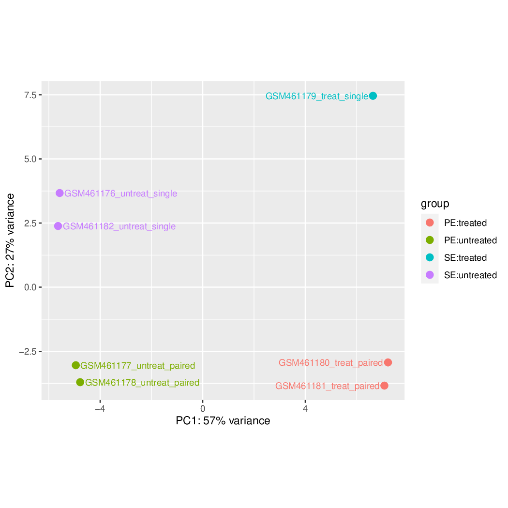
       > 
       > 1. Was ist die erste Dimension (PC1), die trennt?
       > 2. Und die zweite Dimension (PC2)?
       > 3. Was können wir über das von uns gewählte DESeq-Design (Faktoren, Ebenen) aussagen?
       > 
       > > <solution-title></solution-title>
       > > 
       > > 1. Die erste Dimension ist die Trennung der behandelten Proben von den unbehandelten Proben.
       > > 2. Die zweite Dimension ist die Trennung der Single-End-Datensätze von den Paired-End-Datensätzen.
       > > 3. Die Datensätze sind nach den Stufen der beiden Faktoren gruppiert. Die Daten scheinen keinen versteckten Effekt zu enthalten. Wenn unerwünschte Variationen in den Daten vorhanden sind (z. B. Chargeneffekte), ist es immer empfehlenswert, diese zu korrigieren. Dies kann in DESeq2 erreicht werden, indem alle bekannten Chargenvariablen in das Design aufgenommen werden. {: .solution} {: .question}

    2. Heatmap der Probe-zu-Probe-Abstandsmatrix (mit Clustering) auf der Grundlage der normalisierten Anzahlen.

       Die Heatmap gibt einen Überblick über die Ähnlichkeiten und Unähnlichkeiten zwischen den Proben: Die Farbe stellt den Abstand zwischen den Proben dar. Dunkelblau bedeutet einen geringeren Abstand, d. h. näher beieinander liegende Proben in Bezug auf die normalisierten Zählungen.

       > <question-title></question-title>
       > 
       > 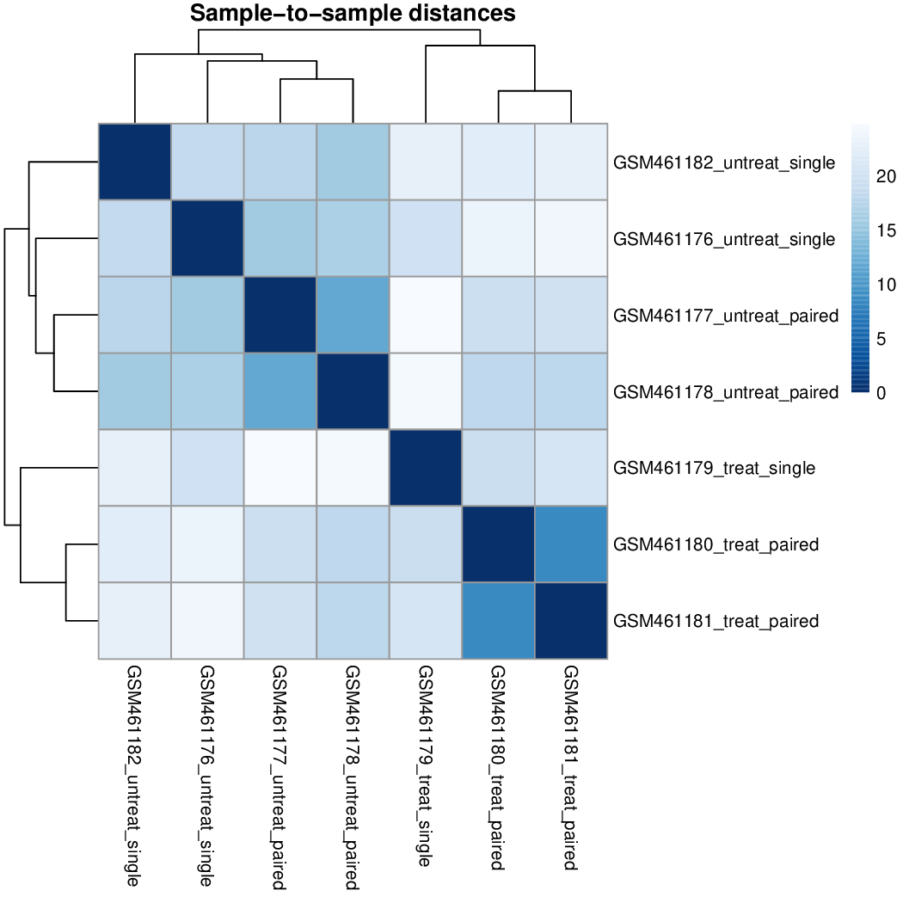
       > 
       > Wie sind die Proben gruppiert?
       > 
       > > <solution-title></solution-title>
       > > 
       > > Sie werden erstens nach der Behandlung (erster Faktor) und zweitens nach dem Sequenzierungstyp (zweiter Faktor) gruppiert, wie in der PCA-Darstellung.
       > > 
       > {: .solution} {: .question}

    3. Dispersionsschätzungen: genweise Schätzungen (schwarz), die angepassten Werte (rot) und die endgültigen Maximum-a-posteriori-Schätzungen, die beim Testen verwendet wurden (blau)

       Dieses Dispersionsdiagramm ist typisch, wobei die endgültigen Schätzungen von den genweisen Schätzungen auf die angepassten Schätzungen geschrumpft sind. Einige genweise Schätzungen werden als Ausreißer markiert und nicht auf den angepassten Wert geschrumpft. Das Ausmaß der Schrumpfung kann je nach Stichprobengröße, Anzahl der Koeffizienten, Zeilenmittelwert und Variabilität der genweisen Schätzungen größer oder kleiner sein als hier dargestellt.

    4. Histogramm der *p*-Werte für die Gene im Vergleich zwischen den beiden Stufen des ersten Faktors

    5. Ein [MA-Plot](https://en.wikipedia.org/wiki/MA_plot):

       Dies zeigt die globale Ansicht des Verhältnisses zwischen der Veränderung der Expression der Bedingungen (log ratios, M), der durchschnittlichen Expressionsstärke der Gene (durchschnittlicher Mittelwert, A) und der Fähigkeit des Algorithmus, eine unterschiedliche Genexpression zu erkennen. Die Gene, die die Signifikanzschwelle (angepasster p-Wert < 0,1) überschritten haben, sind rot eingefärbt.

- Eine Zusammenfassungsdatei mit den folgenden Werten für jedes Gen:

    1. Gen-Identifikatoren
    2. Mittlere normalisierte Zählungen, gemittelt über alle Proben aus beiden Bedingungen
    3. Fold change in log2 (Logarithmus Basis 2)

       Die log2-Fold-Änderungen basieren auf dem primären Faktor Stufe 1 gegenüber Faktor Stufe 2, daher ist die Eingabereihenfolge der Faktorstufen wichtig. In diesem Fall berechnet DESeq2 die Fold Changes der "behandelten" Proben gegenüber den "unbehandelten" Proben anhand des ersten Faktors "Treatment", d. h. die Werte entsprechen der Hoch- oder Herunterregulierung von Genen in behandelten Proben.

    4. Standardfehlerschätzung für die Schätzung der log2-Fold-Change
    5. [Wald](https://en.wikipedia.org/wiki/Wald_test) statistisch
    6. *p*-Wert für die statistische Signifikanz dieser Änderung
    7. *p*-Wert, bereinigt um Mehrfachtests mit dem Benjamini-Hochberg-Verfahren, das die Falschentdeckungsrate kontrolliert ([FDR](https://en.wikipedia.org/wiki/False_discovery_rate))

  > <tip-title>Was sind p-Werte und wofür werden sie verwendet?</tip-title>
  > 
  > Der p-Wert ist ein Maß, das häufig verwendet wird, um festzustellen, ob eine bestimmte Beobachtung statistisch signifikant ist oder nicht. Streng genommen ist der p-Wert die Wahrscheinlichkeit, dass die Daten zufällig entstanden sein könnten, unter der Annahme, dass die Nullhypothese richtig ist. Im konkreten Fall von RNA-Seq lautet die Nullhypothese, dass es keine unterschiedliche Genexpression gibt. Ein p-Wert von 0,13 für ein bestimmtes Gen bedeutet also, dass für dieses Gen unter der Annahme, dass es nicht differentiell exprimiert wird, eine Wahrscheinlichkeit von 13 % besteht, dass eine offensichtliche differentielle Expression einfach durch zufällige Variation in den experimentellen Daten entstanden sein könnte.
  > 
  > 13% ist immer noch ziemlich hoch, so dass wir nicht wirklich sicher sein können, dass eine differentielle Genexpression stattfindet. Die gängigste Art und Weise, wie Wissenschaftler p-Werte verwenden, besteht darin, einen Schwellenwert festzulegen (in der Regel 0,05, manchmal auch andere Werte wie 0,01) und die Nullhypothese nur bei p-Werten unter diesem Wert zurückzuweisen. Bei Genen mit p-Werten unter 0,05 können wir also mit Sicherheit sagen, dass die differentielle Genexpression eine Rolle spielt. Es sei darauf hingewiesen, dass ein solcher Schwellenwert willkürlich ist und es keinen bedeutsamen Unterschied zwischen einem p-Wert von 0,049 und 0,051 gibt, selbst wenn wir nur im ersten Fall die Nullhypothese ablehnen.
  > 
  > Leider werden p-Werte in der wissenschaftlichen Forschung häufig falsch verwendet, so dass Wikipedia einen [eigenen Artikel](https://en.wikipedia.org/wiki/Misuse_of_p-values) zu diesem Thema bereitstellt. Siehe auch [diesen Artikel](https://fivethirtyeight.com/features/not-even-scientists-can-easily-explain-p-values/) (der sich an ein allgemeines, nicht-wissenschaftliches Publikum richtet). {: .tip}

Weitere Informationen über **DESeq2** und seine Ergebnisse finden Sie in der [**DESeq2** Dokumentation] (https://www.bioconductor.org/packages/release/bioc/manuals/DESeq2/man/DESeq2.pdf).

> <question-title></question-title>
> 
> 1. Wird das Gen FBgn0003360 aufgrund der Behandlung unterschiedlich exprimiert? Wenn ja, wie stark?
> 2. Ist das *Pasilla*-Gen (ps, FBgn0261552) durch die RNAi-Behandlung herunterreguliert?
> 3. Wir könnten uns hypothetisch auch für den Effekt der Sequenzierung (oder andere sekundäre Faktoren in anderen Fällen) interessieren. Wie würden wir die unterschiedlich exprimierten Gene aufgrund des Sequenzierungstyps erkennen?
> 4. Wir würden gerne die Interaktion zwischen der Behandlung und der Sequenzierung analysieren. Wie können wir das tun?
> 
> > <solution-title></solution-title>
> > 
> > 1. FBgn0003360 wird aufgrund der Behandlung differenziell exprimiert: Es hat einen signifikanten angepassten p-Wert ($$2.8 \cdot 10^{-171} << 0.05$$). Es wird in behandelten Proben im Vergleich zu unbehandelten Proben um den Faktor ~8 ($$2^{log2FC} = 2^{2.99542318410271}$$) weniger exprimiert (`-` in der log2FC Spalte).
> > 
> > 2. Sie können manuell nach `FBgn0261552` in der ersten Spalte suchen oder 
> >   -  *"Filter "*: die `DESeq2 result file` (Ausgabe von **DESeq2** )
> >   - *"Mit folgender Bedingung "*: `c1 == "FBgn0261552"`
> > 
> > Die log2-Fold-Änderung ist negativ, so dass es tatsächlich herunterreguliert ist, und der angepasste p-Wert liegt unter 0,05, so dass es zu den signifikant veränderten Genen gehört.
> > 
> > 3. DESeq2 in Galaxy liefert den Vergleich zwischen den verschiedenen Niveaus für den ersten Faktor, nach Korrektur der Variabilität aufgrund des zweiten Faktors. In unserem aktuellen Fall, behandelt gegen unbehandelt für jeden Sequenzierungstyp. Um Sequenzierungstypen zu vergleichen, sollten wir DESeq2 erneut ausführen und die Faktoren wechseln: Faktor 1 (Behandlung) wird zu Faktor 2 und Faktor 2 (Sequenzierung) wird zu Faktor 1.
> > 4. Um die Interaktion zwischen zwei Faktoren hinzuzufügen (z. B. behandelt für Paired-End-Daten vs. unbehandelt für Single-End-Daten), sollten wir DESeq2 ein weiteres Mal ausführen, aber mit nur einem Faktor mit den folgenden 4 Stufen:
> >    - treated-PE
> >    - unbehandelt-PE
> >    - treated-SE
> >    - unbehandelt-SE
> > 
> >    Durch Auswahl von *"Output all levels vs. all levels of primary factor (use when you have >2 levels for primary factor) "* auf `Yes` können wir dann treated-PE vs. untreated-SE vergleichen.
> > 
> {: .solution}
> 
{: .question}

## Annotation der DESeq2-Ergebnisse

Die ID für jedes Gen ist etwas wie FBgn0003360, was eine ID aus der entsprechenden Datenbank ist, hier Flybase (). Diese IDs sind eindeutig, aber manchmal ziehen wir es vor, die Gennamen zu haben, auch wenn sie nicht auf ein eindeutiges Gen verweisen (z. B. dupliziert nach einer Neuannotation). Gennamen können jedoch bereits auf eine Funktion hinweisen oder helfen bei der Suche nach den gewünschten Kandidaten. Wir möchten auch die Position dieser Gene innerhalb des Genoms anzeigen. Diese Informationen können wir aus der Annotationsdatei extrahieren, die wir für die Kartierung und Zählung verwendet haben.

> <hands-on-title>Anmerkung der DESeq2-Ergebnisse</hands-on-title>
> 
> 1. Importieren Sie die Ensembl-Gen-Annotation für *Drosophila melanogaster* (`Drosophila_melanogaster.BDGP6.32.109_UCSC.gtf.gz`) aus der vorherigen Historie oder aus der Shared Data-Bibliothek oder aus Zenodo:
> 
>    ```text
>    {{ page.zenodo_link }}/files/Drosophila_melanogaster.BDGP6.32.109_UCSC.gtf.gz
>    ```
> 
> 2.  with:
>    -  *"Tabellarische Ausgabe von DESeq2/edgeR/limma/DEXSeq "*: die `DESeq2 result file` (Ausgabe von **DESeq2** )
>    - *"Input file type "*: `DESeq2/edgeR/limma`
>    -  *"Referenzannotation im GFF/GTF-Format "*: importiertes gtf `Drosophila_melanogaster.BDGP6.32.109_UCSC.gtf.gz`
> 
{: .hands_on}

Die erzeugte Ausgabe ist eine Erweiterung der vorherigen Datei:

1. Gen-Identifikatoren
2. Mittlere normalisierte Zählungen über alle Proben
3. Log2 fold change
4. Standardfehlerschätzung für die Schätzung der log2-Fold-Change
5. Wald-Statistik
6. *p*-Wert für die Wald-Statistik
7. *p*-Wert bereinigt um Mehrfachtests mit dem Benjamini-Hochberg-Verfahren für die Wald-Statistik
8. Chromosom
9. Start
10. Ende
11. Strang
12. Merkmal
13. Genname

> <question-title></question-title>
> 
> 1. Wo befindet sich das am stärksten überexprimierte Gen?
> 2. Wie lautet der Name des Gens?
> 3. Wo befindet sich das *Pasilla*-Gen (FBgn0261552)?
> 
> > <solution-title></solution-title>
> > 
> > 1. FBgn0025111 (das bestplatzierte Gen mit dem höchsten positiven log2FC-Wert) befindet sich auf dem Rückwärtsstrang von Chromosom X, zwischen 10.778.953 bp und 10.786.907 bp.
> > 2. Aus der Tabelle haben wir das Gensymbol: Ant2. Nach einer Suche in den [Online-Biologiedatenbanken] (https://www.ncbi.nlm.nih.gov/gene/32008) stellen wir fest, dass Ant2 der Adenin-Nukleotid-Translokase 2 entspricht.
> > 3. Das *Pasilla*-Gen befindet sich auf dem Vorwärtsstrang des Chromosoms 3R, zwischen 9.417.939 bp und 9.455.500 bp.
> > 
> {: .solution}
> 
{: .question}

Die annotierte Tabelle enthält keine Spaltennamen, was die Lesbarkeit erschwert. Wir würden sie gerne hinzufügen, bevor wir weitermachen.

> <hands-on-title>Add column names</hands-on-title>
> 
> 1. Erstellen Sie eine neue Datei (`header`) mit folgendem Inhalt (Kopfzeile der DESeq2-Ausgabe)
> 
>    ```text
>    GeneID	Base mean	log2(FC)	StdErr	Wald-Stats	P-value	P-adj	Chromosome	Start	End	Strand	Feature	Gene name
>    ```
> 
>    
> 
> 2.  um diese Kopfzeile zur **Annotate** Ausgabe hinzuzufügen:
>    -  *"Concatenate Dataset "*: der `header`-Datensatz
>    - *"Dataset "*
>       - Klicken Sie auf  *"Insert Dataset "*
>         -  *"select "*: Ausgabe von **Annotate** 
> 
> 3. Benennen Sie die Ausgabe in `Annotated DESeq2 results` um
> 
{: .hands_on}

## Extraktion und Annotation von differenziell exprimierten Genen

Nun möchten wir die am stärksten differentiell exprimierten Gene aufgrund der Behandlung mit einer Fold Change > 2 (oder < 1/2) extrahieren.

> <hands-on-title>Extrahieren Sie die am stärksten differentiell exprimierten Gene</hands-on-title>
> 
> 1.  um Gene mit einer signifikanten Veränderung der Genexpression (angepasster *p*-Wert unter 0,05) zwischen behandelten und unbehandelten Proben zu extrahieren:
>    -  *"Filter "*: `Annotated DESeq2 results`
>    - *"Mit folgender Bedingung "*: `c7<0.05`
>    - *"Anzahl der zu überspringenden Kopfzeilen "*: `1`
> 
> 2. Benennen Sie die Ausgabe `Genes with significant adj p-value` um.
> 
>    > <question-title></question-title>
>    > 
>    > Wie viele Gene weisen eine signifikante Veränderung der Genexpression zwischen diesen Bedingungen auf?
>    > 
>    > > <solution-title></solution-title>
>    > > 
>    > > Wir erhalten 966 (967 Zeilen einschließlich Header) Gene (4,04%) mit einer signifikanten Veränderung der Genexpression zwischen behandelten und unbehandelten Proben.
>    > > 
> > > 
> > {: .solution}
> > 
> {: .question}
> 
> > 
> > <comment-title></comment-title>
> > 
> > Die Datei mit den unabhängig gefilterten Ergebnissen kann für weitere nachgeschaltete Analysen verwendet werden, da sie Gene mit nur wenigen Read-Zahlen ausschließt, da diese Gene nicht als signifikant unterschiedlich exprimiert angesehen werden.
> > 
> {: .comment}
> 
> Wir wählen nun nur die Gene aus, die eine Fold Change (FC) > 2 oder FC < 0,5 aufweisen. Beachten Sie, dass die DESeq2-Ausgabedatei $$log_{2} FC$$ enthält, und nicht den FC selbst, so dass wir nach $$abs(log_{2} FC) > 1$$ filtern (was FC > 2 oder FC < 0,5 impliziert).
> 
> 3.  um Gene mit einem $$abs(log_{2} FC) > 1$$ zu extrahieren:
>    -  *"Filter "*: `Genes with significant adj p-value`
>    - *"Mit folgender Bedingung "*: `abs(c3)>1`
>    - *"Anzahl der zu überspringenden Kopfzeilen "*: `1`
> 
> 4. Benennen Sie die Ausgabe `Genes with significant adj p-value & abs(log2(FC)) > 1` um.
> 
>    > <question-title></question-title>
>    > 
>    > 1. Wie viele Gene sind konserviert worden?
>    > 2. Kann das *Pasilla*-Gen (ps, FBgn0261552) in dieser Tabelle gefunden werden?
>    > 
>    > > <solution-title></solution-title>
>    > > 
>    > > 1. Wir erhalten 113 Gene (114 Zeilen einschließlich Header), das sind 11,79 % der signifikant unterschiedlich exprimierten Gene.
>    > > 2. Das *Pasilla*-Gen kann mit einer schnellen Suche gefunden werden (oder sogar mit  )
> > > 
> > {: .solution}
> > 
> {: .question}
> 
{: .hands_on}

Wir haben nun eine Tabelle mit 113 Zeilen und einer Kopfzeile, die den am stärksten differenziell exprimierten Genen entspricht. Für jedes Gen haben wir seine ID, seine mittlere normalisierte Anzahl (gemittelt über alle Proben aus beiden Bedingungen), seinen $$log_{2} FC$$ und andere Informationen wie Genname und Position.

## Visualisierung der Expression der differentiell exprimierten Gene

Wir könnten den $$log_{2} FC$$ für die extrahierten Gene darstellen, aber hier möchten wir eine Heatmap der Expression für diese Gene in den verschiedenen Proben betrachten. Daher müssen wir die normalisierten Werte für diese Gene extrahieren.

Wir gehen in mehreren Schritten vor:

- Extrahieren Sie die normalisierten Zählungen für diese Gene für jede Probe und stellen Sie sie in einer Heatmap dar, indem Sie die von DESeq2 erzeugte Datei mit den normalisierten Zählungen verwenden
- Berechnung, Extraktion und Darstellung des Z-Scores der normalisierten Zählungen

> <comment-title>Fortgeschrittene Tutorials zur Visualisierung</comment-title>
> 
> In diesem Tutorium werden wir kurz einige mögliche Visualisierungen erläutern. Für weitere Details schauen Sie bitte in die zusätzlichen Tutorials zur Visualisierung von RNA-Seq Ergebnissen:
> 
> - [Visualisierung von RNA-Seq Ergebnissen mit heatmap2]()
> - [Visualisierung von RNA-Seq-Ergebnissen mit Volcano Plot]()
> 
{: .comment}

### Visualisierung der normalisierten Anzahlen

Um die normalisierten Zählungen für die interessanten Gene zu extrahieren, verbinden wir die von DESeq2 erzeugte Tabelle der normalisierten Zählungen mit der gerade erzeugten Tabelle. Wir behalten dann nur die Spalten, die den normalisierten Zählungen entsprechen.

> <hands-on-title>Extrahieren Sie die normalisierten Zählungen der am stärksten differentiell exprimierten Gene</hands-on-title>
> 
> 1.  mit den folgenden Parametern:
>    -  *"Join "*: die Datei `Normalized counts` (Ausgabe von **DESeq2** )
>    - *"using column "*: `Column: 1`
>    -  *"mit "*: `Genes with significant adj p-value & abs(log2(FC)) > 1`
>    - *"und Spalte "*: `Column: 1`
>    - *"Behalte Zeilen der ersten Eingabe, die sich nicht mit der zweiten Eingabe verbinden "*: `No`
>    - *"Behalte die Kopfzeilen "*: `Yes`
> 
>    Die generierte Datei hat mehr Spalten als wir für die Heatmap benötigen: mittlere normalisierte Anzahlen, $$log_{2} FC$$ und andere Annotationsinformationen. Wir müssen die zusätzlichen Spalten entfernen.
> 
> 2.  Spalten aus einer Tabelle mit den folgenden Parametern, um die Spalten mit den Gen-IDs und normalisierten Zählungen zu extrahieren:
>    - *"Spalten schneiden "*: `c1-c8`
>    - *"Abgegrenzt durch "*: `Tab`
>    -  *"From "*: der verbundene Datensatz (Ausgabe von **Join two Datasets** )
> 
> 3. Benennen Sie die Ausgabe in `Normalized counts for the most differentially expressed genes` um
> 
{: .hands_on}

Wir haben nun eine Tabelle mit 114 Zeilen (die 113 am stärksten differenziell exprimierten Gene und eine Kopfzeile) und die normalisierten Werte für diese Gene in den 7 Proben.

> <hands-on-title>Geben Sie die Heatmap der normalisierten Anzahl dieser Gene für die Proben an</hands-on-title>
> 
> 1.  zur Darstellung der Heatmap:
>    -  *"Eingabe sollte Spaltenüberschriften haben "*: `Normalized counts for the most differentially expressed genes`
>    - *"Datentransformation "*: `Log2(value+1) transform my data`
>    - *"Enable data clustering "*: `Yes`
>    - *"Spalten und Zeilen beschriften "*: `Label columns and not rows`
>    - *"Typ der zu verwendenden Farbkarte "*: `Gradient with 2 colors`
> 
{: .hands_on}

Sie sollten etwas ähnliches erhalten wie:

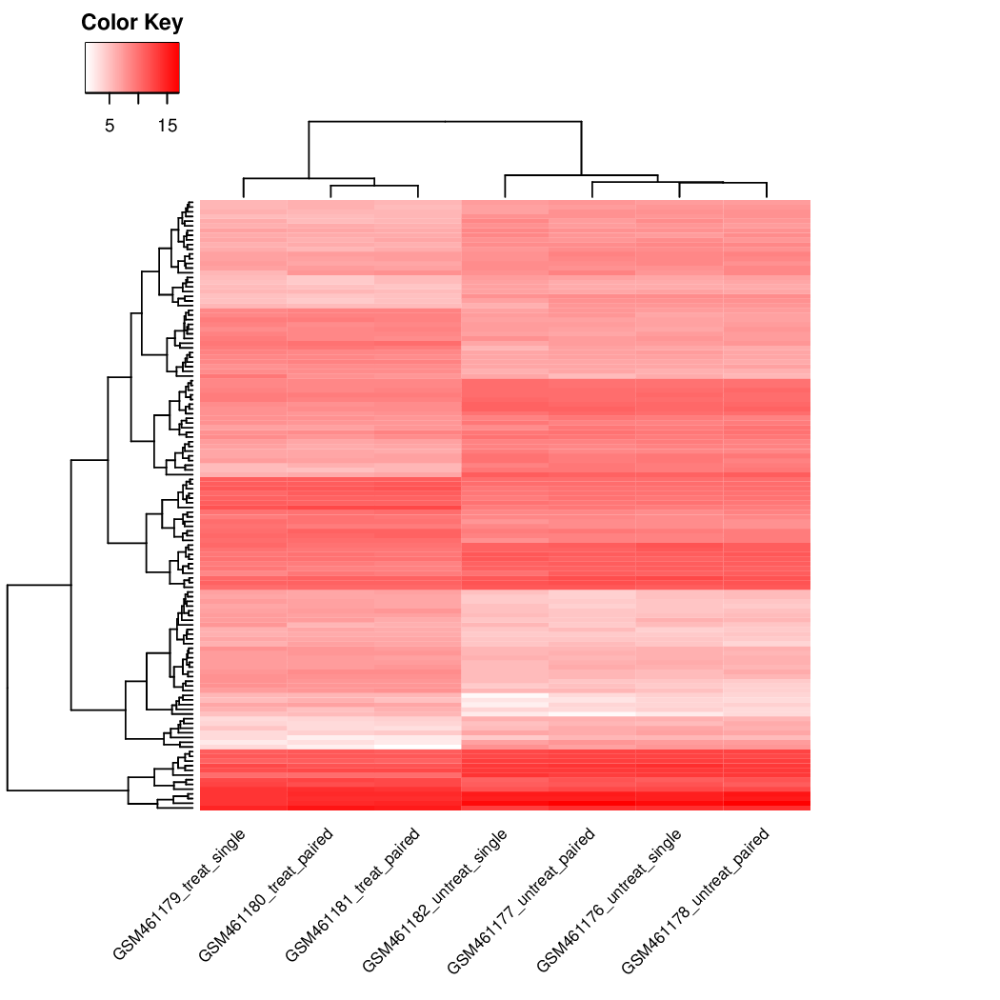

> <question-title></question-title>
> 
> 1. Was stellt die X-Achse der Heatmap dar? Was ist mit der Y-Achse?
> 2. Fällt Ihnen etwas an der Clusterung der Proben und Gene auf?
> 3. Was ändert sich, wenn Sie die Heatmap neu generieren und dieses Mal `Plot the data as it is` in *"Data transformation "* auswählen?
> 4. Warum können wir `Log2(value) transform my data` in *"Data transformation "* nicht verwenden?
> 5. Wie können Sie eine Heatmap der normalisierten Zählungen für alle hochregulierten Gene mit Fold Change > 2 erstellen?
> 
> > <solution-title></solution-title>
> > 
> > 1. Die X-Achse zeigt die 7 Proben zusammen mit einem Dendrogramm, das die Ähnlichkeit zwischen ihren Genexpressionsniveaus darstellt. Die Y-Achse zeigt die 113 unterschiedlich exprimierten Gene, ebenfalls mit einem Dendrogramm, das die Ähnlichkeit zwischen den Genexpressionsniveaus darstellt.
> > 2. Die Proben sind nach Behandlung geclustert.
> > 3. Die Skala ändert sich und wir sehen nur noch wenige Gene.
> > 4. Weil die normalisierte Expression des Gens `FBgn0013688` in `GSM461180_treat_paired` bei `0` liegt.
> > 5. Extrahieren der Gene mit $$log_{2} FC$$ > 1 (Filter für Gene mit `c3>1` in der Zusammenfassung der differenziell exprimierten Gene) und führen Sie **heatmap2**  auf der erzeugten Tabelle aus.
> > 
> {: .solution}
> 
{: .question}

### Visualisierung des Z-Scores

Um die Genexpression über die Proben hinweg zu vergleichen, können wir auch den Z-Score verwenden, der häufig in Veröffentlichungen dargestellt wird.

Der Z-Score gibt die Anzahl der Standardabweichungen an, die ein Wert vom Mittelwert aller Werte in derselben Gruppe, hier demselben Gen, entfernt ist. Ein Z-Score von -2 für das Gen X in Probe A bedeutet, dass dieser Wert 2 Standardabweichungen unter dem Mittelwert der Werte für das Gen X in allen Proben (A, B, C usw.) liegt.

Der Z-Score $$z_{i,j}$$ für ein Gen $$i$$ in einer Probe $$j$$ bei normalisierter Anzahl $$x_{i,j}$$ wird berechnet als $$z_{i,j} = \frac{x_{i,j}- \overline{x_i}}{s_i}$$ mit $$$\overline{x_i}$$ dem Mittelwert und $$$s_i$$ der Standardabweichung der normalisierten Zählungen für das Gen $$i$$ über alle Proben.

> <details-title>Berechnen Sie den Z-Score für alle Gene</details-title>
> 
> Wir benötigen den Z-Score häufig für einige Visualisierungen. Um den Z-Score zu berechnen, unterteilen wir den Prozess in 2 Schritte:
> 
> 1. Subtrahieren Sie jeden Wert durch den Mittelwert der Werte in der Zeile (d.h. $$x_{i,j}- \overline{x_i}$$) unter Verwendung der normalisierten Zähltabelle
> 2. Dividieren Sie die vorherigen Werte durch die Standardabweichung der Werte der Zeile, indem Sie 2 Tabellen verwenden (die normalisierten Zählungen und die im vorherigen Schritt berechnete Tabelle)
> 
> > <hands-on-title>Berechnen Sie den Z-Score für alle Gene</hands-on-title>
> > 
> > 1.  mit den folgenden Parametern, um > zunächst die Mittelwerte pro Zeile zu subtrahieren
> >    - *"Input Single or Multiple Tables "*: `Single Table`
> >      -  *"Tabelle "*: `Normalized counts file on data ... and others` (Ausgabe von **DESeq2** )
> >      - *"Art der Tabellenoperation "*: `Perform a full table operation`
> >        - *"Operation "*: `Custom`
> >          - *"Benutzerdefinierter Ausdruck auf 'Tabelle', entlang 'Achse' (0 oder 1) "*: `table.sub(table.mean(1), 0)`
> > 
> >            Der Ausdruck `table.mean(1)` berechnet den Mittelwert für jede Zeile (hier die Gene) und `table.sub(table.mean(1), 0)` subtrahiert jeden Wert vom Mittelwert der Zeile (berechnet mit `table.mean(1)`)
> > 
> > 2.  mit den folgenden Parametern:
> >    - *"Input Single or Multiple Tables "*: `Multiple Table`
> >      - Klicken Sie auf  *"Tabellen einfügen "*
> >      - In *"1: Tabellen "*:
> >        -  *"Tabelle "*: `Normalized counts file on data ... and others` (Ausgabe von **DESeq2** )
> >      - Klicken Sie auf  *"Tabellen einfügen "*
> >      - In *"2: Tabellen "*:
> >        -  *"Table "*: Ausgabe der ersten **Table Compute** 
> >      - *"Benutzerdefinierter Ausdruck für 'tableN'"*: `table2.div(table1.std(1),0)`
> > 
> >        Der Ausdruck `table1.std(1)` berechnet die Standardabweichungen jeder Zeile der ersten Tabelle (normalisierte Zählungen) und `table2.div` teilt die Werte der zweiten Tabelle (die zuvor berechnet wurden) durch diese Standardabweichungen.
> > 
> > 3. Benennen Sie die Ausgabe in `Z-scores` um
> > 4. Prüfen Sie die Ausgabedatei
> > 
> {: .hands_on}
> 
> Wir haben jetzt eine Tabelle mit dem Z-Score für alle Gene in den 7 Proben.
> 
> > <question-title></question-title>
> > 
> > 1. Was ist der Bereich für den Z-Score?
> > 2. Warum sind einige Zeilen leer?
> > 3. Was können wir über die Z-Scores für die differentiell exprimierten Gene (z.B. `FBgn0037223`) sagen?
> > 4. Können wir den Z-Score verwenden, um die Stärke der differentiellen Expression eines Gens zu schätzen?
> > 
> > > <solution-title></solution-title>
> > > 
> > > 1. Der Z-Score reicht von -3 Standardabweichungen bis zu +3 Standardabweichungen. Er kann auf einer Normalverteilungskurve platziert werden: -3 ist der äußerste linke Rand der Normalverteilungskurve und +3 der äußerste rechte Rand der Normalverteilungskurve
> > > 2. Wenn alle Zählungen identisch sind (in der Regel auf 0), ist die Standardabweichung 0, der Z-Score kann für diese Gene nicht berechnet werden.
> > > 3. Wenn ein Gen zwischen zwei Gruppen (hier behandelt und unbehandelt) unterschiedlich exprimiert wird, sind die Z-Scores für dieses Gen bei den Proben der einen Gruppe (überwiegend) positiv und bei den Proben der anderen Gruppe (überwiegend) negativ.
> > > 4. Der Z-Score ist ein Signal-Rausch-Verhältnis. Große absolute Z-Scores, d. h. große positive oder negative Werte, sind keine direkte Schätzung des Effekts, d. h. der Stärke der differentiellen Expression. Ein gleich großer Z-Score kann je nach Rauschen unterschiedliche Bedeutungen haben:
> > >    - mit großem Rauschen: ein sehr großer Effekt
> > >    - mit etwas Rauschen: ein ziemlich großer Effekt
> > >    - mit nur wenig Rauschen: ein eher geringer Effekt
> > >    - mit fast keinem Rauschen: ein kleiner Effekt
> > > 
> > >    Das Problem ist, dass "Rauschen" hier nicht nur das Rauschen der Messung ist. Es kann auch mit der "Strenge" der Kontrolle der Genregulation zusammenhängen. Nicht streng kontrollierte Gene, d. h. deren Expression in einem weiten Bereich über die Proben hinweg variieren kann, können erheblich induziert oder unterdrückt werden. Ihr absoluter Z-Score wird klein sein, da die Variationen über die Proben hinweg groß sind. Im Gegensatz dazu können Gene, die stark kontrolliert werden, nur sehr kleine Veränderungen in ihrer Expression aufweisen, ohne dass dies biologische Auswirkungen hat. Der absolute Z-Score ist bei diesen Genen groß.
> > > 
> > {: .solution}
> > 
> {: .question}
> 
{: .details}

Wir möchten nun eine Heatmap für die Z-Scores erstellen:

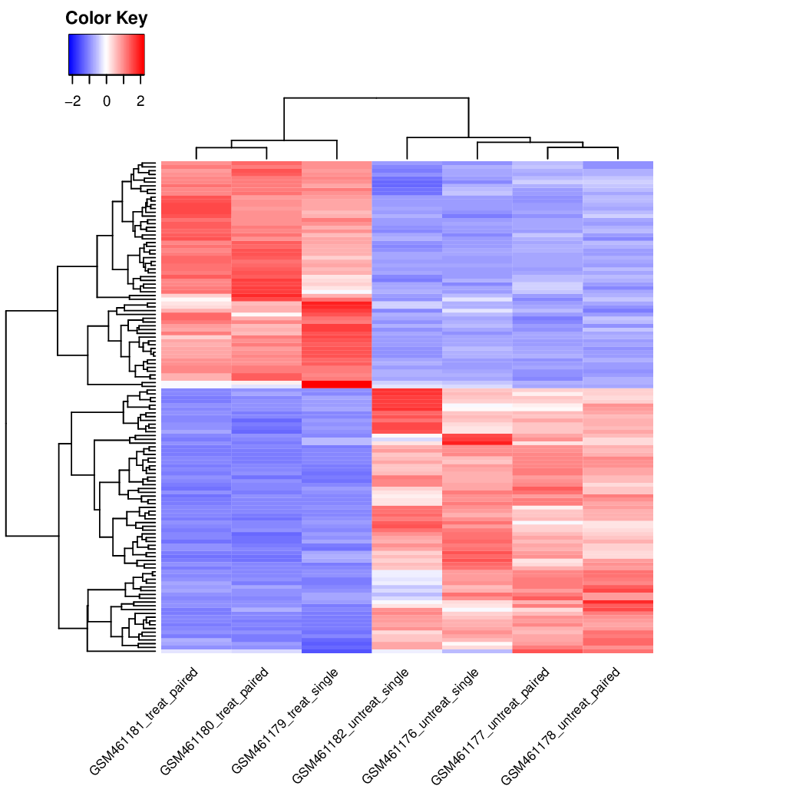

> <hands-on-title>Darstellung des Z-Scores der am stärksten differentiell exprimierten Gene</hands-on-title>
> 
> 1.  zur Darstellung der Heatmap:
>    -  *"Eingabe sollte Spaltenüberschriften haben "*: `Normalized counts for the most differentially expressed genes`
>    - *"Datentransformation "*: `Plot the data as it is`
>    - *"Berechne z-Scores vor dem Clustering "*: `Compute on rows`
>    - *"Enable data clustering "*: `Yes`
>    - *"Spalten und Zeilen beschriften "*: `Label columns and not rows`
>    - *"Typ der zu verwendenden Farbkarte "*: `Gradient with 3 colors`
> 
{: .hands_on}

# Funktionelle Anreicherungsanalyse der DE-Gene

Wir haben Gene extrahiert, die in behandelten (PS-Gen-depletierten) Proben im Vergleich zu unbehandelten Proben differentiell exprimiert werden. Nun möchten wir wissen, ob die unterschiedlich exprimierten Gene angereicherte Transkripte von Genen sind, die zu allgemeineren oder spezifischeren Kategorien gehören, um biologische Funktionen zu identifizieren, die möglicherweise betroffen sind.

## Gene Ontology Analyse

[Gene Ontology (GO)](http://www.geneontology.org/) Analysen werden häufig verwendet, um die Komplexität zu reduzieren und biologische Prozesse in genomweiten Expressionsstudien hervorzuheben. Standardmethoden führen jedoch bei RNA-Seq-Daten zu verzerrten Ergebnissen, da die differentielle Expression langer und hochexprimierter Transkripte zu stark erfasst wird.

[**goseq**](https://bioconductor.org/packages/release/bioc/vignettes/goseq/inst/doc/goseq.pdf) () bietet Methoden zur Durchführung von GO-Analysen von RNA-Seq-Daten unter Berücksichtigung der Längenverzerrung. **goseq** kann auch auf andere kategoriebasierte Tests von RNA-Seq-Daten angewandt werden, wie z. B. die Analyse von KEGG-Pfaden, die in einem weiteren Abschnitt behandelt wird.

**goseq** benötigt 2 Dateien als Eingaben:

- Eine tabellarische Datei mit den differenziell exprimierten Genen aller im RNA-Seq-Experiment untersuchten Gene mit 2 Spalten:
  - die Gen-IDs (eindeutig innerhalb der Datei), in Großbuchstaben
  - ein boolescher Wert, der angibt, ob das Gen differentiell exprimiert wird oder nicht (`True` wenn differentiell exprimiert oder `False` wenn nicht)
- Eine Datei mit Informationen über die Länge eines Gens, um eine mögliche Längenverzerrung bei differenziell exprimierten Genen zu korrigieren

> <hands-on-title>Bereiten Sie den ersten Datensatz für goseq vor</hands-on-title>
> 
> 1.  auf Zeilen mit den folgenden Parametern:
>    -  *"Eingabedatei "*: die `DESeq2 result file` (Ausgabe von **DESeq2** )
>    - In *"Ausdrücke "*:
>      -  *"Ausdruck hinzufügen "*: `bool(float(c7)<0.05)`
>      -  *"Modus der Operation? "*: `Append`
>    - Unter *"Fehlerbehandlung "*:
>      -  *"Automatische Erkennung von Spaltentypen "*: `No`
>      -  *"Wenn ein Ausdruck für eine Zeile nicht berechnet werden kann "*: `Fill in a replacement value`
>      -  *"Ersetzungswert "*: `False`
> 
> 2.  Spalten aus einer Tabelle mit den folgenden Parametern:
>    - *"Spalten schneiden "*: `c1,c8`
>    - *"Abgegrenzt durch "*: `Tab`
>    -  *"From "*: die Ausgabe des **Compute** 
> 
> 3.  mit
>    -  *"From "*: die Ausgabe des vorherigen **Cut** 
>    - *"Fall von Spalten ändern "*: `c1`
>    - *"Abgegrenzt durch "*: `Tab`
>    - *"To "*: `Upper case`
> 
> 4. Benennen Sie die Ausgabe in `Gene IDs and differential expression` um
> 
{: .hands_on}

Wir haben gerade die erste Eingabe für **goseq** erzeugt. Als zweite Eingabe für **goseq** benötigen wir die Genlängen. Wir können hier die von **featureCounts** oder **Genlänge und GC-Gehalt** generierten Genlängen verwenden und die Gen-IDs formatieren.

> <hands-on-title>Bereiten Sie die Genlängendatei vor</hands-on-title>
> 
> <div class="featureCounts" markdown="1">
> 1. Copy the feature length collection previously generated by **featureCounts**  into this history
> 
> 
> 
> 2.  with:
>    -  *"Eingabeliste "*: `featureCounts on collection N: Feature lengths`
>    - *"Wie sollte ein Datensatz ausgewählt werden? "*: `The first dataset`
> 
> </div>
> 
> <div class="STAR" markdown="1">
> 1. Copy the output of **Gene length and GC content**  (`Gene length`) into this history
> 
> 
> </div>
> 
> 2.  mit den folgenden Parametern:
> 
>    -  *"From "*: <span class="featureCounts" markdown="1">`GSM461177_untreat_paired` (Ausgabe von **Extract Dataset** )</span><span class="STAR" markdown="1">`Gene length`</span>
>    - *"Fall von Spalten ändern "*: `c1`
>    - *"Abgegrenzt durch "*: `Tab`
>    - *"To "*: `Upper case`
> 
> 3. Benennen Sie die Ausgabe in `Gene IDs and length` um
> 
{: .hands_on}

Wir haben nun die beiden erforderlichen Eingabedateien für goseq.

> <hands-on-title>Die GO-Analyse durchführen</hands-on-title>
> 
> 1.  mit
>    - *"Datei der differentiell exprimierten Gene "*: `Gene IDs and differential expression`
>    - *"Genlängen-Datei "*: `Gene IDs and length`
>    - *"Gen-Kategorien "*: `Get categories`
>       - *"Wählen Sie ein zu verwendendes Genom "*: `Fruit fly (dm6)`
>       - *"Select Gene ID format "*: `Ensembl Gene ID`
>       - *"Wählen Sie eine oder mehrere Kategorien "*: `GO: Cellular Component`, `GO: Biological Process`, `GO: Molecular Function`
>    - In *"Output Options "*
>      - *"Top GO terms plot ausgeben? "*: `Yes`
>      - *"Extrahiere die DE-Gene für die Kategorien (GO/KEGG-Terme)? "*: `Yes`
> 
{: .hands_on}

**goseq** erzeugt mit diesen Parametern 3 Ausgaben:

1. Eine Tabelle (`Ranked category list - Wallenius method`) mit den folgenden Spalten für jeden GO-Term:

    1. `category`: GO-Kategorie
    2. `over_rep_pval`: *p*-Wert für die Überrepräsentation des Terms in den differenziell exprimierten Genen
    3. `under_rep_pval`: *p*-Wert für die Unterrepräsentation des Terms in den differenziell exprimierten Genen
    4. `numDEInCat`: Anzahl der differenziell exprimierten Gene in dieser Kategorie
    5. `numInCat`: Anzahl der Gene in dieser Kategorie
    6. `term`: Einzelheiten des Begriffs
    7. `ontology`: MF (Molekulare Funktion - molekulare Aktivitäten von Genprodukten), CC (Zelluläre Komponente - wo Genprodukte aktiv sind), BP (Biologischer Prozess - Pfade und größere Prozesse, die aus den Aktivitäten mehrerer Genprodukte bestehen)
    8. `p.adjust.over_represented`: *p*-Wert für die Überrepräsentation des Terms in den differenziell exprimierten Genen, bereinigt um Mehrfachtests mit dem Benjamini-Hochberg-Verfahren
    9. `p.adjust.under_represented`: *p*-Wert für die Unterrepräsentation des Terms in den differenziell exprimierten Genen, bereinigt um Mehrfachtests mit dem Benjamini-Hochberg-Verfahren

   Um Kategorien zu identifizieren, die unterhalb eines bestimmten p-Wertes signifikant angereichert/unangereichert sind, ist es notwendig, den angepassten *p*-Wert zu verwenden.

   > <question-title></question-title>
   > 
   > 1. Wie viele GO-Terme sind mit einem bereinigten P-Wert < 0,05 überrepräsentiert? Wie viele sind unterrepräsentiert?
   > 2. Wie werden die überrepräsentierten GO-Terme in MF, CC und BP unterteilt? Und für unterrepräsentierte GO-Terme?
   > 
   > > <solution-title></solution-title>
   > > 
   > > 1. 60 GO-Terme (0,50%) sind überrepräsentiert und 7 (0,07%) unterrepräsentiert.
   > > 
   > >     auf c8 (angepasster p-Wert für überrepräsentierte GO-Terme) und c9 (angepasster p-Wert für unterrepräsentierte GO-Terme)
   > > 
   > > 2. Für überrepräsentierte, 50 BP, 5 CC und 5 MF und für unterrepräsentierte, 5 BP, 2 CC und 0 MF
   > > 
   > >     in Spalte 7 (Kategorie) und Zählung in Spalte 1 (IDs)
   > > 
   > {: .solution} {: .question}

2. Ein Diagramm mit den 10 wichtigsten überrepräsentierten GO-Begriffen

   > <question-title></question-title>
   > 
   > 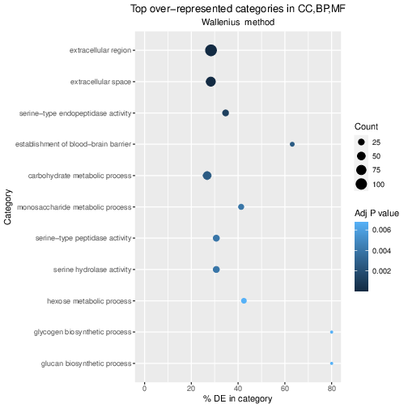
   > 
   > Was ist die x-Achse? Wie wird sie errechnet?
   > 
   > > <solution-title></solution-title>
   > > 
   > > Die x-Achse ist der Prozentsatz der Gene in der Kategorie, die als differenziell exprimiert identifiziert wurden: $$100 \mal \frac{numDEInCat}{numInCat}$$
   > > 
   > {: .solution} {: .question}

3. Eine Tabelle mit den differenziell exprimierten Genen (aus der von uns bereitgestellten Liste), die mit den GO-Begriffen (`DE genes for categories (GO/KEGG terms)`) assoziiert sind

> <comment-title>Fortgeschrittenes Tutorial zur Anreicherungsanalyse</comment-title>
> 
> In diesem Tutorium haben wir die GO-Anreicherungsanalyse mit **goseq** behandelt. Um andere Methoden und Werkzeuge für die Analyse der Anreicherung von Gensätzen kennenzulernen, sehen Sie sich bitte das ["RNA-Seq genes to pathways"]() Tutorial an.
> 
{: .comment}

## Analyse der KEGG-Pfade

**goseq** kann auch verwendet werden, um interessante KEGG-Pfade zu identifizieren. Die KEGG-Pfaddatenbank ist eine Sammlung von Pfadkarten, die das aktuelle Wissen über molekulare Interaktions-, Reaktions- und Beziehungsnetze darstellen. Eine Karte kann viele Entitäten integrieren, darunter Gene, Proteine, RNAs, chemische Verbindungen, Glykane und chemische Reaktionen sowie Krankheitsgene und Arzneimittelziele.

Zum Beispiel repräsentiert der Pfad `dme00010` den Glykolyseprozess (Umwandlung von Glukose in Pyruvat mit Erzeugung kleiner Mengen von ATP und NADH) für Drosophila melanogaster:

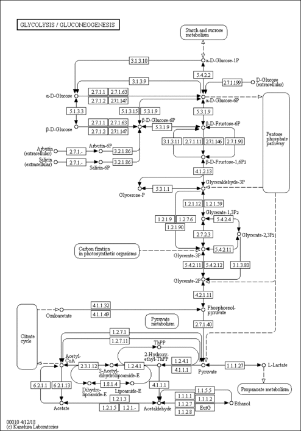

> <hands-on-title>Durchführen der KEGG-Pfadanalyse</hands-on-title>
> 
> 1.  mit
>    - *"Datei der differentiell exprimierten Gene "*: `Gene IDs and differential expression`
>    - *"Genlängen-Datei "*: `Gene IDs and length`
>    - *"Gen-Kategorien "*: `Get categories`
>       - *"Wählen Sie ein zu verwendendes Genom "*: `Fruit fly (dm6)`
>       - *"Select Gene ID format "*: `Ensembl Gene ID`
>       - *"Wählen Sie eine oder mehrere Kategorien "*: `KEGG`
>    - In *"Output Options "*
>      - *"Top GO terms plot ausgeben? "*: `No`
>      - *"Extrahiere die DE-Gene für die Kategorien (GO/KEGG-Terme)? "*: `Yes`
> 
{: .hands_on}

**goseq** erzeugt mit diesen Parametern 2 Ausgaben:

1. Eine große Tabelle mit den KEGG-Begriffen und einigen Statistiken

   > <question-title></question-title>
   > 
   > 1. Wie viele KEGG Pathways Terms wurden identifiziert?
   > 2. Wie viele KEGG-Pathways-Terme sind mit einem bereinigten P-Wert < 0,05 überrepräsentiert?
   > 3. Welches sind die überrepräsentierten Begriffe der KEGG-Pfade?
   > 4. Wie viele KEGG-Pathways-Terme sind mit einem bereinigten P-Wert < 0,05 unterrepräsentiert?
   > 
   > > <solution-title></solution-title>
   > > 
   > > 1. Die Datei hat 128 Zeilen einschließlich eines Headers, so dass 127 KEGG-Pfade identifiziert wurden.
   > > 2. 2 KEGG-Pfade (2,34%) sind überrepräsentiert, unter Verwendung von  auf c6 (angepasster p-value für überrepräsentierte KEGG-Pfade)
   > > 3. Die 2 überrepräsentierten KEGG-Pfade sind `01100` und `00010`. Wenn wir in der [KEGG-Datenbank] (https://www.genome.jp/kegg/kegg2.html) nach ihnen suchen, können wir mehr Informationen über diese Pfade finden: `01100` entspricht allen Stoffwechselwegen und `00010` dem Weg für Glykolyse / Glukoneogenese.
   > > 4. Kein KEGG-Pfad ist unterrepräsentiert, unter Verwendung von  auf c7 (angepasster p-Wert für unterrepräsentierte KEGG-Pfade) {: .solution} {: .question}

2. Eine Tabelle mit den differentiell exprimierten Genen (aus der von uns gelieferten Liste), die mit den KEGG-Pfaden (`DE genes for categories (GO/KEGG terms)`) assoziiert sind

Wir könnten untersuchen, welche Gene an welchen Pfaden beteiligt sind, indem wir uns die zweite Datei ansehen, die von **goseq** erzeugt wurde. Dies kann jedoch umständlich sein, und wir möchten die Pfade wie im vorherigen Bild dargestellt sehen. **Pathview** () kann dabei helfen, automatisch ähnliche Bilder wie das vorherige zu erzeugen und gleichzeitig zusätzliche Informationen über die Gene (z.B. Expression) in unserer Studie hinzuzufügen.

Dieses Tool benötigt 2 Haupteingaben:

- Pathway ID(s), die geplottet werden sollen, entweder als eine einzige ID oder als Datei mit einer Spalte mit den Pathway IDs
- Eine tabellarische Datei mit den Genen des RNA-Seq-Experiments mit 2 (oder mehr) Spalten:
  - die Gen-IDs (eindeutig innerhalb der Datei)
  - einige Informationen zu den Genen

    Dies kann zum Beispiel ein p-Wert oder eine Fold Change sein. Diese Information wird dem Pfaddiagramm hinzugefügt: Der Knoten des entsprechenden Gens wird anhand des Wertes eingefärbt. Wenn es verschiedene Spalten gibt, werden die verschiedenen Informationen nebeneinander auf dem Knoten aufgetragen.

Hier möchten wir die 2 KEGG-Pfade visualisieren: den überrepräsentierten `00010` (Glykolyse / Glukoneogenese) und den am stärksten unterrepräsentierten (aber nicht signifikant) `03040` (Spliceosom). Wir möchten, dass die Genknoten nach Log2 Fold Change für die durch die Behandlung unterschiedlich exprimierten Gene gefärbt werden.

> <hands-on-title>Overlay log2FC on KEGG pathway</hands-on-title>
> 
> 1.  Spalten aus einer Tabelle mit den folgenden Parametern:
>    - *"Spalten schneiden "*: `c1,c3`
>    - *"Abgegrenzt durch "*: `Tab`
>    -  *"From "*: `Genes with significant adj p-value`
> 
> 2. Umbenennen in `Genes with significant adj p-value and their Log2 FC`
> 
>    Wir haben die ID und Log2 Fold Change für die Gene extrahiert, die einen signifikanten angepassten p-Wert haben.
> 
> 3. Erstellen Sie eine neue Tabellendatei aus den folgenden Daten (IDs der zu zeichnenden Pfade) mit dem Namen `KEGG pathways to plot`
> 
>    ```text
>    00010
>    03040
>    ```
> 
> 4.  mit
>    - *"Anzahl der zu zeichnenden Pfade "*: `Multiple`
>      -  *"KEGG-Pfade "*: `KEGG pathways to plot`
>      - *"Hat die Datei einen Header (eine erste Zeile mit Spaltennamen)? "*: `No`
>    - *"Zu verwendende Spezies "*: `Fly`
>    - *"Provide a gene data file? "*: `Yes`
>      -  *"Gendaten "*: `Genes with significant adj p-value and their Log2 FC`
>      - *"Hat die Datei einen Header (eine erste Zeile mit Spaltennamen)? "*: `Yes`
>      - *"Format für Gendaten "*: `Ensembl Gene ID`
>    - *"Provide a compound data file? "*: `No`
>    - In *"Output Options "*
>      - *"Output for pathway "*: `KEGG native`
>        - *"Plot on same layer? "*: `Yes`
> 
{: .hands_on}

**Pathview** erzeugt eine Sammlung mit der KEGG-Visualisierung: eine Datei pro Pathway.

> <question-title></question-title>
> 
> `dme00010` KEGG-Weg aus **Pathview**
> 
> 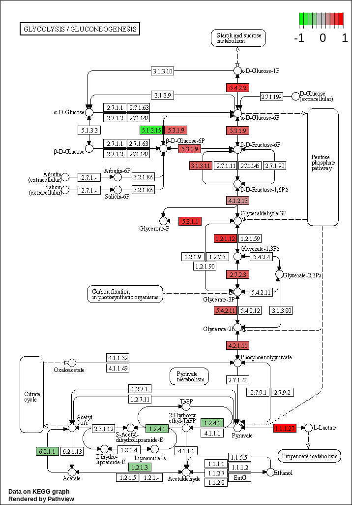
> 
> 1. Was sind die farbigen Kästchen?
> 2. Wie lautet der Farbcode?
> 
> > <solution-title></solution-title>
> > 
> > 1. Die farbigen Kästchen sind Gene im Signalweg, die differenziell exprimiert sind
> > 2. Beachten Sie, dass der Farbcode kontraintuitiv ist: Grün steht für Werte unter 0, also für Gene mit einer log2FC < 0 und rot für Gene mit einer log2FC > 0.
> > 
> {: .solution}
> 
{: .question}



# Inferenz der differentiellen Exon-Nutzung

Als Nächstes möchten wir die unterschiedliche Exon-Nutzung zwischen behandelten (PS-abgereicherten) und unbehandelten Proben anhand der RNA-Seq-Exon-Zahlen ermitteln. Wir werden die Mapping-Ergebnisse, die wir zuvor erstellt haben, überarbeiten.

Wir werden [DEXSeq](https://www.bioconductor.org/packages/release/bioc/html/DEXSeq.html) verwenden. DEXSeq erkennt hochempfindliche Gene und in vielen Fällen Exons, die einer differentiellen Exon-Nutzung unterliegen. Aber zuerst müssen wir, wie bei der differentiellen Genexpression, die Anzahl der Reads zählen, die den Exons zugeordnet sind.

## Zähle die Anzahl der Reads pro Exon

Dieser Schritt ähnelt dem Schritt [Zählen der Anzahl der Reads pro annotiertem Gen] (#count-the-number-of-reads-per-annotated-gene), mit dem Unterschied, dass wir anstelle von HTSeq-count DEXSeq-Count verwenden.

> <hands-on-title>Zählung der Reads pro Exon</hands-on-title>
> 
> 1. : Verwenden Sie den **DEXSeq-Count**, um die *Drosophila* Annotationen vorzubereiten und nur Exons mit entsprechenden Gen-IDs zu extrahieren
>     - *"Arbeitsweise "*: `Prepare annotation`
>       -  *"GTF-Datei "*: `Drosophila_melanogaster.BDGP6.32.109_UCSC.gtf.gz`
> 
>    Die Ausgabe ist wieder eine GTF-Datei, die für die Zählung verwendet werden kann
> 
> 2. : Reads zählen mit **DEXSeq-Count** mit
>     - *"Arbeitsweise "*: `Count reads`
>       -  *"Input bam file "*: die von **RNA STAR** erzeugten `BAM`-Dateien
>       -  *"DEXSeq-kompatible GTF-Datei "*: die von **DEXSeq-Count** erzeugte GTF-Datei
>       - *"Is library paired end? "*: `Yes`
>       - *"Ist die Bibliothek strangspezifisch?*: `No`
>       - *"Alle Reads mit einer Alignment-Qualität unter dem angegebenen Mindestwert überspringen "*: `10`
> 
{: .hands_on}

DEXSeq erzeugt eine Zählungstabelle, die der von featureCounts erzeugten Tabelle ähnelt, jedoch mit Zählungen für Exons.

> <question-title></question-title>
> 
> 1. Welches Exon hat die meisten Reads für beide Proben?
> 2. Zu welchem Gen gehört dieses Exon?
> 3. Gibt es einen Zusammenhang mit dem vorherigen Ergebnis, das mit featureCounts erzielt wurde?
> 
> > <solution-title></solution-title>
> > 
> > FBgn0284245:005 ist das Exon mit den meisten gemappten Reads für beide Proben. Es ist Teil von FBgn0284245, dem Feature mit den meisten darauf gemappten Reads (aus featureCounts).
> > 
> > 
> {: .solution}
> 
{: .question}

## Unterschiedliche Exon-Nutzung

Die Verwendung von DEXSeq ähnelt der von DESeq2. Es verwendet ähnliche Statistiken, um differentiell genutzte Exons zu finden.

Wie bei DESeq2 haben wir im vorherigen Schritt nur Reads gezählt, die auf Exons auf Chromosom 4 abgebildet wurden, und zwar für nur eine Probe. Um die durch die PS-Depletion induzierte unterschiedliche Exon-Nutzung zu identifizieren, müssen alle Datensätze (3 behandelte und 4 unbehandelte) nach demselben Verfahren analysiert werden. Um Zeit zu sparen, haben wir das für Sie getan. Die Ergebnisse sind auf [Zenodo]({{ page.zenodo_link }}) verfügbar:

- Die Ergebnisse der Ausführung von DEXSeq-count im Modus 'Prepare annotation' (Annotation vorbereiten)
- Sieben Zähldateien, die im Modus "Count reads" erzeugt wurden

> <hands-on-title></hands-on-title>
> 
> 1. Erstellen eines **neuen leeren Verlaufs**
> 
>    
> 
> 2. Importieren Sie die sieben Zähldateien von [Zenodo]({{ page.zenodo_link }}) oder der Shared Data Bibliothek (falls verfügbar):
> 
>    - `Drosophila_melanogaster.BDGP6.87.dexseq.gtf`
>    - `GSM461176_untreat_single.exon.counts`
>    - `GSM461177_untreat_paired.exon.counts`
>    - `GSM461178_untreat_paired.exon.counts`
>    - `GSM461179_treat_single.exon.counts`
>    - `GSM461180_treat_paired.exon.counts`
>    - `GSM461181_treat_paired.exon.counts`
>    - `GSM461182_untreat_single.exon.counts`
> 
>    ```text
>    {{ page.zenodo_link }}/files/Drosophila_melanogaster.BDGP6.87.dexseq.gtf
>    {{ page.zenodo_link }}/files/GSM461176_untreat_single.exon.counts
>    {{ page.zenodo_link }}/files/GSM461177_untreat_paired.exon.counts
>    {{ page.zenodo_link }}/files/GSM461178_untreat_paired.exon.counts
>    {{ page.zenodo_link }}/files/GSM461179_treat_single.exon.counts
>    {{ page.zenodo_link }}/files/GSM461180_treat_paired.exon.counts
>    {{ page.zenodo_link }}/files/GSM461181_treat_paired.exon.counts
>    {{ page.zenodo_link }}/files/GSM461182_untreat_single.exon.counts
>    ```
> 
> 3. : Führen Sie **DEXSeq** mit
>    -  *"GTF-Datei, erstellt vom DEXSeq-Count-Tool "*: `Drosophila_melanogaster.BDGP6.87.dexseq.gtf`
>    - In *"Factor "*:
>       - In "1: Faktor"
>           - *"Geben Sie einen Faktornamen an "*: `condition`
>           - In *"Factor level "*:
>               - In *"1: Faktorebene "*:
>                   - *"Geben Sie eine Faktorstufe an "*: `treated`
>                   -  *"Counts file(s) "*: die 3 Exon-Zählungsdateien mit `treated` in ihrem Namen
>               - In *"2: Faktorebene "*:
>                   - *"Geben Sie eine Faktorstufe an "*: `untreated`
>                   -  *"Counts file(s) "*: die 4 Exon-Zählungsdateien mit `untreated` in ihrem Namen
>       - Klicken Sie auf *"Insert Factor "* (nicht auf "Insert Factor level")
>       - In "2: Faktor"
>           - "Geben Sie einen Faktornamen an" zu `sequencing`
>           - In *"Factor level "*:
>               - In *"1: Faktorebene "*:
>                   - *"Geben Sie eine Faktorstufe an "*: `PE`
>                   -  *"Counts file(s) "*: die 4 Exon-Zählungsdateien mit `paired` in ihrem Namen
>               - In *"2: Faktorebene "*:
>                   - *"Geben Sie eine Faktorstufe an "*: `SE`
>                   -  *"Counts file(s) "*: die 3 Exon-Zählungsdateien mit `single` in ihrem Namen
> 
>    > <comment-title></comment-title>
>    > 
>    > Im Gegensatz zu DESeq2 erlaubt DEXSeq keine flexiblen Namen für Primärfaktoren. Verwenden Sie immer den Namen Ihres Primärfaktors als "Bedingung"
> > 
> {: .comment}
> 
{: .hands_on}

Ähnlich wie bei DESeq2 erzeugt DEXSeq eine Tabelle mit:

1. Exon-Bezeichner
2. Gen-Identifikatoren
3. Exon-Identifikatoren im Gen
4. Mittlere normalisierte Zählungen, gemittelt über alle Proben aus beiden Bedingungen
5. Logarithmus (zur Basis 2) der Fold Change

   Die log2-Fold-Änderungen basieren auf der primären Faktorstufe 1 gegenüber der Faktorstufe 2. Die Reihenfolge der Faktorebenen ist also wichtig. Zum Beispiel berechnet DESeq2 für den Faktor "Bedingung" die Fold Changes von "behandelten" Proben im Vergleich zu "unbehandelten" Proben, d. h. die Werte entsprechen der Hoch- oder Herunterregulierung von Genen in behandelten Proben.

6. Standardfehlerschätzung für die Schätzung der log2-Fold-Change
7. *p*-Wert für die statistische Signifikanz dieser Änderung
8. *p*-Wert, bereinigt um Mehrfachtests mit dem Benjamini-Hochberg-Verfahren, das die Falschentdeckungsrate kontrolliert ([FDR](https://en.wikipedia.org/wiki/False_discovery_rate))

> <hands-on-title></hands-on-title>
> 
> 1.  zur Extraktion von Exons mit signifikantem Nutzungsunterschied (angepasster *p*-Wert gleich oder unter 0,05) zwischen behandelten und unbehandelten Proben
> 
> > <question-title></question-title>
> > 
> > Wie viele Exons weisen eine signifikante Änderung in der Verwendung zwischen diesen Bedingungen auf?
> > 
> > > <solution-title></solution-title>
> > > 
> > > Wir erhalten 38 Exons (12,38%) mit einer signifikanten Nutzungsänderung zwischen behandelten und unbehandelten Proben.
> > > 
> > > 
> > {: .solution}
> > 
> {: .question}
> 
{: .hands_on}



# Schlussfolgerung


In diesem Tutorial haben wir echte RNA-Sequenzierungsdaten analysiert, um nützliche Informationen zu extrahieren, z. B. welche Gene durch die Abreicherung des *Pasilla*-Gens herauf- oder herunterreguliert werden, aber auch, an welchen GO-Begriffen oder KEGG-Pfaden sie beteiligt sind. Um diese Fragen zu beantworten, analysierten wir RNA-Sequenzdatensätze mit einem referenzbasierten RNA-Seq-Datenanalyseansatz. Dieser Ansatz lässt sich mit folgendem Schema zusammenfassen:

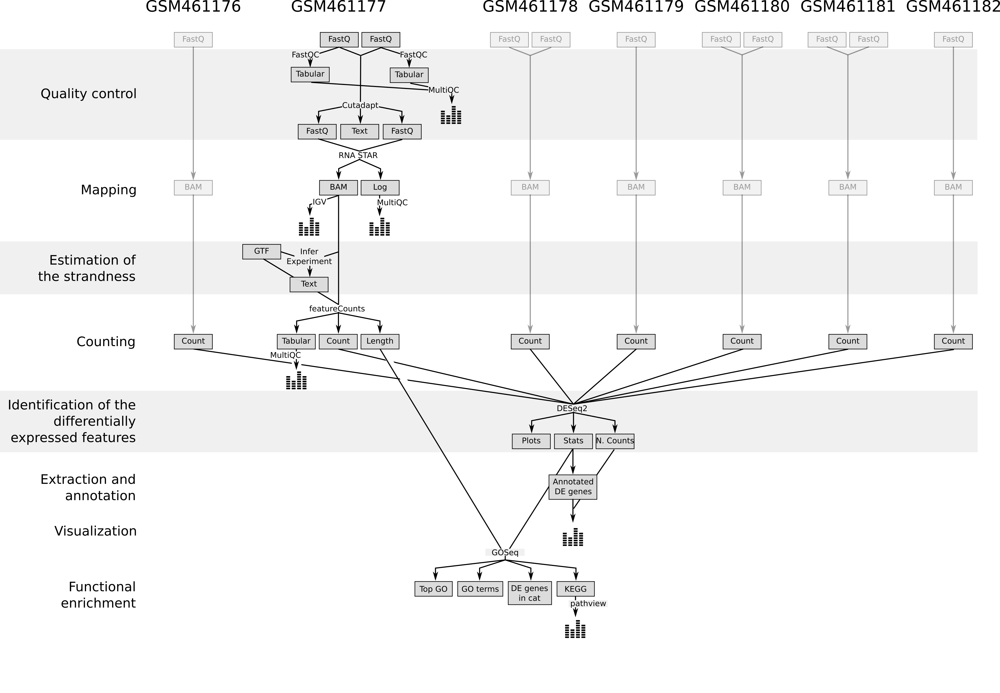

